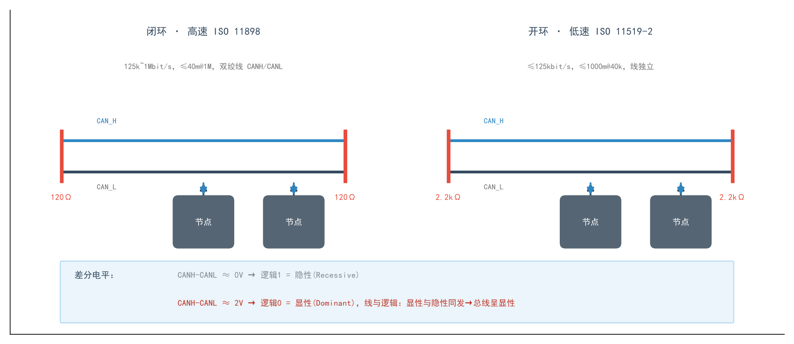
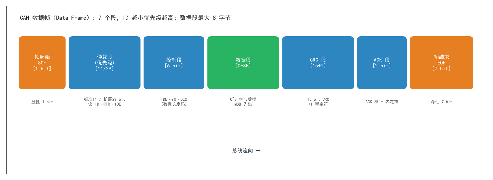
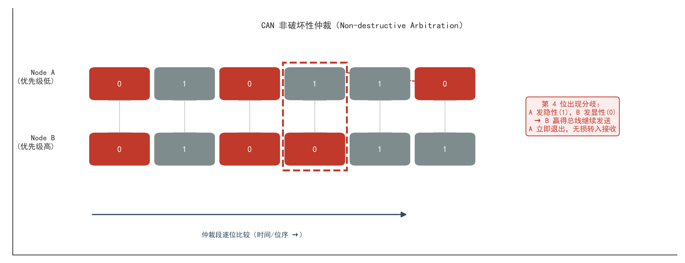

# 04 · CAN 总线协议详解

> 汽车里几十个 ECU 为什么只用两根线就能互相说话？答案就是 CAN（Controller Area Network，控制器局域网）。
> 本文整合 CAN 协议基础（通信模型 / 仲裁 / 错误检测 / 帧格式）与《CAN 总线通信详解》技术细节（物理层 / 位时序 / 帧类型 / 同步），并给出报文解析方法与工具链实战。

---

## 目录

1. [CAN 是什么：历史与定位](#1-can-是什么历史与定位)
2. [物理层：拓扑、差分电平与线与逻辑](#2-物理层拓扑差分电平与线与逻辑)
3. [节点结构与协议分层（OSI 视角）](#3-节点结构与协议分层osi-视角)
4. [五种帧类型总览](#4-五种帧类型总览)
5. [数据帧结构详解（7 段拆解）](#5-数据帧结构详解7-段拆解)
6. [非破坏性仲裁与优先级法则](#6-非破坏性仲裁与优先级法则)
7. [位时序、波特率与同步](#7-位时序波特率与同步)
8. [错误检测与错误处理（错误计数器三态）](#8-错误检测与错误处理错误计数器三态)
9. [CAN 报文解析实战](#9-can-报文解析实战)
10. [应用场景：汽车 / 工业 / 医疗](#10-应用场景汽车--工业--医疗)
11. [工具链：从 CAN 适配器到 Wireshark](#11-工具链从-can-适配器到-wireshark)
12. [CAN vs 其它总线 & CAN FD 展望](#12-can-vs-其它总线--can-fd-展望)
13. [速查表与十大高频坑](#13-速查表与十大高频坑)

---

## 1. CAN 是什么：历史与定位

**一句话**：CAN 是一种**多主（multi-master）、广播式、半双工、差分传输**的串行通信总线，专为"多个 ECU 之间高效可靠地交换数据"而生，尤其在恶劣电磁环境下。

### 1.1 诞生动机：减少线束

- 1980 年代，汽车电子装置越来越多，功能大多基于电子实现 → 装置之间点对点连线爆炸式增长，**线束数量和重量失控**。
- 德国 **Bosch** 公司提出 CAN：设计**单一网络总线**，所有外围器件挂接在总线上，解决"庞大的电子控制装置之间的通讯"问题。
- 1993 年成为国际标准：**ISO 11898**（高速应用）与 **ISO 11519**（低速应用）。

### 1.2 核心设计目标

| 目标 | 手段 |
| --- | --- |
| 高实时性 | 非破坏性仲裁 + 帧优先级（ID 越小越优先），低延迟且可预测 |
| 高可靠 | CRC 校验 + 5 类错误检测 + 错误计数器自动隔离故障节点 |
| 抗干扰 | 差分信号（CANH/CANL）传输，共模噪声天然抵消 |
| 低成本 | 控制器硬件实现仲裁，无需主机处理器；两根双绞线挂所有节点 |
| 灵活扩展 | 节点无地址概念，增删节点不改其它节点软件（ID 滤波即可） |

### 1.3 传输距离与速率的权衡

- 信号传输距离达 **10 km** 时仍可提供 **50 kbit/s**；
- 1 Mbit/s 时总线最长约 **40 m**（高速闭环网络）。
- 记住这对矛盾：**速率越高，可用线长越短**（物理层的信号完整性和仲裁位时间共同决定）。

---

## 2. 物理层：拓扑、差分电平与线与逻辑



### 2.1 两种总线结构

| | 闭环结构 | 开环结构 |
| --- | --- | --- |
| 标准 | ISO 11898（高速） | ISO 11519-2（低速容错） |
| 终端电阻 | 总线**两端各一个 120 Ω**（两信号线成回路） | 每根信号线**各自串联 2.2 kΩ** |
| 速率 | 125 kbit/s ~ 1 Mbit/s | ≤ 125 kbit/s |
| 距离 | 1 Mbit/s 时最长 40 m | 40 kbit/s 时最长 1000 m |
| 典型场景 | 动力总成、底盘控制 | 车身舒适系统、灯光门窗 |

### 2.2 差分信号：显性与隐性

CAN 总线只有两根双绞信号线 **CAN_H / CAN_L**，**没有时钟线**（异步通信，类似 UART；而 SPI/I²C 是时钟同步的）。电平由**电压差 CANH−CANL** 表示：

| 电压差 | 逻辑值 | 名称 | 特性 |
| --- | --- | --- | --- |
| ≈ 0 V（ISO 11898） | 1 | **隐性 Recessive** | 节点"松开"总线，由终端电阻让总线回到默认态 |
| ≈ 2 V（ISO 11898） | 0 | **显性 Dominant** | 节点"驱动"总线，**压倒**隐性 |

**线与（wired-AND）逻辑**是仲裁的物理基础：

> 两个节点同时发送，一个发显性(0)、另一个发隐性(1) → **总线呈现显性(0)**。显性永远赢。

### 2.3 为什么差分传输抗干扰

外部电磁干扰同时耦合到 CANH 和 CANL（共模噪声），接收端只看**差值** → 共模干扰被抵消。这也是 RS485 等工业现场总线采用同样思路的原因，是 CAN 在工厂环境可靠的根源。

---

## 3. 节点结构与协议分层（OSI 视角）

### 3.1 一个 CAN 节点 = 控制器 + 收发器

```
MCU ── CAN控制器(协议逻辑) ── CAN收发器(电平转换) ── CAN_H/CAN_L 总线
```

- **CAN 控制器**：实现 CAN 传输协议（帧化、仲裁、CRC、错误管理），通常是 MCU 片上外设（如 STM32F407 片内集成 2 个 bxCAN 控制器）。
- **CAN 收发器**：MCU 逻辑电平(TTL) ↔ 总线差分电平的转换芯片（如 STM32 开发板常用的 **TJA1040**，只能构成闭环网络）。
- **总线上没有主从之分**：任何节点都可主动发送；但**同一时刻只允许一个节点发送**，其余节点接收。

### 3.2 OSI 分层

CAN 协议覆盖 OSI 模型的**物理层、数据链路层**（部分实现触及传输层语义）：

| 层 | 子层 | 职责 |
| --- | --- | --- |
| 数据链路层 | **LLC**（逻辑链路控制） | 过滤帧、过载通知、恢复管理 |
| | **MAC**（介质访问控制）——**CAN 协议核心** | 帧化、仲裁、应答、错误检测与报告；**通常由 CAN 控制器硬件执行** |
| 物理层 | PCS / PMA / MDI | 信号电平、位时序、位编码、同步 |
| | | ⚠️ 信号电平、通信速度、采样点、驱动器与连接器电气特性**协议不定义**，由用户/上层标准确定 |

**ISO 11898 与 ISO 11519-2**：数据链路层定义完全相同，差异在物理层的 PMA/MDI（电平、电阻、速率、距离，见 2.1 表）。

### 3.3 ID 不是地址！

这是 CAN 最反直觉的一点：

- **节点没有地址**，帧才有 **11 位（标准帧）/ 29 位（扩展帧）标识符 ID**；
- ID 表示**数据的类型/内容**（例：碰撞检测节点发 ID=0x01 的帧，车内温度节点发 ID=0x05 的帧）；
- ID 同时决定**仲裁优先级**；
- 每个节点通过**硬件滤波器**只接收自己关心的 ID，无关帧自动丢弃（例：安全气囊控制器只收 ID=0x01，硬件过滤保证碰撞时零延迟响应）。

---

## 4. 五种帧类型总览

CAN 网络通信通过 **5 种帧**进行（数据帧与遥控帧各有标准/扩展两种格式）：

| 帧类型 | 用途 | 关键构成 |
| --- | --- | --- |
| **数据帧 Data Frame** | 发送单元 → 接收单元传送数据 | 7 个段（见第 5 节） |
| **遥控帧 Remote Frame** | 接收单元请求具有相同 ID 的发送单元发数据 | 6 个段，**无数据段** |
| **错误帧 Error Frame** | 检测出错误时向其它单元通报 | 错误标志 + 错误界定符 |
| **过载帧 Overload Frame** | 接收单元通知"尚未做好接收准备" | 过载标志 + 过载界定符 |
| **帧间隔 Inter-frame Space** | 分隔数据帧/遥控帧与前面的帧 | 间隔 + 总线空闲 +（延迟传送） |

细节补充：

- **错误帧**：错误标志分两种——主动错误标志（**6 个显性位**）、被动错误标志（**6 个隐性位**）；错误界定符为 8 个隐性位。
- **过载帧**：过载标志 = 6 个显性位（与主动错误标志构成相同）；过载界定符 = 8 个隐性位。
- **帧间隔**：间隔（3 个隐性位）→ 总线空闲（隐性、长度不限，可立即开始发送）→ 延迟传送（8 个隐性位，仅被动错误状态的单元刚发完一帧后才有）。
- ⚠️ **过载帧和错误帧之前不能插入帧间隔**。

---

## 5. 数据帧结构详解（7 段拆解）



数据帧由 **7 个段**构成（用户资料里"起始位/SOF/仲裁段/RTR/IDE/DLC/数据段/CRC/ACK/EOF"的称谓对应关系见下表）：

| 段 | 位宽 | 内容与要点 |
| --- | --- | --- |
| **帧起始 SOF** | 1 bit | **显性位**，标志帧开始，所有节点据此硬同步 |
| **仲裁段** | 标准 11 / 扩展 29 bit | **ID + RTR + (IDE)**。ID 决定优先级；RTR 位：数据帧=显性、遥控帧=隐性；IDE 位区分标准/扩展格式 |
| **控制段** | 6 bit | 保留位 + **DLC**（数据长度码，0~8）；接收方据此确定数据段字节数 |
| **数据段** | 0~64 bit | **0~8 字节**实际数据，**MSB（最高位）先发** |
| **CRC 段** | 15 + 1 bit | 15 位 CRC 序列校验帧传输错误 + 1 位 CRC 界定符 |
| **ACK 段** | 2 bit | ACK 槽 + ACK 界定符。接收节点在 ACK 槽回**显性**表示"收到且 CRC 正确"；发送方发隐性、读到显性即确认 |
| **帧结束 EOF** | 7 bit | **7 个隐性位**，标志帧结束 |

### 标准帧 vs 扩展帧

| | 标准帧 | 扩展帧 |
| --- | --- | --- |
| ID 长度 | 11 位 | 29 位 |
| 消息种类容量 | 2¹¹ = 2048 | 2²⁹ ≈ 5.4 亿 |
| 适用 | 传统汽车/工控 | 需要更细粒度优先级与更多消息种类的系统 |

**优先级细节**：同为 11 位 ID 时，标准格式的 IDE 位为显性 → **标准帧优先级高于同 ID 的扩展帧**（见第 6 节法则 4）。

---

## 6. 非破坏性仲裁与优先级法则



### 6.1 仲裁过程

总线空闲时，**最先开始发送的节点获得发送权**。多个节点同时开始发送时：

1. 各节点从**仲裁段第 1 位**开始，边发边回读总线；
2. 自己发隐性(1)却读到显性(0) → **仲裁失利**，立即停止发送、转入接收，**不损坏任何一方的数据**（"非破坏性"的含义）；
3. 输出**连续显性最多**（即 ID 数值最小、0 最多的前缀）的节点赢得总线。

图中示例：Node A 与 Node B 前 3 位（0,1,0）一致；第 4 位 A 发隐性(1)、B 发显性(0) → 线与结果为显性，A 检测到总线与自己发送不符，退出发送，B 继续发完整帧。

### 6.2 优先级判定四法则（速记）

| # | 竞争情形 | 胜者 | 原因 |
| --- | --- | --- | --- |
| 1 | 总线空闲，多节点同时发起 | 逐位仲裁胜者 | 第一次出现电平互异时，**显性方赢** |
| 2 | **数据帧 vs 遥控帧**（同 ID 同格式） | **数据帧** | 数据帧 RTR 位为显性，遥控帧 RTR 为隐性 |
| 3 | **标准帧 vs 扩展帧**（前 11 位 ID 相同） | **标准帧** | 标准 IDE=SRR 显性 vs 扩展 SRR 隐性 |
| 4 | 一般规律 | **ID 数值越小，优先级越高** | ID 前 0 越多，连续显性越多 |

### 6.3 设计启示

- **给关键报文分小 ID**：刹车/安全气囊类消息 ID 应尽量小（如 0x01），温度/娱乐类消息用大 ID；
- 仲裁只发生在仲裁段，**数据段不仲裁**——高负载下高优先级帧最多延迟一个低优先级帧的时间，这正是 CAN 实时性可预测的来源；
- ID 规划是 CAN 应用层设计（如 CANopen、J1939、DeviceNet 都建立在 ID 分配策略之上）的第一要务。

---

## 7. 位时序、波特率与同步

CAN 是异步 NRZ（不归零）编码、无时钟线 → **所有节点必须约定相同波特率**，并用同步机制吸收时钟误差。

### 7.1 一个位 = 4 段 × N 个 Tq

**Tq（Time Quantum，时间片）** 是由控制器时钟分频得到的最小时间单位。一个标称位时间（NBT）分为 4 段：

| 段 | 作用 | 典型 Tq |
| --- | --- | --- |
| **同步段 SS** | 期望跳变沿出现于此段；长度固定 **1 Tq** | 1 |
| **传播段 PTS** | 补偿总线物理传播延迟（线长、驱动器延迟） | 1~8 |
| **相位缓冲段 1 PBS1** | **采样点在 PBS1 末尾**；再同步时可**自动加长**补偿正相位漂移 | 1~16 |
| **相位缓冲段 2 PBS2** | 定义发送点位置；再同步时可**自动缩短**补偿负相位漂移 | 1~8 |

```
一个位时间：| SS | PTS | PBS1 | PBS2 |
                              ↑ 采样点（通常设在 75%~87.5% 处）
波特率 = 1 / (NBT × Tq)，NBT = SS+PTS+PBS1+PBS2 的 Tq 总数
```

（STM32 等芯片手册把 PTS 并入 BS1 表述为"SYNC_SEG + BS1 + BS2"三段，本质相同。）

### 7.2 两种同步方式

| 方式 | 触发时机 | 动作 |
| --- | --- | --- |
| **硬同步 Hard Sync** | 总线空闲时检测到**帧起始（SOF）跳变沿** | 该沿被当作 SS 段，无视 SJW 直接对齐 |
| **再同步 Resync** | 帧传输中每检测到跳变沿 | 按 **SJW**（再同步跳转宽度，1~4 Tq）加长 PBS1 或缩短 PBS2；单次调整不超过 SJW |

**同步规则速记**：

1. 1 个位内只做 1 次同步调整；
2. 只有"上次采样点电平 ≠ 边沿后电平"的边沿才可用于同步；
3. 空闲总线出现隐性→显性沿，必须硬同步；
4. 发送单元观测到自身显性输出延迟**不**再同步（帧起始到仲裁段多节点同发时的延迟沿亦然）。

---

## 8. 错误检测与错误处理（错误计数器三态）

### 8.1 五种错误类型

| 错误 | 内容 | 检测者 |
| --- | --- | --- |
| **位错误** | 发送回读值 ≠ 发送值（仲裁段隐性读出显性 = 仲裁失利，**不算**；ACK 槽读到显性 = 别人的应答，**不算**） | 发送单元 |
| **填充错误** | 位填充规则被破坏（连续 5 个同电平后必须插入反码位） | 接收单元 |
| **CRC 错误** | CRC 序列计算结果与接收的 CRC 不符 | 接收单元 |
| **格式错误** | 固定格式位出现非法电平（如 EOF 期间检测到显性；注：EOF 第 8 位与 DLC=9~15 有豁免细则） | 接收/发送单元 |
| **ACK 错误** | ACK 槽未检测到显性应答（总线上没有节点正确收到） | 发送单元 |

检测到错误的节点在**下一位**输出错误标志（主动：6 显性；被动：6 隐性）通报全总线，发送单元发完错误帧后**重发**数据帧/遥控帧。

### 8.2 错误限制：TEC / REC 三态机

每个节点维护两个计数器——发送错误计数 **TEC**、接收错误计数 **REC**：

| 状态 | 条件 | 行为 |
| --- | --- | --- |
| **错误主动 Error Active** | TEC≤127 且 REC≤127 | 正常收发；出错发**主动错误标志**（6 显性，立即破坏总线上的坏帧） |
| **错误被动 Error Passive** | 任一计数器 >127 | 仍可收发；出错只发**被动错误标志**（6 隐性，不干扰总线）；发帧后需附加延迟传送 |
| **总线关闭 Bus Off** | TEC >255 | **脱离总线**，不再收发；需检测到 128 次 11 位隐性序列后复位（或软件复位），防止坏节点持续破坏通信 |

这套机制是 CAN 高可靠的精髓：**坏节点被自动降级甚至隔离，总线整体永不停摆**。

---

## 9. CAN 报文解析实战

### 9.1 解析流程（接收节点的视角）

```
总线空闲 → 检测到 SOF(显性沿) → 硬同步，开始接收
  ↓
仲裁段：读 ID（+RTR/IDE）→ 判断优先级；硬件滤波器比对 ID，无关帧直接丢弃
  ↓
控制段：读保留位 + DLC → 得知数据段长度
  ↓
数据段：按 DLC 读出 0~8 字节数据
  ↓
CRC 段：边收边算，与帧内 CRC 比对 → 不符则发错误标志并等待重发
  ↓
ACK 段：CRC 正确 → 在 ACK 槽输出显性，应答发送方
  ↓
EOF(7 隐性位) + 帧间隔 → 报文结束，交付应用层
```

### 9.2 手工解析一个标准数据帧

设抓到一帧标准数据帧的仲裁/控制/数据段字段：

- ID = `0x123`（11 位标准帧），RTR = 0（数据帧），DLC = 4
- 数据 = `01 02 03 04`

解读：

| 字段 | 值 | 含义 |
| --- | --- | --- |
| ID = 0x123 | 11 位 | 优先级中等偏上的消息类型；数值小于 0x456 的帧可抢占它 |
| RTR = 0 | 显性 | 数据帧（若为 1 则是请求该 ID 的遥控帧） |
| IDE = 0 | 显性 | 标准格式（11 位 ID） |
| DLC = 4 | 0x4 | 数据段 4 字节 |
| Data | 01 02 03 04 | 应用层数据（含义由 DBC/J1939 等上层协议定义） |

**实际工程里**，"CAN 报文解析"通常指两件事：

1. **位流级**：示波器/CAN 分析仪把总线波形还原成 SOF/ID/DLC/Data/CRC/ACK 字段（本文第 4~8 节就是解码依据）；
2. **信号级**：用 **DBC 文件**把 Data 字节按位域/缩放/偏移翻译成物理量（例：字节 2-3 的 16 位值 × 0.1 − 40 = 摄氏温度）。CANoe、SavvyCAN、candump+python-can 都支持 DBC 加载。

---

## 10. 应用场景：汽车 / 工业 / 医疗

| 领域 | 典型应用 | 为什么选 CAN |
| --- | --- | --- |
| **汽车** | 发动机管理、刹车(ABS/ESP)、安全气囊、变速箱、车身舒适(灯光/门窗)、车载信息娱乐 | 高抗干扰、高实时（安全相关报文小 ID 高优先级）、减线束降成本；车内常按速率分多段 CAN（动力 500k / 舒适 125k）经网关互exchange |
| **工业自动化** | PLC、传感器、执行器之间数据交换；基于 CAN 的应用层协议：**CANopen**（设备档案/SDO/PDO）、**DeviceNet**（罗克韦尔）、**J1939**（商用车/农机） | 差分抗工厂电磁干扰；多主结构天然适合分布式控制；错误隔离保证产线不停摆 |
| **医疗设备** | 心电图机、呼吸机、监护仪等设备互联与数据共享、远程监控 | 可靠性（错误三态隔离）+ 实时性满足生命体征传输 |
| 其他 | 船舶、电梯、电池管理(BMS)、农业机械 | 同上 |

---

## 11. 工具链：从 CAN 适配器到 Wireshark

### 11.1 硬件入口

要"看见"总线，先要有 **CAN 适配器**（USB-CAN 接口卡）把差分总线接入 PC：

- 常见：PEAK PCAN-USB、周立功 ZLG、Kvaser、CANable（开源）、创芯 USB-CAN-A 等；
- 接线：CANH→CANH、CANL→CANL、GND→GND；**别忘了 120 Ω 终端电阻**（两端各一个，实测两端 CANH-CANL 间电阻应 ≈60 Ω）。

### 11.2 软件工具

| 工具 | 定位 | 典型用法 |
| --- | --- | --- |
| **CANoe / CANalyzer**（Vector） | 行业金标准，仿真+分析+测试一体 | 加载 DBC 信号级解码；剩余总线仿真；自动化测试 CAPL 脚本 |
| **Wireshark**（SocketCAN 插件） | 抓包分析 | Linux 下 `socketcand`/`can` 协议 dissector，直接按 ID/字节过滤 |
| **PCAN-View**（PEAK 免费版） | 轻量查看 | 看帧 ID/DLC/数据/错误计数器 |
| **candump / cansend**（can-utils） | Linux SocketCAN 命令行 | `candump can0`、`cansend can0 123#DEADBEEF` |
| **SavvyCAN** | 开源逆向利器 | 加载 DBC、差分分析、逆向未知 ID |
| **python-can** | 脚本化 | 批量回放/注入/统计报文 |

### 11.3 排障三板斧

1. **物理层**：测两端电阻（应 ≈60 Ω）；示波器看显性电平压差是否 ≈2 V；检查波特率两边是否一致（最常见的"一发就错误帧"根因）；
2. **帧层**：看错误计数器（TEC/REC 是否飙升、节点是否 Bus Off）；查错误帧类型（CRC 错 → 干扰/速率错；ACK 错 → 没有接收方或断线）；
3. **应用层**：对比 DBC 核对 ID 分配与信号定义；过滤无关 ID 降低负载（总线负载率建议 <50%）。

---

## 12. CAN vs 其它总�� & CAN FD 展望

### 12.1 横向对比

| | CAN | RS485 | PCIe（本库总线 02 篇） |
| --- | --- | --- | --- |
| 拓扑 | 多主总线 + 广播 | 多点总线（主从轮询为主） | 点对点、交换机树形 |
| 仲裁 | 硬件非破坏性（按 ID） | 无（需上层协议避免冲突） | 不需要（交换式） |
| 速率 | 5k~1 Mbit/s（CAN FD 数据段可至 8 Mbit/s） | ≤10 Mbit/s | Gen4 x1 ≈ 2 GB/s |
| 可靠性 | 5 类错误检测 + 节点自动隔离 | CRC + 上层重传 | 链路层重试/FEC |
| 典型距离×速率 | 40m@1M / 500m@125k / 10km@50k | 1200m@100k | <30cm（板内） |
| 生态 | 汽车/工业事实标准 | 工业仪表 | PC/服务器高速互连 |

**定位一句话**：PCIe 管"快"（芯片间大带宽），CAN 管"稳"（恶劣环境多节点实时控制），二者量级与场景完全不同；CAN 与 RS485 同为差分双绞线，但 CAN 的**多主仲裁 + 错误三态**是 RS485 原生不具备的。

### 12.2 CAN FD 与后继者

- **CAN FD**（Flexible Data-rate）：数据段扩到 **64 字节**、数据阶段速率可至 **5~8 Mbit/s**、CRC 增强——兼容仲裁段速率不变以保持仲裁可靠；
- 车内下一代骨干已转向 ** Automotive Ethernet（车载以太网，100/1000BASE-T1）**：大带宽娱乐/ADAS 数据走以太网，CAN 继续统治低成本实时控制域。二者长期共存、网关互通。

---

## 13. 速查表与十大高频坑

### 13.1 一页速查

| 项目 | 标准帧 | 扩展帧 |
| --- | --- | --- |
| ID | 11 位 | 29 位 |
| 数据段 | 0~8 字节（FD 可 64） | 同左 |
| 仲裁 | ID 越小越优先；数据帧 > 遥控帧；标准 > 扩展 | 同左（前 11 位相同则标准赢） |

| 物理层 | 闭环(ISO 11898) | 开环(ISO 11519-2) |
| --- | --- | --- |
| 速率/距离 | 125k~1M / 40m@1M | ≤125k / 1000m@40k |
| 电阻 | 两端各 120 Ω | 各线 2.2 kΩ |
| 显性压差 | ≈2 V | >2 V |

**关键位**：SOF(1,显性) · IDE(标准=0) · RTR(数据帧=0) · DLC(0~8) · CRC(15) · ACK(2) · EOF(7 隐性)

**错误三态**：Error Active(TEC,REC≤127) → Error Passive(>127) → Bus Off(TEC>255)

### 13.2 十大高频坑

1. **波特率两端不一致** → 一发就错误帧/Bus Off。先对两边位时序寄存器，再看采样点。
2. **终端电阻缺失/过多** → 无 120 Ω 信号反射失真；三个 120 Ω 并联驱动过载。标准做法：**两端各一个**，实测总线电阻 ≈60 Ω。
3. **把 ID 当节点地址用** → ID 是消息类型不是地址；多个节点可发同 ID（但同 ID 同格式时数据帧赢遥控帧）。
4. **仲裁失败当作错误排查** → 仲裁段发隐性读出显性是正常失利，不是位错误。
5. **DLC>8 想传大数据** → 经典 CAN 数据段上限 8 字节；大数据要走传输层（ISO-TP 15765-2 分段）或上 CAN FD。
6. **总线负载率过高** → 高优先级帧尚可，低优先级帧抖动变大；建议负载 <50%，必要时合并信号或升速。
7. **CAN_H/CAN_L 接反** → 帧全错且错误计数飙升；万用表测静态压差（隐性 ≈ 各 2.5 V）。
8. **忘记共地** → 差分虽然抗共模，但节点间压差超出共模范围会损坏收发器；长距离务必共 GND。
9. **采样点位置不当** → 长线传播延迟大时采样点应靠后（80%~87.5%）；采样点太早会采到反射未稳定电平。
10. **Bus Off 后不恢复** → 硬件要求检测 128×11 位隐性才复位，多数驱动需要软件重启控制器；现场"失联"先查错误计数器。

---

## 附：术语对照

| 缩写 | 全称 | 含义 |
| --- | --- | --- |
| ECU | Electronic Control Unit | 电子控制单元（汽车里的每个"电脑"） |
| SOF | Start Of Frame | 帧起始（1 显性位） |
| RTR | Remote Transmission Request | 遥控请求位（数据帧 0 / 遥控帧 1） |
| IDE | Identifier Extension | 标识符扩展位（标准 0 / 扩展 1） |
| DLC | Data Length Code | 数据长度码（0~8） |
| CRC | Cyclic Redundancy Check | 循环冗余校验（15 位） |
| ACK | Acknowledge | 应答 |
| EOF | End Of Frame | 帧结束（7 隐性位） |
| Tq | Time Quantum | 时间片（位时序最小单位） |
| SJW | resynchronization Jump Width | 再同步跳转宽度（1~4 Tq） |
| TEC/REC | Transmit/Receive Error Counter | 发送/接收错误计数器 |
| DBC | Database CAN | CAN 报文信号描述文件（Vector 格式） |

---

> **一句话核心要义**：CAN 用"两根差分线 + ID 仲裁 + 错误三态"这三件事，换来了恶劣电磁环境下多节点实时通信的可靠性——理解了显性压倒隐性的线与逻辑、ID 即优先级、坏节点自动隔离，CAN 的 90% 就通了。
