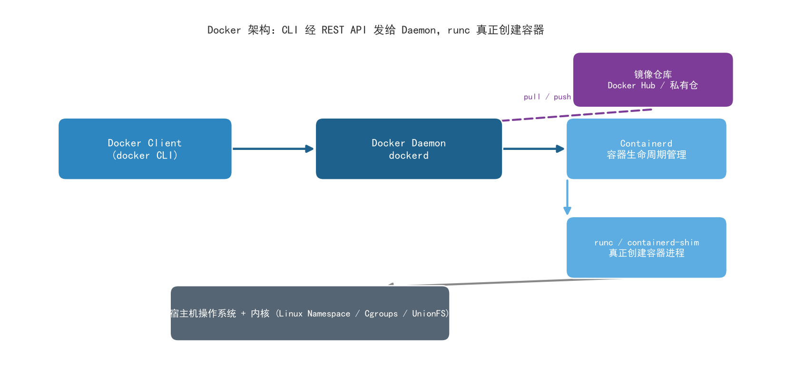
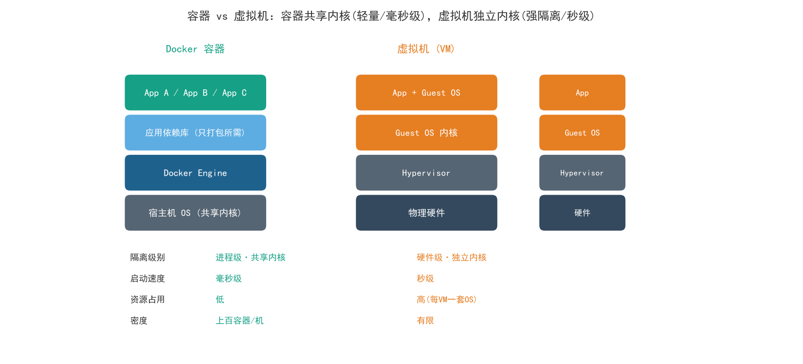
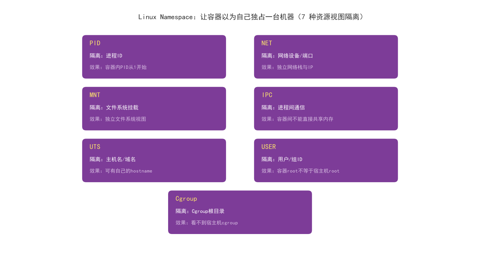
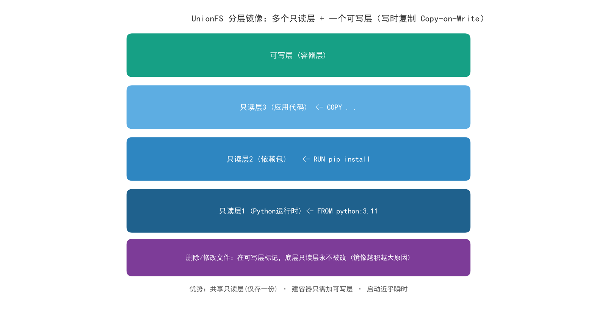
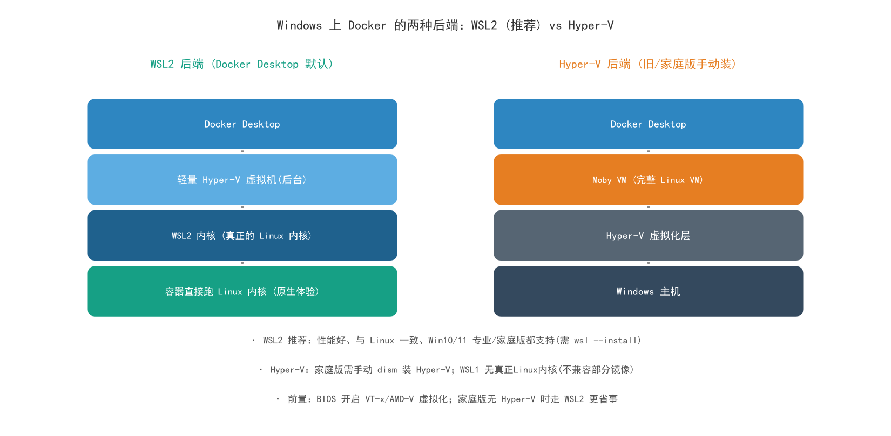

# 01 · Docker 详解：从入门到原理，Windows 与 Linux 全平台使用指南

> 整理自两篇 CSDN 文章——《一文搞懂 Docker：从入门到原理，避坑指南全解析》（qq_56483923）与《Windows 安装 Docker 使用教程》（lxw1844912514），在此基础上扩展补充 Linux 安装、跨平台差异、数据卷/网络、镜像加速与生产实践。目标是：**讲清楚 Docker 是什么、Windows/Linux 怎么装怎么用、常见命令、以及那些让人踩坑的注意事项。**

---

## 1. Docker 到底是什么？别被"容器"这个词唬住了

### 1.1 一个让人顿悟的类比：集装箱

Docker 最经典的类比就是**"数字世界的集装箱"**。

现实中的海运集装箱：不管里面装的是衣服、手机还是汽车零件，集装箱的外形尺寸都是统一的。货轮、码头吊机、卡车，只需要按标准尺寸去处理集装箱就行，根本不用关心里面装的是什么。集装箱的出现，让全球物流效率发生了革命性的变化。

Docker 干的是同样的事情。它把你的**应用程序、运行时环境、系统库、配置文件**全部打包成一个标准化的"集装箱"——这就是**镜像（Image）**。这个"集装箱"可以在任何安装了 Docker 的机器上运行，跑起来之后就叫**容器（Container）**。

> 💡 **核心结论**：Docker 解决了软件开发领域一个千古难题——**"在我电脑上能跑，在你电脑上怎么就跑不起来？"**

### 1.2 敲黑板：Docker 不是"轻量级虚拟机"

很多教程一上来就说"Docker 是一种轻量级虚拟机"，这个说法**不准确，甚至有害**。它会让你的思维被虚拟机的框架框住，从而无法真正理解 Docker 的本质。

Docker 官方对它的定义是：**一个开源的应用容器引擎**。它基于 Linux 内核的 **Namespace、Cgroups 和 UnionFS** 等技术，实现了**进程级别**的隔离和封装。

**Docker 容器本质上就是运行在宿主机操作系统上的一个普通进程**，只不过通过 Linux 内核提供的能力，让它"以为自己独占了一台机器"。

### 1.3 三大核心概念，五分钟搞懂

| 概念 | 类比 | 说明 |
|---|---|---|
| **镜像（Image）** | 类 / 安装包 | 只读模板，包含应用运行所需的一切 |
| **容器（Container）** | 对象 / 运行中的程序 | 镜像的运行实例，可启动、停止、删除 |
| **仓库（Registry）** | GitHub / 应用商店 | 存放和分发镜像的地方，官方仓库叫 Docker Hub |

镜像和容器的关系，就像面向对象编程中的**类和对象**——镜像是静态的定义，容器是运行时的实体。**一个镜像可以创建无数个相同的容器**。

而 **Dockerfile** 就是**构建镜像的"配方"**：你用几条简单的指令告诉 Docker——"先拉一个 Ubuntu 基础镜像，然后安装 Nginx，再把我的代码复制进去"——Docker 就按这个配方一层一层地构建出镜像。

### 1.4 Docker 架构：Client-Server 模式

你输入的 `docker run` 等命令，实际上是被 Docker Client 发送给 Docker Daemon（守护进程）执行的。Daemon 收到命令后，通过 containerd 调用 runc 来真正创建和运行容器。这个分层架构让 Docker 的各个组件可以独立升级和维护。



---

## 2. 容器 vs 虚拟机 vs 沙箱：一场三方对决

### 2.1 虚拟机的架构：完整的"房子"

虚拟机（VM）的核心思路是**硬件级别的虚拟化**。它通过一个叫 Hypervisor（虚拟机监视器）的中间层，在物理硬件之上模拟出多套虚拟硬件，每套虚拟硬件上运行一个**完整的操作系统**。

**关键特征**：每个虚拟机都有自己独立的操作系统内核。这带来了极强的隔离性——一个虚拟机被攻破，不会影响其他虚拟机。但代价是：启动慢（要引导完整操作系统）、资源占用大（每个 VM 都要跑一套 OS）、密度低（一台物理机跑不了太多 VM）。

### 2.2 Docker 的架构：同一栋楼里的"房间"

Docker **没有 Hypervisor 这一层**，所有容器直接运行在宿主机的操作系统上，**共享同一个内核**，只打包应用所需的库和依赖。这带来了极致的轻量和速度——启动容器就像启动一个进程，毫秒级别；一台机器可以跑上百个容器。



### 2.3 沙箱：一种"隔离理念"，而非特定技术

**沙箱（Sandbox）是一种隔离理念**——把不受信任的代码放在受控环境中运行。Docker 容器确实提供了一定程度的沙箱能力，但隔离强度不如虚拟机（共享内核）。在云原生领域，**安全沙箱容器**（如 Kata Containers、Firecracker）用轻量级虚拟机来运行容器，每个沙箱拥有独立内核，既保留容器的轻量快速，又获得接近虚拟机的强隔离性。

### 2.4 三方对比表

| 维度 | 虚拟机 | Docker 容器 | 安全沙箱容器 |
|---|---|---|---|
| **隔离级别** | 硬件级，独立内核 | 进程级，共享内核 | 独立内核（轻量级 VM） |
| **启动速度** | 慢（秒级） | 极快（毫秒级） | 较快（百毫秒级） |
| **资源占用** | 高（每台一套 OS） | 低（共享内核） | 中等 |
| **安全性** | 强 | 较弱（共享内核） | 强 |
| **典型场景** | 多租户云主机、传统数据中心 | 微服务、CI/CD、开发测试 | 多租户容器平台、边缘计算 |

**总结**：虚拟机是"整栋楼"级别的隔离，Docker 是"房间"级别的隔离，安全沙箱容器则试图在两者之间找到最佳平衡点。

---

## 3. 底层原理：Docker 凭什么这么快？

这是面试官最爱问的"Docker 为什么比虚拟机快"的答案所在。Docker 的技术底座由三大 Linux 内核技术支撑：**Namespace、Cgroups、UnionFS**。

### 3.1 Namespace：让容器"以为"自己独占一台机器

Namespace（命名空间）是 Linux 内核提供的**资源隔离机制**：让不同的进程组看到不同的系统资源视图。Linux 提供了七种 Namespace，每种隔离一类资源：

| Namespace | 隔离内容 | 效果 |
|---|---|---|
| **PID** | 进程 ID | 容器内的进程 PID 从 1 开始，看不到宿主机其他进程 |
| **NET** | 网络设备、端口 | 每个容器有独立的网络栈和 IP |
| **MNT** | 文件系统挂载点 | 容器有独立的文件系统视图 |
| **IPC** | 进程间通信 | 容器间不能直接通过共享内存通信 |
| **UTS** | 主机名和域名 | 容器可以有自己的 hostname |
| **USER** | 用户和用户组 ID | 容器内的 root 不等于宿主机的 root |
| **Cgroup** | Cgroup 根目录 | 容器看不到宿主机的 cgroup 视图 |



最直观的例子是 **PID Namespace**：你在宿主机上运行两个容器，每个容器里都能看到一个 PID=1 的进程——但宿主机上显然只有一个 PID=1。Docker 在创建容器时，通过调用 Linux 的 `clone()` 系统调用，传入不同的 Namespace 标志位，就创建了一个拥有独立资源视图的进程空间。

### 3.2 Cgroups：给容器戴上"紧箍咒"

Namespace 解决了"看到什么"的问题，但没解决"能用多少"的问题——一个容器可能疯狂占用 CPU 或内存，把宿主机拖垮。**Cgroups（Control Groups）** 是 Linux 内核提供的**资源限制和统计机制**，可以精确控制一组进程能使用的 CPU、内存、磁盘 I/O、网络带宽等物理资源。

> 💡 **一句话理解**：**Namespace 是给容器画了一个圈子（让它看不见圈子外的东西），Cgroups 是给容器套了一个笼子（让它只能用笼子里面的资源）**。两者配合，才构成完整的隔离环境。

```bash
# 限制容器最多使用 512MB 内存和 1 个 CPU 核心
docker run -d --memory=512m --cpus=1 nginx
```

### 3.3 UnionFS：分层镜像的魔法

UnionFS（联合文件系统）是 Docker 镜像**分层存储**的技术基础。它允许将多个目录（称为"层"）联合挂载到同一个挂载点，对外呈现为一个统一的文件系统。

Docker 镜像的结构：**多个只读层 + 一个可写层**。

```
┌─────────────────────────────────────┐
│  可写层（容器层）            ← 容器运行时写入的数据 │
├─────────────────────────────────────┤
│  只读层 3（应用代码）        ← COPY . .              │
├─────────────────────────────────────┤
│  只读层 2（依赖包）          ← RUN pip install       │
├─────────────────────────────────────┤
│  只读层 1（Python 运行时）   ← FROM python:3.11      │
└─────────────────────────────────────┘
```



当你运行容器时，Docker 在只读层之上添加一个可写层。容器里所有的写操作（创建文件、修改配置）都发生在**可写层**。**镜像本身的层永远不会被修改**。这样做的好处是巨大的：

- **共享**：多个容器可以共享同一个镜像的只读层，宿主机只需要存储一份
- **轻量**：创建一个容器不需要复制整个镜像，只需要添加一个可写层
- **快速**：启动容器几乎瞬间完成，因为不需要复制任何数据
- **分层下载**：`docker pull` 支持分层下载，本地已有基础镜像层时智能复用，大幅减少下载量

> ⚠️ **注意**：当你删除一个文件时，Docker 并不会真的删除底层只读层中的文件，而是在可写层中标记"此文件已删除"（whiteout）。最终文件系统中看不到该文件，但底层数据仍然存在——**这就是为什么 Docker 镜像会"越积越大"的原因**。

---

## 4. Windows 系统下怎么用 Docker

### 4.1 前置条件：开启 CPU 虚拟化（VT）

Docker 在 Windows 上需要硬件虚拟化支持。**是否已启用可以通过任务管理器 → 性能 → CPU 查看"虚拟化"字段**。

VT（Virtualization Technology）是虚拟化技术，Intel 叫 VT-x、AMD 叫 AMD-V。开启后对虚拟机（VMware、安卓模拟器等）性能有非常大提高。

**BIOS 开启 VT 指南**（开机时按住对应按键进入 BIOS）：

| 机型类型 | 按键 |
|---|---|
| 组装机-华硕主板 | F8 |
| 组装机-Intel 主板 | F12 |
| 组装机-其他 | ESC、F11 或 F12 |
| 笔记本-联想 ThinkPad | F1 |
| 笔记本-其他品牌 | F2 |
| 台式机-Dell | ESC |
| 台式机-其他品牌 | F12 |

进入 BIOS 后：选择 **Configuration** 选项 → 选择 **Intel Virtual Technology** 回车 → 将光标移到 **Enabled** 回车确定 → 按 **F10** 保存退出。

> ⚠️ 若无 VT 选项或不可更改，表示你的电脑不支持 VT 技术（部分老机器或云主机屏蔽了 VT）。

### 4.2 Windows 家庭版：手动安装 Hyper-V

Hyper-V 是 Windows 自带的虚拟机产品，但 **Win10/11 家庭版没有 Hyper-V**。解决办法：将以下代码保存为 `Hyper-V.cmd` 文件（记事本另存为），然后**右键以管理员身份运行**：

```bat
pushd "%~dp0"
dir /b %SystemRoot%\servicing\Packages\*Hyper-V*.mum >hyper-v.txt
for /f %%i in ('findstr /i . hyper-v.txt 2^>nul') do dism /online /norestart /add-package:"%SystemRoot%\servicing\Packages\%%i"
del hyper-v.txt
Dism /online /enable-feature /featurename:Microsoft-Hyper-V-All /LimitAccess /ALL
```

弹出用户帐户控制对话框点击"是"，等待处理完成（**过程中不要关闭窗口或关机**），在末尾输入 `Y`，电脑自动重启进行配置更新。重启后在 Windows 管理工具中可以看到 Hyper-V 已成功安装——**不用重装专业版系统就能使用 Hyper-V**。

### 4.3 安装 Docker Desktop

1. 注册 Docker 账号（Docker Hub）
2. 从官网下载 Docker Desktop for Windows：https://www.docker.com/products/docker-desktop/
3. 双击安装，一路 Next
4. 安装完**需要重启电脑**，重启后 Docker 自动运行
5. 看到 Docker Desktop 的运行界面（左下角状态绿色）即证明一切正常

### 4.4 常见报错排查：Docker failed to initialize / 一直 starting

**Docker failed to initialize 并一直处于 starting** 是最高频的安装翻车点，按以下顺序排查：

1. **检查 CPU 是否开启虚拟化**：任务管理器 → 性能 → CPU → 虚拟化字段应为"已启用"
2. **检查 Hyper-V 是否开启**：控制面板 → 程序 → 启用或关闭 Windows 功能
3. **重启 Docker 服务**：

```bat
net stop com.docker.service
net start com.docker.service
```

4. **WSL 版本太老**（报错提示需要 WSL2 内核更新）：下载安装 **WSL2 Linux 内核更新包**（x64：`wsl_update_x64.msi`；ARM64 机器下载 ARM64 包；不确定类型可在命令提示符执行 `systeminfo | find "System Type"` 查询），安装后重启即可。

新版 Windows 也可直接用简化安装（管理员权限运行 `wsl --install`，重启后即装好 WSL）。

### 4.5 Windows 两种后端：WSL2 vs Hyper-V



| 对比项 | WSL2 后端（推荐） | Hyper-V 后端 |
|---|---|---|
| 内核 | 真正的 Linux 内核 | Moby VM（完整 Linux 虚拟机） |
| 性能 | 好，文件 I/O 快 | 一般 |
| 系统要求 | Win10/11 家庭版/专业版均可 | 家庭版需手动 dism 装 Hyper-V |
| 与 Linux 一致性 | 高（可同 WSL 发行版互通） | 一般 |
| 资源占用 | 较低（动态内存） | 较高 |

> 💡 **选型建议**：新机器一律用 **WSL2 后端**（Docker Desktop 安装时默认勾选）；WSL1 没有真正的 Linux 内核，不兼容部分依赖内核特性的镜像，不要用。

### 4.6 Windows 下使用要点与差异

- Docker Desktop 图形界面可直观管理容器/镜像，也可用 PowerShell / CMD 执行 `docker` 命令（与 Linux 完全一致）
- **文件挂载路径写法不同**：Linux 挂载写 `-v /home/user/data:/data`，Windows 写 `-v D:\docker\data:/data` 或 `-v /d/docker/data:/data`（WSL2 风格路径）
- Windows 容器与 Linux 容器：Docker Desktop 支持切换 Windows 容器模式（运行 .NET Framework 等原生 Windows 应用），但**绝大多数镜像生态是 Linux 的**，日常保持 Linux 容器模式即可
- Docker Desktop 商用需注意授权：大企业（员工超 250 人或年营收超 1000 万美元）需付费订阅；个人/教育/小型商用免费

---

## 5. Linux 系统下怎么用 Docker

### 5.1 安装（Ubuntu/Debian 为例）

```bash
# 官方一键脚本（最省事）
curl -fsSL https://get.docker.com | sh

# 或用 apt 从 Docker 官方源安装
sudo apt-get update
sudo apt-get install ca-certificates curl gnupg
sudo install -m 0755 -d /etc/apt/keyrings
curl -fsSL https://download.docker.com/linux/ubuntu/gpg | sudo gpg --dearmor -o /etc/apt/keyrings/docker.gpg
echo "deb [arch=$(dpkg --print-architecture) signed-by=/etc/apt/keyrings/docker.gpg] https://download.docker.com/linux/ubuntu $(lsb_release -cs) stable" | sudo tee /etc/apt/sources.list.d/docker.list
sudo apt-get update
sudo apt-get install docker-ce docker-ce-cli containerd.io
```

### 5.2 启动服务与验证

```bash
# 启动 Docker 守护进程并设置开机自启
sudo systemctl start docker
sudo systemctl enable docker

# 验证安装是否成功
docker --version
docker run hello-world
```

### 5.3 免 sudo 使用（用户组）

```bash
# 把当前用户加入 docker 组，重新登录后 docker 命令不再需要 sudo
sudo usermod -aG docker $USER
newgrp docker
```

> ⚠️ **安全提示**：docker 组等价于 root 权限（可挂载宿主机根文件系统进容器），只把可信任用户加入。

### 5.4 国内镜像加速

拉取官方镜像慢或超时时，配置镜像加速器。编辑 `/etc/docker/daemon.json`（Windows 在 Docker Desktop → Settings → Docker Engine 里改同一份 JSON）：

```json
{
  "registry-mirrors": [
    "https://docker.m.daocloud.io",
    "https://dockerproxy.com",
    "https://mirror.ccs.tencentyun.com"
  ]
}
```

```bash
sudo systemctl daemon-reload
sudo systemctl restart docker
# 验证加速器是否生效
docker info | grep -A 5 "Registry Mirrors"
```

> 💡 加速器地址随时间可能失效，可搜索"docker 镜像加速 可用"获取最新列表；阿里云/腾讯云还提供带账号的个人加速地址。

---

## 6. 常见命令详解（跨平台通用）

### 6.1 镜像操作

```bash
docker version              # 查看 Docker 版本
docker search python        # 在 Docker Hub 查找 python 相关镜像（看 STARS/ OFFICIAL）
docker pull nginx:latest    # 拉取官方 Nginx 镜像（分层下载，已有层智能复用）
docker pull php:7.3         # 拉取指定版本（TAG）
docker images               # 查看本地已有镜像
docker image ls             # 同上（新语法）
docker rmi nginx:latest     # 删除镜像（rmi = remove image）
docker rmi {imageID}        # 按镜像 ID 删除
```

### 6.2 容器操作

```bash
# 创建并启动一个 Nginx 容器：后台运行，端口映射 8080->80
docker run -d --name my-nginx -p 8080:80 nginx

docker ps                   # 查看正在运行的容器
docker ps -a                # 查看所有容器（包括已停止的）
docker ps -q                # 只列出运行中容器的 ID
docker ps -a -q             # 只列出所有容器的 ID

docker stop my-nginx        # 停止容器
docker start my-nginx       # 启动已停止的容器
docker restart my-nginx     # 重启容器
docker rm my-nginx          # 删除容器（运行中的需先 stop，或加 -f）
docker rm {容器ID}          # 按容器 ID 删除

# 批量操作（利用 -q 输出 ID 的组合技）
docker stop $(docker ps -a -q)      # 停止所有容器
docker restart $(docker ps -q)      # 重启所有运行中的容器
docker rm $(docker ps -a -q)        # 删除所有已停止容器（慎用）

# 一次启动多个容器（推荐为该命令取 shell 别名，更方便操作）
docker start nginx-web php-web php-web-73 php-web-80 redis-web

docker exec -it my-nginx /bin/bash  # 进入容器的交互式终端
docker exec -it cb6c1fe83bff bash   # 按容器 ID 进入

docker logs my-nginx        # 查看容器日志（排障第一入口，可加 -f 跟踪）
docker inspect php01        # 查看容器的完整信息（IP/挂载/环境变量等）

# 复制本地文件到 docker 容器（宿主机路径在前，容器路径在后）
docker cp /Users/macbook/Desktop/docker/nginx/conf/default.conf nginx-web:/etc/nginx/conf.d/default.conf

# 限制资源
docker run -d --memory=512m --cpus=1 nginx   # 限 512MB 内存 + 1 CPU

# docker 服务本身出问题（Linux）
systemctl restart docker
```

### 6.3 docker run 关键参数速记

第二篇原文总结的参数字母意义，逐个记住能覆盖 90% 场景：

| 参数 | 含义 | 说明 |
|---|---|---|
| `-d` | detached | 后台运行容器（不占用当前终端） |
| `-p 宿主:容器` | port | 端口映射，如 `-p 8080:80` 访问宿主机 8080 即访问容器 80 |
| `-v 宿主路径:容器路径` | volume | 挂载文件/目录。容器是独立空间，把日志、配置、数据挂载到宿主机文件上，便于管理与持久化（**容器删了数据还在**） |
| `--name` | name | 给容器命名，便于后续引用 |
| `-e` | env | 设置容器环境变量，如 `-e POSTGRES_PASSWORD=secret` |
| `--link` | link | 连接另一个容器（旧式，单机容器互联；新项目推荐自定义网络） |
| `--restart=always` | restart | 容器退出后自动重启（开机自启常配） |
| `--memory` / `--cpus` | limit | 限制内存 / CPU（Cgroups 能力） |
| `-it` | interactive+tty | 分配交互式终端（配 exec 进入容器用） |

### 6.4 镜像与容器的关系实操

```bash
docker run -d --name my-nginx -p 8080:80 nginx
# -d 后台运行；-p 8080:80 把宿主机 8080 映射到容器 80
# 访问宿主机 http://localhost:8080 实际就是访问容器里的 Nginx
```

---

## 7. Dockerfile：构建自己的镜像

假设你写了一个 Flask 应用，想把它打包成 Docker 镜像。创建一个 `Dockerfile`：

```dockerfile
# 基于 Python 3.11 官方镜像（slim 精简版体积更小）
FROM python:3.11-slim
# 设置工作目录
WORKDIR /app
# 复制依赖文件并安装（先复制 requirements 单独一层，是为了利用构建缓存）
COPY requirements.txt .
RUN pip install --no-cache-dir -r requirements.txt
# 复制应用代码
COPY . .
# 声明容器监听的端口（文档作用，真正映射靠 -p）
EXPOSE 5000
# 容器启动命令
CMD ["python", "app.py"]
```

然后一条命令就能构建出镜像：

```bash
# 构建镜像，打上标签 my-flask-app:v1.0（注意最后的 . 表示构建上下文为当前目录）
docker build -t my-flask-app:v1.0 .

# 运行这个镜像
docker run -d -p 5000:5000 --name flask-app my-flask-app:v1.0
```

> 🔥 **划重点**：Dockerfile 的每一条指令都会在镜像中创建一个新的层。构建时如果某一层没有变化，Docker 直接**复用缓存**，大幅加速构建。所以**变化少的指令写前面**（如装依赖），变化多的写后面（如 COPY 代码）。

**常用 Dockerfile 指令速查**：

| 指令 | 作用 |
|---|---|
| `FROM` | 指定基础镜像（第一条指令） |
| `WORKDIR` | 设置工作目录（后续指令的当前目录） |
| `COPY` / `ADD` | 复制文件进镜像（ADD 额外支持 URL 和自动解压） |
| `RUN` | 构建时执行命令（产生新层） |
| `ENV` | 设置环境变量 |
| `EXPOSE` | 声明端口（文档性质） |
| `CMD` | 容器默认启动命令（可被 docker run 后的参数覆盖） |
| `ENTRYPOINT` | 容器入口（不易被覆盖，常与 CMD 配合） |

---

## 8. Docker Compose：多容器编排

现实中的应用往往由多个服务组成——Web 服务、数据库、缓存……一个个手动启动太麻烦。Docker Compose 用一个 YAML 文件管理多容器应用：

```yaml
version: '3.8'
services:
  web:
    build: .                    # 用当前目录 Dockerfile 构建
    ports:
      - "5000:5000"
    depends_on:
      - db                      # 先启动 db 再启动 web
  db:
    image: postgres:15
    environment:
      POSTGRES_PASSWORD: secret
    volumes:
      - pgdata:/var/lib/postgresql/data   # 数据持久化到命名卷
volumes:
  pgdata:
```

```bash
docker compose up -d      # 一条命令拉起整个应用栈（新版语法不带连字符）
docker compose down       # 停止并删除整个栈
docker compose logs -f    # 跟踪整个栈的日志
```

这就是 Docker 在微服务架构中的威力。

---

## 9. 数据卷与网络（进阶必备）

### 9.1 数据卷：容器删了数据不能丢

容器是"用完即扔"的，数据必须放容器外。三种方式：

| 方式 | 写法 | 特点 |
|---|---|---|
| **命名卷（推荐）** | `-v pgdata:/var/lib/postgresql/data` | Docker 统一管理，位置在 `/var/lib/docker/volumes/`，可备份迁移 |
| **绑定挂载** | `-v /home/user/code:/app` | 宿主机目录直接映射，开发时改代码容器立即生效 |
| **tmpfs** | `--tmpfs /app/tmp` | 存内存里，容器停即消失，适合临时文件 |

### 9.2 容器网络

- **bridge（默认）**：容器接入虚拟网桥，彼此通过 IP 访问；`-p` 端口映射对外暴露
- **host**：容器直接用宿主机网络栈（无端口映射开销，Linux 专属）
- **自定义网络**：`docker network create mynet` 后 `--network mynet` 加入——**同网络内容器可以用容器名互相访问**（内置 DNS），替代过时的 `--link`

```bash
docker network create app-net
docker run -d --name db --network app-net postgres:15
docker run -d --name web --network app-net -p 5000:5000 my-flask-app:v1.0
# web 容器里直接用 db 这个主机名连接数据库
```

---

## 10. 注意事项与十大高频坑

1. **容器数据不挂载就删了丢**——数据库类容器一定要用 `-v` 挂载数据卷，否则 `docker rm` 后数据全没。
2. **镜像越积越大**——删除文件只是在可写层做标记（whiteout），底层仍在。正确做法：写 Dockerfile 时在同一条 `RUN` 里"安装+清理"（`apt-get install ... && rm -rf /var/lib/apt/lists/*`），并选 slim/alpine 基础镜像。
3. **构建缓存失效**——把经常变的 `COPY . .` 写在装依赖之前，每次改一行代码就重装全部依赖。正确顺序：先 COPY 依赖清单 → 装依赖 → 再 COPY 代码。
4. **Docker Desktop 一直 starting**——90% 是 VT 未开 / Hyper-V 未装好 / WSL2 内核太老，按第 4.4 节顺序排查。
5. **Windows 路径挂载写错**——`-v C:\data:/data` 在 PowerShell 可能要写成 `-v C:\data:/data`（引号包裹）或 `-v /c/data:/data`（Git Bash 风格），路径不对挂载出来是空目录。
6. **端口冲突**——`-p 8080:80` 报 port is already allocated：宿主机 8080 已被占用，换端口或先停掉占用者。
7. **容器内时间差 8 小时**——镜像默认 UTC 时区。加 `-e TZ=Asia/Shanghai` 或挂载 `/etc/localtime`。
8. **用 root 跑容器**——镜像里默认 root，逃逸风险高。生产镜像用 `USER appuser` 降权；宿主机上 docker 组给用户的本质是 root 权限，慎加。
9. **exec 进入容器改配置以为持久了**——可写层随容器删除而消失。配置要么写进 Dockerfile/镜像，要么挂载文件进来。
10. **docker system prune 清理**——长期使用后悬空镜像/停止容器/无用卷占满磁盘：`docker system df` 看占用，`docker system prune -a` 清理（确认无需要数据再执行，卷默认不动，加 `--volumes` 才会删卷）。

---

## 11. 速查表

| 任务 | 命令 |
|---|---|
| 拉镜像 | `docker pull nginx:latest` |
| 查镜像 | `docker images` |
| 删镜像 | `docker rmi <image>` |
| 跑容器 | `docker run -d --name x -p 8080:80 -v /data:/data nginx` |
| 查容器 | `docker ps` / `docker ps -a` |
| 进容器 | `docker exec -it <c> bash` |
| 日志 | `docker logs -f <c>` |
| 启/停/重启 | `docker start/stop/restart <c>` |
| 删容器 | `docker rm <c>` |
| 复制文件 | `docker cp 本地 <c>:容器路径` |
| 详情 | `docker inspect <c>` |
| 资源限制 | `--memory=512m --cpus=1` |
| 批量停 | `docker stop $(docker ps -a -q)` |
| 构建镜像 | `docker build -t name:tag .` |
| 编排 | `docker compose up -d` / `down` |
| 自定义网络 | `docker network create net1` |
| 服务管理 | `systemctl start/restart docker` |
| 加速器 | `/etc/docker/daemon.json` → `registry-mirrors` |

---

## 12. 一句话核心要义

**Docker 用 Namespace 隔离视图、用 Cgroups 限制资源、用 UnionFS 分层复用，把应用连同环境打包成标准"集装箱"——它不是轻量级虚拟机，而是一个让"在我电脑上能跑"变成"在哪都能跑"的应用容器引擎。** Windows 上记住三件事：开 VT、装好 WSL2（或 Hyper-V）、数据用 `-v` 挂出来；Linux 上记住三件事：装完加用户组、配置镜像加速、数据卷 + 自定义网络。

---

## 附：参考来源

- CSDN《一文搞懂 Docker：从入门到原理，避坑指南全解析》 — qq_56483923
  https://blog.csdn.net/qq_56483923/article/details/166994676
- CSDN《Windows 安装 Docker 使用教程》 — lxw1844912514
  https://blog.csdn.net/lxw1844912514/article/details/128544838
- Docker 官方文档：https://docs.docker.com/
