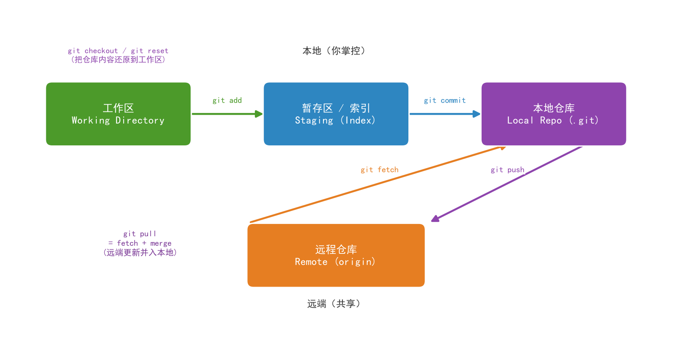
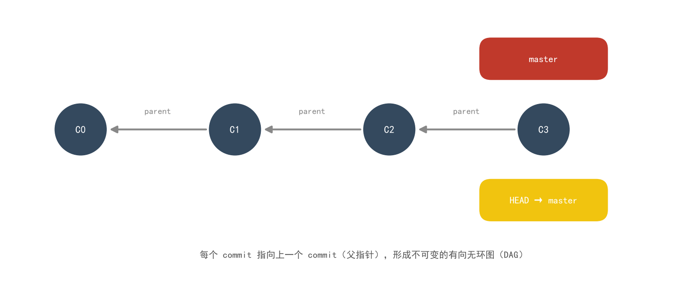
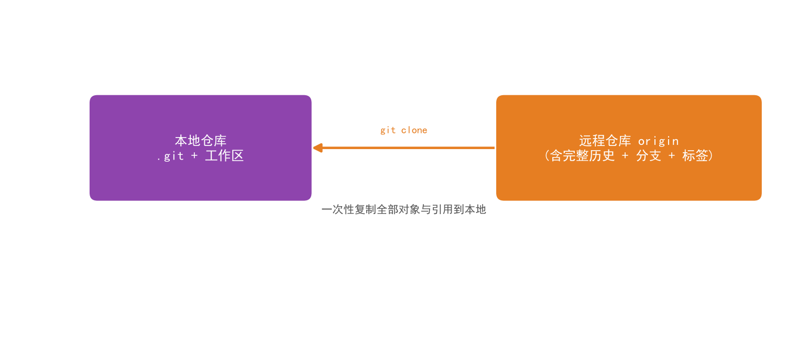
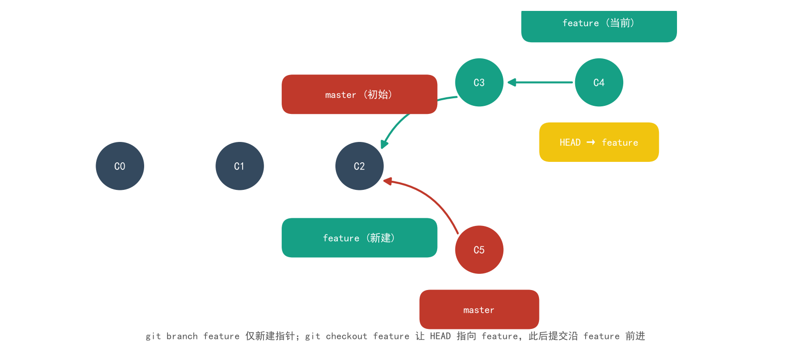
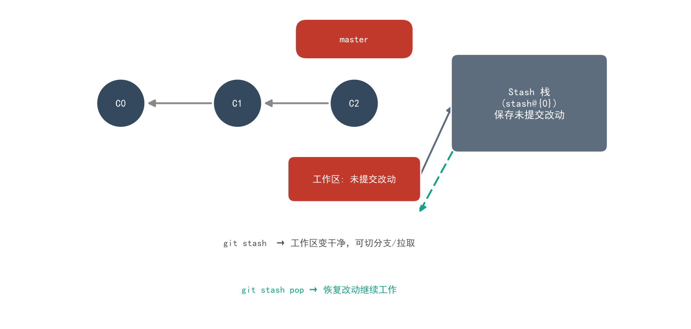
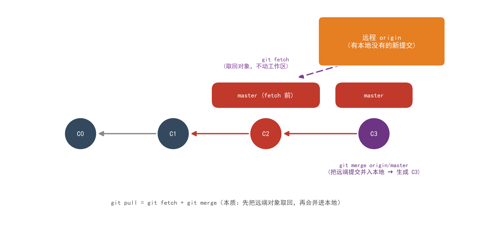
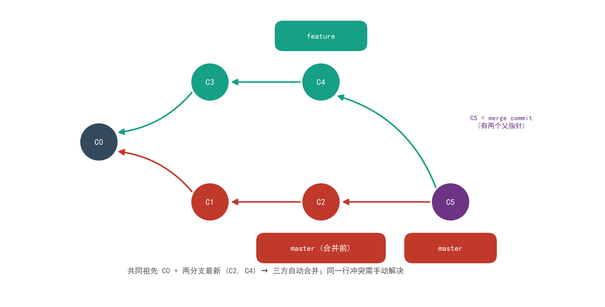
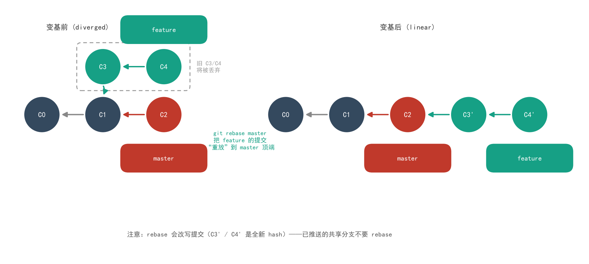
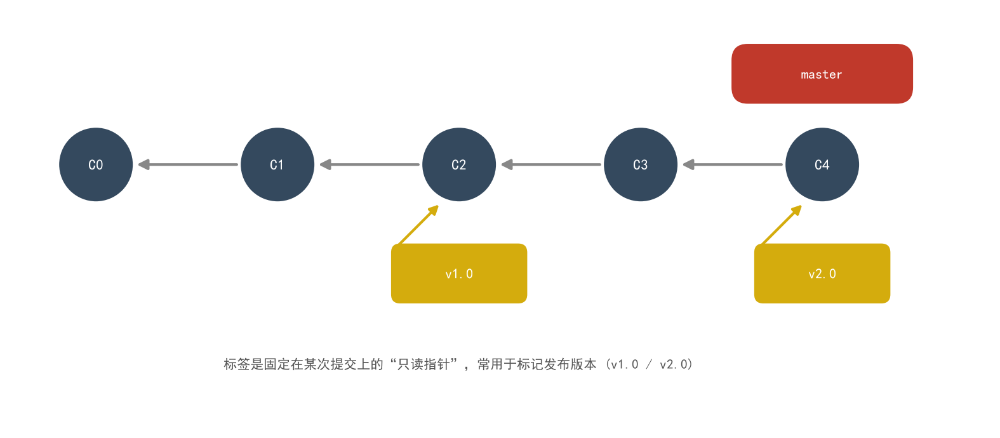

# Git 版本控制详解

> **一句话**:Git 把你的每次保存变成一个**不可变的快照链**,分支和标签只是指向快照的**便宜指针**——理解了"指针 + 三区"这个心智模型,clone / add / commit / branch / merge / rebase / stash / tag 全部豁然开朗。

本文覆盖日常最核心的 11 个命令:**clone / branch / checkout / add / commit / pull / push / merge / rebase / stash / tag**,每个命令都配可视化图解,并附速查表、危险操作后悔药、可视化工具与团队工作流。

---

## 0. Git 是什么:分布式版本控制

| 维度 | 集中式(SVN) | 分布式(Git) |
|---|---|---|
| 仓库位置 | 唯一中央服务器 | 每人本地都有**完整仓库**(含全部历史) |
| 离线工作 | 基本不行 | 提交 / 看日志 / 建分支全离线 |
| 分支成本 | 重(目录拷贝) | 极轻(一个 41 字节指针文件) |
| 断网后果 | 无法提交 | 只有 push/pull 受影响 |

**核心结论**:Git 里"本地仓库"和"远程仓库"是两个平等主体,`push`/`pull` 只是两者之间的同步动作;而 `add`/`commit` 发生在本地内部。这正是图 1 要表达的全景。

---

## 1. 核心心智模型:三区 + 快照链

### 1.1 三区与数据流(必须先刻进脑子)



- **工作区 (Working Directory)**:你正在编辑的文件目录。
- **暂存区 (Staging / Index)**:"下一次提交"的清单,一个精确到行的购物车。
- **本地仓库 (Local Repo,即 `.git` 目录)**:全部历史快照,只属于你。
- **远程仓库 (Remote)**:团队共享的服务器(GitHub / GitLab / Gitee…)。

数据流口诀:**add 进购物车 → commit 入本地库 → push 上云端;fetch/pull 从云端取**。

### 1.2 commit 是什么:不可变快照链



每个 commit 包含:

1. **指向内容快照的指针**(Git 存的是文件快照,不是差异);
2. **指向上一个 commit 的 parent 指针**(merge commit 有两个);
3. 作者 / 时间 / 提交信息;
4. 由以上内容算出的 **SHA-1 哈希**(如 `a7d332b`)——内容一变,hash 全变,历史因此**不可篡改**。

### 1.3 分支与 HEAD 的本质

```bash
$ cat .git/HEAD
ref: refs/heads/master        # HEAD 通常指向"当前分支"

$ cat .git/refs/heads/master
a7d332b8...                   # 分支只是一个 41 字节的哈希指针文件
```

- **分支 = 指向某个 commit 的可移动指针**,创建分支零成本;
- **HEAD = "你当前在哪个分支/提交上"的指针**,提交时 HEAD 带着当前分支指针一起前移。

---

## 2. clone:把整个仓库搬回家



```bash
git clone https://github.com/user/repo.git          # HTTPS
git clone git@github.com:user/repo.git              # SSH(推荐,配密钥免密)
git clone git@github.com:user/repo.git mydir        # 指定本地目录名
git clone -b dev git@github.com:user/repo.git       # 直接检出 dev 分支
git clone --depth 1 git@github.com:user/repo.git    # 浅克隆:只要最新一层(大仓库提速)
```

要点:
- clone = **下载全部对象 + 全部分支历史**,并自动配置好 `origin` 远程、建立本地跟踪分支;
- 只想要文件不想要历史?用 Download ZIP 即可,那不是 clone;
- `--depth 1` 浅克隆省流量,但后续 `fetch` 完整历史需要 `git fetch --unshallow`。

---

## 3. add:选择"这次提交什么"

工作区改动**不会自动**进入提交——必须先 `add` 进暂存区。这个"多一步"正是 Git 的精华:**你可以把一堆改动拆成多个干净的提交**。

```bash
git add file.py              # 单个文件
git add src/                 # 整个目录
git add .                    # 当前目录下全部改动(含新文件)
git add -u                   # 只加已跟踪文件的修改/删除(不含新文件)
git add -A                   # 全仓库所有改动
git add -p                   # 逐块(hunk)挑着加——精确到行的克制提交
```

配套观察命令:

```bash
git status                   # 谁在暂存区、谁还没跟踪
git diff                     # 工作区 vs 暂存区(还没 add 的改动)
git diff --staged            # 暂存区 vs 上次提交(即将提交的内容)
```

> **误区**:`git add .` 一把梭是"垃圾提交"的根源。善用 `add -p` 把功能改动和顺手修的 typo 拆开,历史才可读、可回滚。

---

## 4. commit:给历史打一个快照

```bash
git commit -m "feat(camera): 支持软触发模式切换"
git commit                                    # 打开编辑器写多行提交信息
git commit --amend                            # 补漏文件/改信息,修掉最近一次提交
git commit -a -m "..."                        # 跳过 add,直接提交所有已跟踪文件的改动
```

**提交信息规范(Conventional Commits)**,与本书仓库实践一致:

```
<类型>(<范围>): <一句话摘要>

<可选正文:为什么改>
```

常用类型:`feat` 新功能 / `fix` 修 bug / `docs` 文档 / `refactor` 重构 / `test` 测试 / `chore` 杂务。

**好提交的粒度**:一个提交只做一件事;能一句话说清;编译可通过。粗看图 3 的快照链——每个节点未来都可能被 `revert` 或 `cherry-pick`,粒度太粗就拆不动了。

---

## 5. branch:指针而已,尽管开



```bash
git branch                    # 列出本地分支
git branch feature/net        # 新建分支(仅创建指针,不切换)
git switch feature/net        # 切换分支(新语法,推荐)
git switch -c feature/net     # 新建并切换(= git checkout -b)
git branch -d feature/net     # 删除已合并分支(安全)
git branch -D feature/net     # 强删未合并分支(丢弃提交!)
```

- 上图关键:**`feature` 创建时与 `master` 指向同一个 commit(C2)**;切换到 feature 后的新提交沿 feature 前进,master 纹丝不动——这就是"分支互不干扰"的全部真相;
- 分支命名习惯:`feature/xxx`、`fix/xxx`、`hotfix/xxx`,斜杠形成命名空间。

---

## 6. checkout / switch:移动 HEAD

`git checkout` 是个**身兼两职**的老命令,新版本拆成了两个语义清晰的命令:

| 老写法 | 新写法 | 用途 |
|---|---|---|
| `git checkout dev` | `git switch dev` | 切换分支 |
| `git checkout -b dev` | `git switch -c dev` | 新建并切换 |
| `git checkout -- file.py` | `git restore file.py` | **丢弃工作区改动**(危险!) |
| `git checkout a7d332b` | `git switch --detach a7d332b` | 检出到某个历史提交 |

**detached HEAD(游离头指针)**:直接检出 commit 哈希时,HEAD 不再指向任何分支——此时提交的 commit 不挂在分支上,一切换走就可能"丢失"(实际可经 `reflog` 找回)。想在旧提交上实验,先 `git switch -c tmp-branch`。

---

## 7. stash:把现场临时收起来

**场景**:改到一半,突然要切分支修线上 bug——代码还没到能提交的程度,`stash` 就是为此而生。



```bash
git stash                     # 收起工作区+暂存区改动,现场变干净
git stash -u                  # 连未跟踪的新文件一起收
git stash push -m "调参到一半"  # 带备注
git stash list                # stash@{0}, stash@{1}... 栈式排列
git stash pop                 # 弹出最近一条并恢复(= apply + drop)
git stash apply stash@{2}     # 恢复指定一条(保留在栈上)
git stash drop stash@{0}      # 丢弃某条
```

要点:stash 是**栈**,后进先出;`pop` 恢复时若有冲突会保留栈条目,先解决冲突再 `drop`。

---

## 8. pull = fetch + merge



```bash
git fetch origin                    # 只取回远端对象与引用,不动工作区(安全!)
git log origin/master..master       # 看看 fetch 回来了什么差异
git merge origin/master             # 把远端更新合并进本地
# 等价于一步:
git pull origin master
git pull --rebase                   # fetch + rebase:历史保持线性(见 §11)
```

- **fetch 是"只看不动"**:把远端新提交下载成本地跟踪分支 `origin/master`,你的工作区、本地分支完全不变——先 fetch 再决定怎么合并,是稳妥姿势;
- **pull 是"取回并自动合并"**:省事,但合并失败(冲突)时你会直接被推进冲突现场;
- 团队协作日常节奏:**上班先 pull,下班前 push**。

---

## 9. push:把本地历史发布出去

```bash
git push                           # 推当前分支(需已建立跟踪)
git push -u origin feature/net     # 首次推送并建立跟踪关系(-u 只需一次)
git push origin --delete old-branch  # 删除远端分支
git push --tags                    # 推送标签(默认 push 不带 tag!)
```

**push 被拒绝 (rejected / non-fast-forward) 的原因**:远端有你本地没有的新提交(别人先推了)。Git 拒绝你"覆盖"别人,正确处理:

```bash
git pull --rebase        # 把自己的提交变基到远端最新之上,再推
# 或
git pull                 # 合并远端(会产生 merge commit),再推
```

**`-f` 强推是危险动作**,会抹掉远端别人的提交。共享分支一律禁用;万不得已要用 `--force-with-lease`(若远端在你看过之后又变了,推送仍会失败,多一层保险)。

---

## 10. merge:三方合并



两个分支从 C0 分叉后各自前进(master 到 C2,feature 到 C4)。`git merge feature` 时,Git 找到**共同祖先 C0**,对"祖先 / 我方 C2 / 对方 C4"三方做合并:

- **改动不重叠** → 自动合并,生成 **merge commit C5**(注意它有**两个父指针**);
- **同一行两边都改了** → 冲突(CONFLICT),Git 会在文件里留下标记:

```
<<<<<<< HEAD
master 侧的修改
=======
feature 侧的修改
>>>>>>> feature
```

**冲突解决 SOP**:`git status` 列出冲突文件 → 逐个编辑(决定保留哪边/融合两边)→ `git add <文件>` 标记已解决 → `git commit` 完成 merge(或 `git merge --abort` 整体撤回)。

**fast-forward(快进)**:若 master 在分叉后**没有新提交**,合并只是把指针前移,不产生 merge commit。想强制保留"合流"记录:`git merge --no-ff feature`。

---

## 11. rebase:变基,把提交"搬"到新基底上



`git rebase master`(在 feature 上执行)= 把 feature 独有的提交**逐个摘下来,重放到 master 顶端**,历史从"分叉"变成"一条直线"。

- 右图中 `C3' / C4'` 是**全新的 commit(新 hash)**——rebase 本质是**改写历史**;
- 好处:线性、干净的历史,review 友好;
- **黄金法则:已被推送到共享分支的提交,不要 rebase**(别人已经基于旧提交工作,你一改写,全网冲突)。

```bash
git switch feature
git rebase master            # 把 feature 变基到 master 顶端
git rebase --continue        # 解决冲突后继续
git rebase --abort           # 整体撤回,回到 rebase 前
```

**交互式 rebase——提交整理神器**:

```bash
git rebase -i HEAD~3         # 整理最近 3 个提交
```

把动作列表里的 `pick` 改为:`squash` 合并进上一个 / `reword` 改信息 / `drop` 丢弃 / `edit` 停下来改内容。发 PR 前把一串 "wip" 揉成一个体面提交,全靠它。

**merge vs rebase 怎么选**:

| | merge | rebase |
|---|---|---|
| 历史 | 保留真实分叉(有 merge commit) | 线性、伪造的干净历史 |
| 安全性 | 不改写历史,绝对安全 | 改写 hash,共享分支慎用 |
| 典型场景 | 合并功能进主干(公开动作) | push 前同步主干 / 整理私人提交 |
| 团队约定 | 主干只进 merge | 分支合并一律 PR + squash |

---

## 12. tag:给历史钉里程碑



```bash
git tag                              # 列出标签
git tag v1.0                         # 轻量标签(只是个指针)
git tag -a v2.0 -m "正式版:支持多相机"  # 附注标签(含作者/日期/信息,推荐发版用)
git tag -a v1.5 a7d332b -m "补标"     # 给历史提交补标签
git push origin v2.0                 # 推单个标签
git push origin --tags               # 推全部标签
git switch --detach v1.0             # 检出到某版本(查看/排查旧版)
git tag -d v1.0                      # 删本地标签
```

- 分支会随提交**前移**,tag 钉死在 commit 上**永不动**——`v1.0` 永远是当年那个 v1.0;
- 附注标签是完整对象(有 hash、可签名),轻量标签只是别名;发版用 `-a`;
- `git push` 默认**不带**标签,要单独 `--tags` 或指定 tag 名——忘了推 tag 是"CI 找不到版本号"的常见根因。

---

## 13. 速查表:11 个核心命令一页看全

| 命令 | 作用域 | 一句话 | 高频参数 |
|---|---|---|---|
| `clone` | 远→本地 | 完整搬回仓库 | `-b 分支` `--depth 1` |
| `branch` | 本地 | 创建/列出/删除指针 | `-c` 新建 `-d` 删 `-D` 强删 |
| `checkout` / `switch` | HEAD | 切分支;老命令兼还原文件 | `-b` 新建切换;`restore` 丢改动 |
| `add` | 工作区→暂存区 | 挑选本次提交内容 | `.` `-A` `-u` `-p` |
| `commit` | 暂存区→本地 | 打快照 | `-m` `--amend` `-a` |
| `fetch` | 远→本地 | 只取不动(安全) | `--all` `--prune` |
| `pull` | 远→本地 | fetch + merge | `--rebase` |
| `push` | 本地→远 | 发布提交 | `-u` `--tags` `--force-with-lease` |
| `merge` | 本地 | 三方合并分支 | `--no-ff` `--abort` |
| `rebase` | 本地 | 变基/改写历史 | `-i` `--continue` `--abort` |
| `stash` | 工作区⇄栈 | 临时收起现场 | `-u` `list` `pop` `apply` |
| `tag` | 本地 | 钉里程碑 | `-a` `-m` `--tags` |

---

## 14. 危险操作与后悔药

| 场景 | 后悔药 |
|---|---|
| 刚 commit,发现漏文件/信息写错 | `git commit --amend` |
| 工作区改乱了,想丢弃某文件改动 | `git restore file.py`(**不可恢复,慎用**) |
| 已 commit 但还没 push,想整个撤回 | `git reset --soft HEAD~1`(留改动)/ `--mixed`(默认)/ `--hard`(连改动一起丢,**高危**) |
| 已 push,要安全撤回某次提交 | `git revert <hash>`(生成反向提交,不改写历史,共享分支唯一正解) |
| rebase / reset --hard 之后想反悔 | `git reflog` 找到操作前的 hash → `git reset --hard <hash>`(**Git 的终极后悔药**) |
| 删了分支找不到提交 | 同上,`reflog` 里都记着(默认保留 90 天) |

**三条铁律**:
1. `--force`、`reset --hard`、`branch -D` 出手前先 `git log`/`reflog` 确认一遍;
2. 共享分支上撤销 = `revert`,本地撤销才可用 `reset`;
3. 天天提交、勤 push,损失自然小。

---

## 15. 可视化工具推荐

| 工具 | 类型 | 特点 |
|---|---|---|
| `git log --graph --oneline --all` | 命令行 | 零依赖,ASCII 画分支图,服务器可用 |
| **GitKraken** | GUI | 颜值高,拖拽 merge/rebase,历史树直观 |
| **Sourcetree** | GUI(免费) | 老牌全功能,stash/patch 支持好 |
| **VS Code 内置 Git + GitLens 插件** | 编辑器集成 | 行级 blame、历史内联,日常开发够用 |
| **lazygit** | 终端 TUI | 键盘流的图形化,`brew install lazygit` |
| `gitk` / `git gui` | 自带 GUI | 随 Git 安装,看历史足够 |

终端下强烈建议配置别名:

```bash
git config --global alias.lg "log --graph --oneline --decorate --all"
git lg    # 一条命令看全仓库分支拓扑
```

---

## 16. 团队工作流选型

| 工作流 | 结构 | 适合 |
|---|---|---|
| **GitHub Flow** | main + 短命 feature 分支 + PR | Web 持续部署团队,最简单(推荐起步) |
| **Git Flow** | main / develop / feature / release / hotfix 五类分支 | 有版本化发布节奏的产品(桌面软件、SDK) |
| **Trunk-Based** | 人人直接小步提交主干,feature flag 控开关 | 高频部署、强 CI/CD 的成熟团队 |

本书仓库即 **GitHub Flow 变体**:main 直推 + Conventional Commits,轻量可控。

---

## 17. 十大高频坑

1. **`git add .` 一把梭** → 提交粒度稀烂;用 `add -p` 挑着加。
2. **push 忘了推 tag** → CI 拿不到版本号;发版记得 `git push origin --tags`。
3. **在共享分支上 rebase / amend 后强推** → 队友历史错乱;公共分支只 `revert`。
4. **pull 直接冲突进退两难** → 日常用 `pull --rebase`;先 `fetch` 看再并更稳。
5. **merge 冲突把 `<<<<<<<` 标记留在代码里就提交** → 提交前全文件搜 `<<<<<<<`。
6. **`checkout <旧hash>` 上直接提交** → detached HEAD 提交丢失;先建临时分支。
7. **`reset --hard` 当撤销键** → 未提交改动永久丢失;丢改动前 `git stash` 一下。
8. **大小写仅不同的两个分支/文件** → Windows 不区分大小写,推到 Linux CI 就炸。
9. **CRLF/LF 换行符全文件 diff** → 配 `.gitattributes`(`* text=auto`)一劳永逸。
10. **`.gitignore` 写晚了** → 二进制/密钥已进历史;改 ignore 不删已跟踪文件,需 `git rm --cached`。

---

## 18. 一句话核心要义

**Git = 不可变快照链(commit)+ 一堆可移动指针(branch/HEAD/tag)+ 三区数据流(add→commit→push)**。所有命令不过是在"移动指针、搬运快照"——想明白每条命令动的是哪个指针,就再也不会背命令了。

---

*关联阅读:[HTML 前后端通信详解](../Web前后端通信/01-HTML前后端通信详解.md)(团队协作的代码如何变成服务)| [CloudBase 开发部署详解](../云开发CloudBase/01-CloudBase开发部署详解.md)(push 之后还能自动部署)*
