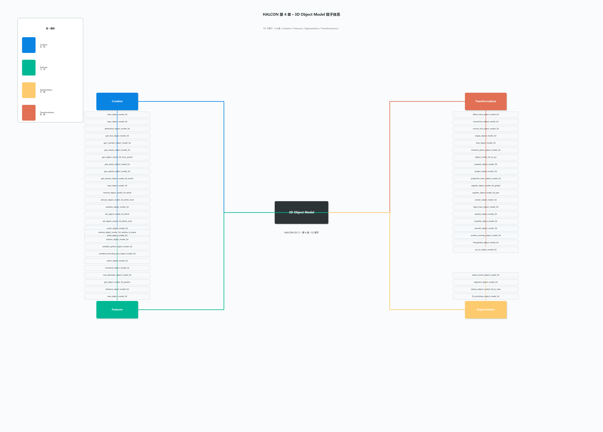

# 第 4 章 · 3D Object Model 算子体系总结

> **一句话结论**：这一章 HALCON 把"3D 几何对象"抽象成一个通用的 **句柄 `ObjectModel3D`**（相当于"3D 数据的 `HImage`"），整章 **52 个算子**围绕"**怎么造 → 怎么量 → 怎么拆 → 怎么变**"四步流水线展开，对应 4 大族。本章是 HALCON 3D 能力的"**底层数据层**"——第 5~7 章的 `Surface-Based` / `Shape-Based` / `Deformable` 匹配全部以本章的 `ObjectModel3D` 为输入。

> 配套可视化：[04-3D对象模型.png](04-3D对象模型.png)（思维导图，4 大族 + 52 算子全列）

---

## 0. 思维导图（一眼总览）



> 中心节点 `3D Object Model`、四个分支：左上 `Creation`、右上 `Transformations`、左下 `Features`、右下 `Segmentation`，每个分支下方是该族全部算子的英文原名（52 个全列）。

---

## 1. 核心抽象：`ObjectModel3D` 句柄

整个第 4 章只有一个核心数据类型：**`ObjectModel3D`**。它不是一个具体的 mesh/点云/原始 xyz，而是 HALCON 内部一个**多态容器**，可以装下面这些数据形态之一或多种：

| 数据形态 | 含义 | 典型来源 | 关键属性（attrib 名称）|
| --- | --- | --- | --- |
| **点云 (Points)** | 一堆 xyz 坐标点 | `xyz_to_object_model_3d` / `read_object_model_3d('ply','xyz')` | `'&x'`, `'&y'`, `'&z'` |
| **三角面 (Triangles)** | Mesh 拓扑（顶点+三角形索引） | `gen_sphere_object_model_3d` / `gen_box_object_model_3d` | `'&triangles'` |
| **法向 (Normals)** | 每个点的法向量 | `surface_normals_object_model_3d` | `'&point_normal_x/y/z'` |
| **映射图 (Mapping)** | 像素 → 3D 点的对应关系 | `xyz_to_object_model_3d(...,'xyz_mapping','...')` | `'mapping'` |
| **属性 (Attrib)** | 用户自定义数组（如每个点的强度/颜色/标签） | `set_object_model_3d_attrib` | 任意名字 |

> **关键认知**：`ObjectModel3D` 是**句柄**（handle），不是"内存里的对象"。HALCON 内部维护一个句柄表，存的是指针/索引；算子 `clear_object_model_3d` 才真正释放内存。所以"传值" `ObjectModel3D` 永远很轻——O(1)，不要把它当 struct。

**重要配套算子**：

| 算子 | 用途 | 何时用 |
| --- | --- | --- |
| `gen_empty_object_model_3d` | 创建空容器 | 后面要逐步 `set_*_attrib` 往里塞数据 |
| `copy_object_model_3d` | 浅拷贝 | 不想改原 3D 时复制一份 |
| `clear_object_model_3d` | 释放内存 | 显式释放，避免 HALCON 内部句柄表爆炸 |
| `union_object_model_3d` | 把多个 `ObjectModel3D` 合一个 | 多视角点云拼接 |
| `set_object_model_3d_attrib / attrib_mod` | 加新属性 / 改已有属性 | 加强度、标签、ROI 等 |
| `remove_object_model_3d_attrib / attrib_mod` | 删属性 / 删某点属性 | 减小数据量、屏蔽干扰 |

---

## 2. 算子全景（4 大族 × 52 算子）

| 族 | 算子数 | 一句话职责 | 关键算子 |
| --- | --- | --- | --- |
| **A. Creation（生成）** | 18 | 怎么造一个 `ObjectModel3D`（基础几何/空/读文件/序列化） | `gen_box/cylinder/sphere/plane_object_model_3d`、`gen_object_model_3d_from_points`、`xyz_to_object_model_3d`、`read/write/serialize/deserialize_object_model_3d`、`gen_empty`、`union`、`clear`、`copy` |
| **B. Features（特征）** | 10 | 对 3D 模型量尺寸、算体积、算包围盒（"测"阶段） | `distance_object_model_3d`、`area_object_model_3d`、`volume_object_model_3d`、`moments_object_model_3d`、`smallest_bounding_box_object_model_3d`、`smallest_sphere_object_model_3d`、`max_diameter_object_model_3d`、`select_object_model_3d`、`get_object_model_3d_params` |
| **C. Segmentation（分割）** | 4 | 把整个模型"切开"（点云分块、拟合基元、ROI 裁剪） | `segment_object_model_3d`、`fit_primitives_object_model_3d`、`reduce_object_model_3d_by_view`、`select_points_object_model_3d` |
| **D. Transformations（变换）** | 20 | 对模型做变换（几何/拓扑/格式转换/可视化） | `affine/rigid/projective_trans_object_model_3d`、`sample/simplify/smooth/triangulate_object_model_3d`、`surface_normals_object_model_3d`、`register_object_model_3d_pair/global`、`render_object_model_3d`、`xyz_to_object_model_3d`/`object_model_3d_to_xyz` 等 |

> **族选择口诀**：要 **造**→A；要 **量**→B；要 **拆**→C；要 **变**→D。

---

## 3. 族 A · Creation（18 个算子，造数据）

**做什么**：把"原始数据"（xyz 数组、文件、空状态）变成 HALCON 能识别的 `ObjectModel3D`。

### 3.1 子分组

| 子组 | 算子 | 用途 |
| --- | --- | --- |
| **基础几何** | `gen_box_object_model_3d` / `gen_cylinder_object_model_3d` / `gen_sphere_object_model_3d` / `gen_sphere_object_model_3d_center` / `gen_plane_object_model_3d` | 构造规则几何体（Box、Cylinder、Sphere、Plane），用于仿真、ROI 标定、碰撞盒 |
| **点云构造** | `gen_empty_object_model_3d` / `gen_object_model_3d_from_points` / `xyz_to_object_model_3d` | 从 C 数组（Hx×3 或 Hx×6）或空容器起步，构造点云 |
| **持久化** | `read_object_model_3d` / `write_object_model_3d` | 读写 .ply / .obj / .stl / .off / .om3d 等文件 |
| **序列化** | `serialize_object_model_3d` / `deserialize_object_model_3d` | 把 `ObjectModel3D` 压成 base64 字符串（用于存数据库、跨进程传输） |
| **属性操作** | `set_object_model_3d_attrib` / `set_object_model_3d_attrib_mod` / `remove_object_model_3d_attrib` / `remove_object_model_3d_attrib_mod` | 在已有模型上**新增 / 改写 / 删除**属性 |
| **生命周期** | `copy_object_model_3d` / `clear_object_model_3d` / `union_object_model_3d` | 拷贝 / 释放 / 合并 |

### 3.2 关键签名（精选）

```text
gen_box_object_model_3d(  : : LengthX, LengthY, LengthZ : ObjectModel3D)
gen_cylinder_object_model_3d(  : : Height, RadiusMin, RadiusMax, NumSegments : ObjectModel3D)
gen_sphere_object_model_3d(  : : Radius, NumPhi, NumTheta : ObjectModel3D)
gen_plane_object_model_3d(  : : XAxis, YAxis, ZAxis : ObjectModel3D)
gen_object_model_3d_from_points(  : : NumPoints, Points : ObjectModel3D)
xyz_to_object_model_3d(  : : X, Y, Z : ObjectModel3D)
xyz_to_object_model_3d(  : : X, Y, Z, XYZMapping, Mapping : ObjectModel3D)
read_object_model_3d(  : : FileName, Scale : ObjectModel3D)
write_object_model_3d(  : : ObjectModel3D, FileType, FileName : )
serialize_object_model_3d(  : : ObjectModel3D : SerializedItem)
deserialize_object_model_3d(  : : SerializedItem : ObjectModel3D)
set_object_model_3d_attrib(  : : ObjectModel3D, Name, AttribData : ObjectModel3D)
set_object_model_3d_attrib_mod(  : : ObjectModel3D, Name, AttribData : )
remove_object_model_3d_attrib(  : : ObjectModel3D, Name : ObjectModel3D)
union_object_model_3d(  : : ObjectModels3D : ObjectModel3DUnion)
```

### 3.3 `xyz_to_object_model_3d` 的 6 种 Mapping 模式（高频考点）

`xyz_to_object_model_3d` 的关键参数 `XYZMapping` 决定了 X/Y/Z 数组的语义：

| `XYZMapping` 值 | 输入数组含义 | 典型用法 |
| --- | --- | --- |
| `'cartesian'`（默认） | X/Y/Z 都是 N×1 的笛卡尔坐标 | 普通点云 |
| `'polar'` | X=距离、Y=方位角 θ、Z=仰角 φ | 雷达/LiDAR 球坐标 |
| `'cylindrical'` | X=半径、Y=角度、Z=高度 | 圆柱扫描 |
| `'spherical'` | X=半径、Y=极角、Z=方位角 | 球坐标系 |
| `'object_polar'` | 距参考点（Origin）的距离/角度 | 单物体局部坐标系 |
| `'plane_and_height'` | X/Y 平面坐标 + Z 离地高度 | 高度图 |
| `'onto_plane'` | **必须配套 Mapping** 参数：把 X/Y 像素坐标映到 3D 平面 | 配合 `XYZ Mapping`（结构光相机、ToF） |

> 当 `XYZMapping = 'onto_plane'` 时，必须额外提供 `Mapping`（NxM 整数矩阵），把"像素坐标 (row, col)"绑到 X/Y/Z 中的"对应像素行"——这是结构光相机和双目视觉最常见的入口。

### 3.4 实战工作流（HDevelop）

```text
* 1) 从文件读
read_object_model_3d ('pc.ply', 'mm', [], [], ObjectModel3D, Status)

* 2) 从 C 数组造（HALCON/C++ 接口，HDevelop 演示）
X := [1.0, 2.0, 3.0]
Y := [4.0, 5.0, 6.0]
Z := [7.0, 8.0, 9.0]
xyz_to_object_model_3d (X, Y, Z, ObjectModel3D)

* 3) 加属性（如每个点的强度）
Intensity := [120, 200, 80]
set_object_model_3d_attrib (ObjectModel3D, '&intensity', Intensity, ObjectModelOut)

* 4) 显式释放
clear_object_model_3d (ObjectModel3D)
```

---

## 4. 族 B · Features（10 个算子，量数据）

**做什么**：对 `ObjectModel3D` 做**几何测量**（面积/体积/距离/包围盒）。

### 4.1 子分组

| 子组 | 算子 | 量什么 |
| --- | --- | --- |
| **标量度量** | `area_object_model_3d` / `volume_object_model_3d` / `volume_object_model_3d_relative_to_plane` / `max_diameter_object_model_3d` | 总表面积、总体积（参考某平面之上的体积）、最大直径 |
| **特征度量** | `moments_object_model_3d` / `distance_object_model_3d` / `smallest_bounding_box_object_model_3d` / `smallest_sphere_object_model_3d` | 3D 矩（重心+惯量）、点到模型的最短距离、OBB、最小包围球 |
| **筛选 / 元数据** | `select_object_model_3d` / `get_object_model_3d_params` | 按属性筛选子集；查询模型元信息（点数、面数、属性名） |

### 4.2 关键签名（精选）

```text
area_object_model_3d(  : : ObjectModel3D : Area)
volume_object_model_3d(  : : ObjectModel3D, Orientation : Volume)
volume_object_model_3d_relative_to_plane(  : : ObjectModel3D, Plane, Mode : Volume)
distance_object_model_3d(  : : ObjectModel3D, ObjectModel3DReference, Pose, MaxDistance, NumSampling : DistanceMin, DistanceMax)
smallest_bounding_box_object_model_3d(  : : ObjectModel3D, Type : Pose, Length1, Length2, Length3)
smallest_sphere_object_model_3d(  : : ObjectModel3D : Center, Radius)
moments_object_model_3d(  : : ObjectModel3D, MomentsToCalculate : Moments)
select_object_model_3d(  : : ObjectModel3D, Feature, Operation, MinValue, MaxValue : ObjectModel3DSelected)
get_object_model_3d_params(  : : ObjectModel3D, ParamName : ParamValue)
max_diameter_object_model_3d(  : : ObjectModel3D : Diameter)
```

### 4.3 易混点：OBB 三种 `Type`

`smallest_bounding_box_object_model_3d` 的 `Type`：

| `Type` | 含义 | 用途 |
| --- | --- | --- |
| `'oriented'`（默认） | OBB，长轴方向自适应 | 测量物体在最小外接长方体里的位姿 |
| `'axis_aligned'` | AABB，与世界轴对齐 | 计算栅格占用、装箱 |
| `'obb_oriented_points_only'` | 只用点云、忽略拓扑的 OBB | 点云缺面数据时用 |

### 4.4 实战：测一堆螺钉点云的 OBB + 体积

```text
* 假设 ObjectModel3DScrews 是一组螺钉点云（已 union 到一起）
* 1) 算 OBB
smallest_bounding_box_object_model_3d (ObjectModel3DScrews, 'oriented', \
    Pose, Lx, Ly, Lz)
* 2) 算体积（参考 OBB 中心所在平面）
volume_object_model_3d_relative_to_plane (ObjectModel3DScrews, \
    [Pose[0:2], 0, 0, 0, 0], 'positive_side', Volume)
* 3) 算最远一对点（直径）
max_diameter_object_model_3d (ObjectModel3DScrews, Diameter)
```

---

## 5. 族 C · Segmentation（4 个算子，拆数据）

**做什么**：把 `ObjectModel3D` 切成"有意义的块"或筛选出 ROI。

### 5.1 4 个算子

| 算子 | 用途 | GenParam / 关键参数 |
| --- | --- | --- |
| `segment_object_model_3d` | **核心**：按法向/颜色/距离把点云分块 | `'method'` = `'distance'` / `'normal'` / `'color'` / `'texture'`；`'max_dist'`、`'min_pts_per_seg'` |
| `fit_primitives_object_model_3d` | 在点云里拟合规则基元（平面/圆柱/球/box） | `'primitive_type'` = `'plane'`/`'cylinder'`/`'sphere'`/`'box'`；`'fitting_algorithm'` = `'least_squares'`/`'huber'`/`'tukey'`；`'min_num_points'` |
| `reduce_object_model_3d_by_view` | 按视角过滤点云（只留相机能看到的） | `'view_azimuth'`、`'view_elevation'`、`'view_distance'`、`'remove_hidden'` |
| `select_points_object_model_3d` | 按条件筛点云（保留/移除满足属性的子集） | `'attribute_name'`、`'min_value'`/`'max_value'`、`'operation'` |

### 5.2 `segment_object_model_3d` 4 种分割法

| `method` | 原理 | 适用场景 |
| --- | --- | --- |
| `'distance'` | 按欧氏距离聚类（类似 DBSCAN） | 杂乱场景里拆散乱件 |
| `'normal'` | 按法向聚类 | 平面、斜面、规则曲面分割 |
| `'color'` | 按颜色聚类（要 RGB 属性） | 彩色物体、零件分色 |
| `'texture'` | 按纹理聚类 | 表面纹理区分 |

### 5.3 `fit_primitives_object_model_3d` 6 种基元

| `'primitive_type'` | 输出 | GenParam 关键 |
| --- | --- | --- |
| `'plane'` | 平面 `Pose` | `'output_xyz_mapping'`、`'min_num_points'` |
| `'cylinder'` | 圆柱 | `'radius_range'`、`'axis_range'` |
| `'sphere'` | 球心+半径 | `'radius_range'` |
| `'box'` | OBB | — |
| `'line'` | 3D 直线 | — |
| `'circle'` | 3D 圆 | — |

### 5.4 实��：拆出螺丝点云 + 拟合圆柱

```text
* 1) 按法向初分
segment_object_model_3d (ObjectModel3D, 'normal', 5, [], [], ObjectModelsSegmented)

* 2) 选最大的块（ObjectModelsSegmented 是元组）
select_object_model_3d (ObjectModelsSegmented, 'num_points', \
    'and', 1000, 99999999, ObjectModelLargest)

* 3) 在最大块里拟合圆柱
fit_primitives_object_model_3d (ObjectModelLargest, 'cylinder', \
    [], [], 'least_squares', [], CylinderParams)
```

---

## 6. 族 D · Transformations（20 个算子，变数据）

**做什么**：对 `ObjectModel3D` 做各种变换——几何变换（移动/旋转/缩放）、拓扑变换（采样/简化/平滑）、格式变换（xyz ↔ `ObjectModel3D`）、可视化（渲染）、配准（多片拼接）。

### 6.1 子分组（按用途 8 类）

| 子类 | 算子 | 用途 |
| --- | --- | --- |
| **几何变换** | `rigid_trans_object_model_3d` / `affine_trans_object_model_3d` / `projective_trans_object_model_3d` | 把整个模型做刚体 / 仿射 / 透视变换（输入 `Pose` 或 `HomMat3D`） |
| **格式转换** | `xyz_to_object_model_3d` / `object_model_3d_to_xyz` | 数组 ↔ 句柄 |
| **拓扑处理** | `sample_object_model_3d` / `simplify_object_model_3d` / `smooth_object_model_3d` / `triangulate_object_model_3d` | 降采样 / 抽稀 / 法向平滑 / 三角化 |
| **几何求交** | `intersect_plane_object_model_3d` / `edges_object_model_3d` / `convex_hull_object_model_3d` | 模型与平面求交、抽边、凸包 |
| **法向/曲率** | `surface_normals_object_model_3d` | 计算法向（`'mls'`/`'polygon'` 两种方法） |
| **配准 (Registration)** | `register_object_model_3d_pair` / `register_object_model_3d_global` | 两片配准 / 多片全局配准（输出 Pose） |
| **可视化** | `render_object_model_3d` / `project_object_model_3d` | 把 3D 渲染成 2D 图 / 投影到平面 |
| **点云连接** | `connection_object_model_3d` / `fuse_object_model_3d` / `prepare_object_model_3d` | 元组转单 / 单转元组 / 预处理（法向/边界框加速） |

### 6.2 关键签名（精选）

```text
rigid_trans_object_model_3d(  : : ObjectModel3D, Pose : ObjectModel3DTransformed)
affine_trans_object_model_3d(  : : ObjectModel3D, HomMat3D : ObjectModel3DTransformed)
sample_object_model_3d(  : : ObjectModel3D, SamplingMethod, NumPoints, Seed : ObjectModel3DSampled)
simplify_object_model_3d(  : : ObjectModel3D, Method, Amount, GenParamName, GenParamValue : ObjectModel3DSimplified)
intersect_plane_object_model_3d(  : : ObjectModel3D, Plane, Mode, Direction : ObjectModel3DIntersected)
surface_normals_object_model_3d(  : : ObjectModel3D, Method, GenParamName, GenParamValue : ObjectModel3DNormals, NormalInformation)
render_object_model_3d(  : : ObjectModel3D, Pose, GenParamName, GenParamValue : Image)
register_object_model_3d_pair(  : : ObjectModel3D1, ObjectModel3D2, Mode, GenParamName, GenParamValue : Pose, Score)
register_object_model_3d_global(  : : : HomMats3D, From, To, Mode, GenParamName, GenParamValue : HomMat3DOut, Score)
project_object_model_3d(  : : ObjectModel3D, CamParam, Pose, GenParamName, GenParamValue : ModelContours, HiddenSurfaceRemovals)
```

### 6.3 4 种常用采样法

| `'method'` | 原理 | 速度 | 保形 |
| --- | --- | --- | --- |
| `'uniform'` | 等间距均匀采样 | 快 | 一般 |
| `'random'` | 随机采 N 个点 | 最快 | 差（可能漏特征） |
| `'accurate'` | 保留尖锐边/角的均匀采样 | 慢 | 好 |
| `'fast'` | 体素降采样（voxel grid） | 快 | 较好 |

### 6.4 `simplify_object_model_3d` 3 种简化法

| `'method'` | 用途 | 关键 GenParam |
| --- | --- | --- |
| `'preserve_point_count'` | 保留点数到 N | `'amount'` = 目标点数 |
| `'preserve_relative_amount'` | 保留百分比 | `'amount'` ∈ (0, 1] |
| `'preserve_max_distance'` | 控制最大简化误差 | `'amount'` = 最大允许距离 |

### 6.5 实战：从 .ply 到配准拼接

```text
* 1) 读两片
read_object_model_3d ('scan_a.ply', 'mm', [], [], A, [])
read_object_model_3d ('scan_b.ply', 'mm', [], [], B, [])

* 2) 粗配准（ICP-like，HALCON 实现）
register_object_model_3d_pair (A, B, 'point_to_point', [], [], PoseInit, Score)

* 3) 用初始 Pose 把 B 搬到 A 附近
rigid_trans_object_model_3d (B, PoseInit, B_aligned)

* 4) 融合
fuse_object_model_3d ({A, B_aligned}, Merged)
```

---

## 7. 与其他章的关系（脉络图）

```
┌────────────────────────────────────────────────────────┐
│ Ch.4 3D Object Model (本章·底层数据层)                     │
│ - ObjectModel3D 是所有 3D 算法的输入/输出类型                │
│ - 造量拆变 4 步流水线 = 4 大族                              │
└────────────────────────────────────────────────────────┘
        ↑                                        ↓
        │                                        │
        │  读出来                                │  造好之后
        │                                        ↓
   ┌────────┐                          ┌────────────────────┐
   │外部数据 │                          │ Ch.5/6/7 3D 匹配家族 │
   │ .ply   │                          │  Shape-Based 3D     │
   │ .obj   │                          │  Deformable Surface │
   │ .stl   │                          │  Surface-Based      │
   │ .off   │                          │  (输入都是           │
   │ 3D相机 │                          │   ObjectModel3D)    │
   │ 阵列   │                          └────────────────────┘
   └────────┘
        ↑                                        ↑
        │                                        │
   相机标定 (Ch.8 Calibration)            3D 可视化 (Ch.9 Visualization)
```

> 读本章之前不需要先学匹配，但读匹配章节前**必须**把"句柄 + 4 大族"吃透。

---

## 8. 4 大族选型决策表

| 需求 | 走哪个族 | 关键算子 |
| --- | --- | --- |
| 从文件读点云 | A | `read_object_model_3d` |
| 把点云转 numpy 数组 | D | `object_model_3d_to_xyz` |
| 算包围盒/体积/面积 | B | `smallest_bounding_box` / `volume_*` / `area_*` |
| 在点云里找螺丝、孔洞 | C | `fit_primitives_object_model_3d('cylinder')` |
| 把 3D 转 2D 投影图 | D | `project_object_model_3d` 或 `render_object_model_3d` |
| 多视角点云拼接 | C+D | `register_*` + `fuse_*` |
| 裁掉背景只看物体 | C | `reduce_object_model_3d_by_view` |
| 给每个点加强度/标签 | A | `set_object_model_3d_attrib` |
| 让点云法向平滑 | D | `surface_normals_object_model_3d` (`'mls'`) |
| 把 .ply 存进数据库 | A | `serialize_object_model_3d` |

---

## 9. 实战误区（10 条）

1. **不调 `clear_object_model_3d`**：HALCON 内部句柄表会膨胀，跑到几千个 3D 模型时显存崩溃。
2. **混淆"笛卡尔"与"极坐标" `xyz_to_object_model_3d`**：漏写 `XYZMapping` 默认 `'cartesian'`，但相机标定输出常常是 `('row', 'col', ...)` 的二维图，必须用 `'onto_plane'` + `Mapping`。
3. **`volume_object_model_3d` 不带参考平面**：算的"全空间体积"是无意义的（点云在某半空间也要算进去），要量"零件凸出桌面之上的体积"必须用 `volume_object_model_3d_relative_to_plane`。
4. **`segment_object_model_3d` 选错 `method`**：法向分割对光滑曲面好用，对散乱点云（无面）直接失败——点云先 `triangulate_object_model_3d`。
5. **`fit_primitives_object_model_3d` 不设 `'min_num_points'`**：会被噪声拟合出几百个"假圆柱"。设 ≥ 50。
6. **`rigid_trans_object_model_3d` 错传 `HomMat3D`**：要刚体变换，必须用 `Pose`（7 元素：Tx,Ty,Tz,α,β,γ,code），传 4×4 矩阵要走 `affine_trans_object_model_3d`。
7. **`sample_object_model_3d('random')` 不设 `Seed`**：每次采样点云不同，算法难复现。
8. **`simplify_object_model_3d('preserve_max_distance')` 的 amount 单位搞错**：是模型**世界坐标**单位，不是百分比（和 `'preserve_relative_amount'` 相反）。
9. **`read_object_model_3d` 不设 `Scale`**：默认默认会按文件里的单位读，.ply 没标单位时会读成米而你想要毫米——务必显式 `Scale`。
10. **`union_object_model_3d` 与 `fuse_object_model_3d` 混用**：前者只做"集合并集"（保留两片所有点），后者会**去重叠+重采样**，做拼接必须用 `fuse`，但要先把两片粗配准到位。

---

## 10. ASCII 速查卡（一图串全章 4 步骤流水线）

```
┌────────────────────────────────────────────────────────────┐
│             HALCON 3D Object Model 工作流                    │
└────────────────────────────────────────────────────────────┘

   [STEP 1]  造数据  (Creation · A 族)
       ┌─────────────────────────────────────────────────┐
       │ 文件读        read_object_model_3d              │
       │ 基础几何造    gen_box/cylinder/sphere/plane      │
       │ C 数组造      xyz_to_object_model_3d             │
       │ 加属性        set_object_model_3d_attrib          │
       └─────────────────────────────────────────────────┘
                          ↓
                    ObjectModel3D
                          ↓
   [STEP 2]  测量    (Features · B 族)
       ┌─────────────────────────────────────────────────┐
       │ 包围盒/直径   smallest_bounding_box               │
       │              smallest_sphere                    │
       │              max_diameter                       │
       │ 体积/面积    volume_* / area_object_model_3d    │
       │ 距离/矩      distance_* / moments_*              │
       │ 元数据查询    get_object_model_3d_params         │
       └─────────────────────────────────────────────────┘
                          ↓
                    ObjectModel3D + 标量结果
                          ↓
   [STEP 3]  分割    (Segmentation · C 族)
       ┌─────────────────────────────────────────────────┐
       │ 拆开          segment_object_model_3d            │
       │ 拟合基元      fit_primitives_object_model_3d     │
       │ 视角裁剪      reduce_object_model_3d_by_view     │
       │ 选点          select_points_object_model_3d      │
       └─────────────────────────────────────────────────┘
                          ↓
                  多个 ObjectModel3D（分块后）
                          ↓
   [STEP 4]  变换    (Transformations · D 族)
       ┌─────────────────────────────────────────────────┐
       │ 几何变换      rigid/affine/projective_trans_*    │
       │ 配准          register_object_model_3d_*         │
       │ 拓扑处理      sample/simplify/smooth/*           │
       │ 可视化        render/project_object_model_3d      │
       │ 格式转换      object_model_3d_to_xyz             │
       │ 融合          fuse/union_object_model_3d         │
       └─────────────────────────────────────────────────┘
                          ↓
        [Ch.5/6/7 3D 匹配家族输入]
        或 [Ch.9 3D 可视化输入]
```

> **口诀**：**A 造 → B 量 → C 拆 → D 变**，任何 HALCON 3D 任务的底层数据层都是这条流水线。

---

## 11. 参考资料

- 本地 HALCON 20.11.1.0 Operator Reference
  - `E:/HALCON-20.11-Steady/doc/html/reference/operators/gen_box_object_model_3d.html`
  - `E:/HALCON-20.11-Steady/doc/html/reference/operators/xyz_to_object_model_3d.html`
  - `E:/HALCON-20.11-Steady/doc/html/reference/operators/fit_primitives_object_model_3d.html`
  - `E:/HALCON-20.11-Steady/doc/html/reference/operators/register_object_model_3d_pair.html`
  - `E:/HALCON-20.11-Steady/doc/html/reference/operators/render_object_model_3d.html` 等共 52 个 HTML
- 思维导图：本目录 `04-3D对象模型.png`
- 前置章节：[第 3 章 3D Matching 算子体系总结](03-3D匹配.md)（用户给本章输入的是 `ObjectModel3D`）

---

**算子数核查**：18（Creation）+ 10（Features）+ 4（Segmentation）+ 20（Transformations）= **52 算子**，与用户截图列表一致。