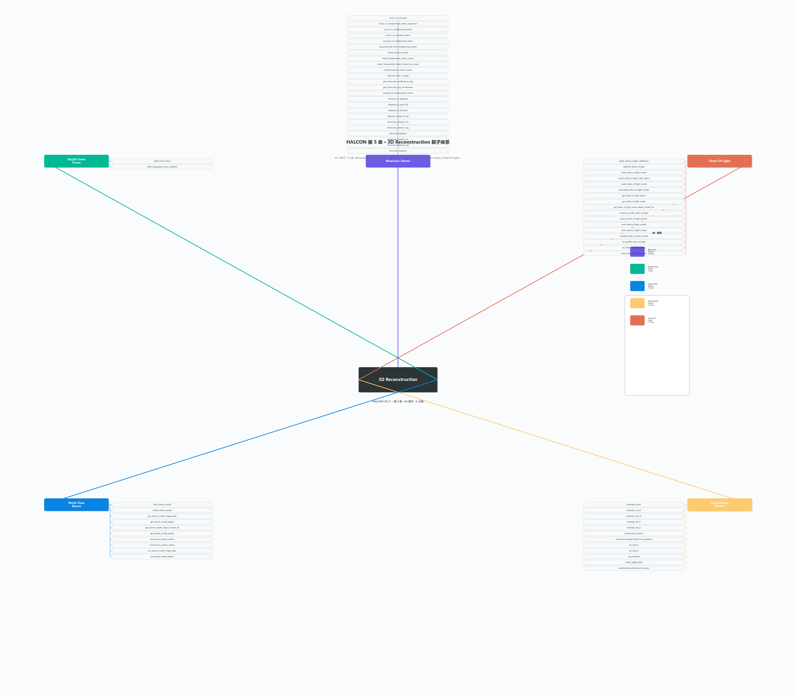

# 第 5 章 · 3D Reconstruction 算子体系总结

> **一句话结论**：这一章 HALCON 给出了**五种互补的"3D 重建路径"**——从两目视差到多目稠密匹配到光度立体到结构光——共 **65 个算子**。与第 3 章的"**3D 匹配**"（在已有 3D 模型里找位姿）不同，第 5 章的"3D 重建"是**从 2D 图像（们）反推出 3D 几何**。本章是 HALCON 3D 能力的"**传感器层**"：把相机/激光/结构光的原始信号变成第 3~4 章能吃的 `ObjectModel3D` / `Pose`。

> 配套可视化：[05-3D重建.png](05-3D重建.png)（五角形辐射布局，5 大族 + 65 算子全列）

---

## 0. 思维导图（一眼总览）



> 中心节点 `3D Reconstruction`、五个分支按五角形辐射：
> - **上**：Binocular Stereo（24 算子）
> - **右上**：Sheet Of Light（17 算子）
> - **右下**：Photometric Stereo（12 算子）
> - **左下**：Multi-View Stereo（10 算子）
> - **左上**：Depth From Focus（2 算子）

---

## 1. 核心问题与五族选型地图

**3D 重建本质**：已知 N 张 2D 图像（每张带相机内参/外参/或运动信息），求每个像素/特征点的 3D 坐标。HALCON 把这个大问题拆成 **5 条互补的物理路径**：

| 族 | 输入 | 核心物理量 | 适用场景 | 关键算子 |
| --- | --- | --- | --- | --- |
| **A. Binocular Stereo 双目立体** | 2 张校正过的左右图 + 相机内参 | **视差 Disparity**（同一点在左右图的像素位移） | 室内、室外、机器人双目 | `binocular_disparity_ms`、`disparity_to_distance`、`reconstruct3d_from_fundamental_matrix` |
| **B. Depth From Focus 焦距法** | 同一点多张不同焦距的图 | **聚焦距离 / Defocus** | 微距、显微镜、芯片检测 | `depth_from_focus`、`select_grayvalues_from_channels` |
| **C. Multi-View Stereo 多目立体** | ≥2 张任意视角图（可不校正） | **多视几何** | 摄影测量、3D 扫描仪 | `create_stereo_model`、`reconstruct_surface_stereo` |
| **D. Photometric Stereo 光度立体** | 同视角 **N 张** 不同光照图 | **表面法向/反照率** | 表面微缺陷、纹理细节、文物 | `photometric_stereo`、`sfs_mod_lr`、`reconstruct_height_field_from_gradient` |
| **E. Sheet Of Light 线激光** | 激光线扫描多行 + 单相机 | **激光三角** | 工业 3D 扫描、焊缝检测、料堆体积 | `create_sheet_of_light_model`、`measure_profile_sheet_of_light` |

> **选型口诀**：
> - **两个相机** → A（双目）；
> - **一个相机 + 不同焦距** → B（焦距）；
> - **一个相机 + 多个视角** → C（多目）；
> - **一个相机 + 多个方向的光** → D（光度）；
> - **一个相机 + 线激光** → E（结构光）。

---

## 2. 算子全景（5 大族 × 65 算子）

| 族 | 算子数 | 一句话职责 |
| --- | --- | --- |
| **A. Binocular Stereo** | 24 | 双目立体匹配：视差/距离/几何矩阵/极线校正/重建 |
| **B. Depth From Focus** | 2 | 用多张焦距图估计每像素的聚焦深度 |
| **C. Multi-View Stereo** | 10 | 通用多视角稠密重建（封装在 `StereoModel` 句柄里） |
| **D. Photometric Stereo** | 12 | 多光源法向估计 + 高度场反演（SFS） |
| **E. Sheet Of Light** | 17 | 线激光扫描的标定、测量、profile 提取与重建 |
| **合计** | **65** | — |

---

## 3. 族 A · Binocular Stereo（24 算子，最核心）

**做什么**：用**两张已标定+已校正的左右相机图**算出每个像素的视差/距离/3D 坐标。是工业双目检测（焊接引导、3D 抓取）最常用。

### 3.1 6 个子分组

| 子组 | 算子 | 用途 |
| --- | --- | --- |
| **视差计算** | `binocular_disparity` / `binocular_disparity_mg` (multi-grid) / `binocular_disparity_ms` (multi-scale) | 算左右图的 disparity 灰度图（最慢但最鲁棒的多尺度版是 `*_ms`） |
| **距离计算** | `binocular_distance` / `binocular_distance_mg` / `binocular_distance_ms` | 直接算每像素距离（Z），省去 disparity→distance 转换 |
| **视差↔距离** | `disparity_to_distance` / `distance_to_disparity` / `disparity_to_point_3d` | 视差与距离互转、视差直接转 3D 点云（XYZ mapping） |
| **视差图后处理** | `disparity_image_to_xyz` | disparity 灰度图 → 3D 物体模型 `ObjectModel3D` |
| **几何矩阵** | `vector_to_essential_matrix` / `essential_to_fundamental_matrix` / `rel_pose_to_fundamental_matrix` / `vector_to_fundamental_matrix` / `vector_to_fundamental_matrix_distortion` / `vector_to_rel_pose` | 7×1 旋转向量 ↔ 3×3 矩阵互转（本质/基础矩阵、本征矩阵、相对位姿） |
| **极线校正与匹配** | `gen_binocular_proj_rectification` / `gen_binocular_rectification_map` / `match_essential_matrix_ransac` / `match_fundamental_matrix_distortion_ransac` / `match_fundamental_matrix_ransac` / `match_rel_pose_ransac` / `intersect_lines_of_sight` / `reconstruct3d_from_fundamental_matrix` | 校正映射、对应点找位姿 RANSAC、两视线交点、3D 重建 |

### 3.2 关键签名（精选）

```text
binocular_disparity_ms(  : : Image1, Image2, Disparity, Score : ImageRect1, ImageRect2, DisparityImage, ScoreImage, DisImage)
binocular_distance_ms(  : : Image1, Image2, Distance : ImageRect1, ImageRect2, DisparityImage, ScoreImage, DistanceImage)
disparity_to_distance(  : : DisparityImage, CamParamRect1, CamParamRect2, RelPoseRect : DistanceImage)
disparity_to_point_3d(  : : DisparityImage, CamParamRect1, CamParamRect2, RelPoseRect : X, Y, Z, Mapping)
disparity_image_to_xyz(  : : DisparityImage, CamParamRect1, CamParamRect2, RelPoseRect : ObjectModel3D)
match_rel_pose_ransac(  : : Image1, Image2, Rows1, Cols1, Rows2, Cols2, CamParam1, CamParam2, GrayMatchMethod, MaskSize, RowMove, ColMove, RowTolerance, ColTolerance, Rotation, MatchThreshold, EstimationMethod, DistanceThreshold, RandSeed : Pose, Score, Points1, Points2)
intersect_lines_of_sight(  : : CamParam1, CamParam2, RelPose, Row1, Col1, Row2, Col2 : X, Y, Z, Dist)
reconstruct3d_from_fundamental_matrix(  : : ImageRows, ImageCols, FMatrix, CovFMat, CameraMatrix, CameraMatrices2 : X, Y, Z, Points2DR1, Points2DR2, _, _, Scores, _, _)
```

### 3.3 三种双目算子的 `*_ms` vs `*_mg` vs 默认

| 变体 | 含义 | 速度 | 鲁棒性 | 何时用 |
| --- | --- | --- | --- | --- |
| `binocular_disparity`（默认） | 单尺度块匹配 | 快 | 一般 | 实时、纹理丰富 |
| `*_mg`（multi-grid） | 多网格层级，从粗到精 | 中 | 较好 | 视差范围大、跨尺度 |
| `*_ms`（multi-scale） | 多尺度（含 SGM 半全局） | 慢 | **最好** | 量产精度、亚像素、无纹理区也稳 |

### 3.4 几何矩阵三剑客（易混点）

| 矩阵 | 维度 | 输入 | 含义 |
| --- | --- | --- | --- |
| `EssentialMatrix` 本征 | 3×3 | 标定后的相机（已知内参） | 两相机间的纯旋转+平移约束（归一化坐标系） |
| `FundamentalMatrix` 基础 | 3×3 | 未标定相机 | 含内参+位姿，描述极线关系 |
| `RelPose` 相对位姿 | 7×1 (Tx,Ty,Tz,α,β,γ,Code) | 双目标定结果 | 第二个相机相对第一个的 6DOF 位姿 |

> 配套互转算子：`vector_to_*`（7 元素 ↔ 3×3 矩阵）；`*_to_*`（矩阵之间）；`match_*_ransac`（从对应点 + 鲁棒估计矩阵）。

### 3.5 实战：双目重建 3D 点云

```text
* 1) 已标定的左右图 + 相机内参
read_image (Image1, 'left.png')
read_image (Image2, 'right.png')
read_cam_par ('cam_left.dat', CamParam1)
read_cam_par ('cam_right.dat', CamParam2)
read_pose ('rel_pose.dat', RelPose)

* 2) 多尺度立体匹配（最鲁棒）
binocular_disparity_ms (Image1, Image2, Disparity, Score, \
    ImageRect1, ImageRect2, DispImg, ScoreImg, DisImg)

* 3) 视差 → 距离灰度图
disparity_to_distance (DispImg, CamParam1, CamParam2, RelPose, DistImg)

* 4) 视差 → 3D 点云（一步到位）
disparity_to_point_3d (DispImg, CamParam1, CamParam2, RelPose, X, Y, Z, Mapping)

* 5) 转 ObjectModel3D（第 4 章），后续可做匹配/分割
xyz_to_object_model_3d (X, Y, Z, ObjectModel3D)
```

---

## 4. 族 B · Depth From Focus（2 算子，最简单）

**做什么**：对同一点拍 **N 张不同焦距的图**，找哪张图在该点聚焦最锐，焦距对应的对焦距离就是该点的深度。

### 4.1 2 个算子

| 算子 | 用途 |
| --- | --- |
| `depth_from_focus` | 从 N 张焦距图（带焦距值）算出每像素 depth 灰度图 |
| `select_grayvalues_from_channels` | 多通道图 → 选特定通道的灰度值（预处理：取锐度指标） |

### 4.2 适用与不适用

| 适用 | 不适用 |
| --- | --- |
| 微距测量（< 10 cm） | 远距离（焦深太大） |
| 显微镜、芯片检测 | 运动场景（每张图位置要严格一致） |
| 表面纹理丰富（要算锐度） | 完全无纹理表面 |
| 静态物体 | 高反光（焦距镜头光圈要小） |

> 优点：算法简单、不用标定；缺点：要拍很多张图、慢、对镜头光圈依赖大。

---

## 5. 族 C · Multi-View Stereo（10 算子，封装最干净）

**做什么**：把 **N 张任意视角的图** 一次性给 HALCON，它自动做稠密 3D 重建。族 A 是"两个相机"的特例；族 C 是它的**通用封装**。

### 5.1 10 个算子

| 子组 | 算子 | 用途 |
| --- | --- | --- |
| **模型生命周期** | `create_stereo_model` / `clear_stereo_model` | 建/销毁 `StereoModel` 句柄 |
| **配对/参数** | `set_stereo_model_image_pairs` / `get_stereo_model_image_pairs` / `set_stereo_model_param` / `get_stereo_model_param` | 配对图片对（任意两两组合）、GenParam 配置 |
| **取结果** | `get_stereo_model_object` / `get_stereo_model_object_model_3d` | 取回 XLD 轮廓 / 3D 物体模型 |
| **重建** | `reconstruct_points_stereo` / `reconstruct_surface_stereo` | 跑重建（点云/曲面） |

### 5.2 关键签名

```text
create_stereo_model(  : : CameraSetupModel, Method, GenParamName, GenParamValue : StereoModel)
set_stereo_model_image_pairs(  : : StereoModel, From, To : )
reconstruct_points_stereo(  : : StereoModel, : X, Y, Z, Points3DCov, StereoModelResult)
reconstruct_surface_stereo(  : : StereoModel, ObjectModel3D, GenParamName, GenParamValue : ObjectModel3DOut, Score, StereoModelResult)
```

### 5.3 `Method` 选型

| `'method'` | 内部实现 | 速度 | 精度 | 适用 |
| --- | --- | --- | --- | --- |
| `'surface_pairwise'` | 两两稠密 SGM | 中 | 高 | 多视角精确重建（推荐默认） |
| `'points_pairwise'` | 两两稀疏匹配 + 反投影 | 快 | 一般 | 快速检查 |
| `'points_sequential'` | 顺序跟踪 | 最快 | 一般 | 视频序列 |

### 5.4 实战：手机拍 12 张工件照片 → 3D 模型

```text
* 1) 多相机设置模型（已在 Ch.8 Calibration 标定过）
read_camera_setup_model ('stereo_setup.mcal', CameraSetupModel)

* 2) 建通用 stereo 模型
create_stereo_model (CameraSetupModel, 'surface_pairwise', [], [], StereoModel)

* 3) 配对：1-2, 1-3, ..., 1-12
set_stereo_model_image_pairs (StereoModel, [1:11], [2:12])

* 4) 读 12 张图（Image1..Image12）
set_stereo_model_param (StereoModel, 'images', [Image1,Image2,...,Image12])

* 5) 重建 → ObjectModel3D
reconstruct_surface_stereo (StereoModel, [], [], ObjectModel3D, Score, Result)
```

---

## 6. 族 D · Photometric Stereo（12 算子，纹理最细腻）

**做什么**：相机**位置不动**，但**光源从 N 个方向依次打**同一个物体，每张图同一点灰度反映"该方向光照 × 表面法向"。用 N ≥ 3 张图解方程可得每点的**法向 + 反照率**，积分法向可得**高度场**。

### 6.1 12 个算子分 3 组

| 子组 | 算子 | 用途 |
| --- | --- | --- |
| **法向/反照率估计** | `photometric_stereo` / `uncalibrated_photometric_stereo` | 主入口：N 张图 → 法向 + 反照率；未标定版不需光源位姿 |
| **光源标定** | `estimate_al_am` / `estimate_sl_al_lr` / `estimate_sl_al_zc` / `estimate_tilt_lr` / `estimate_tilt_zc` | 从已知标定板估计光源方向/亮度 |
| **高度场反演 (SFS)** | `sfs_mod_lr` / `sfs_orig_lr` / `sfs_pentland` / `shade_height_field` / `reconstruct_height_field_from_gradient` | 从法向场积分回高度场（3 种 SFS 算法 + 渲染 + 梯度反演） |

### 6.2 3 种 SFS 算法对比

| 算法 | 原理 | 速度 | 适用 |
| --- | --- | --- | --- |
| `sfs_orig_lr`（原始） | 经典 Woodham 线性化 | 快 | 平面、小倾角 |
| `sfs_mod_lr`（改进） | 鲁棒线性化、抗噪声 | 中 | **默认推荐**，量产 |
| `sfs_pentland` | 频域方法 | 中 | 平滑表面 |

### 6.3 `photometric_stereo` GenParam（高频考点）

| GenParam | 含义 | 推荐 |
| --- | --- | --- |
| `'number_of_images'` | 至少 3 张 | 3~8 |
| `'reconstruction_method'` | `'gradient'`（默认）/ `'curvature'` | `'gradient'` |
| `'photometric_stereo_type'` | `'calibrated'` / `'uncalibrated'` | 已知光源用前者 |
| `'surface_normal_smoothing'` | 法向平滑半径 | 1.0~3.0 |

### 6.4 实战：芯片表面微缺陷检测

```text
* 1) 已知 4 个光源方向
Lights := [[1,0,0], [0,1,0], [-1,0,0], [0,-1,0]]

* 2) 主入口
photometric_stereo (Images, Height, Gradient, Albedo, Lights, [], [], \
    'number_of_images', 4, 'reconstruction_method', 'gradient', \
    PhotometricResult)

* 3) 高度场平滑
smooth_object_model_3d (Height, 'mls', 2.0, HeightSmooth)
```

---

## 7. 族 E · Sheet Of Light（17 算子，工业 3D 扫描之王）

**做什么**：**线激光器** 把激光线投到物体表面，**单相机** 从另一角度看激光线的变形。多行扫描（或移动传送带）累积起来得到完整 3D 轮廓。是**工业 3D 扫描**最主流的方案（焊缝、料堆体积、鞋模）。

### 7.1 17 算子分 5 组

| 子组 | 算子 | 用途 |
| --- | --- | --- |
| **模型生命周期** | `create_sheet_of_light_model` / `clear_sheet_of_light_model` / `reset_sheet_of_light_model` | 建/销毁/重置 `SheetOfLightModel` 句柄 |
| **标定** | `calibrate_sheet_of_light` / `apply_sheet_of_light_calibration` / `create_sheet_of_light_calib_object` | 标定激光平面几何参数 / 应用标定 / 生成标定对象 |
| **参数** | `set_sheet_of_light_param` / `get_sheet_of_light_param` / `query_sheet_of_light_params` | 通用 GenParam 设置/查询 |
| **测量/Profile** | `measure_profile_sheet_of_light` / `set_profile_sheet_of_light` | 从一行图采激光线 profile / 设定 profile 提取方式 |
| **取结果/持久化** | `get_sheet_of_light_result` / `get_sheet_of_light_result_object_model_3d` | 取回每行距离 / 3D 物体模型 |
| **持久化** | `read_sheet_of_light_model` / `write_sheet_of_light_model` / `serialize_sheet_of_light_model` / `deserialize_sheet_of_light_model` | 模型存盘/序列化（base64） |

### 7.2 关键签名

```text
create_sheet_of_light_model(  : : ProfileRegion, MinGray, MinThickness, NumProfiles, AmbiguityResolution : SheetOfLightModelID)
measure_profile_sheet_of_light(  : : SheetOfLightModelID, MoveThreshold, MinScore : Movement)
get_sheet_of_light_result(  : : SheetOfLightModelID, ResultName : ResultValue, Row, Column)
get_sheet_of_light_result_object_model_3d(  : : SheetOfLightModelID : ObjectModel3D)
calibrate_sheet_of_light(  : : SheetOfLightModelID, CalibObj, CalibPath : Errors)
```

### 7.3 标定必须项

| 标定物 | 算子 | 用途 |
| --- | --- | --- |
| 标准阶梯块 | `calibrate_sheet_of_light` | 校准激光平面与相机坐标系的位姿 |

> 标定是"激光平面与相机的相对位姿"——决定后面算的距离是否准确。没标定 = 测的距离全是错的。

### 7.4 实战：焊缝 3D 扫描

```text
* 1) 创建模型（profile 区域、灰度阈值、线最细像素、移动阈值等）
create_sheet_of_light_model (ProfileRegion, 80, 1, 1000, 'first', SolModel)

* 2) 标定（用阶梯块）
calibrate_sheet_of_light (SolModel, CalibObjID, CalibPath, Errors)

* 3) 循环：每行扫描一帧
for I := 1 to NumFrames by 1
    grab_image (Image, AcqHandle)
    measure_profile_sheet_of_light (SolModel, 0.5, 0.7, Movement)
endfor

* 4) 取回 3D 模型
get_sheet_of_light_result_object_model_3d (SolModel, ObjectModel3D)
```

---

## 8. 5 族选型决策表

| 场景 | 走哪个族 | 关键算子 | 备注 |
| --- | --- | --- | --- |
| 工厂双目焊接引导 | A | `binocular_disparity_ms` + `disparity_to_point_3d` | 实时优先 |
| 3D 扫描仪（多视角） | C | `create_stereo_model` + `reconstruct_surface_stereo` | 通用、慢 |
| 芯片表面微缺陷 | D | `photometric_stereo` + `sfs_mod_lr` | 亚像素精度 |
| 焊缝/料堆体积 | E | `create_sheet_of_light_model` + `measure_profile_sheet_of_light` | 工业最稳定 |
| 显微镜微距 | B | `depth_from_focus` | 简单但慢 |
| 任意 N 张无序照片 | C | `reconstruct_surface_stereo('surface_pairwise')` | 需先标定相机 |
| 已知 CAD 模板 + 单图找位姿 | **不是本章**（是 Ch.3） | `find_shape_model_3d` 等 | 第 3 章 |
| 已知 3D 曲面模板 + 3D 数据找位姿 | **不是本章**（是 Ch.3） | `find_surface_model` 等 | 第 3 章 |

> **判定流程**：
> 1) **输入是几张图**？
>    - 2 张 + 双目标定 → A
>    - ≥3 张 + 相机标定 → C
>    - N 张同视角不同光 → D
> 2) **输入是单相机 + 线激光**？→ E
> 3) **输入是单相机 + 不同焦距**？→ B
> 4) **输入是单图**？→ 不是本章，去看 Ch.3（匹配）。

---

## 9. 与 Ch.3、Ch.4 的边界

| 你想做什么 | 去哪章 |
| --- | --- |
| 把图像重建成 3D 点云/曲面 | **第 5 章 重建** |
| 用 3D 点云做匹配找位姿 | **第 3 章 3D Matching**（输入 = 本章产物） |
| 操作 3D 点云/曲面（造/量/拆/变） | **第 4 章 3D Object Model**（输入 = 本章产物） |

> **数据流向**：
> `5 章 重建 3D 点云 → 4 章 整理 3D 数据 → 3 章 用 3D 数据匹配找位姿 → 9 章 3D 可视化`

---

## 10. 实战误区（12 条）

1. **双目标定精度不够**：`binocular_disparity_ms` 鲁棒但救不了烂标定。`RelPose` 的旋转/平移哪怕差 0.1°/0.1 mm，距离场都会差几个毫米。先 `check_calibration`。
2. **用默认 `binocular_disparity` 做量产**：量产场景一定要 `*_ms`，默认版无纹理区直接错配。
3. **`*_mg` / `*_ms` 不设 `'min_disparity'`/`'max_disparity'`**：算子会扫全视差范围，巨慢。已知场景下必须夹紧范围。
4. **`disparity_to_distance` 传错 RelPose**：必须传**校正后**的相对位姿 `RelPoseRect`（不是标定时的 `RelPose`），否则距离错。
5. **`match_rel_pose_ransac` 不设 `'match_threshold'` 和 `'distance_threshold'`**：会匹配错位。RANSAC 抗 outlier 也得给阈值。
6. **`depth_from_focus` 在镜面物体上用**：反光面没有锐度，会给假深度。换 D（光度） 或 E（结构光）。
7. **`create_stereo_model` 配对数 > 30**：Multi-View 配对是 O(N²)，15 张图配 105 对，30 张配 435 对——RAM 爆。
8. **`reconstruct_surface_stereo` 不设 `'point_meshing'`**：默认是稀疏点云，转 mesh 要设 `'method', 'poisson'`。
9. **`photometric_stereo` 用的光源太少**：3 张勉强，**至少 4 张**，否则法向歧义（4 张可唯一解）。
10. **`sfs_*` 输入用 `sfs_orig_lr` 处理大倾角**：会发散。倾角 > 30° 一定要用 `sfs_mod_lr`。
11. **`calibrate_sheet_of_light` 标定物脏污**：会带入系统性误差。标定前用酒精擦标定块。
12. **`get_sheet_of_light_result` 忘了 `ResultName` 大小写敏感**：必须用 `'disp_image_contour'` 之类的小写串，文档里写的是这个。

---

## 11. ASCII 速查卡（5 族速选）

```
┌────────────────────────────────────────────────────────────┐
│          HALCON 3D Reconstruction 工作流                     │
└────────────────────────────────────────────────────────────┘

  输入是什么？         ┌─ 2 张左右图     → A. Binocular Stereo
                      │  (双目标定)        binocular_disparity_ms
                      │                    disparity_to_point_3d
                      │
                      ├─ ≥3 张任意视角  → C. Multi-View Stereo
                      │  (相机标定)        create_stereo_model
                      │                    reconstruct_surface_stereo
                      │
                      ├─ 同视角多光源   → D. Photometric Stereo
                      │                    photometric_stereo
                      │                    sfs_mod_lr
                      │
                      ├─ 单相机+线激光  → E. Sheet Of Light
                      │                    create_sheet_of_light_model
                      │                    measure_profile_sheet_of_light
                      │
                      └─ 单相机+多焦距  → B. Depth From Focus
                                           depth_from_focus

           ↓
   [所有族都输出] → 3D 点云 / ObjectModel3D / HeightField
           ↓
   [Ch.4 整理 3D 数据]  →  [Ch.3 用 3D 数据匹配找位姿]
           ↓
   [Ch.9 3D 可视化]
```

---

## 12. 参考资料

- 本地 HALCON 20.11.1.0 Operator Reference
  - `E:/HALCON-20.11-Steady/doc/html/reference/operators/binocular_disparity_ms.html`
  - `E:/HALCON-20.11-Steady/doc/html/reference/operators/disparity_to_point_3d.html`
  - `E:/HALCON-20.11-Steady/doc/html/reference/operators/match_rel_pose_ransac.html`
  - `E:/HALCON-20.11-Steady/doc/html/reference/operators/depth_from_focus.html`
  - `E:/HALCON-20.11-Steady/doc/html/reference/operators/create_stereo_model.html`
  - `E:/HALCON-20.11-Steady/doc/html/reference/operators/reconstruct_surface_stereo.html`
  - `E:/HALCON-20.11-Steady/doc/html/reference/operators/photometric_stereo.html`
  - `E:/HALCON-20.11-Steady/doc/html/reference/operators/sfs_mod_lr.html`
  - `E:/HALCON-20.11-Steady/doc/html/reference/operators/calibrate_sheet_of_light.html`
  - `E:/HALCON-20.11-Steady/doc/html/reference/operators/measure_profile_sheet_of_light.html`
  - 等共 65 个 HTML
- 思维导图：本目录 `05-3D重建.png`
- 上游章节：[第 3 章 3D Matching](03-3D匹配.md)（消费本章的 3D 重建结果）
- 下游章节：[第 4 章 3D Object Model](04-3D对象模型.md)（整理本章的 3D 数据）
- 前置章节：[第 8 章 Calibration](../HALCON/章节总结/)（双目/多目/Sheet Of Light 都依赖相机标定）

---

**算子数核查**：24（Binocular Stereo）+ 2（Depth From Focus）+ 10（Multi-View Stereo）+ 12（Photometric Stereo）+ 17（Sheet Of Light）= **65 算子**，与用户截图列表完全一致。