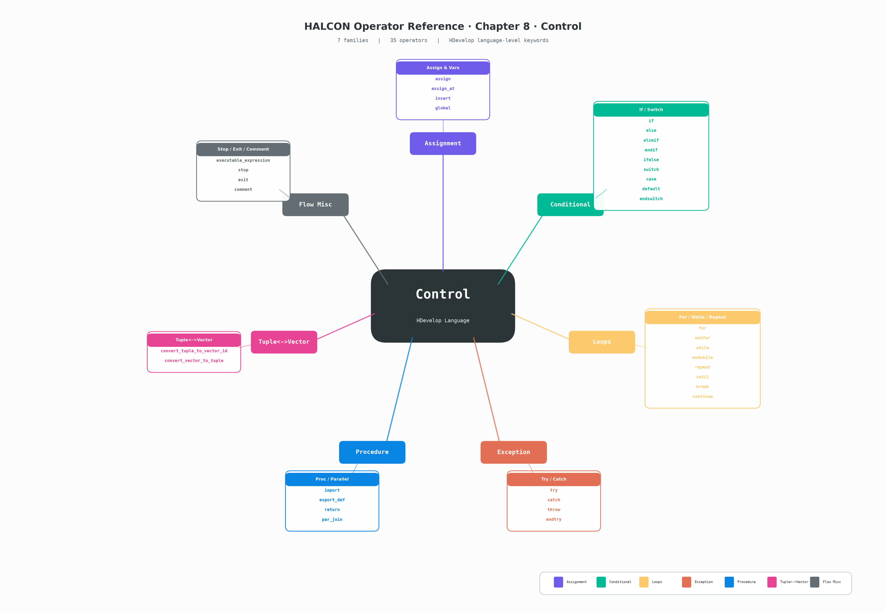

# 第八章 Control（控制流）

> 适用版本：HALCON 20.11.1.0 · 本章为 HDevelop 脚本语言级的关键字与控制结构（与算子 reference 严格区分）
> 共 **35** 个条目，分 **7** 个族：赋值与变量 / 条件分支 / 循环 / 异常处理 / 过程与并行 / 元组↔向量互转 / 流程杂项
> 截图源：HALCON Operator Reference 20.11.1.0 → Operators → Control



---

## 1. 这一章在讲什么

`Control` 章节在 HALCON 文档里**不是图像处理算子**，而是 HDevelop IDE / `.hdvp` 过程文件的**语言级关键字**——和 C/Python 的 `if / for / while / try` 同类。它们负责：

1. **流程控制**：条件、循环、跳转、退出
2. **变量管理**：赋值、声明全局变量、修改元组元素
3. **过程组织**：导入外部 `.hdvp`、导出代码、并行等待
4. **错误处理**：捕获 / 抛出异常
5. **元组 ↔ 向量转换**：`convert_tuple_to_vector_1d` / `convert_vector_to_tuple`（仅 HDevelop 关键字形式，等价算子见 Tuple 章节）

> ⚠️ **关键概念差异**：
>
> - 这些关键字仅在 HDevelop 脚本中直接使用；导出 C/C++/C#/Python 时**已被翻译为目标语言的原生控制流**（`if`→`if`，`for`→`for`，`par_join`→`WaitForMultipleObjects`/`Event`等）。
> - 本章**不包含**普通的图像算子（如 `count_obj`、`tuple_length` 等在 Tuple 章节）。
> - `ifelse` 是 HDevelop 的**三元表达式**（类似 C 的 `?:`），不是关键字。

---

## 2. 七族总览（速查表）

| 族 | 算子数 | 关键字一览 | 用途一句话 |
|---|---|---|---|
| **赋值与变量 Assignment** | 4 | `assign` `assign_at` `insert` `global` | 修改变量值 / 元组元素 / 声明全局 |
| **条件分支 Conditional** | 9 | `if` `else` `elseif` `endif` `ifelse` `switch` `case` `default` `endswitch` | 单/多路条件分支 |
| **循环 Loops** | 8 | `for` `endfor` `while` `endwhile` `repeat` `until` `break` `continue` | 三种循环 + 流程跳转 |
| **异常处理 Exception** | 4 | `try` `catch` `throw` `endtry` | 捕获 / 抛出用户异常 |
| **过程与并行 Procedure** | 4 | `import` `export_def` `return` `par_join` | 导入过程 / 导出占位 / 终止 / 并行等待 |
| **元组↔向量 Tuple↔Vector** | 2 | `convert_tuple_to_vector_1d` `convert_vector_to_tuple` | 元组与 HDevelop 内部向量互转 |
| **流程杂项 Flow Misc** | 4 | `executable_expression` `stop` `exit` `comment` | 表达式行 / 断点 / 退出 / 单行注释 |

---

## 3. 各族详解

### 3.1 赋值与变量（Assignment · 4 算子）

这一族负责"给变量写值"。

| 算子 | 签名 (HDevelop) | 语义 |
|---|---|---|
| `assign` | `assign( : : Input : Result)` | 把 `Input` 赋给 `Result`，是 HDevelop `:=` 的算子形式 |
| `assign_at` | `assign_at( : : Index, Value : Result)` | 按下标把 `Value` 赋到 `Result[Index]`（多值批量） |
| `insert` | `insert( : : Input, Value, Index : Result)` | 把 `Value` 插入 `Input` 元组的 `Index` 位置 |
| `global` | `global( : : Declaration : )` | 声明全局变量（需配合 `dev_set_check` 关闭警告） |

**关键点**：
- `assign` 是最朴素的赋值；HDevelop 中常省略算子名直接写 `A := B;`
- `assign_at` 与 `insert` 区别：**前者是覆盖式**（`Result[Index] = Value`），**后者是插入式**（长度+1）
- `global` 声明必须在**过程外**或**主程序最前**；在循环内部重新声明会抛异常

```hdevelop
* assign 例子
A := 42

* assign_at 例子
Tuple := [10, 20, 30, 40]
assign_at(Tuple, 99, [1, 3])   * Tuple[1] = 99, Tuple[3] = 99

* insert 例子
Tuple2 := [10, 20, 30]
insert(Tuple2, 99, 1)          * 结果 [10, 99, 20, 30]

* global 例子
global tuple gCounter
gCounter := 0
```

**易错点**：
- `assign_at` 的 `Index` **必须存在**（不能越界），否则抛错
- `insert` 索引超界会按"插到末尾"行为处理
- 全局变量在多过程调用时是**共享状态**，调试时建议用前缀如 `g_` 区分

---

### 3.2 条件分支（Conditional · 9 算子）

最常用的族，几乎每个过程都会用到。

| 算子 | 签名 (HDevelop) | 语义 |
|---|---|---|
| `if` | `if( : : Condition : )` | 条件为真（非零）时执行后续块 |
| `else` | `else( : : : )` | `if` 的 else 分支 |
| `elseif` | `elseif( : : Condition : )` | 多重条件，**只能跟在 `if`/`elseif` 之后** |
| `endif` | `endif( : : : )` | 终止 if 块 |
| `ifelse` | `ifelse( : : Condition : )` | 三元表达式（HDevelop 独有，类似 `?:`） |
| `switch` | `switch( : : ControlExpression : )` | 多路分支起始 |
| `case` | `case( : : Constant : )` | `switch` 内的分支标签 |
| `default` | `default( : : : )` | `switch` 的默认分支（必须放最后） |
| `endswitch` | `endswitch( : : : )` | 终止 switch 块 |

**`if` 块模式**：

```hdevelop
if (Score > 0.9)
    * 高置信度分支
elseif (Score > 0.6)
    * 中置信度
else
    * 低置信度或异常
endif
```

**`switch` 块模式**：

```hdevelop
switch (Mode)
case 0:
    * 单帧
    break
case 1:
    * 连续
    break
case 2:
    * 触发
    break
default:
    * 未知模式
    break
endswitch
```

**`ifelse` 三元表达式**：

```hdevelop
Label := ifelse(Condition > 0.5, 'pass', 'fail')
* 等价于:
* if (Condition > 0.5)
*     Label := 'pass'
* else
*     Label := 'fail'
* endif
```

**易错点**：
- `switch` 的 `case` 标签必须是**常量**（不能是变量或表达式）
- `switch` 内必须有 `break`，否则会**穿透**到下一个 `case`（不像 C 默认带 break）
- `if` 条件里**整数 0 / 空串 `''` / 空元组 `[]` 都视为假**（与 C 的 0/非 0 一致）
- `ifelse` 只能用于**单行赋值**，不能独立成块

---

### 3.3 循环（Loops · 8 算子）

三种循环结构 + 两条跳转语句。

| 算子 | 签名 (HDevelop) | 语义 |
|---|---|---|
| `for` | `for( : : Start, End, Step : Index)` | `Index` 从 `Start` 累加到 `End`（不含 End），步长 `Step` |
| `endfor` | `endfor( : : : )` | 终止 for 块 |
| `while` | `while( : : Condition : )` | 条件为真时重复 |
| `endwhile` | `endwhile( : : : )` | 终止 while 块 |
| `repeat` | `repeat( : : : )` | 起始 repeat-until 块 |
| `until` | `until( : : Condition : )` | repeat 终止条件（**条件为真时退出**） |
| `break` | `break( : : : )` | 跳出当前循环 / switch |
| `continue` | `continue( : : : )` | 跳到本次循环末尾，进入下一轮 |

**`for` 模式**（最常用）：

```hdevelop
* 单参数: 0..N-1
for Index := 0 to 9 by 1
    * 9 次数
endfor

* 负步长
for I := 10 to 0 by -1
    * 倒数
endfor

* 浮点步长
for X := 0.0 to 1.0 by 0.1
    * 11 次
endfor
```

**`while` 模式**（条件驱动）：

```hdevelop
MaxIter := 100
Iter := 0
while (Iter < MaxIter and not Converged)
    * 迭代逻辑
    Iter := Iter + 1
endwhile
```

**`repeat..until` 模式**（先执行后判断）：

```hdevelop
repeat
    ReadFrame(Frame)
    Valid := IsFrameValid(Frame)
until (Valid)
```

**易错点**：
- `for Index := Start to End by Step` 中 `End` **不包含**（半开区间 `[Start, End)`）
- `Step=0` 会死循环，HDevelop IDE 不会自动检测
- `break` 只能跳出一层循环；多层跳出需要用 `try/throw` 或标志位
- `continue` 在 `for` 中会**执行 `Index` 累加**（`Step` 处理在 `for` 体内首尾）
- `until` 条件**为真时退出**（与 do-while 语义一致，与 while 取反）

---

### 3.4 异常处理（Exception · 4 算子）

类似 C++/Java 的 try-catch，但 HDevelop 的"异常"可以是任何字符串。

| 算子 | 签名 (HDevelop) | 语义 |
|---|---|---|
| `try` | `try( : : : )` | 起始 try 块 |
| `catch` | `catch( : : : Exception)` | 捕获异常，存入 `Exception` 元组 |
| `throw` | `throw( : : Exception : )` | 抛出用户异常（字符串或代码） |
| `endtry` | `endtry( : : : )` | 终止 try 块 |

**基本模式**：

```hdevelop
try
    read_image(Image, 'nonexistent.png')
catch (Exception)
    * 图像加载失败
    Message := Exception[0]
    Code := Exception[1]
    dev_disp_error('加载失败: ' + Message)
endtry
```

**`throw` 主动抛错**：

```hdevelop
if (Width < 100)
    throw ('Width too small: ' + Width)
endif
```

**`throw` 重抛**（嵌套 try）：

```hdevelop
try
    try
        OpThatMayFail()
    catch (Exception)
        * 记录日志后重抛
        LogError(Exception)
        throw ([Exception, 'rethrown'])
    endtry
catch (Exception)
    HandleOuter(Exception)
endtry
```

**易错点**：
- `Exception` 是**元组**（不止字符串），第 0 个元素是消息文本，第 1 个是错误码
- `try` 块**必须有 `catch`**（不像某些语言有 `finally`）
- 抛出的异常若没人接，会**冒泡到最外层**，IDE 会弹错误对话框
- 大量 `try/catch` 会**拖慢速度**（HALCON 内部异常机制是字符串比较），仅在关键路径使用

---

### 3.5 过程与并行（Procedure · 4 算子）

| 算子 | 签名 (HDevelop) | 语义 |
|---|---|---|
| `import` | `import( : : ProcedureSource : )` | 导入外部 `.hdvp` 过程文件或目录 |
| `export_def` | `export_def( : : Position, Declaration : )` | 在导出代码（如 C++）中插入任意文本 |
| `return` | `return( : : : )` | 立即终止当前过程 |
| `par_join` | `par_join( : : ThreadID : )` | 等待 `par_start` 启动的子线程 |

**`import` 模式**（最常用）：

```hdevelop
* 单文件导入
import 'common_utils.hdvp'

* 目录导入（导入目录下所有 .hdvp）
import 'C:/halcon_libs/'

* 带星号的相对路径
import './sub/*.hdvp'
```

**`export_def` 模式**（嵌入导出代码）：

```hdevelop
export_def('declaration', '#include "my_custom_lib.h"')
* 导出 C++ 时会在函数顶部插入这行 #include
```

**`par_join` 模式**（线程同步）：

```hdevelop
par_start (ThreadA : HeavyTaskA())
par_start (ThreadB : HeavyTaskB())

par_join ([ThreadA, ThreadB])   * 同时等待两个线程

* 现在可以安全访问 ThreadA / ThreadB 的结果
```

**易错点**：
- `import` 路径分隔符在 Windows 上**两种都支持**（`/` 和 `\`），但 HALCON 习惯用 `/`
- `import` 导入的符号**不区分大小写**（HDevelop 是大小写不敏感的）
- `return` 在主程序中**会终止整个程序**（不是返回"无"）
- `par_join` 必须与 `par_start` **配对**，单用 `par_join` 会卡死
- `par_start` 的线程函数**不能共享写同一变量**（HDevelop 内部有 GIL）

---

### 3.6 元组 ↔ 向量（Tuple ↔ Vector · 2 算子）

HALCON 元组（tuple）是扁平序列，但 HDevelop 内部还有"向量"（vector）概念——本质是 C++ 数组视图。这两个关键字用来在元组和向量间转换。

| 算子 | 签名 (HDevelop) | 语义 |
|---|---|---|
| `convert_tuple_to_vector_1d` | `convert_tuple_to_vector_1d( : : InputTuple, SubTupleLength : ResultVector)` | 把 `InputTuple` 切成 `ResultVector`，每段长度 `SubTupleLength` |
| `convert_vector_to_tuple` | `convert_vector_to_tuple( : : InputVector : ResultTuple)` | 把向量扁平化回元组 |

**使用场景**（在 HDevelop 调试器 / 变量查看器中）：

```hdevelop
* 把元组 [1,2,3,4,5,6] 切成 2x3 矩阵视图
convert_tuple_to_vector_1d([1,2,3,4,5,6], 3, Vec)
* Vec 现在被 IDE 视为 2 行 3 列的 2D 向量显示
```

**易错点**：
- 这两个**只在 HDevelop IDE 中影响显示**；运行时它们是空操作（被优化器消除）
- `InputTuple` 长度**必须**是 `SubTupleLength` 的整数倍
- 真正的"矩阵"操作在 Matrix 章节（`create_matrix` / `get_full_matrix` 等），这里只是显示辅助

---

### 3.7 流程杂项（Flow Misc · 4 算子）

| 算子 | 签名 (HDevelop) | 语义 |
|---|---|---|
| `executable_expression` | `executable_expression( : : Expression : )` | 执行任意表达式的"行算子"形式（IDE 用） |
| `stop` | `stop( : : : )` | 暂停程序执行（IDE 中可继续），等价于断点 |
| `exit` | `exit( : : : )` | 终止 HDevelop IDE 本身 |
| `comment` | `comment( : : Comment : )` | 单行注释（`Comment` 为字符串） |

**`comment` 模式**（两种写法等价）：

```hdevelop
* 这是行注释（IDE 风格）
comment('这也是注释（关键字形式）')
```

**`stop` 模式**（动态断点）：

```hdevelop
* 在某条件下暂停
if (DebugFlag)
    stop()   * IDE 弹"已暂停"，可继续
endif
```

**易错点**：
- `exit` 会**关闭整个 HDevelop IDE**，包括其他打开的标签页，请勿在生产代码中用
- `stop` 在 C++ 导出后是**空操作**（被优化），仅 IDE 调试有效
- `comment` 在 HDevelop 中常用 `*` 行注释，更简洁

---

## 4. 签名表（HDevelop 全集）

> 来源：本地 HALCON 20.11.1.0 文档 `E:/HALCON-20.11-Steady/doc/html/reference/operators/`
> HDevelop 视图（其它语言视图在切换 tab 后展示）

```
# 赋值与变量
assign( : : Input : Result)
assign_at( : : Index, Value : Result)
insert( : : Input, Value, Index : Result)
global( : : Declaration : )

# 条件分支
if( : : Condition : )
else( : : : )
elseif( : : Condition : )
endif( : : : )
ifelse( : : Condition : )
switch( : : ControlExpression : )
case( : : Constant : )
default( : : : )
endswitch( : : : )

# 循环
for( : : Start, End, Step : Index)
endfor( : : : )
while( : : Condition : )
endwhile( : : : )
repeat( : : : )
until( : : Condition : )
break( : : : )
continue( : : : )

# 异常处理
try( : : : )
catch( : : : Exception)
throw( : : Exception : )
endtry( : : : )

# 过程与并行
import( : : ProcedureSource : )
export_def( : : Position, Declaration : )
return( : : : )
par_join( : : ThreadID : )

# 元组↔向量
convert_tuple_to_vector_1d( : : InputTuple, SubTupleLength : ResultVector)
convert_vector_to_tuple( : : InputVector : ResultTuple)

# 流程杂项
executable_expression( : : Expression : )
stop( : : : )
exit( : : : )
comment( : : Comment : )
```

> 说明：
> - 签名中 `:` 是 HALCON 的"槽位分隔符"，格式 `( : : 输入参数 : 输出参数 )`
> - `for` 的 `Index` 是**输出**，循环过程中可被读取
> - `ifelse` 的签名看起来像无输出，但实际是**单值表达式**，HDevelop 会按上下文推断

---

## 5. 与其他章的关系

| 关联章节 | 关系 |
|---|---|
| **Tuple（第十一章）** | 真正的"元组操作"算子（`tuple_length`, `tuple_gen_const`, ...）—— Control 的 `insert` / `assign_at` 仅是单点修改 |
| **System（第十五章）** | `system`、`set_system` 等系统级算子；Control 的 `stop` / `exit` 也在 IDE 行为里调用 System 层 |
| **OCV / OCR / Matching 等** | 业务算子运行时**不会**触发 Control 关键字；Control 关键字**只能**出现在 HDevelop 脚本中 |
| **C++/Python 导出** | 全部 Control 关键字被翻译成目标语言原生控制流，**运行时不存在**这些算子 |

---

## 6. 速查卡

**我该用哪个？**

| 需求 | 用什么 |
|---|---|
| 简单条件分支 | `if / elseif / else / endif` |
| 多路分支（常量） | `switch / case / default / endswitch` |
| 三元表达式 | `ifelse` |
| 固定次数循环 | `for / endfor` |
| 条件循环（先判断） | `while / endwhile` |
| 条件循环（先执行） | `repeat / until` |
| 跳出循环 | `break` |
| 跳过本轮 | `continue` |
| 捕获错误 | `try / catch / endtry` |
| 主动抛错 | `throw` |
| 终止过程 | `return` |
| 暂停调试 | `stop` |
| 引入外部过程 | `import` |
| 等待子线程 | `par_start` + `par_join` |
| 单行注释 | `*` 或 `comment()` |
| 修改变量 | `assign` |
| 元组按下标赋值 | `assign_at` |
| 元组按位置插入 | `insert` |
| 声明全局 | `global` |
| 在导出代码中插入文本 | `export_def` |

---

## 7. 常见误区

1. **"switch 不会穿透"** —— 错！HDevelop 的 switch **不会**自动 break，必须显式写
2. **"for 的 End 包含在内"** —— 错！`for I := 0 to 9` 是 0..8 共 9 次
3. **"try 没有 catch 也可以"** —— 错！必须有 catch（HDevelop 编译会警告）
4. **"return 只退出当前 if"** —— 错！`return` 退出整个过程
5. **"par_join 可以替代 while 等待"** —— 错！`par_join` 只等待 `par_start` 启动的线程
6. **"global 在过程中随便写"** —— 错！全局变量声明需要在过程外或主程序入口
7. **"ifelse 是 if+else 的简写"** —— 部分对，但**只能单行赋值**，不能独立成块
8. **"export_def 在 HDevelop 运行时生效"** —— 错！它只在**导出代码**时插入文本

---

## 8. 导出到其他语言时的对应

| HDevelop 关键字 | C++ | Python | .NET (C#) |
|---|---|---|---|
| `if / endif` | `if { }` | `if:` | `if { }` |
| `else` | `else` | `else:` | `else` |
| `switch / case / default / endswitch` | `switch / case / default` | 无（用 if/elif） | `switch / case / default` |
| `for / endfor` | `for (...)` | `for ... in range(...)` | `for (...)` |
| `while / endwhile` | `while (...)` | `while:` | `while (...)` |
| `repeat / until` | `do { } while (...)` | `while True: ... if ...: break` | `do { } while (...)` |
| `try / catch / endtry` | `try / catch (...)` | `try / except` | `try / catch` |
| `throw` | `throw ...` | `raise ...` | `throw ...` |
| `break` | `break` | `break` | `break` |
| `continue` | `continue` | `continue` | `continue` |
| `return` | `return ...` | `return ...` | `return ...` |
| `par_start / par_join` | `std::thread + join()` | `threading.Thread + join()` | `Task + Wait` |

> HDevelop 导出器会自动翻译，**但** `export_def` 中的内容**原样**插入到目标代码指定位置。

---

> 📌 备注：本章 35 个条目均为 HDevelop 脚本关键字，无图像处理功能。导出 C++/Python/.NET 后，这些关键字**不会**出现在最终算子调用列表里。
