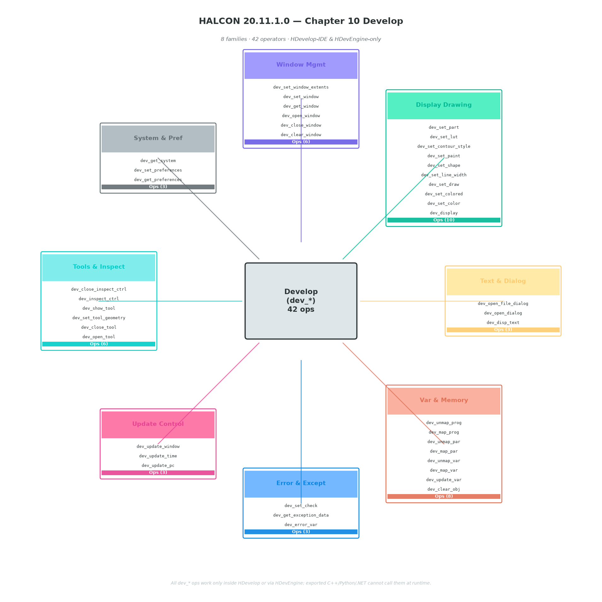

# HALCON 20.11.1.0 — Chapter 10 Develop（开发/调试算子）

> 本章共 **42 个算子**（手册目录 `toc_develop.html` 列出 **36 个**，另 6 个 `dev_map_*` / `dev_unmap_*` 为 HDevEngine 内部 API）。
>
> ⚠️ **关键认知**：所有 `dev_*` 算子**只**在 HDevelop IDE 内部或通过 HDevEngine 解释执行时生效。导出的 C++/Python/C# 程序**编译后运行时调不到**它们——这是与 1~7、9、11… 等"图像算子"章节最大的区别。



---

## 1. 本章定位

| 维度 | 说明 |
|---|---|
| **名字** | Develop |
| **算子前缀** | `dev_*` |
| **总数量** | 42（手册 36 + HDevEngine 6） |
| **类别** | HDevelop IDE 专用（部分导出后失效） |
| **典型用途** | 窗口管理、绘图样式、变量检视、工具面板、错误捕获、刷新控制 |
| **与 Control 章区别** | Control 是 HDevelop 脚本语言级关键字（`if`/`for`），导出会翻译成目标语言原生控制流；Develop 是 HDevelop IDE 级 API，多数在导出后不存在 |

---

## 2. 8 族总览

| # | 族名 | 算子数 | 核心职责 |
|---|---|---|---|
| 1 | **Window Mgmt** | 6 | 创建/关闭/激活/查询图形窗口 |
| 2 | **Display Drawing** | 10 | 颜色/线宽/形状/填充等绘图样式 |
| 3 | **Text & Dialog** | 3 | 文字叠加、对话框、文件选择框 |
| 4 | **Var & Memory** | 8 | 对象释放、变量检视、Map/Unmap（HDevEngine） |
| 5 | **Error & Except** | 3 | 错误捕获开关、异常数据查询 |
| 6 | **Update Control** | 3 | 控制 PC 同步、时间显示、窗口刷新 |
| 7 | **Tools & Inspect** | 6 | 工具窗口显隐、检视器控制 |
| 8 | **System & Pref** | 3 | 偏好读写、系统信息 |

> 与 Ch3~Ch7 的"图像算子"不同，本章是**调试与界面控制**算子，多数对应 HDevelop 菜单项的"程序化等价"。

---

## 3. 各族详解（含签名）

> **签名约定**：下面只列 HDevelop 语法；C++ / .NET / Python 等价物可在本地 `E:/HALCON-20.11-Steady/doc/html/reference/operators/<op>.html` 查 `sec_synopsis` 段。
>
> 形如 `dev_op ( : : Param : )` 中的 4 段分别对应 HDevelop 算子调用模板的 `InputIconic / ControlInput / ControlOutput / OutputIconic`，对无输入输出的算子多为 `(: : : )`。

### 3.1 Window Mgmt（6）

```text
dev_clear_window         ( : : : )
dev_close_window         ( : : : )
dev_open_window          ( : : Row, Column, Width, Height, Background : WindowHandle )
dev_get_window           ( : : : WindowHandle )
dev_set_window           ( : : WindowHandle : )
dev_set_window_extents   ( : : Row, Column, Width, Height : )
```

**用途**：

- `dev_open_window` 创建绘图窗口，**必须有 Row/Column/Width/Height/Background** 5 个参数；返回 WindowHandle。
- `dev_set_window_extents` 在**已打开**窗口上调整位置/大小（不重建），适合响应式布局。
- `dev_set_window(WindowHandle)` 是"切到当前活动窗口"——所有后续 `dev_display`/`dev_set_color` 都作用在它上面。
- 跟"算子层"窗口控制 `open_window`/`set_window` 区别：`dev_*` 是**HDevelop 窗口**（绑死 IDE），普通 `open_window` 是**程序运行时**窗口（导出后还存在）。

### 3.2 Display Drawing（10）

```text
dev_display              ( Object : : : )
dev_set_color            ( : : ColorName : )
dev_set_colored          ( : : NumColors : )
dev_set_draw             ( : : DrawMode : )
dev_set_line_width       ( : : LineWidth : )
dev_set_shape            ( : : Shape : )
dev_set_paint            ( : : Mode : )
dev_set_contour_style    ( : : Style : )
dev_set_lut              ( : : LutName : )
dev_set_part             ( : : Row1, Column1, Row2, Column2 : )
```

**用途**：

- `dev_set_color` 取 `'red'`/`'green'`/`'blue'`/`'white'`/`'black'` 或 `#RRGGBB` 十六进制；`dev_set_colored(N)` 是 N 色循环调色板。
- `dev_set_draw('fill'|'margin')` 控制 region 绘制是实心还是边框。
- `dev_set_shape('original'/'outer_circle'/'inner_circle'/'rectangle1'/'rectangle2'/'ellipse')` 决定 region 在窗口的**近似显示**形状。
- `dev_set_paint('default'/'3d_plot'/'histogram'...)` 控制 region 内**填充规则**——`'3d_plot'` 把 region 高度当 z 轴涂色（最常用）。
- `dev_set_part` 设定显示的"图像子区域"——便于只看大图的 ROI。
- **绘制逻辑链**：`dev_set_color`/`dev_set_draw`/`dev_set_shape`/`dev_set_paint` 是一组**复合样式**——`dev_display(Region)` 一次性按当前所有样式渲染。

### 3.3 Text & Dialog（3）

```text
dev_disp_text            ( : : String, CoordSystem, Row, Column, Color, GenParamName, GenParamValue : )
dev_open_dialog          ( : : DialogName : )
dev_open_file_dialog     ( : : Filter, Mode, Path : Selection )
```

**用途**：

- `dev_disp_text` 是在窗口上**叠加文字**的最常用算子。`CoordSystem` 取 `'window'`/`'image'`；`GenParamName/GenParamValue` 用来设 `'font'`/`'size'`/`'bold'`/`'box'`（背景框）等：
  ```text
  dev_disp_text('Hello', 'window', 10, 10, 'black', [], [])
  dev_disp_text('Title', 'window', 10, 10, 'white',
                ['box','box_color'], ['true','red'])
  ```
- `dev_open_dialog(DialogName)` 打开**已编译好的 HDevelop 对话框**（`*.hdpl` 文件）——开发 GUI 工具时用。
- `dev_open_file_dialog` 弹**文件选择框**；`Filter` 用 `{'*.*','*.png','*.bmp'}` 这种 tuple 列表。

### 3.4 Var & Memory（8）

```text
dev_clear_obj            ( Objects : : : )
dev_update_var           ( : : DisplayMode : )
dev_map_var              ( : : : )
dev_unmap_var            ( : : : )
dev_map_par              ( : : : )
dev_unmap_par            ( : : : )
dev_map_prog             ( : : : )
dev_unmap_prog           ( : : : )
```

**用途**：

- `dev_clear_obj(Objects)` **手动释放** HObject 引用计数；正常 HALCON 自动 GC，**调试内存泄漏**时用。
- `dev_update_var('on'/'off')` 切变量窗口**自动刷新**——批量写循环里关掉能提速。
- 6 个 `dev_map_*` / `dev_unmap_*` 是 HDevEngine（外部程序调用 `.hdev` 脚本）专用：**Map** = 把外部变量/参数/程序映射进 HDevEngine 上下文，**Unmap** = 取消映射。无 HDevelop 时这些调用无效。

### 3.5 Error & Except（3）

```text
dev_error_var            ( : : ErrorVar, Mode : )
dev_get_exception_data   ( : : Exception : Tag, Value )
dev_set_check            ( : : Mode : )
```

**用途**：

- `dev_error_var(ErrorVar, Mode)` 注册**错误捕获变量**——之后调算子失败时 HALCON 不弹窗而是把错误号写进 `ErrorVar`：
  ```text
  dev_error_var(ErrorVar, 1)  * 1=开启
  read_image(Image, 'missing.png')
  if (ErrorVar != H_MSG_TRUE)
      * 处理错误
  endif
  dev_error_var(ErrorVar, 0)  * 0=关闭
  ```
- `dev_get_exception_data(Exception, 'error_code'/'error_message'/'procedure_name'...)` 抓 `try`/`catch` 块的异常字段。
- `dev_set_check('~all' / 'default' / 'legacy')` 全局切换"算子输入合法性"严格度——legacy 模式跳过部分检查（提速但可能崩）。

### 3.6 Update Control（3）

```text
dev_update_pc            ( : : Mode : )
dev_update_time          ( : : Mode : )
dev_update_window        ( : : Mode : )
```

**用途**：三件套都是"**关掉自动刷新，提速**"，常用于演示 / 调试大循环：

```text
dev_update_window('off')
dev_update_pc('off')
dev_update_time('off')
for i := 1 to 1000 by 1
    * ... 大量 set_display / 算子调用
endfor
dev_update_window('on')
dev_update_pc('on')
dev_update_time('on')
```

- `dev_update_window('off')` 让所有 `dev_display` 不真的画到屏幕，**最后**才一并显示。
- `dev_update_time('off')` 关闭算子耗时显示。
- `dev_update_pc('off')` 关闭程序计数器/单步高亮。

> 这些是"演示模式开关"，**生产代码不要碰**——开 off 时程序出 bug 难调试。

### 3.7 Tools & Inspect（6）

```text
dev_open_tool             ( : : ToolName : )
dev_close_tool            ( : : ToolName : )
dev_set_tool_geometry     ( : : ToolName, Row, Column, Width, Height : )
dev_show_tool             ( : : ToolName, Visibility : )
dev_inspect_ctrl          ( : : VariableName : )
dev_close_inspect_ctrl    ( : : VariableName : )
```

**用途**：

- 4 个 `dev_*_tool` 控制 HDevelop 的**浮动工具窗口**（如 `'zoom_window'`/`'move_window'`/`'gray_ramp'`），**ToolName 是字符串**。
- `dev_inspect_ctrl(VarName)` 在 HDevelop 里**弹变量监视器**——开发时调试元组/数组用。

### 3.8 System & Pref（3）

```text
dev_get_preferences     ( : : Preference : Value )
dev_set_preferences     ( : : Preference, Value : )
dev_get_system          ( : : SystemParameter : Value )
```

**用途**：

- `dev_get/set_preferences` 读写 HDevelop **用户偏好**（如 `'editor/font_size'`、`'check/update_time'`、`'graphics/buffered'`），只对**当前 IDE 进程**有效。
- `dev_get_system` 读 HALCON **系统参数**（如 `'cpu_num'`/`'opengl_version'`/`'halcon_dir'`），导出代码也能用——但参数名字段集合很杂，用得不多。

---

## 4. 完整签名速查表（42 算子）

> 截自 `E:/HALCON-20.11-Steady/doc/html/reference/operators/dev_*.html` 的 `sec_synopsis` 段。

| 算子 | HDevelop 签名 | 导出后可用？ |
|---|---|---|
| `dev_clear_obj` | `(Objects : : : )` | ✅（等价 HOperatorSet.DevClearObj） |
| `dev_clear_window` | `(: : : )` | ✅ |
| `dev_close_inspect_ctrl` | `(: : VariableName : )` | ❌ |
| `dev_close_tool` | `(: : ToolName : )` | ❌ |
| `dev_close_window` | `(: : : )` | ✅ |
| `dev_disp_text` | `(: : String, CoordSystem, Row, Column, Color, GenParamName, GenParamValue : )` | ✅ |
| `dev_display` | `(Object : : : )` | ✅ |
| `dev_error_var` | `(: : ErrorVar, Mode : )` | ✅ |
| `dev_get_exception_data` | `(: : Exception : Tag, Value )` | ✅ |
| `dev_get_preferences` | `(: : Preference : Value )` | ❌ |
| `dev_get_system` | `(: : SystemParameter : Value )` | ✅ |
| `dev_get_window` | `(: : : WindowHandle )` | ✅ |
| `dev_inspect_ctrl` | `(: : VariableName : )` | ❌ |
| `dev_map_par` | `(: : : )` | ⚠️ HDevEngine 专用 |
| `dev_map_prog` | `(: : : )` | ⚠️ HDevEngine 专用 |
| `dev_map_var` | `(: : : )` | ⚠️ HDevEngine 专用 |
| `dev_open_dialog` | `(: : DialogName : )` | ❌ |
| `dev_open_file_dialog` | `(: : Filter, Mode, Path : Selection )` | ✅ |
| `dev_open_tool` | `(: : ToolName : )` | ❌ |
| `dev_open_window` | `(: : Row, Column, Width, Height, Background : WindowHandle )` | ✅ |
| `dev_set_check` | `(: : Mode : )` | ✅ |
| `dev_set_color` | `(: : ColorName : )` | ✅ |
| `dev_set_colored` | `(: : NumColors : )` | ✅ |
| `dev_set_contour_style` | `(: : Style : )` | ✅ |
| `dev_set_draw` | `(: : DrawMode : )` | ✅ |
| `dev_set_line_width` | `(: : LineWidth : )` | ✅ |
| `dev_set_lut` | `(: : LutName : )` | ✅ |
| `dev_set_paint` | `(: : Mode : )` | ✅ |
| `dev_set_part` | `(: : Row1, Column1, Row2, Column2 : )` | ✅ |
| `dev_set_preferences` | `(: : Preference, Value : )` | ❌ |
| `dev_set_shape` | `(: : Shape : )` | ✅ |
| `dev_set_tool_geometry` | `(: : ToolName, Row, Column, Width, Height : )` | ❌ |
| `dev_set_window` | `(: : WindowHandle : )` | ✅ |
| `dev_set_window_extents` | `(: : Row, Column, Width, Height : )` | ✅ |
| `dev_show_tool` | `(: : ToolName, Visibility : )` | ❌ |
| `dev_unmap_par` | `(: : : )` | ⚠️ HDevEngine 专用 |
| `dev_unmap_prog` | `(: : : )` | ⚠️ HDevEngine 专用 |
| `dev_unmap_var` | `(: : : )` | ⚠️ HDevEngine 专用 |
| `dev_update_pc` | `(: : Mode : )` | ❌ |
| `dev_update_time` | `(: : Mode : )` | ❌ |
| `dev_update_var` | `(: : DisplayMode : )` | ❌ |
| `dev_update_window` | `(: : Mode : )` | ❌ |

**统计**：

- ✅ 导出后可用：**19**（窗口/绘图/文本/错误处理/系统查询）
- ❌ 导出后失效：**17**（HDevelop IDE UI/偏好/更新控制）
- ⚠️ 仅 HDevEngine：**6**（`dev_map_*` / `dev_unmap_*`）

---

## 5. 与其他章的关系

| 章节 | 关系 |
|---|---|
| **Ch1 Image Acquisition** | 无直接关系，但 `dev_open_window` 的 `WindowHandle` 与 `grab_image` 配合演示采集→显示 |
| **Ch8 Control** | Control 是 HDevelop 脚本关键字（导出翻译成目标语言），Develop 是 HDevelop IDE API（多数导出后失效）——**两章合起来才是完整 HDevelop 编程模型** |
| **Ch11 Filter / Ch12 Geometry** | 算子执行结果需 `dev_display` 看到——Develop 是"算子→人眼"的桥梁 |
| **Ch15 OCR / Ch16 Data Code** | 演示程序里 `dev_disp_text` 用于叠加识别结果，`dev_set_color`/`dev_set_draw` 用于画 region |

---

## 6. 速查卡

### 创建窗口并显示

```text
dev_open_window(0, 0, 512, 512, 'black', WindowHandle)
read_image(Image, 'fabrik.png')
dev_display(Image)
```

### 绘制 region（红填充 + 黑边）

```text
threshold(Image, Region, 128, 255)
dev_set_color('red')
dev_set_draw('fill')
dev_set_shape('original')
dev_set_paint('default')
dev_display(Region)
```

### 叠加文字（带白底框）

```text
dev_disp_text('Count: 42', 'window', 12, 12, 'black',
              ['box','box_color'], ['true','white'])
```

### 错误捕获

```text
dev_error_var(ErrorVar, 1)
read_image(Image, 'missing.png')
if (ErrorVar != H_MSG_TRUE)
    dev_disp_text('File missing!', 'window', 50, 50, 'red', [], [])
endif
dev_error_var(ErrorVar, 0)
```

### 批量处理时提速

```text
dev_update_window('off')
dev_update_time('off')
dev_update_pc('off')
for i := 1 to 100 by 1
    * 大量 dev_display
endfor
dev_update_window('on')
dev_update_time('on')
dev_update_pc('on')
```

### 监视变量

```text
dev_inspect_ctrl('Image')   * HDevelop 里弹监视器
```

---

## 7. 常见误区（8 条）

1. **在导出代码里调 `dev_*`** — 编译运行后会报 "Operator not found"。窗口/绘图用 `open_window`/`disp_color` 等非 `dev_` 算子。
2. **用 `dev_open_window` 创建导出程序窗口** — 它是 HDevelop IDE 窗口绑死的。导出程序要么用 HDevEngine（继续用 .hdev），要么用 `open_window`。
3. **`dev_set_color` 后没 `dev_display`** — 只设样式不显示，跟没设一样。绘制逻辑：先 `dev_set_*` 设样式，再 `dev_display(Obj)` 出图。
4. **`dev_set_draw('margin')` 误以为会画 region 轮廓外** — 它画 region 的**边界像素**（内/外 1 像素带），与 `dev_set_shape` 配合才决定 region 用什么形状近似显示。
5. **`dev_update_window('off')` 后忘了 `'on'`** — 程序跑完窗口不会刷，最终看不到结果。
6. **`dev_disp_text` 中文乱码** — `GenParamName` 加 `'font'`，`GenParamValue` 用 `'Microsoft YaHei'`/`'SimHei'`/`'Noto Sans CJK SC'`，取决于系统装了啥。
7. **把 `dev_inspect_ctrl` 当断点用** — 它只是"在变量窗口里多开一个观察项"，**不暂停程序**。要断点用 HDevelop 的 F9。
8. **`dev_error_var` 全程开着** — 性能损耗大且错误码不会自动清零。建议**最小作用域**用完即关。

---

## 8. 跨语言导出对照

| HDevelop | C++ | .NET (C#) | Python |
|---|---|---|---|
| `dev_display(Obj)` | `HWindow::DevDisplay(Obj)` 或 `HOperatorSet.DevDisplay(Obj)` | `HWindow.DevDisplay(obj)` | `dev_display(obj)` |
| `dev_set_color('red')` | `HWindow::DevSetColor("red")` | `HWindow.DevSetColor("red")` | `dev_set_color("red")` |
| `dev_open_window(0,0,W,H,'black',WinID)` | `HOperatorSet.OpenWindow(...)` 或 `HWindow(...).OpenWindow(...)` | `HWindow.OpenWindow(...)` | `dev_open_window(...)` |
| `dev_inspect_ctrl('X')` | **不可导出** | **不可导出** | **不可导出** |
| `dev_update_window('off')` | **不可导出** | **不可导出** | **不可导出** |

> Python 绑定里 `dev_*` 函数虽然存在但**只在 HDevEngine 内部**有效；用 `halcon` 库（`from halcon import *`）时调用会运行时报 "DevXXX not supported outside HDevelop"。

---

## 9. 备注

- 本章**不是图像处理算子章**，没有形参/GenParam/Result 矩阵——所有算子都是 HDevelop 工具调用。
- "导出后失效"清单由 `E:/HALCON-20.11-Steady/doc/html/reference/operators/dev_*.html` 顶部 `Section: HDevelop` 段判定：若 Synopsis 段只有 `dev_* (...)`（HDevelop）和 HDevEngine C# 形式，没有 C/C++ 库函数，则导出后不可用。
- 配合阅读：
  - [Ch8 Control](./08-控制.md)：HDevelop 脚本语言关键字
  - [Ch1 Image Acquisition](../chapter_summary/)（TODO：补链接）— 配合 `dev_open_window` 演示
  - HALCON 安装目录 `doc/html/reference/hdevelop/` 下有 HDevelop 工具说明

---

*生成于 HALCON 20.11.1.0 Operator Reference；截图源：用户提供的官方手册 `Clipboard_Screenshot.png`（仅含 36 算子，本章补 6 个 `dev_map_*`/`dev_unmap_*`）。*
