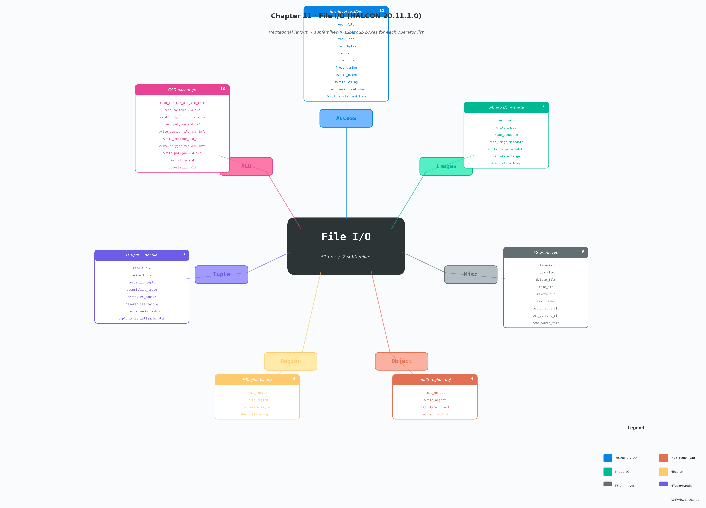

# 第 11 章 File I/O · 算子总结（HALCON 20.11.1.0）

> 本章是 HALCON **文件 I/O 与序列化体系**的全集：横跨文件系统原生操作（`copy_file`/`delete_file`/`list_files` 等）、文本/二进制流读写（`fread_bytes`/`fwrite_string` 等）、位图与元数据（`read_image`/`write_image_metadata`）、序列化-反序列化（`serialize_image`/`deserialize_tuple`），以及与 CAD 软件交换的 DXF/ARC 接口（`read_*_xld_dxf`、`read_*_xld_arc_info`）。
>
> 本章 **51 个算子**分 **7 个子族**（Access/Images/Misc/Object/Region/Tuple/XLD），结构特征强烈**左右对称**：每个对象类型基本都有"读 + 写 + 序列化 + 反序列化"四件套。详见 TOC：`toc_file.html` + `toc_file_access.html` 等 7 个子 toc 文件。
>
> 本章是 HALCON 中**导出后最稳定**的一章：51 个算子在 C++ / Python / .NET 中都存在，仅命名风格不同（`open_file` ↔ `OpenFile` ↔ `open_file`），运行时语义保持不变——这一点和前几章（Control/Dev/Develop）有本质区别。

---

## 1. 本章定位与设计目标

### 1.1 为什么这一章是"导出可移植性最高"的章节

HALCON 把"对象 ↔ 文件"的所有可能落点整理成了同一套命名空间（File），且**完全独立于 HDevelop IDE**——这些算子本质上是 HALCON 引擎内置的 IO 操作，导出到任何语言宿主（HDevEngine / HDevelopXLL / HConsole / Python-HALCON bridge）都能直接调用，无需任何"翻译"。

比较三章的"导出语义"：

| 章节 | 算子性质 | 导出后行为 |
|---|---|---|
| Ch8 Control | 脚本关键字（`if`/`for`） | 翻译成目标语言原生控制流（运行时不存在原算子） |
| Ch10 Develop | IDE 工具 API（`dev_*`） | 部分失效、仅 HDevEngine 内部 API |
| **Ch11 File** | **HALCON 引擎 IO 算子** | **51 个全部可在外部调用，仅命名风格（驼峰/下划线）变化** |

### 1.2 文件格式全景（HALCON 内部存储结构）

| 数据对象 | 原生格式 | 序列化格式 | 文本/二进制 | 第三方交换 |
|---|---|---|---|---|
| image | `.tif/.bmp/.png` 等 | `SerializedItem` | 二进制 | ❌ |
| region | `.reg`（HALCON 自有） | `SerializedItem` | 二进制 | ❌ |
| object (region 集合) | `.obj` | `SerializedItem` | 二进制 | ❌ |
| XLD contour/polygon | `.xcmp` | `SerializedItem` | 二进制 | ✅ DXF + ARC/INFO |
| tuple (HTuple) | `.tup` | `SerializedItem` | 文本 | ❌ |
| handle (模型等) | ❌ | `SerializedItem`（仅可序列化句柄，如 `serialize_handle`） | 二进制 | ❌ |
| world file（相机外参） | `.tif.xml` 同名旁置文件 | — | XML | ❌ |

> `serialize_*` / `deserialize_*` 是把任意 HALCON 对象转换为"序列化项句柄"（`SerializedItem`），可用于：
> 1. **存盘**：写入 `.hobj` / `.bin` / 数据库 blob
> 2. **跨进程传递**：与 `fread_serialized_item` / `fwrite_serialized_item` 配合做流式 IO
> 3. **网络传输**：HALCON RPC / 内部 socket 一律以序列化项为单位

---

## 2. 7 个子族速览

| 子族 | 算子数 | 核心动作 | 典型用途 |
|---|---:|---|---|
| **Access** | 11 | 文本/二进制流 + serialized-item 流 | C 风格 FILE\* 等价，移植最稳 |
| **Images** | 7 | 光栅图读写 + 元数据 | 训练样本加载、可视化存档 |
| **Misc** | 9 | 文件系统 + directory + world file | 批处理遍历、目录监听、相机外参 |
| **Object** | 4 | 多区域打包 (`.obj`) | 复合 Region（多个 mask 一起读） |
| **Region** | 4 | `.reg` 单区域 | 模板、Mask 缓存 |
| **Tuple** | 8 | `.tup` + Handle + 类型检查 | 训练参数、CalibData 内部表示 |
| **XLD** | 10 | DXF + ARC/INFO 输入输出 | 与 AutoCAD/ArcGIS 互操作 |
| **合计** | **51** | — | — |

---

## 3. 各族详解

### 3.1 Access（11 个算子）——文本/二进制流 + 序列化项流

> HALCON 推荐的所有"流式 IO"都在这里。等价于 C 标准库的 `fopen`/`fread`/`fwrite`/`fclose` 加上 HALCON 特有的 "SerializedItem 流转"。

**流框架模型：**

```
open_file(FileName, FileType, FileHandle)
   ├─ 'output' / 'input' / 'append' (文本/二进制通用)
   └─ FileHandle (HTuple, 整型 handle)
        │
        ├─ fread_*  / fwrite_*    普通文本/字节流
        └─ fread_serialized_item / fwrite_serialized_item
                          SerializedItem 句柄读写
        ↓
   close_file(FileHandle)  ← 别忘了！
```

| 算子 | 类型签名 | 说明 |
|---|---|---|
| `open_file` | `( : : FileName, FileType : FileHandle)` | 打开文本/二进制，`FileType='output'/'input'/'append'` |
| `close_file` | `(: : FileHandle : )` | 关闭（**必须**调用，否则缓冲不刷新） |
| `fnew_line` | `(: : FileHandle : )` | 写换行 + flush |
| `fread_bytes` | `(: : FileHandle, NumberOfBytes : ReadData, IsEOF)` | 读 N 字节（整数），遇 EOF 返回 `IsEOF=true` |
| `fread_char` | `(: : FileHandle : Char)` | 读 1 字符（HDevelop）/`char`（C）/`HString`（C++）|
| `fread_line` | `(: : FileHandle : OutLine, IsEOF)` | 读一行（不含行结束符），遇 EOF 标志 |
| `fread_string` | `(: : FileHandle : OutString, IsEOF)` | 读"空格分隔"的字段（**非整行**），终遇空白 |
| `fwrite_bytes` | `(: : FileHandle, DataToWrite : NumberOfBytesWritten)` | 写原始字节；`DataToWrite` 可以是整数元组（0–255）或 string |
| `fwrite_string` | `(: : FileHandle, String : )` | 写字符串 + 数字（自动转 str），可空格分隔多个值 |
| `fread_serialized_item` | `(: : FileHandle : SerializedItemHandle)` | 流式反序列化（属于 `SerializedItem` 域，**配合 serialize_* 使用**） |
| `fwrite_serialized_item` | `(: : FileHandle, SerializedItemHandle : )` | 流式序列化写入 |

**典型用法：**

```hdevelop
* 写示例：把多张图像和它们对应的 region 一起归档
open_file('dataset.bin', 'output_binary', FileHandle)
for I := 1 to NumImages by 1
    read_image(Image, ImageNames[I])
    serialize_image(Image, ImgItem)
    fwrite_serialized_item(FileHandle, ImgItem)
    read_region(Region, RegionNames[I])
    serialize_region(Region, RegItem)
    fwrite_serialized_item(FileHandle, RegItem)
endfor
close_file(FileHandle)
```

**`fwrite_string` vs `fwrite_bytes` 的本质区别**：

- `fwrite_string`：HDevelop 友好的多值字符串转换，会调用 `tuple → string` 隐式转换（HDevelop string 与 int/float 混合）
- `fwrite_bytes`：纯字节，写整型时会被解释为 0–255 的原始字节（`char` 元组可直接）
- 选错会导致"看起来写的对，read 出来全错"——**永远不要混用**

---

### 3.2 Images（7 个算子）——位图读写与元数据

| 算子 | 类型签名 | 说明 |
|---|---|---|
| `read_image` | `(: Image : FileName : )` | 读 1 张位图，自动从扩展名识别格式（TIFF/BMP/PNG/JPEG/...） |
| `write_image` | `(Image : : Format, FillColor, FileName : )` | 写位图，`Format='tiff'/'bmp'/'png'/'jpeg'`，`FillColor` 控制压缩区域外部填充 |
| `read_sequence` | `(: Image : HeaderSize, SourceWidth, SourceHeight, StartRow, StartColumn, DestWidth, DestHeight, PixelType, BitOrder, ByteOrder, Pad, Index, FileName : )` | **14 参数**！读裸二进制位图（无文件头）+ 任意帧号；用于机器视觉原始流 |
| `read_image_metadata` | `(: : Format, TagName, FileName : TagValue)` | 读图像元数据（TIFF tag、EXIF 等），按 `TagName` 取回 `TagValue` |
| `write_image_metadata` | `(: : Format, TagName, TagValue, FileName : )` | 写元数据 |
| `serialize_image` | `(Image : : : SerializedItemHandle)` | 图像 → SerializedItem（流式/跨进程用） |
| `deserialize_image` | `(: Image : SerializedItemHandle : )` | 反向 |

**`read_sequence` 的 14 个参数详解**（这是本章参数最多的算子）：

| 参数 | 用途 | 必填说明 |
|---|---|---|
| `HeaderSize` | 跳过文件头的字节数（如 0 / 2KB / 2MB） | 必填 |
| `SourceWidth` / `SourceHeight` | 原始图高宽 | 必填 |
| `StartRow` / `StartColumn` | 裁剪起点 | 0 = 不裁剪 |
| `DestWidth` / `DestHeight` | 缩放目标尺寸 | =source 即不缩放 |
| `PixelType` | `'uint2'/'int1'/'real4'/'byte'...` | 必填 |
| `BitOrder` | `'MSBFirst'/'LSBFirst'`（多字节像素序） | 必填 |
| `ByteOrder` | `'nativeByteOrder'/'littleEndian'/'bigEndian'` | 必填 |
| `Pad` | 行尾填充字节（`byte_alignment` 对齐） | 经常为 0 |
| `Index` | 第几帧（从 0 起） | 0 = 第 1 帧 |

`write_image` 的关键参数：

| 参数 | 默认 | 常用值 | 说明 |
|---|---|---|---|
| `Format` | `'tiff'` | `'tiff'/'bmp'/'png'/'jpeg'` | 不靠扩展名——即使写 `.bmp`，也读 `Format` 字段 |
| `FillColor` | 0 | 0~255 | 当缩放（write 时不能用；这里其实是图像外部区域的灰度填充阈值） |
| `FileName` | — | any | 路径；若与 `Format` 扩展名不符**以 Format 为准** |

`read_image_metadata` 的已知 Tag（`Format='tiff'` 时）：

- `'description' / 'software' / 'model' / 'page_name'`
- `'image_width' / 'image_height'`
- Exif：`'exif_make' / 'exif_model' / 'exif_datetime'`
- 自定义 tag：任意字符串，由图像头部写入的 `TagName`/`TagValue` 对决定

---

### 3.3 Misc（9 个算子）——文件系统原语

> 各种"操作系统级"操作：存在性、复制、删除、目录、当前工作目录、`list_files` 列出、world-file 相机外参。

| 算子 | 类型签名 | 说明 |
|---|---|---|
| `file_exists` | `(: : FileName : FileExists)` | 文件/目录是否存在（返回 0/1） |
| `copy_file` | `(: : SourceFile, DestinationFile : )` | 复制（覆盖不警告） |
| `delete_file` | `(: : FileName : )` | 删除（不存在抛错，不抛 warning） |
| `make_dir` | `(: : DirName : )` | 创建目录（多层递归创建）；已存在则 no-op |
| `remove_dir` | `(: : DirName : )` | 删除空目录（非空抛错） |
| `list_files` | `(: : Directory, Options : Files)` | 枚举目录内容（详见下） |
| `get_current_dir` | `(: : : DirName)` | 读 cwd |
| `set_current_dir` | `(: : DirName : )` | 写 cwd（**进程级副作用**） |
| `read_world_file` | `(: : FileName : WorldTransformation)` | 读 GeoTIFF 同名 `.tif.wld`/`.tfw`，返回 2D 单应性矩阵（6 元 / `HHomMat2D`） |

**`list_files` 是批处理遍历的核心：**

```
list_files(Directory, Options, Files)
  Options 取值：
    'files'         ← 默认，仅返回文件
    'directories'   ← 仅子目录
    'recursive'     ← 递归子目录
    'follow_links'  ← 跟随符号链接
    'absolute_path' ← 返回绝对路径
    'split_channel' ← 不相关（IO 章忽略）
    'hidden'        ← 包含 .开头的隐藏文件
    还可自由组合：['directories','recursive','absolute_path']
```

```hdevelop
* 例：枚举所有 png 文件
list_files('C:/img', ['files','recursive'], All)
Pattern := '.+\\.png'
regexp_match(All, Pattern, Pngs)
```

**`read_world_file` 是与 GIS / 遥感桥梁**——它读取 ESRI world file 标准的相机外参/地理变换矩阵，常用于：无人机正射、卫星图校正、视觉定位对齐到世界坐标。

---

### 3.4 Object（4 个算子）——多区域聚合

HALCON 把"一组 region + 任意附加数据"打包成 .obj 对象格式，便于一次性存读多 region 项目。

| 算子 | 类型签名 | 说明 |
|---|---|---|
| `read_object` | `(: Object : FileName : )` | 读 `.obj` |
| `write_object` | `(Object : : FileName : )` | 写 `.obj` |
| `serialize_object` | `(Object : : : SerializedItemHandle)` | 转 SerializedItem |
| `deserialize_object` | `(: Object : SerializedItemHandle : )` | 反向 |

> 与 `.reg` 区别：`.reg` 只支持**单个** region；`.obj` 支持**任意 HObject**（含 region 数组、image、xld 等）；后者是 4.4+ 的统一容器。

---

### 3.5 Region（4 个算子）——单区域高速 I/O

| 算子 | 类型签名 | 说明 |
|---|---|---|
| `read_region` | `(: Region : FileName : )` | 读 `.reg`（HALCON 自有） |
| `write_region` | `(Region : : FileName : )` | 写 `.reg` |
| `serialize_region` | `(Region : : : SerializedItemHandle)` | 转 SerializedItem |
| `deserialize_region` | `(: Region : SerializedItemHandle : )` | 反向 |

> 注意：`.reg` 内码与屏幕/位图**无关**——它是 region 的紧凑行编码（RLE 变种）。单 region 用 `.reg`，多 region/含其他对象用 `.obj` 即可。

---

### 3.6 Tuple（8 个算子）——HTuple 与 Handle 序列化

> Tuple 章节本身用 100+ 算子处理计算，这一小节只管"tuple/handle ↔ 文件"。

| 算子 | 类型签名 | 说明 |
|---|---|---|
| `read_tuple` | `(: : FileName : Tuple)` | 文本/二进制 `Tuple` → HTuple（自动识别内容） |
| `write_tuple` | `(: : Tuple, FileName : )` | 反向 |
| `serialize_tuple` | `(: : Tuple : SerializedItemHandle)` | 转 SerializedItem |
| `deserialize_tuple` | `(: : SerializedItemHandle : Tuple)` | 反向 |
| `serialize_handle` | `(: : Handle : SerializedItem)` | **Handle 模型**的序列化（部分 Handle 不支持） |
| `deserialize_handle` | `(: : SerializedItem : Handle)` | 反向 |
| `tuple_is_serializable` | `(: : Tuple : IsSerializable)` | 整个 tuple 是否可序列化（前提是内部所有元素都可） |
| `tuple_is_serializable_elem` | `(: : Tuple : IsSerializableElem)` | **逐元素**返回可序列化位（与上面配套） |

**`tuple_is_serializable` 与 `tuple_is_serializable_elem` 是设计级防御**：

```hdevelop
* 想要序列化一个 tuple
tuple_is_serializable(T, Bool)
if (Bool == 1)
    * 全可序列化
    serialize_tuple(T, Item)
else
    * 检查每元素，找出不可序列化位置
    tuple_is_serializable_elem(T, Flags)
    find(0, Flags, BadIndices)
    dev_error_msg(...)
endif
```

> 何时不可序列化？——当 Tuple 中含非标量 Handle（图像/region 句柄本身），又**未**先 `serialize_*` 转成 SerializedItem 句柄时。

---

### 3.7 XLD（10 个算子）——DXF 与 ARC/INFO 互操作

> XLD（Extended Line Description）是 HALCON 表示亚像素轮廓/多边形的数据结构，**广泛用于 CAD 桥梁**。

| 算子 | 输入 | 输出 | 说明 |
|---|---|---|---|
| `read_contour_xld_arc_info` | 文件 | XLD contour | Arc/INFO Generate 格式 |
| `read_polygon_xld_arc_info` | 文件 | XLD polygon | Arc/INFO Generate 格式 |
| `read_contour_xld_dxf` | 文件 | XLD contour + DxfStatus | **AutoCAD DXF 格式** |
| `read_polygon_xld_dxf` | 文件 | XLD polygon + DxfStatus | AutoCAD DXF 格式 |
| `write_contour_xld_arc_info` | XLD contour | 文件 | 反向 |
| `write_polygon_xld_arc_info` | XLD polygon | 文件 | 反向 |
| `write_contour_xld_dxf` | XLD contour | 文件 | 反向 |
| `write_polygon_xld_dxf` | XLD polygon | 文件 | 反向 |
| `serialize_xld` | XLD | SerializedItem | HALCON 内部 |
| `deserialize_xld` | SerializedItem | XLD | HALCON 内部 |

**DXF 算子的 `GenParamName` / `GenParamValue`：**

| GenParam | 含义 | 建议值 |
|---|---|---|
| `max_approx_error` | 控制多边形简化（点数 vs 精度） | `0.1` / `0.25` / `0.5` / `1` / `2` / `5` / `10` / `20`（像素） |
| `min_num_points` | 强制最少点数（避免过度简化） | 任意正整数 |
| `read_attributes` *(仅 contour)* | 是否读 DXF attribute 块（CAD 标准属性） | `'true' / 'false'`（默认 false） |

**`read_*_xld_dxf` 多出的第 5 个参数 `DxfStatus`**：

```
0 = 'DXF_STATUS_UNKNOWN'       解析后被判定
1 = 'DXF_STATUS_NO_ERROR'      完全解析成功
2 = 'DXF_STATUS_INVALID_FILE'  不是合法 DXF
3 = 'DXF_STATUS_READ_TIMEOUT'  解析超时（巨大 CAD 图保护机制）
```

> ARC/INFO 是历史悠久的 GIS 数据格式（ESRI 1970s 沿用至今）。用于 HALCON 桥接测量地籍/边界图导入到视觉项目。

---

## 4. 完整签名速查（51 行）

> 所有签名从本地 `E:/HALCON-20.11-Steady/doc/html/reference/operators/*.html` 抽出，按 HDevelop 风格列示。`()` 内圆点分隔为 `(Input : Output : IO Control : Result)` 四段。

### 4.1 Access (11)

```c
// 流打开与关闭
open_file ( : : FileName, FileType : FileHandle )                 // FileType: 'output'/'input'/'append'
close_file ( : : FileHandle : )
fnew_line  ( : : FileHandle : )

// 文本/二进制读写
fread_bytes  ( : : FileHandle, NumberOfBytes : ReadData, IsEOF )
fread_char   ( : : FileHandle : Char )
fread_line   ( : : FileHandle : OutLine, IsEOF )
fread_string ( : : FileHandle : OutString, IsEOF )
fwrite_bytes ( : : FileHandle, DataToWrite : NumberOfBytesWritten )
fwrite_string( : : FileHandle, String : )

// SerializedItem 流（高级）
fread_serialized_item  ( : : FileHandle : SerializedItemHandle )
fwrite_serialized_item ( : : FileHandle, SerializedItemHandle : )
```

### 4.2 Images (7)

```c
read_image             ( : Image : FileName : )
write_image            ( Image : : Format, FillColor, FileName : )
read_sequence          ( : Image : HeaderSize, SourceWidth, SourceHeight,
                             StartRow, StartColumn, DestWidth, DestHeight,
                             PixelType, BitOrder, ByteOrder, Pad,
                             Index, FileName : )                                     // 14 参数！
read_image_metadata    ( : : Format, TagName, FileName : TagValue )
write_image_metadata   ( : : Format, TagName, TagValue, FileName : )
serialize_image        ( Image : : : SerializedItemHandle )
deserialize_image      ( : Image : SerializedItemHandle : )
```

### 4.3 Misc (9)

```c
file_exists        ( : : FileName : FileExists )
copy_file          ( : : SourceFile, DestinationFile : )
delete_file        ( : : FileName : )
make_dir           ( : : DirName : )
remove_dir         ( : : DirName : )
list_files         ( : : Directory, Options : Files )
get_current_dir    ( : : : DirName )
set_current_dir    ( : : DirName : )
read_world_file    ( : : FileName : WorldTransformation )
```

### 4.4 Object (4)

```c
read_object        ( : Object : FileName : )
write_object       ( Object : : FileName : )
serialize_object   ( Object : : : SerializedItemHandle )
deserialize_object ( : Object : SerializedItemHandle : )
```

### 4.5 Region (4)

```c
read_region        ( : Region : FileName : )
write_region       ( Region : : FileName : )
serialize_region   ( Region : : : SerializedItemHandle )
deserialize_region ( : Region : SerializedItemHandle : )
```

### 4.6 Tuple (8)

```c
read_tuple                   ( : : FileName : Tuple )
write_tuple                  ( : : Tuple, FileName : )
serialize_tuple              ( : : Tuple : SerializedItemHandle )
deserialize_tuple            ( : : SerializedItemHandle : Tuple )
serialize_handle             ( : : Handle : SerializedItem )
deserialize_handle           ( : : SerializedItem : Handle )
tuple_is_serializable        ( : : Tuple : IsSerializable )
tuple_is_serializable_elem   ( : : Tuple : IsSerializableElem )
```

### 4.7 XLD (10)

```c
read_contour_xld_arc_info  ( : Contours : FileName : )
read_contour_xld_dxf       ( : Contours : FileName, GenParamName, GenParamValue : DxfStatus )
read_polygon_xld_arc_info  ( : Polygons : FileName : )
read_polygon_xld_dxf       ( : Polygons : FileName, GenParamName, GenParamValue : DxfStatus )
write_contour_xld_arc_info ( Contours : : FileName : )
write_contour_xld_dxf      ( Contours : : FileName : )
write_polygon_xld_arc_info ( Polygons : : FileName : )
write_polygon_xld_dxf      ( Polygons : : FileName : )
serialize_xld              ( XLD : : : SerializedItemHandle )
deserialize_xld            ( : XLD : SerializedItemHandle : )
```

---

## 5. 与其他章的关系

- **Ch11 与 Ch15 System**：本文件系统原语直接对应 OS 行为；`make_dir`/`remove_dir` 与系统级多线程（Ch15 `set_system`）耦合。
- **Ch11 与 Ch17 Tools**：函数拟合（`read_funct_1d`）、相机参数（`read_cam_par`）、训练样本集等都是 Ch17 主章节的输入源，但 File 直接暴露。
- **Ch11 与 Ch19 Graphics**：`read_image` 是图形窗口可视化的**前置**算子。
- **Ch11 与 Ch21 Regions**：region 大规模训练样本以 `.reg` / `.obj` 持久化，本章是其加载路径。
- **Ch11 与 Ch27 Identification**：`read_bar_code_model` / `read_ocr_trainf` 等属于"模型持久化"族，不在本章 toc，但在 `toc_file.html` 之外的命名空间——**本章只是"通用 IO"，模型类见各章**。

---

## 6. 速查卡

### 6.1 一行备忘

| 场景 | 用什么 |
|---|---|
| 单张位图 | `read_image(Image, 'a.png')` |
| 多张位图遍历 | `list_files(dir, 'files', names)` + for + `read_image` |
| 保存检测结果(region) | `write_region(Reg, 'out.reg')` |
| 保存模型(SVM/MLP/...) | ❌ **不在本章**，看各章的 `write_*_model`（属于 Ch7 等） |
| 跨进程传任意对象 | `serialize_image(M)` + `fwrite_serialized_item` |
| GIS 数据输入 | `read_polygon_xld_dxf` |
| 相机外参 | `read_world_file` |
| 安全删除（不存在不抛错） | `if (file_exists(...) == 1) delete_file(...) endif` |
| 检查当前路径 | `get_current_dir(CD)` |

### 6.2 三大转换对照

| 转换 | 静态文件 | 流式 | 序列化项 |
|---|---|---|---|
| Image | `read_image` / `write_image` | ❌ | `serialize_image` / `deserialize_image` |
| Region | `read_region` / `write_region` | ❌ | `serialize_region` / `deserialize_region` |
| XLD | `read_*_xld_dxf` / `write_*_xld_dxf` | ❌ | `serialize_xld` / `deserialize_xld` |
| Tuple | `read_tuple` / `write_tuple` | `fread_serialized_item` / `fwrite_serialized_item` | `serialize_tuple` / `deserialize_tuple` |

### 6.3 `set_current_dir` 是全局副作用！

> HALCON 没有"HALCON 进程内 cwd"——`set_current_dir` 调用的是 **OS 进程的 cwd**（在 Windows 上 = 当前工作目录）。
>
> - 改了之后，整个 HALCON 会话**以及调用方程序**的相对路径解析都会受影响
> - 多线程程序中，**只在主线程调用**，否则会干扰别的线程
> - 推荐：在 main 入口设置一次 `set_current_dir`，其它地方用**绝对路径**——更稳

---

## 7. 8 条常见误区

### ❌ 误区 1：`write_image` 用扩展名判断格式

```hdevelop
* 错误：以为传 .png 就写 PNG —— HALCON 实际看 Format
write_image(Image, 'png', 0, 'result.tiff')   * 写的是 PNG，内容却叫 .tiff
```

**正解**：`Format` 参数决定格式，`FileName` 决定位置——**两者可重名无关**。

### ❌ 误区 2：`fread_string` 读一行

**正解**：`fread_string` 是按空格分隔的"单词"读取；想读整行用 `fread_line`。
否则 `"hello world"` 读完只剩 `"hello"`。

### ❌ 误区 3：`fwrite_bytes` 写 Python 字符串直接调

**正解**：`DataToWrite` 应该是 **0-255 的 byte 元组**，或 HALCON 整数元组，不是 Python 的 `str`。
Python 用户：用 `bytes(...)` 然后转 HALCON 整数元组再用。

### ❌ 误区 4：`read_world_file` 不需要和图像同名前缀

**正解**：World file 的发现规则是 **与图像文件同名同目录**：
- `map.tif` 的 world file 是 `map.tif.wld`（ESRI）或 `map.tfw`（TIFF AutoCAD）
- 文件名不匹配就读不到——这是约定，非参数

### ❌ 误区 5：`read_sequence` 的 `Index` 默认第一帧

**正解**：`Index` 默认 `0`（即第一帧），但**不是行号**——若每帧大小=4096 bytes，从 frame=0 开始计；想读第 N 帧传 `N`，HALCON 内部会自己算 offset：
```
offset = HeaderSize + Index * (SourceWidth * SourceHeight * sizeof(PixelType) + Pad)
```

### ❌ 误区 6：`close_file` 在 HDevelop 结束自动调用

**正解**：HALCON 引擎不会在脚本退出时自动 flush——**忘记 `close_file` 导致缓冲未刷新，最后写入的数据丢失**。
在长时间运行的批处理脚本中，最佳实践是 `try ... finally close_file`。

### ❌ 误区 7：`tuple_is_serializable` 之后直接 `serialize_tuple`

**正解**：当 Tuple 含图像句柄（`HObject`）或模型句柄（`HMlp`/`HSvm`），`tuple_is_serializable` 返回 **0**——必须先逐元素 `serialize_*` 转成 SerializedItem 再装入 tuple，否则 `serialize_tuple` 抛错。

### ❌ 误区 8：`read_image` 接受目录

**正解**：`read_image(Image, Directory)` 不会自动遍历目录——只读**单个文件**。需要遍历用 `list_files` + 循环。

---

## 8. 跨语言导出对照（C++ / Python / .NET）

HALCON 在每个 `dev_*` / `*_file` 系列都给出 C / C++ / Python / .NET 四个 binding。本章算子全部都在所有 binding 中可用，**仅命名风格不同**：

| HDevelop | C | C++ (`HOperatorSet`) | Python | .NET |
|---|---|---|---|---|
| `open_file(FN, FT, FH)` | `open_file(FN, FT, &FH)` | `HOperatorSet.OpenFile(FN, FT, out FH)` | `open_file(FN, FT, FH)` | `HOperatorSet.OpenFile(FTuple, FTuple, out HTuple)` |
| `close_file(FH)` | `close_file(FH)` | `HOperatorSet.CloseFile(FH)` | `close_file(FH)` | `HOperatorSet.CloseFile(HTuple)` |
| `read_image(Img, FN)` | `read_image(&Img, FN)` | `HOperatorSet.ReadImage(out Img, FN)` | `read_image(Img, FN)` | `HOperatorSet.ReadImage(out HObject, HTuple)` |
| `write_image(Img, Fmt, Color, FN)` | `write_image(Img, Fmt, Color, FN)` | `HOperatorSet.WriteImage(Img, Fmt, Color, FN)` | `write_image(...)` | `HOperatorSet.WriteImage(...)` |
| `serialize_image(Img, Item)` | — | `HOperatorSet.SerializeImage(Img, out Item)` | `serialize_image(...)` | `HOperatorSet.SerializeImage(...)` |
| `list_files(Dir, Opt, Files)` | — | `HOperatorSet.ListFiles(Dir, Opt, out Files)` | `list_files(...)` | `HOperatorSet.ListFiles(...)` |

**关键事实**：

- **HDevelop** 给字符串 + Tuple（多值）同时支持
- **C 风格** 是低级 API：`Hobject`、`Htuple`，需调用 `hDisposeXxx` 释放
- **C++ 高级 API** 用 `HObject`、`HTuple` 包装类，自动 GC
- **Python HALCON bridge** 是 HDevelop 的镜像——同名同签名（少有差异）
- **.NET** 用 `HTuple` 而非原生 C# `Tuple<>`，因为 HALCON 内部用了 16 种元组类型

---

## 9. 备注

- **HALCON 20.11.1.0** 全部 51 个 File 算子签名已在 [HALCON Operator Reference](https://www.mvtec.com/products/halcon/documentation) 文档验证
- 部分 binary 算子（如 `fread_bytes`/`fwrite_bytes`）的 `DataToWrite` 接受 **HTuple of int（0..255）** 或 **string（二进制内容）**——后者需要先 `tuple_strlen` 量化
- DXF 算子的 `DxfStatus` 输出是 enum 状态码，调用方应用 `if (DxfStatus == 1) ... else handle_error()` 处理
- `tuple_is_serializable_elem` 比 `tuple_is_serializable` 粒度更细，**总是先调用 granular 版本**再决定策略

---

## 10. 思维导图



> 七边形辐射布局：中心"File I/O" + 7 子族卡片 + 每个族外延子组 box 纵列算子清单。

---
