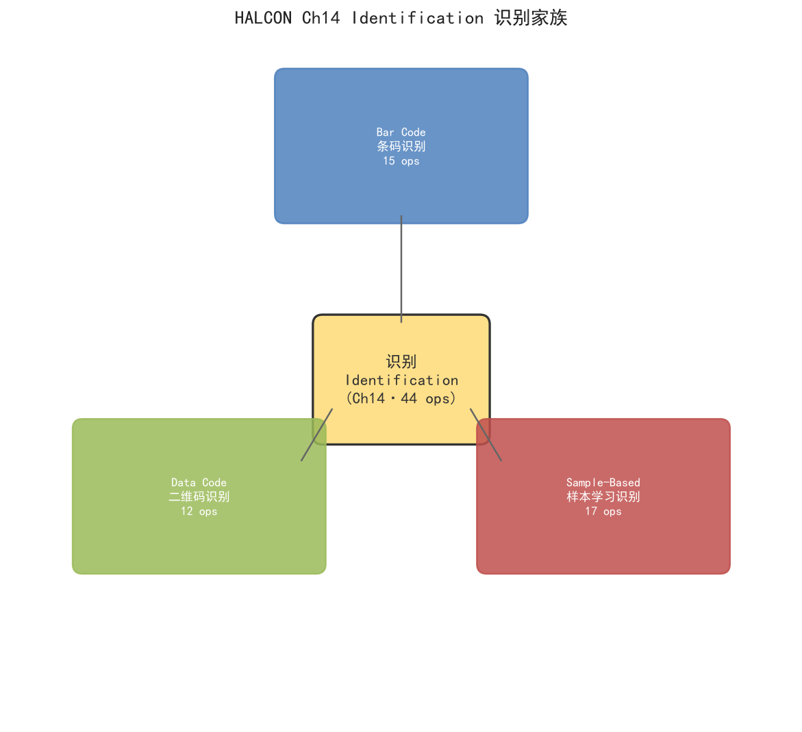

# 第 14 章 Identification（识别）

> HALCON 20.11.1.0 Operator Reference — Identification 章节整章合卷
> 三族：**Bar Code（一维条码，15）**、**Data Code（二维码，12）**、**Sample-Based（样本学习，17）**——共 **44 ops**。

---

## 0. 本章定位

"识别"在 HALCON 中是**把图像/区域里的语义符号读成结构化字符串或类别**。三族代表三种识别范式：

- **Bar Code**：基于符号几何（条空宽度比）的传统一维条码（EAN/UPC/Code 128/QR-1D 等）。模型轻、速度快、对光照鲁棒，工业流水线首选。
- **Data Code**：二维码（Data Matrix / QR Code / Aztec / PDF417 / MaxiCode 等）。基于模块定位与纠错（Reed-Solomon），单图容许更大信息量与一定污损。
- **Sample-Based**：基于样本学习（"教机器这是零件 A、那是零件 B"）。通用分类器，适合没有标准码但是有"模板图"的工业场景——例如识别金属件型号、电池极片、印刷字符类型、缺陷等级。

> 一句话记忆：**Bar Code = 形状编码的字符串，Data Code = 矩阵式的字符串，Sample-Based = 给一张图识别"它是谁"**。

---

## 1. 三族速览

| 族 | 算子数 | 一句话定位 | 代表算子 | 适用场景 |
|---|---|---|---|---|
| **Bar Code** | 15 | 一维条码识别（线/激光条码枪场景） | `create_bar_code_model` / `find_bar_code` / `get_bar_code_result` | 商品、快递单、WMS 仓库、PDA |
| **Data Code** | 12 | 二维码识别（DM/QR/Aztec/PDF417） | `create_data_code_2d_model` / `find_data_code_2d` / `get_data_code_2d_results` | 零部件追溯、医药监管、汽车 VIN |
| **Sample-Based** | 17 | 样本学习识别（基于已标注训练集） | `create_sample_identifier` / `prepare_sample_identifier` / `train_sample_identifier` / `apply_sample_identifier` | 缺陷分级、零件型号、字符/形状分类 |
| **合计** | **44** | | | |

---

## 2. 思维导图



三族三角形辐射：右上 Bar Code（蓝）/ 左下 Data Code（绿）/ 右下 Sample-Based（红）。
中心节点为本章总名"识别 Identification"，每个家族都包含族英文/中文/算子数三行摘要。

---

## 3. Bar Code（一维条码）

### 3.1 何时用 Bar Code

- 图中是**竖条横条相间的黑白条**（不是方块矩阵）。
- 货物追溯、零售 POS、物流分拣、票务、票据号段读取。
- 二维码不可用或印刷面积受限时一维条码更经济。

### 3.2 标准 5 步流水线

```text
1) create_bar_code_model( : : GenParamName, GenParamValue : BarCodeHandle)
   ── 创建一个空白"读码器"，可指定码制与解码/扫描参数
2) （可选）set_bar_code_param_specific( : : BarCodeHandle, CodeType, GenParamName, GenParamValue : )
   ── 针对某个具体码制（Code 128、EAN-13…）微调
3) find_bar_code(Image : SymbolRegions : BarCodeHandle, CodeType : DecodedDataStrings)
   ── 主入口：找条 + 解码一体
4) get_bar_code_result( : : BarCodeHandle, CandidateHandle, ResultName : BarCodeResults)
   ── 取出"结果字段名→结果值"，ResultName 是 'decoded_string' 等
5) （保存模型）write_bar_code_model( : : BarCodeHandle, FileName : )
   反之 read_bar_code_model( : : FileName : BarCodeHandle)
```

**解码残损条码**：`decode_bar_code_rectangle2(Image : : BarCodeHandle, CodeType, Row, Column, Phi, Length1, Length2 : DecodedDataStrings)`。已知条的大致矩形但识不出时，强制以此矩形解码，常用于激光扫描线。

### 3.3 注意事项

| 易踩坑 | 解释 |
|---|---|
| **CodeType 写错** | 必须用 HALCON 支持的字符串 `'EAN-13'`、`'Code 128'`、`'QR Code'`（注意大小写与连字符）。`query_bar_code_params` 可枚举当前模型支持哪些码制。 |
| **空 SymbolRegions** | 完全找不到时返回空区域，需检查 Image 是否正确（黑白、对焦、对比度）。 |
| **多码冲突** | `find_bar_code` 默认全图扫描；如需指定 ROI，配合 `reduce_domain` + `find_bar_code`。 |
| **结果被截** | `get_bar_code_result` 取 `DecodedDataStrings` 默认仅一字符；想看全部 `set_bar_code_param_specific(..., 'stop_after_result_num', 'all')`。 |
| **取 SymbolRegions** | `get_bar_code_object( : BarCodeObjects : BarCodeHandle, CandidateHandle, ObjectName :)` → `'symbol_regions'` / `'scanlines'` 等。 |
| **持久化** | `serialize_*` / `deserialize_*` 比 `write_*` / `read_*` 更紧凑，适合进程间传递或数据库存 blob。 |

---

## 4. Data Code（二维码）

### 4.1 何时用 Data Code

- 图像中是**方格模块矩阵**（黑白相间的方阵）——Data Matrix、QR、Aztec、PDF417、MaxiCode。
- 二维码自带**纠错**（Reed-Solomon）：部分污损/遮挡仍可读。
- 单图承载 10B ~ 数 KB 字符串，远多于一维条码。

### 4.2 标准 5 步流水线

```text
1) create_data_code_2d_model( : : SymbolType, GenParamName, GenParamValue : DataCodeHandle)
   ── SymbolType 例：'Data Matrix ECC 200' / 'QR Code' / 'Aztec Code'
2) （可选微调）set_data_code_2d_param( : : DataCodeHandle, GenParamName, GenParamValue : )
   ── 模块大小容差、镜像/极性、字符集（默认 ASCII）等
3) find_data_code_2d(Image : SymbolXLDs : DataCodeHandle : DataCodeStrings, ResultHandles)
   ── 主入口；同时返回字符串与每个码的 handle
4) 遍历 ResultHandles，取每个候选：
   get_data_code_2d_results( : : DataCodeHandle, ResultHandle, ResultName : DataCodeResults)
   ── 'decoded_string' / 'symbol_polygon' / 'module_size' 等
5) 持久化：write_data_code_2d_model / read_data_code_2d_model
```

注意找码返回的不是 Region 而是 **XLD 轮廓** `SymbolXLDs`（带 4 个角点的多边形），便于后续做位姿估计、3D 投影、与相机标定结合。

### 4.3 注意事项

| 易踩坑 | 解释 |
|---|---|
| **创建失败但不让错** | SymbolType 拼错时 `create_data_code_2d_model` 返回无效 handle 而不抛异常，要判 `handle == 0`。 |
| **极性反** | 白底黑码/黑底白码混线时设 `'polarity'` = `'any'` 或 `'black_on_white'`/`'white_on_black'` 切换。 |
| **字符串为乱码** | 默认 ASCII；中文用 `'default_parameters'` 设 `'character_set'` = `'utf8'` 或 `'shift_jis'`。 |
| **找不到码** | 调小 `module_size_min` / 调高 `contrast_min`；或开启 `persistence` 内存上次状态。 |
| **大图慢** | 先 `zoom_image_factor` 缩小一半或 `rectify_image` 后再 `find_data_code_2d`。 |
| **取轮廓不是 region** | `get_data_code_2d_objects( : DataCodeObjects : DataCodeHandle, CandidateHandle, ObjectName :)` → `'candidate_xld'` / `'symbol_xld'`。 |

---

## 5. Sample-Based（样本学习识别）

### 5.1 何时用 Sample-Based

- 没有标准"码"，但能拿到"同类多张样本图"——典型如**零件型号识别、电池极片正反、塑料件缺陷等级、印刷字符种类**。
- 与第 7 章 Classification 的区别：**Classification 训练的是特征向量**（GMM/MLP/SVM/Box/MLP-LUT 等）；**Sample-Based 用 HALCON 自己的 Sample-Identifier 引擎**，直接吃 image 区域，省去自己抽特征。
- 适合训练集小（10~1000 张）、类别数 2~30、识别速度 ms 级的工业场景。

### 5.2 完整 7 步流水线

```text
1) create_sample_identifier( : : GenParamName, GenParamValue : SampleIdentifier)
2) add_sample_identifier_training_data( : SampleImage : SampleIdentifier, ObjectIdx, GenParamName, GenParamValue :)
   ── 给模型喂训练图与"它的类别号 ObjectIdx"
3) add_sample_identifier_preparation_data( : SampleImage : SampleIdentifier, ObjectIdx, GenParamName, GenParamValue :)
   ── （可选）预先喂图，标记哪些做"准备"——多轮迭代
4) prepare_sample_identifier( : : SampleIdentifier, RemovePreparationData, GenParamName, GenParamValue :)
   ── "消化"准备数据；RemovePreparationData = 'true' 表示用完丢弃，节省内存
5) remove_sample_identifier_preparation_data( : : SampleIdentifier : )
   ── 单独移除准备数据
6) train_sample_identifier( : : SampleIdentifier, GenParamName, GenParamValue :)
   ── 把训练数据压成内部结构（持久化模型文件前必做）
7) apply_sample_identifier(Image : : SampleIdentifier, NumResults, RatingThreshold, GenParamName, GenParamValue : ObjectIdx, Rating)
   ── 主入口：返回 Top-N 类别号 + 置信度 Rating
```

辅助：`*_param` / `*_object_info` 配置/读取超参与对象元数据；`clear_*` 释放；`write_*` / `read_*` 与 `serialize_*` / `deserialize_*` 做持久化。

### 5.3 训练数据的形式

两种模式：

- **`'image'` 模式**：每张训练图作为一个原子样本。直接 `add_*_training_data(SampleImage, SampleIdentifier, ObjectIdx, ...)`。
- **`'region'` 模式**：训练图以多个 region 表示（每个 region 一个样本）。`add_*_training_data` 中通过 `GenParamName` `'add_region'` 切换。

可选 `'preparation'` 模式：先把多张图作为"准备数据"喂入（同 ObjectIdx），最后再 `prepare_sample_identifier` 一次性消化——避免一张张训练更新模型慢。

### 5.4 注意事项

| 易踩坑 | 解释 |
|---|---|
| **采样不齐** | 同类别的样本数量级要匹配；某类 1 张、另一类 100 张 → 严重偏倚。 |
| **用错 ObjectIdx** | 必须从 0 开始的连续 int；新增类别跳过不用的号会让模型体积膨胀。 |
| **`NumResults` 太小** | `apply_sample_identifier(..., NumResults := 5,...)` 才返回 5 个候选，1 是 Top-1。 |
| **RatingThreshold 含义** | 低于阈值的候选被剔除，返回的 `ObjectIdx` 会是 **0 类占位**——记得非零才认。 |
| **`Rating` 是置信度** | HALCON 内部相似度，非 0~1 概率，跨数据集不可比。 |
| **没 train 就 apply** | 直接 `apply_sample_identifier` 会报错或返回乱码，必须先 `train_sample_identifier`。 |
| **模型版本升级** | 老版本训练的 SampleIdentifier 在新版 HDevelop 里 `read_*` 失败，需用 `deserialize_*` + 重 train。 |

---

## 6. 通用工作流（跨族）

```text
                ┌────────────────────────────────┐
                │  输入图像 Image / 区域 Region  │
                └─────────────┬──────────────────┘
                              │
                ┌─────────────▼───────────────┐
                │ (可选) reduce_domain 切 ROI │
                └─────────────┬───────────────┘
                              │
                ┌─────────────▼───────────────┐
                │  find_* 主入口：找+识别一体 │
                └─────────────┬───────────────┘
                              │
                  ┌───────────┼───────────┐
                  ▼           ▼           ▼
              String数组   Region/XLD   Handle(可迭代)
                  │                       │
              ┌───▼───┐         ┌────────▼────────┐
              │ 业务  │         │ 遍历 get_*_res  │
              │ 用结果│         │ 取每个候选详情  │
              └───────┘         └─────────────────┘
```

任何一族都遵循："**造模型 → 找 → 取**"三段式：
1. **造模型**：`create_*`（配 `set_*_param`）
2. **找 + 解码 / 应用**：`find_*` / `apply_*`
3. **取结果**：`get_*_result` / `get_*_object`

---

## 7. 常见误区

| 误区 | 正确做法 |
|---|---|
| `find_*` 失败就死循环 | 失败的常见原因是 **图像对比度/方向/码制**——先 `set_*_param` 调参，不要反复重建模型。 |
| 多次 `create_*` 不 `clear_*` | 每代模型持有内存；循环里务必 `clear_*` 或用完一次 `clear_*` 防泄露。 |
| 一维条码用 QR 模型 | CodeType 决定了内部算法；选错时 `find_*` 返回空 Region。 |
| 二维码不纠错就上产线 | 工业流水线一定把 `'persistence'` = 1、纠错级别调到 ECC-M/H。 |
| 样本识别不 train 直接 apply | 必须 `train_sample_identifier` 才能产出可用的 SampleIdentifier。 |
| 把 `BarCodeHandle` 当永久资源 | 进程退出或模型清空时 handle 即失效；不要跨进程缓存。 |
| `serialize_*` 后改 HALCON 版本 | 序列化格式随版本变；升级 HALCON 后用 `read_*` + `make_*_model` 重新训练。 |

---

## 8. 完整签名速查表（44 ops）

### 8.1 全章汇总

| 算子 | 一句话功能 | HDevelop 签名 |
|---|---|---|
| `clear_bar_code_model` | Delete a bar code model and free the allocated memory | ` : : BarCodeHandle : ` |
| `create_bar_code_model` | Create a model of a bar code reader. | ` : : GenParamName, GenParamValue : BarCodeHandle` |
| `decode_bar_code_rectangle2` | Decode bar code symbols within a rectangle. | `Image : : BarCodeHandle, CodeType, Row, Column, Phi, Length1, Length2 : DecodedDataStrings` |
| `deserialize_bar_code_model` | Deserialize a bar code model. | ` : : SerializedItemHandle : BarCodeHandle` |
| `find_bar_code` | Detect and read bar code symbols in an image. | `Image : SymbolRegions : BarCodeHandle, CodeType : DecodedDataStrings` |
| `get_bar_code_object` | Access iconic objects that were created during the search or decoding of bar code symbols. | ` : BarCodeObjects : BarCodeHandle, CandidateHandle, ObjectName : ` |
| `get_bar_code_param` | Get one or several parameters that describe the bar code model. | ` : : BarCodeHandle, GenParamName : GenParamValue` |
| `get_bar_code_param_specific` | Get parameters that are used by the bar code reader when processing | ` : : BarCodeHandle, CodeType, GenParamName : GenParamValue` |
| `get_bar_code_result` | Get the alphanumerical results that were accumulated during the decoding of bar code symbols. | ` : : BarCodeHandle, CandidateHandle, ResultName : BarCodeResults` |
| `query_bar_code_params` | Get the names of the parameters that can be used in set_bar_code* | ` : : BarCodeHandle, Properties : GenParamName` |
| `read_bar_code_model` | Read a bar code model from a file and create a new model. | ` : : FileName : BarCodeHandle` |
| `serialize_bar_code_model` | Serialize a bar code model. | ` : : BarCodeHandle : SerializedItemHandle` |
| `set_bar_code_param` | Set selected parameters of the bar code model. | ` : : BarCodeHandle, GenParamName, GenParamValue : ` |
| `set_bar_code_param_specific` | Set selected parameters of the bar code model for selected bar code | ` : : BarCodeHandle, CodeType, GenParamName, GenParamValue : ` |
| `write_bar_code_model` | Write a bar code model to a file. | ` : : BarCodeHandle, FileName : ` |
| `clear_data_code_2d_model` | Delete a 2D data code model and free the allocated memory. | ` : : DataCodeHandle : ` |
| `create_data_code_2d_model` | Create a model of a 2D data code class. | ` : : SymbolType, GenParamName, GenParamValue : DataCodeHandle` |
| `deserialize_data_code_2d_model` | Deserialize a serialized 2D data code model. | ` : : SerializedItemHandle : DataCodeHandle` |
| `find_data_code_2d` | Detect and read 2D data code symbols in an image or train the 2D data code model. | `Image : SymbolXLDs : DataCodeHandle : DataCodeStrings, ResultHandles` |
| `get_data_code_2d_objects` | Access iconic objects that were created during the search for 2D data code symbols. | ` : DataCodeObjects : DataCodeHandle, CandidateHandle, ObjectName : ` |
| `get_data_code_2d_param` | Get one or several parameters that describe the 2D data code model. | ` : : DataCodeHandle, GenParamName : GenParamValue` |
| `get_data_code_2d_results` | Get the alphanumerical results that were accumulated during the search for 2D data code symbols. | ` : : DataCodeHandle, ResultHandle, ResultName : DataCodeResults` |
| `query_data_code_2d_params` | Get for a given 2D data code model the names of the generic parameters or | ` : : DataCodeHandle, Properties : GenParamName` |
| `read_data_code_2d_model` | Read a 2D data code model from a file and create a new model. | ` : : FileName : DataCodeHandle` |
| `serialize_data_code_2d_model` | Serialize a 2D data code model. | ` : : DataCodeHandle : SerializedItemHandle` |
| `set_data_code_2d_param` | Set selected parameters of the 2D data code model. | ` : : DataCodeHandle, GenParamName, GenParamValue : ` |
| `write_data_code_2d_model` | Writes a 2D data code model into a file. | ` : : DataCodeHandle, FileName : ` |
| `add_sample_identifier_preparation_data` | Add preparation data to a sample identifier. | `SampleImage : : SampleIdentifier, ObjectIdx, GenParamName, GenParamValue : ` |
| `add_sample_identifier_training_data` | Add training data to an existing sample identifier. | `SampleImage : : SampleIdentifier, ObjectIdx, GenParamName, GenParamValue : ` |
| `apply_sample_identifier` | Identify objects with a sample identifier. | `Image : : SampleIdentifier, NumResults, RatingThreshold, GenParamName, GenParamValue : ObjectIdx, Rating` |
| `clear_sample_identifier` | Free the memory of a sample identifier. | ` : : SampleIdentifier : ` |
| `create_sample_identifier` | Create a new sample identifier. | ` : : GenParamName, GenParamValue : SampleIdentifier` |
| `deserialize_sample_identifier` | Deserialize a serialized sample identifier. | ` : : SerializedItemHandle : SampleIdentifier` |
| `get_sample_identifier_object_info` | Retrieve information about an object of a sample identifier. | ` : : SampleIdentifier, ObjectIdx, InfoName : InfoValue` |
| `get_sample_identifier_param` | Get selected parameters of a sample identifier. | ` : : SampleIdentifier, GenParamName : GenParamValue` |
| `prepare_sample_identifier` | Adapt the internal data structure of a sample identifier. | ` : : SampleIdentifier, RemovePreparationData, GenParamName, GenParamValue : ` |
| `read_sample_identifier` | Read a sample identifier from a file. | ` : : FileName : SampleIdentifier` |
| `remove_sample_identifier_preparation_data` | Remove preparation data from a sample identifier. | ` : : SampleIdentifier : ` |
| `remove_sample_identifier_training_data` | Remove training data from a sample identifier. | ` : : SampleIdentifier, ObjectIdx : ` |
| `serialize_sample_identifier` | Serialize a sample identifier. | ` : : SampleIdentifier : SerializedItemHandle` |
| `set_sample_identifier_object_info` | Define a name or a description for an object of a sample identifier. | ` : : SampleIdentifier, ObjectIdx, InfoName, InfoValue : ` |
| `set_sample_identifier_param` | Set selected parameters of a sample identifier. | ` : : SampleIdentifier, GenParamName, GenParamValue : ` |
| `train_sample_identifier` | Train a sample identifier. | ` : : SampleIdentifier, GenParamName, GenParamValue : ` |
| `write_sample_identifier` | Write a sample identifier to a file. | ` : : SampleIdentifier, FileName : ` |

### 8.2 Bar Code 子表（15）

| 算子 | 一句话功能 | HDevelop 签名 |
|---|---|---|
| `clear_bar_code_model` | Delete a bar code model and free the allocated memory | ` : : BarCodeHandle : ` |
| `create_bar_code_model` | Create a model of a bar code reader. | ` : : GenParamName, GenParamValue : BarCodeHandle` |
| `decode_bar_code_rectangle2` | Decode bar code symbols within a rectangle. | `Image : : BarCodeHandle, CodeType, Row, Column, Phi, Length1, Length2 : DecodedDataStrings` |
| `deserialize_bar_code_model` | Deserialize a bar code model. | ` : : SerializedItemHandle : BarCodeHandle` |
| `find_bar_code` | Detect and read bar code symbols in an image. | `Image : SymbolRegions : BarCodeHandle, CodeType : DecodedDataStrings` |
| `get_bar_code_object` | Access iconic objects that were created during the search or decoding of bar code symbols. | ` : BarCodeObjects : BarCodeHandle, CandidateHandle, ObjectName : ` |
| `get_bar_code_param` | Get one or several parameters that describe the bar code model. | ` : : BarCodeHandle, GenParamName : GenParamValue` |
| `get_bar_code_param_specific` | Get parameters that are used by the bar code reader when processing | ` : : BarCodeHandle, CodeType, GenParamName : GenParamValue` |
| `get_bar_code_result` | Get the alphanumerical results that were accumulated during the decoding of bar code symbols. | ` : : BarCodeHandle, CandidateHandle, ResultName : BarCodeResults` |
| `query_bar_code_params` | Get the names of the parameters that can be used in set_bar_code* | ` : : BarCodeHandle, Properties : GenParamName` |
| `read_bar_code_model` | Read a bar code model from a file and create a new model. | ` : : FileName : BarCodeHandle` |
| `serialize_bar_code_model` | Serialize a bar code model. | ` : : BarCodeHandle : SerializedItemHandle` |
| `set_bar_code_param` | Set selected parameters of the bar code model. | ` : : BarCodeHandle, GenParamName, GenParamValue : ` |
| `set_bar_code_param_specific` | Set selected parameters of the bar code model for selected bar code | ` : : BarCodeHandle, CodeType, GenParamName, GenParamValue : ` |
| `write_bar_code_model` | Write a bar code model to a file. | ` : : BarCodeHandle, FileName : ` |

### 8.3 Data Code 子表（12）

| 算子 | 一句话功能 | HDevelop 签名 |
|---|---|---|
| `clear_data_code_2d_model` | Delete a 2D data code model and free the allocated memory. | ` : : DataCodeHandle : ` |
| `create_data_code_2d_model` | Create a model of a 2D data code class. | ` : : SymbolType, GenParamName, GenParamValue : DataCodeHandle` |
| `deserialize_data_code_2d_model` | Deserialize a serialized 2D data code model. | ` : : SerializedItemHandle : DataCodeHandle` |
| `find_data_code_2d` | Detect and read 2D data code symbols in an image or train the 2D data code model. | `Image : SymbolXLDs : DataCodeHandle : DataCodeStrings, ResultHandles` |
| `get_data_code_2d_objects` | Access iconic objects that were created during the search for 2D data code symbols. | ` : DataCodeObjects : DataCodeHandle, CandidateHandle, ObjectName : ` |
| `get_data_code_2d_param` | Get one or several parameters that describe the 2D data code model. | ` : : DataCodeHandle, GenParamName : GenParamValue` |
| `get_data_code_2d_results` | Get the alphanumerical results that were accumulated during the search for 2D data code symbols. | ` : : DataCodeHandle, ResultHandle, ResultName : DataCodeResults` |
| `query_data_code_2d_params` | Get for a given 2D data code model the names of the generic parameters or | ` : : DataCodeHandle, Properties : GenParamName` |
| `read_data_code_2d_model` | Read a 2D data code model from a file and create a new model. | ` : : FileName : DataCodeHandle` |
| `serialize_data_code_2d_model` | Serialize a 2D data code model. | ` : : DataCodeHandle : SerializedItemHandle` |
| `set_data_code_2d_param` | Set selected parameters of the 2D data code model. | ` : : DataCodeHandle, GenParamName, GenParamValue : ` |
| `write_data_code_2d_model` | Writes a 2D data code model into a file. | ` : : DataCodeHandle, FileName : ` |

### 8.4 Sample-Based 子表（17）

| 算子 | 一句话功能 | HDevelop 签名 |
|---|---|---|
| `add_sample_identifier_preparation_data` | Add preparation data to a sample identifier. | `SampleImage : : SampleIdentifier, ObjectIdx, GenParamName, GenParamValue : ` |
| `add_sample_identifier_training_data` | Add training data to an existing sample identifier. | `SampleImage : : SampleIdentifier, ObjectIdx, GenParamName, GenParamValue : ` |
| `apply_sample_identifier` | Identify objects with a sample identifier. | `Image : : SampleIdentifier, NumResults, RatingThreshold, GenParamName, GenParamValue : ObjectIdx, Rating` |
| `clear_sample_identifier` | Free the memory of a sample identifier. | ` : : SampleIdentifier : ` |
| `create_sample_identifier` | Create a new sample identifier. | ` : : GenParamName, GenParamValue : SampleIdentifier` |
| `deserialize_sample_identifier` | Deserialize a serialized sample identifier. | ` : : SerializedItemHandle : SampleIdentifier` |
| `get_sample_identifier_object_info` | Retrieve information about an object of a sample identifier. | ` : : SampleIdentifier, ObjectIdx, InfoName : InfoValue` |
| `get_sample_identifier_param` | Get selected parameters of a sample identifier. | ` : : SampleIdentifier, GenParamName : GenParamValue` |
| `prepare_sample_identifier` | Adapt the internal data structure of a sample identifier. | ` : : SampleIdentifier, RemovePreparationData, GenParamName, GenParamValue : ` |
| `read_sample_identifier` | Read a sample identifier from a file. | ` : : FileName : SampleIdentifier` |
| `remove_sample_identifier_preparation_data` | Remove preparation data from a sample identifier. | ` : : SampleIdentifier : ` |
| `remove_sample_identifier_training_data` | Remove training data from a sample identifier. | ` : : SampleIdentifier, ObjectIdx : ` |
| `serialize_sample_identifier` | Serialize a sample identifier. | ` : : SampleIdentifier : SerializedItemHandle` |
| `set_sample_identifier_object_info` | Define a name or a description for an object of a sample identifier. | ` : : SampleIdentifier, ObjectIdx, InfoName, InfoValue : ` |
| `set_sample_identifier_param` | Set selected parameters of a sample identifier. | ` : : SampleIdentifier, GenParamName, GenParamValue : ` |
| `train_sample_identifier` | Train a sample identifier. | ` : : SampleIdentifier, GenParamName, GenParamValue : ` |
| `write_sample_identifier` | Write a sample identifier to a file. | ` : : SampleIdentifier, FileName : ` |

---

## 9. 一句话总结

> **Ch14 Identification = 三种"图像 → 字符串/类别"的识别范式**：一维条码（Bar Code）、二维码（Data Code）、样本学习（Sample-Based）；共 44 ops，全部遵循"**建模型 → 找 → 取**"三段式。
