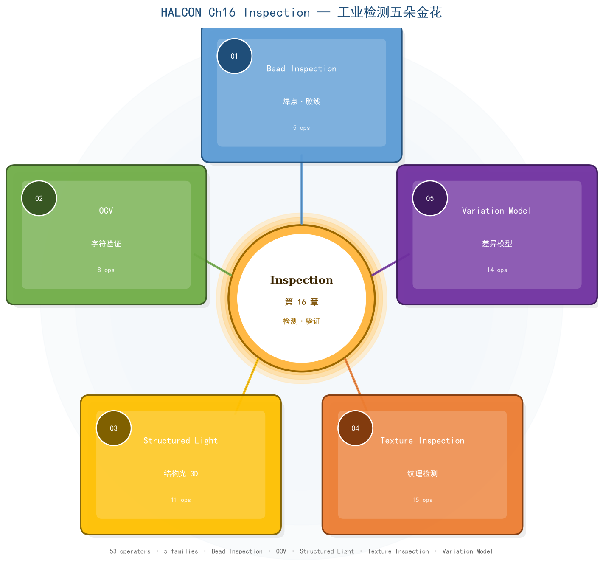

# 第 16 章 Inspection（检测·验证）· 工业"看得准、判得对"

> HALCON 20.11.1.0 Operator Reference — Inspection 章节整章合卷
> 五族：**Bead Inspection 焊点胶线（5）**、**OCV 字符验证（8）**、**Structured Light 结构光 3D（11）**、**Texture Inspection 纹理检测（15）**、**Variation Model 差异模型（14）**——共 **53 ops**。

---

## 0. 本章定位

"Inspection" 在 HALCON 中是**把"标准模板 / 物理模型 / 训练样本 / 标定结构光"作为对照，把未知图像的偏差找出来**的统称。五族代表五种工业最常用的检测范式：

- **Bead Inspection（焊点·胶线）**：在已知胶线/焊点**轮廓**基础上测每段实际位置/厚度/连续性——汽车焊装、点胶机、密封胶检测。
- **OCV（Optical Character Verification）**：把字符印**灰度投影**做模板，验证印刷是否清晰、位置是否漂移——药监码、二维码旁字符、激光打标字符���
- **Structured Light（结构光）**：投影已知图案到物体表面，用解码后图像恢复**深度/3D 形状**——手机盖板平整度、PCB 元件高度、零件 3D 检测。
- **Texture Inspection（纹理检测）**：基于多张正常纹理样本训练一个**统计/频域模型**，实时算"新图差异度图"——皮革/塑料/木材/墙布划痕、压伤、污染。
- **Variation Model（差异模型）**：训练时记下**每像素均值+方差**（或 max-min），比较时按阈值判"超差"——对齐无瑕的产品图后做缺陷检测的最快方法。

> 一句话记忆：**Bead = 测条状轨迹，OCV = 测字清晰，Structured Light = 测 3D 形貌，Texture = 测纹理异常，Variation = 测像素偏离。**

---

## 1. 五族速览

| 族 | 算子数 | 一句话定位 | 代表算子 | 适用场景 |
|---|---|---|---|---|
| **Bead Inspection** | 5 | 焊点/胶线连续性、位置、厚度检测 | `create_bead_inspection_model` `apply_bead_inspection_model` | 汽车焊装、点胶、密封胶 |
| **OCV** | 8 | 灰度投影字符验证 | `create_ocv_proj` `traind_ocv_proj` `do_ocv_simple` | 药监码、激光打标、二维码旁字符 |
| **Structured Light** | 11 | 结构光 3D 重建 + 高度差 | `create_structured_light_model` `gen_structured_light_pattern` `decode_structured_light_pattern` | 盖板平整度、PCB 元件高度、零件 3D |
| **Texture Inspection** | 15 | 纹理异常检测（统计/频域） | `create_texture_inspection_model` `add_texture_inspection_model_image` `train_texture_inspection_model` `apply_texture_inspection_model` | 皮革/塑料划痕、木纹异常、布匹瑕疵 |
| **Variation Model** | 14 | 像素差异模型（无监督） | `create_variation_model` `train_variation_model` `prepare_variation_model` `compare_variation_model` | 工业对齐产品图缺陷检测、印刷偏移 |
| **合计** | **53** | | | |

---

## 2. 思维导图



**美学设计**：
- 中心"焦点圆 + 三层渐变光晕"——内白心嵌"Inspection · 第 16 章 · 检测·验证"
- 五个**花瓣形彩色卡片**均匀辐射：①Bead Inspection（钢蓝）/ ②OCV（翠绿）/ ③Structured Light（琥珀金）/ ④Texture Inspection（珊瑚橙）/ ⑤Variation Model（紫罗兰）
- 每张卡片**左上有编号徽章**（01–05）、三行文字（英文族名/中文语义/算子数）、**圆角白心**提升层次感
- 主连线+细线**双重轨道**形成"花瓣茎"，从中心颜色渐变到族颜色
- 背景三道**淡蓝光晕**增强焦点纵深
- 整体 13×10.5 大画布，175KB 高 DPI 输出

---

## 3. Bead Inspection（焊点·胶线）

### 3.1 何时用 Bead Inspection

- **对象是条状**（焊缝、胶线、密封条、填缝线、激光熔覆轨迹）。
- 已经从模板图像（CAD 或典型 OK 样本）里**抽出"标准轨迹轮廓"** `BeadContour`（XLD）。
- 关心：实际轨迹**位置漂移、厚度变化、断胶/堆胶、与标准轮廓的连续性差**。

### 3.2 标准 5 步流水线

```text
1) get_bead_inspection_param / set_bead_inspection_param
   ── 调"目标厚度 + 容差"等参数
2) create_bead_inspection_model(BeadContour : : TargetThickness, ThicknessTolerance,
                                 PositionTolerance, Polarity, GenParamName, GenParamValue :
                                 BeadInspectionModel)
   ── 用"标准轮廓 + 厚度参数"创建检测模型
3) apply_bead_inspection_model(Image : LeftContour, RightContour, ErrorSegment :
                                 BeadInspectionModel : ErrorType)
   ── 主入口；返回左右边界轮廓、错误区段、错误类型代码
4) 业务侧判断 ErrorType（OK / 太厚 / 太薄 / 中断 / 漂移）→ 报警/剔件
5) clear_bead_inspection_model(: : BeadInspectionModel :)
```

### 3.3 注意事项

| 易踩坑 | 解释 |
|---|---|
| **`BeadContour` 是 XLD 不是 Region** | 必须先用 `edges_sub_pix` / `gen_contours_skeleton_xld` 等抽 XLD 给入。 |
| **`Polarity` 含义** | `'dark'`（深色胶线，浅背景）/ `'bright'`（浅色胶线，深背景）——错配完全检测不出。 |
| **厚度容差单位** | 是**像素**不是毫米；做实物检测需先 `image_to_world_plane` 把像素长度转物理长度。 |
| **ErrorType 不是 boolean** | 是 `[ok, too_thick, too_thin, position_error, gap, ...]` 的 tuple；要看清单个 region 的具体错误。 |
| **`ErrorSegment` 是 Region** | 多段，每段是一处不符合的位置；用 `count_obj` 取段数。 |

---

## 4. OCV（光学字符验证）

### 4.1 何时用 OCV

- **印刷字符清晰度验证**——制药、食品、化妆品监管码；激光打标的批次号。
- **字符位置/角度漂移验证**——字符应在某个框内，偏移超差即不合格。
- 与 OCR 的区别：**OCR 关心"识别成什么字"，OCV 关心"这个字印得像不像模板"**——不返回字符串，只返回 Quality 分数。

### 4.2 标准 5 步流水线

```text
1) create_ocv_proj(: : PatternNames : OCVHandle)
   ── 创建一个空的 OCV 工具，指定字符模式名（如 'A'/'B'/'1' 等）
2) traind_ocv_proj(Pattern : : OCVHandle, Name, Mode :)
   ── 训练：喂入字符图（每个图对应一个 Name）
   ── Mode 'single' / 'multi'：单个字符或多字符模板
3) do_ocv_simple(Pattern : : OCVHandle, PatternName, AdaptPos, AdaptSize, AdaptAngle, AdaptGray,
                  Threshold : Quality)
   ── 主入口；Quality 越低越相似；阈值越严格越易拒识
   ── Adapt* 参数决定模板怎么"适应"被验证图
4) close_ocv(: : OCVHandle :)
   ── 销毁
5) （持久化）write_ocv / read_ocv / serialize_ocv / deserialize_ocv
```

### 4.3 训练 vs 验证

- **训练** (`traind_ocv_proj`)：从若干张 OK 字符图抽取灰度**投影特征**（水平 + 垂直投影 + 一阶/二阶矩）。
- **验证** (`do_ocv_simple`)：把测试图也投影，按 Adapt* 做位置/大小/角度/灰度归一化，再与训练投影对比，返回 Quality。

### 4.4 注意事项

| 易踩坑 | 解释 |
|---|---|
| **Pattern 训练图要够多** | 每个字符至少 5~10 张不同实例才能覆盖字体抖动；否则模板太"硬"。 |
| **Mode = 'single' 只能验单字** | 多字字符串必须先 `segment_characters`（外部库）切字再 do_ocv_simple；OCV 不自动切。 |
| **`AdaptPos = 'true'`` 把模板漂移到图中心** | 测试图与模板位置对不齐时设 true；否则 false 更严苛（位置也参与评分）。 |
| **Quality 阈值** | 通常 0.5~0.8 之间；可先 ROC 曲线选最优点。 |
| **不输出识别结果** | OCV 不返回"A"还是"B"；要做识别需第 14 章 OCR（识别字符）或加 OCR 后再 OCV。 |

---

## 5. Structured Light（结构光 3D）

### 5.1 何时用 Structured Light

- **平整度/平行度/高度差检测**——手机盖板、PCB 元件高度、电池极片焊点高度、瓶口密封平整度。
- 物体**不能太反光**（结构光会被镜面破坏）。
- 需要**已知标定**（相机内参+投影仪→相机外参），HALCON 提供 N 步法工具链（详见 Ch6 标定）。
- 不适合透明体、严重阴影、极低纹理表面。

### 5.2 标准 5 步流水线

```text
1) 准备（外部）：标定相机+投影仪、准备好投影图案的相位
2) create_structured_light_model(: : ModelType : StructuredLightModel)
   ── ModelType 例 'default' / 'deflectometry' / 'shape_from_focus'
3) gen_structured_light_pattern(: PatternImages : StructuredLightModel :)
   ── 给 HALCON 模型 → 拿到要在投影仪显示的图案序列（一般多张正弦条纹）
4) （外部）：把 PatternImages 投出去，相机采多张 CameraImages
5) decode_structured_light_pattern(CameraImages : : StructuredLightModel :)
   ── 主入口；解算深度/高度 → ObjectModel3D（参考 Ch4 3D 对象模型）
   ── 中间结果用 get_structured_light_object(: Object : StructuredLightModel, ObjectName :)
```

### 5.3 模型类型速记

| ModelType | 物理原理 | 适用 |
|---|---|---|
| `'default'` | 多频外差（相移法） | 通用平整度 |
| `'deflectometry'` | 反射法 | 镜面物体表面形貌 |
| `'shape_from_focus'` | 多焦深 | 微距纹理表面 |

### 5.4 注意事项

| 易踩坑 | 解释 |
|---|---|
| **未做相机+投影仪标定** | HALCON 不内置标定，需外部标定板 + Ch6 标定族 + `stereo_calibrate` 等。 |
| **`PatternImages` 顺序** | 必须与相机采集顺序一致；错位相位错位 → 完全解不出。 |
| **环境光过强** | 红外或可见波段在强太阳光下会被冲掉，要遮光或加窄带滤光片。 |
| **`get_structured_light_object` 取中间值** | `'disparity'` / `'height'` / `'score'` 等可逐个取，方便调试。 |
| **`ModelType` 不可后改** | 重建模型要换 ModelType 必须重新 `create_*`。 |
| **IO 协议** | `read_structured_light_model` / `write_*` + `serialize_*` / `deserialize_*` 两种持久化方式——后者更紧凑。 |

---

## 6. Texture Inspection（纹理检测）

### 6.1 何时用 Texture Inspection

- **正常纹理有"模式"**——皮革纹、布纹、木纹、墙纸、塑料注塑纹、瓷砖底纹。
- 关心**纹理异常**（划痕、压伤、污染、缺失、错印）。
- 不需要定位（定位靠 detection → 缺陷段提取）。
- 与 Variation Model 的区别：**Variation 关心像素偏离；Texture 关心纹理统计/频域特征**——对**正常纹理内的异常**更敏感，对**整图偏移**不那么敏感。

### 6.2 标准 6 步流水线

```text
1) create_texture_inspection_model(: : ModelType : TextureInspectionModel)
   ── ModelType 'texture_model' / 'texture_model_pca'
2) add_texture_inspection_model_image(Image : : TextureInspectionModel : Indices)
   ── 喂入若干张**正常纹理样本**（至少 5~10 张，推荐 30+）
3) （可选）remove_texture_inspection_model_image(: : TextureInspectionModel, Indices : RemainingIndices)
   ── 移除不合适的训练图
4) set_texture_inspection_model_param / get_texture_inspection_model_param
   ── 调 Sensitivity / 频域半径 / PCA 维度等
5) train_texture_inspection_model(: : TextureInspectionModel :)
   ── "消化"所有训练图，得到统计模型
6) apply_texture_inspection_model(Image : NoveltyRegion : TextureInspectionModel :
                                    TextureInspectionResultID)
   ── 主入口；返回 NoveltyRegion（异常区域）
   ── 取中间结果：get_texture_inspection_model_image / get_texture_inspection_result_object
```

### 6.3 关键参数

| 参数 | 含义 | 调优建议 |
|---|---|---|
| `'sensitivity'` | 检测敏感度（越小越严） | 0.1~0.5；越严格越易过杀 |
| `'texture_model_pca_dim'` | PCA 保留维度 | 5~15；越大越精细越慢 |
| `'patch_size'` | 局部 patch 大小 | 图像尺寸 / 20 ~ / 50 |
| `'novelty_threshold'` | 异常分数阈值 | 越大越严 |

### 6.4 注意事项

| 易踩坑 | 解释 |
|---|---|
| **训练图必须"正常"** | 任何混在训练集里的缺陷都会被模型"当成正常"。 |
| **训练图应包含"光照变化"** | 否则新图换光照就大量误报。 |
| **训练图应覆盖"位置变化"** | 否则检测时换位置也误报。 |
| **`NoveltyRegion` 不是二值图** | 而是按异常分数连续；`threshold` 后再 `connection` 取离散段。 |
| **纹理 vs 表面差异** | 表面有坑/凸的差异不算纹理——那是 Variation Model 强项。 |
| **PCA 模型训练慢** | 上百张图训练需要数分钟；上线前批量训练好再用 `read_*_model` 加载。 |

---

## 7. Variation Model（差异模型）

### 7.1 何时用 Variation Model

- **对齐精度高**的产品图对比——理想:被检测件已**完美对位**到标准图位置。
- 关心**像素级偏离**——缺墨、漏印、错印、压伤、异物、错件。
- 是最古老最经典的**无监督表面检测**方法，比 Texture 更快更直觉。
- 与 Texture 的区别：**Texture 训练"纹理统计"；Variation 训练"每个像素的平均值和方差/极值"**。

### 7.2 标准 5 步流水线

```text
1) create_variation_model(: : Width, Height, Type, Mode : ModelID)
   ── Type 'byte' / 'uint2' / 'real'；Mode 'standard' / 'robust'
2) train_variation_model(Images : : ModelID :)
   ── 喂入**对齐后的多张 OK 样本**；内部计算每像素的 min/max 或 mean/var
3) （可选）prepare_direct_variation_model(RefImage, VarImage : : ModelID, AbsThreshold, VarThreshold :)
   ── 用一张参考图+方差图（不用训练集）直接初始化——适合样本极少
   ── 或 prepare_variation_model(: : ModelID, AbsThreshold, VarThreshold :)
   ── 用训练集算好的均值/方差准备阈值
4) compare_variation_model(Image : Region : ModelID :)
   ── 主入口；返回 Region（超差像素区域）
   ── compare_ext_variation_model 额外返回每个像素偏离分数
5) 业务侧：对 Region 做面积/位置判定 → 报警/剔件
```

### 7.3 取内部状态

- `get_variation_model(: Image, VarImage : ModelID :)` → 取参考图 Image + 方差图 VarImage
- `get_thresh_images_variation_model(: MinImage, MaxImage : ModelID :)` → 取训练集的 min/max 图（适合可视化阈值）

### 7.4 注意事项

| 易踩坑 | 解释 |
|---|---|
| **没对齐就 compare** | Variation 假设像素坐标对齐；偏移/旋转/缩放要先做 `find_ncc_model` 或 `affine_trans_image`。 |
| **`Mode = 'robust'` vs 'standard'** | `'robust'` 用中位数+绝对中位差，抗 1~2 张异常训练图干扰；`'standard'` 用均值+标准差，对异常更敏感。 |
| **`AbsThreshold` 是绝对差** | `'byte'` 一般设 5~20；太大漏检，太小过杀。 |
| **`VarThreshold` 是相对方差** | `'byte'` 一般 30~80；越大越允许噪声。 |
| **大图训练慢** | 4K 图训练 30 张要数分钟；可 `crop_part` 切 ROI 再训。 |
| **`compare_ext_*` 返回分数** | 是 Region 之外的连续"偏离度图"（实数），可用 `histo_2dim` 分析分布。 |

---

## 8. 通用工作流（跨族）

```text
                ┌─────────────────────────────┐
                │   训练阶段（offline）        │
                └──────────────┬──────────────┘
                               │
        ┌──────────┬───────────┼───────────┬──────────┐
        ▼          ▼           ▼           ▼          ▼
   Bead(轮廓)  OCV(字符图)  StrLight(标定) Texture(多图) Variation(多图)
        │          │           │           │          │
        ▼          ▼           ▼           ▼          ▼
  train/create / traind_ocv_proj / gen_pattern / add_train_image / train_variation_model
        │          │           │           │          │
        └──────────┴─────┬─────┴───────────┴──────────┘
                          ▼
                  模型句柄（持久化 save/serialize）
                          │
                          ▼
                ┌─────────────────────────────┐
                │   推断阶段（online）          │
                └──────────────┬──────────────┘
                               ▼
                          apply / compare / do_ocv_simple / decode_structured_light_pattern
                               │
                  ┌────────────┼────────────┐
                  ▼            ▼            ▼
              ErrorType    Quality     Region/ObjectModel3D
                  │            │            │
                  ▼            ▼            ▼
                 业务判定（OK / 报警 / 剔件 / 维修）
```

---

## 9. 常见误区

| 误区 | 正确做法 |
|---|---|
| **Texture 训练集混入缺陷图** | 训练集必须严格 OK，否则"教坏"模型。 |
| **Variation 没对齐就 compare** | 必须先做模板匹配/对位，HALCON 不帮你对齐。 |
| **OCV 当 OCR 用** | OCV 只输出 Quality，不输出字符；要做字符识别要 OCR（独立工具）或先 OCR 后 OCV 验证。 |
| **Structured Light 没标定** | 必须先 Ch6 标定做相机+投影仪的相机内参+相对外参。 |
| **Bead 的 `Target thickness` 单位错** | 是像素不是毫米；做实物先 `image_to_world_plane` 转物理尺寸。 |
| **5 族算子混用** | Bead / OCV / Texture / Variation 各有"模型"句柄，不要混；Structured Light 输出 3D 对象。 |
| **比较时用了 train 中没出现的图像类型** | Variation/Texture 训练时用什么类型（byte/real），推断也必须同类型。 |
| **持久化模型跨版本不通用** | `write_*` 跨 HALCON 版本可能不兼容；用 `serialize_*` 更稳但仍要小心。 |

---

## 10. 完整签名速查表（53 ops）

### 10.1 全章汇总

| 算子 | 一句话功能 | HDevelop 签名 |
|---|---|---|
| `apply_bead_inspection_model` | Inspect beads in an image, as defined by the bead inspection model. | `Image : LeftContour, RightContour, ErrorSegment : BeadInspectionModel : ErrorType` |
| `clear_bead_inspection_model` | Delete the bead inspection model and free the allocated memory. | ` : : BeadInspectionModel : ` |
| `close_ocv` | Clear an OCV tool. | ` : : OCVHandle : ` |
| `clear_structured_light_model` | Clear a structured light model and free the allocated memory. | ` : : StructuredLightModel : ` |
| `create_bead_inspection_model` | Create a model to inspect beads or adhesive in images. | `BeadContour : : TargetThickness, ThicknessTolerance, PositionTolerance, Polarity, GenParamName, GenParamValue : BeadInspectionModel` |
| `create_ocv_proj` | Create a new OCV tool based on gray value projections. | ` : : PatternNames : OCVHandle` |
| `create_structured_light_model` | Create a structured light model. | ` : : ModelType : StructuredLightModel` |
| `decode_structured_light_pattern` | Decode the camera images acquired with a structured light setup. | `CameraImages : : StructuredLightModel : ` |
| `deserialize_ocv` | Deserialize a serialized OCV tool. | ` : : SerializedItemHandle : OCVHandle` |
| `deserialize_structured_light_model` | Deserialize a structured light model. | ` : : SerializedItemHandle : StructuredLightModel` |
| `do_ocv_simple` | Verification of a pattern using an OCV tool. | `Pattern : : OCVHandle, PatternName, AdaptPos, AdaptSize, AdaptAngle, AdaptGray, Threshold : Quality` |
| `gen_structured_light_pattern` | Generate the pattern images to be displayed in a structured light setup. | ` : PatternImages : StructuredLightModel : ` |
| `get_bead_inspection_param` | Get the value of a parameter in a specific bead inspection model. | ` : : BeadInspectionModel, GenParamName : GenParamValue` |
| `get_structured_light_model_param` | Query parameters of a structured light model. | ` : : StructuredLightModel, GenParamName : GenParamValue` |
| `get_structured_light_object` | Get (intermediate) iconic results of a structured light model. | ` : Object : StructuredLightModel, ObjectName : ` |
| `read_ocv` | Reading an OCV tool from file. | ` : : FileName : OCVHandle` |
| `read_structured_light_model` | Read a structured light model from a file. | ` : : FileName : StructuredLightModel` |
| `serialize_ocv` | Serialize an OCV tool. | ` : : OCVHandle : SerializedItemHandle` |
| `serialize_structured_light_model` | Serialize a structured light model. | ` : : StructuredLightModel : SerializedItemHandle` |
| `set_bead_inspection_param` | Set parameters of the bead inspection model. | ` : : BeadInspectionModel, GenParamName, GenParamValue : ` |
| `set_structured_light_model_param` | Set parameters of a structured light model. | ` : : StructuredLightModel, GenParamName, GenParamValue : ` |
| `traind_ocv_proj` | Training of an OCV tool. | `Pattern : : OCVHandle, Name, Mode : ` |
| `write_ocv` | Saving an OCV tool to file. | ` : : OCVHandle, FileName : ` |
| `write_structured_light_model` | Write a structured light model to a file. | ` : : StructuredLightModel, FileName : ` |
| `add_texture_inspection_model_image` | Add training images to the texture inspection model. | `Image : : TextureInspectionModel : Indices` |
| `apply_texture_inspection_model` | Inspection of the texture within an image. | `Image : NoveltyRegion : TextureInspectionModel : TextureInspectionResultID` |
| `clear_texture_inspection_model` | Clear a texture inspection model and free the allocated memory. | ` : : TextureInspectionModel : ` |
| `clear_texture_inspection_result` | Clear a texture inspection result handle and free the allocated memory. | ` : : TextureInspectionResultID : ` |
| `create_texture_inspection_model` | Create a texture inspection model. | ` : : ModelType : TextureInspectionModel` |
| `deserialize_texture_inspection_model` | Deserialize a serialized texture inspection model. | ` : : SerializedItemHandle : TextureInspectionModel` |
| `get_texture_inspection_model_image` | Get the training images contained in a texture inspection model. | ` : ModelImages : TextureInspectionModel : ` |
| `get_texture_inspection_model_param` | Query parameters of a texture inspection model. | ` : : TextureInspectionModel, GenParamName : GenParamValue` |
| `get_texture_inspection_result_object` | Query iconic results of a texture inspection. | ` : Object : TextureInspectionResultID, ResultName : ` |
| `read_texture_inspection_model` | Read a texture inspection model from a file. | ` : : FileName : TextureInspectionModel` |
| `remove_texture_inspection_model_image` | Clear all or a user-defined subset of the images of a texture inspection model. | ` : : TextureInspectionModel, Indices : RemainingIndices` |
| `serialize_texture_inspection_model` | Serialize a texture inspection model. | ` : : TextureInspectionModel : SerializedItemHandle` |
| `set_texture_inspection_model_param` | Set parameters of a texture inspection model. | ` : : TextureInspectionModel, GenParamName, GenParamValue : ` |
| `train_texture_inspection_model` | Train a texture inspection model. | ` : : TextureInspectionModel : ` |
| `write_texture_inspection_model` | Write a texture inspection model to a file. | ` : : TextureInspectionModel, FileName : ` |
| `clear_train_data_variation_model` | Free the memory of the training data of a variation model. | ` : : ModelID : ` |
| `clear_variation_model` | Free the memory of a variation model. | ` : : ModelID : ` |
| `compare_ext_variation_model` | Compare an image to a variation model. | `Image : Region : ModelID, Mode : ` |
| `compare_variation_model` | Compare an image to a variation model. | `Image : Region : ModelID : ` |
| `create_variation_model` | Create a variation model for image comparison. | ` : : Width, Height, Type, Mode : ModelID` |
| `deserialize_variation_model` | Deserialize a variation model. | ` : : SerializedItemHandle : ModelID` |
| `get_thresh_images_variation_model` | Return the threshold images used for image comparison by a variation model. | ` : MinImage, MaxImage : ModelID : ` |
| `get_variation_model` | Return the images used for image comparison by a variation model. | ` : Image, VarImage : ModelID : ` |
| `prepare_direct_variation_model` | Prepare a variation model for comparison with an image. | `RefImage, VarImage : : ModelID, AbsThreshold, VarThreshold : ` |
| `prepare_variation_model` | Prepare a variation model for comparison with an image. | ` : : ModelID, AbsThreshold, VarThreshold : ` |
| `read_variation_model` | Read a variation model from a file. | ` : : FileName : ModelID` |
| `serialize_variation_model` | Serialize a variation model. | ` : : ModelID : SerializedItemHandle` |
| `train_variation_model` | Train a variation model. | `Images : : ModelID : ` |
| `write_variation_model` | Write a variation model to a file. | ` : : ModelID, FileName : ` |

### 10.2 Bead Inspection 子表（5）

| 算子 | 一句话功能 | HDevelop 签名 |
|---|---|---|
| `apply_bead_inspection_model` | Inspect beads in an image, as defined by the bead inspection model. | `Image : LeftContour, RightContour, ErrorSegment : BeadInspectionModel : ErrorType` |
| `clear_bead_inspection_model` | Delete the bead inspection model and free the allocated memory. | ` : : BeadInspectionModel : ` |
| `create_bead_inspection_model` | Create a model to inspect beads or adhesive in images. | `BeadContour : : TargetThickness, ThicknessTolerance, PositionTolerance, Polarity, GenParamName, GenParamValue : BeadInspectionModel` |
| `get_bead_inspection_param` | Get the value of a parameter in a specific bead inspection model. | ` : : BeadInspectionModel, GenParamName : GenParamValue` |
| `set_bead_inspection_param` | Set parameters of the bead inspection model. | ` : : BeadInspectionModel, GenParamName, GenParamValue : ` |

### 10.3 OCV 子表（8）

| 算子 | 一句话功能 | HDevelop 签名 |
|---|---|---|
| `close_ocv` | Clear an OCV tool. | ` : : OCVHandle : ` |
| `create_ocv_proj` | Create a new OCV tool based on gray value projections. | ` : : PatternNames : OCVHandle` |
| `deserialize_ocv` | Deserialize a serialized OCV tool. | ` : : SerializedItemHandle : OCVHandle` |
| `do_ocv_simple` | Verification of a pattern using an OCV tool. | `Pattern : : OCVHandle, PatternName, AdaptPos, AdaptSize, AdaptAngle, AdaptGray, Threshold : Quality` |
| `read_ocv` | Reading an OCV tool from file. | ` : : FileName : OCVHandle` |
| `serialize_ocv` | Serialize an OCV tool. | ` : : OCVHandle : SerializedItemHandle` |
| `traind_ocv_proj` | Training of an OCV tool. | `Pattern : : OCVHandle, Name, Mode : ` |
| `write_ocv` | Saving an OCV tool to file. | ` : : OCVHandle, FileName : ` |

### 10.4 Structured Light 子表（11）

| 算子 | 一句话功能 | HDevelop 签名 |
|---|---|---|
| `clear_structured_light_model` | Clear a structured light model and free the allocated memory. | ` : : StructuredLightModel : ` |
| `create_structured_light_model` | Create a structured light model. | ` : : ModelType : StructuredLightModel` |
| `decode_structured_light_pattern` | Decode the camera images acquired with a structured light setup. | `CameraImages : : StructuredLightModel : ` |
| `deserialize_structured_light_model` | Deserialize a structured light model. | ` : : SerializedItemHandle : StructuredLightModel` |
| `gen_structured_light_pattern` | Generate the pattern images to be displayed in a structured light setup. | ` : PatternImages : StructuredLightModel : ` |
| `get_structured_light_model_param` | Query parameters of a structured light model. | ` : : StructuredLightModel, GenParamName : GenParamValue` |
| `get_structured_light_object` | Get (intermediate) iconic results of a structured light model. | ` : Object : StructuredLightModel, ObjectName : ` |
| `read_structured_light_model` | Read a structured light model from a file. | ` : : FileName : StructuredLightModel` |
| `serialize_structured_light_model` | Serialize a structured light model. | ` : : StructuredLightModel : SerializedItemHandle` |
| `set_structured_light_model_param` | Set parameters of a structured light model. | ` : : StructuredLightModel, GenParamName, GenParamValue : ` |
| `write_structured_light_model` | Write a structured light model to a file. | ` : : StructuredLightModel, FileName : ` |

### 10.5 Texture Inspection 子表（15）

| 算子 | 一句话功能 | HDevelop 签名 |
|---|---|---|
| `add_texture_inspection_model_image` | Add training images to the texture inspection model. | `Image : : TextureInspectionModel : Indices` |
| `apply_texture_inspection_model` | Inspection of the texture within an image. | `Image : NoveltyRegion : TextureInspectionModel : TextureInspectionResultID` |
| `clear_texture_inspection_model` | Clear a texture inspection model and free the allocated memory. | ` : : TextureInspectionModel : ` |
| `clear_texture_inspection_result` | Clear a texture inspection result handle and free the allocated memory. | ` : : TextureInspectionResultID : ` |
| `create_texture_inspection_model` | Create a texture inspection model. | ` : : ModelType : TextureInspectionModel` |
| `deserialize_texture_inspection_model` | Deserialize a serialized texture inspection model. | ` : : SerializedItemHandle : TextureInspectionModel` |
| `get_texture_inspection_model_image` | Get the training images contained in a texture inspection model. | ` : ModelImages : TextureInspectionModel : ` |
| `get_texture_inspection_model_param` | Query parameters of a texture inspection model. | ` : : TextureInspectionModel, GenParamName : GenParamValue` |
| `get_texture_inspection_result_object` | Query iconic results of a texture inspection. | ` : Object : TextureInspectionResultID, ResultName : ` |
| `read_texture_inspection_model` | Read a texture inspection model from a file. | ` : : FileName : TextureInspectionModel` |
| `remove_texture_inspection_model_image` | Clear all or a user-defined subset of the images of a texture inspection model. | ` : : TextureInspectionModel, Indices : RemainingIndices` |
| `serialize_texture_inspection_model` | Serialize a texture inspection model. | ` : : TextureInspectionModel : SerializedItemHandle` |
| `set_texture_inspection_model_param` | Set parameters of a texture inspection model. | ` : : TextureInspectionModel, GenParamName, GenParamValue : ` |
| `train_texture_inspection_model` | Train a texture inspection model. | ` : : TextureInspectionModel : ` |
| `write_texture_inspection_model` | Write a texture inspection model to a file. | ` : : TextureInspectionModel, FileName : ` |

### 10.6 Variation Model 子表（14）

| 算子 | 一句话功能 | HDevelop 签名 |
|---|---|---|
| `clear_train_data_variation_model` | Free the memory of the training data of a variation model. | ` : : ModelID : ` |
| `clear_variation_model` | Free the memory of a variation model. | ` : : ModelID : ` |
| `compare_ext_variation_model` | Compare an image to a variation model. | `Image : Region : ModelID, Mode : ` |
| `compare_variation_model` | Compare an image to a variation model. | `Image : Region : ModelID : ` |
| `create_variation_model` | Create a variation model for image comparison. | ` : : Width, Height, Type, Mode : ModelID` |
| `deserialize_variation_model` | Deserialize a variation model. | ` : : SerializedItemHandle : ModelID` |
| `get_thresh_images_variation_model` | Return the threshold images used for image comparison by a variation model. | ` : MinImage, MaxImage : ModelID : ` |
| `get_variation_model` | Return the images used for image comparison by a variation model. | ` : Image, VarImage : ModelID : ` |
| `prepare_direct_variation_model` | Prepare a variation model for comparison with an image. | `RefImage, VarImage : : ModelID, AbsThreshold, VarThreshold : ` |
| `prepare_variation_model` | Prepare a variation model for comparison with an image. | ` : : ModelID, AbsThreshold, VarThreshold : ` |
| `read_variation_model` | Read a variation model from a file. | ` : : FileName : ModelID` |
| `serialize_variation_model` | Serialize a variation model. | ` : : ModelID : SerializedItemHandle` |
| `train_variation_model` | Train a variation model. | `Images : : ModelID : ` |
| `write_variation_model` | Write a variation model to a file. | ` : : ModelID, FileName : ` |

---

## 11. 一句话总结

> **Ch16 Inspection = 工业检测五朵金花**：Bead Inspection 测条状轨迹、OCV 测字符清晰度、Structured Light 测 3D 形貌、Texture Inspection 测纹理异常、Variation Model 测像素偏离；共 53 ops，每族都是"训练 → 推断 → 持久化"的标准模型范式。