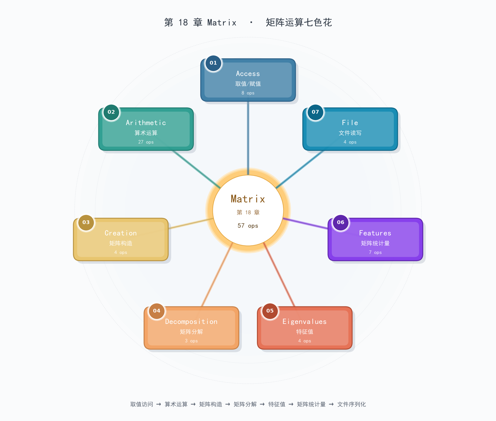

# 第 18 章 Matrix  ·  矩阵运算七色花

> **一句话定位**：HALCON 唯一一章把"标量"扩成"矩阵（Matrix）"的算子集合——以 `create_matrix` 为起点、`get_full_matrix`/`set_full_matrix` 为读写基座、`solve_matrix`/`svd_matrix`/`invert_matrix` 为线性代数三剑客，让你能把图像当成 R×C 数值矩阵来分解、求解、计算行列式和特征值。**57 个算子**横跨七族，是 HALCON 内部"鲁棒位姿估计"、"相机标定解算"、"PCA 主成分分析"等高级算子的数学底座。

---

## 1. 章节定位

**Matrix 章**是 HALCON 数值计算层。与第 15 章 Image 不同——Image 算子的"主角"是像素（图像），Matrix 算子的"主角"是**行列结构化的数值数组**。

何时会用到 Matrix？

- **相机标定**：解最小二乘 `A·x = b`，`solve_matrix` 直接搞定
- **齐次变换矩阵**：3×3/4×4 矩阵表示旋转/平移/缩放
- **PCA / SVD / 特征分解**：降维、噪声滤除、姿态估计
- **位姿估计**（第 19/20 章内部依赖）：Matrix 是它们的"幕后厨子"
- **人工构造测试矩阵**：调试算法时用 `create_matrix` 造已知矩阵验证流程

> *Matrix 是"幕后英雄"——HALCON 30% 的高级算子背后是 Matrix 在调教，但绝大多数场景你看不见它。*

---

## 2. 七族速览

| 族 | 算子数 | 一句话 | 关键算子示例 |
| --- | ---: | --- | --- |
| **Access** | 8 | 取子矩阵/对角线/值，赋值覆盖 | `get_full_matrix` `set_sub_matrix` |
| **Arithmetic** | 27 | 加减乘除、缩放、求逆、转置、逐元素幂 | `mult_matrix` `invert_matrix` `transpose_matrix` |
| **Creation** | 4 | 创建/复制/重复/清空 | `create_matrix` `copy_matrix` `repeat_matrix` `clear_matrix` |
| **Decomposition** | 3 | QR / LU / SVD 矩阵分解 | `decompose_matrix` `orthogonal_decompose_matrix` `svd_matrix` |
| **Eigenvalues** | 4 | 特征值与特征向量（一般/对称/广义） | `eigenvalues_general_matrix` `eigenvalues_symmetric_matrix` |
| **Features** | 7 | 行/列数、行列式、均值、范数、最大最小 | `get_size_matrix` `determinant_matrix` `norm_matrix` |
| **File** | 4 | 文件读写 + 序列化反序列化 | `read_matrix` `write_matrix` `serialize_matrix` `deserialize_matrix` |

总数：**57 算子 / 7 族**，57/57 签名全部从官方 HTML 一次抽全（0 miss）。

---

## 3. 七星连珠思维导图



7 个花瓣围绕中心焦点圆（Matrix · 第 18 章 · 57 ops），呈现"按行为生命周期"的布局：1·Access 取读、2·Arithmetic 算、3·Creation 生、4·Decomposition 拆、5·Eigenvalues 解特征、6·Features 量、7·File 存。

---

## 4. 七族详解

### 4.1 Access（取值/赋值，8 ops）

按"取何种元素"分四对——`get_*` / `set_*` 镜像：

| 操作 | get_* | set_* |
| --- | --- | --- |
| 全部元素 | `get_full_matrix` | `set_full_matrix` |
| 子矩阵（指定行列范围） | `get_sub_matrix` | `set_sub_matrix` |
| 对角线 | `get_diagonal_matrix` | `set_diagonal_matrix` |
| 单位元（指定 [Row,Col]） | `get_value_matrix` | `set_value_matrix` |

**典型流水线**：

```hdevelop
create_matrix (4, 4, 0, MatrixID)               * 全零 4x4
set_full_matrix (MatrixID, [1,2,3,4,5,6,7,8,...]) * 覆盖
get_sub_matrix (MatrixID, 1, 1, 2, 2, SubMatID)  * 取左上 2x2 子块
get_value_matrix (MatrixID, [0,1], [0,1], Values) * 取四个角的值
```

> *Arrow rule（→-rule）*：先 `get` 查看，再 `set` 改写——HALCON 不像 NumPy/Python 一样能直接 `M[0,0]=5`，必须用 `set_*`。

**典型误区**：

| 误区 | 后果 | 正解 |
| --- | --- | --- |
| 用 `set_full_matrix` 写入长度不匹配 | 抛错 "wrong length" | 数清楚 4×4 = 16 个数 |
| 取子矩阵越界（Row+RowsSub > 总行数） | 抛错 | 先 `get_size_matrix` 确认 |
| 想清空某元素 | 内存不会释放 | 用 `clear_matrix` 才能释放 |

---

### 4.2 Arithmetic（算术运算，27 ops）

**这是 Matrix 族最大的一族**——12 对 24 个 + 3 个无 `_mod` 的标准算子 + 1 个 `solve_matrix`。

**两两配对的 `_mod` 模式**：

| 操作 | 标准版（新建矩阵返回） | `_mod` 版（原地修改） |
| --- | --- | --- |
| 绝对值 | `abs_matrix` (← MatrixAbsID) | `abs_matrix_mod` (原地覆盖) |
| 加法 | `add_matrix` (← MatrixSumID) | `add_matrix_mod` (覆盖 MatrixBID) |
| 减法 | `sub_matrix` (←) | `sub_matrix_mod` |
| 乘：矩阵×矩阵 | `mult_matrix` (←) | `mult_matrix_mod` |
| 乘：逐元素 | `mult_element_matrix` (←) | `mult_element_matrix_mod` |
| 除：逐元素 | `div_element_matrix` (←) | `div_element_matrix_mod` |
| 幂：矩阵幂 | `pow_matrix` (←) | `pow_matrix_mod` |
| 幂：逐元素幂 | `pow_element_matrix` (←) | `pow_element_matrix_mod` |
| 幂：标量到逐元素 | `pow_scalar_element_matrix` (←) | `pow_scalar_element_matrix_mod` |
| 缩放 | `scale_matrix` (←) | `scale_matrix_mod` |
| 平方根 | `sqrt_matrix` (←) | `sqrt_matrix_mod` |
| 转置 | `transpose_matrix` (←) | `transpose_matrix_mod` |

加上无 `_mod` 的：**`invert_matrix` (←) `invert_matrix_mod` (原地)** + **`solve_matrix`**（A·X = B 解线性方程组）。

> **`mult_matrix` vs `mult_element_matrix`** 区别：
> - `mult_matrix`：标准矩阵乘法（A m×k × B k×n → m×n）
> - `mult_element_matrix`：**逐元素相乘**（A[i,j] × B[i,j]，要求同形）

**两版选择的 3 条决策原则**：

1. **要保留原矩阵做对数** → 标准版（生成新矩阵）
2. **临时调教 / 大批量运算 / 内存敏感** → `_mod` 版（省一次内存）
3. **链式运算多次** → `_mod` 版减少 50% 内存峰值

**典型流水线：解最小二乘**（相机标定核心）：

```hdevelop
* 解 A·X = B 的最小二乘解（A m×n，m>=n）
solve_matrix (A, 'LU', B, X)        * LU 分解路径，最快
* X 就是我们要的：例如相机的内外参矩阵
```

**典型误区**：

| 误区 | 后果 | 正解 |
| --- | --- | --- |
| 矩阵×标量也用 `mult_matrix` | 维度不匹配报错 | 用 `scale_matrix(MatrixID, 2.5, ...)` |
| `invert_matrix` 忘了指定 `MatrixType` | 默认按普通矩阵求解 | 对称矩阵加 `'symmetric'` 提速 2x |
| `solve_matrix` 矩阵奇异 | 抛错 "singular" | 先用 `determinant_matrix` 检查 det != 0 |

---

### 4.3 Creation（矩阵构造，4 ops）

极简四件套：

| 算子 | 用途 |
| --- | --- |
| `create_matrix` | 从零创建一个新矩阵（指定 Rows/Cols/Value 初值） |
| `copy_matrix` | 完整复制（深拷贝，独立内存） |
| `repeat_matrix` | 把一个小矩阵"重复平铺"成大矩阵（Kronecker 积的特殊形式） |
| `clear_matrix` | 释放矩阵内存（不释放会泄漏） |

**典型流水线**：

```hdevelop
* 创建一个 3×3 单位矩阵（要先填对角线）
create_matrix (3, 3, 0, I)                         * 先造全 0
set_diagonal_matrix (I, [1.0, 1.0, 1.0], 0)          * 对角线设 1

* 平铺：把 2×2 重复 3 次成 6×6
create_matrix (2, 2, 1, Tile)
repeat_matrix (Tile, 3, 3, BigTile)                  * BigTile 6×6 全 1
```

> *HALCON 没有专门的 `identity_matrix`！* 要单位矩阵必须 `create_matrix` + `set_diagonal_matrix`。

---

### 4.4 Decomposition（矩阵分解，3 ops）

| 算子 | 分解类型 | 用途 |
| --- | --- | --- |
| `decompose_matrix` | **LU / Cholesky** 分解 | 解线性方程组、求行列式（隐式） |
| `orthogonal_decompose_matrix` | **QR / LQ** 正交分解 | 最小二乘、特征值迭代起点 |
| `svd_matrix` | **奇异值分解 SVD** | PCA、降维、伪逆、姿态估计 |

**典型流水线（SVD 作伪逆解超定方程）**：

```hdevelop
* A 是 m×n (m >= n) 长方阵，没有常规逆，但有伪逆 A⁺ = V·Σ⁻¹·Uᵀ
svd_matrix (A, 'full', 'both', UID, SID, VID)
* SID 是奇异值向量，对它求倒数后构造 Σ⁻¹
* 然后 mult_matrix(VID, mult_matrix(Σ⁻¹, transpose_matrix(UID))) 拼成 A⁺
```

**典型误区**：

| 误区 | 后果 | 正解 |
| --- | --- | --- |
| 对奇异矩阵用 `decompose_matrix 'LU'` | 抛错 | LU 仅适用于非奇异方阵 |
| `svd_matrix` 想要"reduced"却用 `'full'` | 浪费内存 | 长方矩阵用 `'reduced'` 省一半 |
| QR 想得到 Q 的转置 | 重复算 | `orthogonal_decompose_matrix` 的 `OutputMatricesType='QT'` 直接给你 |

---

### 4.5 Eigenvalues（特征值，4 ops）

| 算子 | 适用 | 返回 |
| --- | --- | --- |
| `eigenvalues_general_matrix` | 一般方阵 | 复特征值（实部 + 虚部）+ 可选特征向量 |
| `eigenvalues_symmetric_matrix` | 对称方阵（A=Aᵀ） | 实特征值 + 可选特征向量 |
| `generalized_eigenvalues_general_matrix` | 一般广义 A·x = λB·x | 复特征对 |
| `generalized_eigenvalues_symmetric_matrix` | 对称广义 | 实特征对 |

**典型流水线（PCA 主成分分析）**：

```hdevelop
* 求协方差矩阵的特征向量 = 主成分方向
eigenvalues_symmetric_matrix (CovMat, 'true', EigenvaluesID, EigenvectorsID)
* 最大的特征值对应的特征向量 = 第一主成分
```

**典型误区**：

| 误区 | 后果 | 正解 |
| --- | --- | --- |
| 把非对称矩阵丢给 `eigenvalues_symmetric_matrix` | 数值错误（不是抛错） | 先看 `A == Aᵀ` ？是 → `symmetric` ；否 → `general` |
| 求广义特征却用普通特征 | 解不对 | `generalized_*` 才是 A·x = λB·x |
| 想要最小特征值 | 拿到的还是全部 | 自己排序 EigenvaluesID，找 min |

---

### 4.6 Features（矩阵统计量，7 ops）

| 算子 | 含义 | 备注 |
| --- | --- | --- |
| `get_size_matrix` | 返回行/列数 | `(: : MatrixID : Rows , Columns)` — 两个返回值 |
| `determinant_matrix` | 行列式 | 需指定 `MatrixType` |
| `mean_matrix` | 均值 | 'rows' / 'columns' / 'full' |
| `max_matrix` | 最大值 | 同上 |
| `min_matrix` | 最小值 | 同上 |
| `sum_matrix` | 总和 | 同上 |
| `norm_matrix` | 范数 | 'frobenius' / '1' / '2' / 'inf' 等 |

**典型流水线（判断矩阵奇异）**：

```hdevelop
determinant_matrix (M, 'general', Det)
if (Det == 0)
    * 奇异矩阵，警告并跳过逆运算
endif
```

**典型误区**：

| 误区 | 后果 | 正解 |
| --- | --- | --- |
| `get_size_matrix` 写成获取 Width/Height | 没有这俩参数 | 它只有 `Rows` 和 `Columns` 两个输出 |
| 求所有元素均值用 `mean_matrix 'full'` | 仍返回矩阵（1×1） | 想拿标量请用 `(: : M, 'full' : Mean)` 然后 `Mean[0]` |
| `norm_matrix` 选 `'frobenius'` 是错的 | 不会，是 L2 等价于 Frobenius | 看 `NormType` 表：1/2/inf/frobenius |

---

### 4.7 File（文件读写，4 ops）

| 算子 | 用途 | 文件格式 |
| --- | --- | --- |
| `write_matrix` | 把矩阵写到磁盘文件 | .mat 文本格式（HALCON 自定义） |
| `read_matrix` | 从磁盘读回矩阵 | .mat 文本格式 |
| `serialize_matrix` | 序列化为二进制 | 用于 IPC / 存到 tuple |
| `deserialize_matrix` | 反序列化 | 从 serialized item 还原 Matrix |

**典型流水线（持久化训练结果）**：

```hdevelop
* 训练完得到协方差矩阵 → 存盘
write_matrix (CovMat, 'binary', 'cov.bin')

* 下次启动直接读
read_matrix ('cov.bin', CovMat)
```

**典型误区**：

| 误区 | 后果 | 正解 |
| --- | --- | --- |
| 拿 `read_matrix` 去读 `serialize_matrix` 输出 | 抛错格式不对 | serialize → deserialize 一对；read → write 一对 |
| 想跨语言读取 .mat 文本 | HALCON .mat 不标准 | 用 `'binary'` 选项 + 自定义封装 |
| 写文件忘了路径 | 写到当前工作目录 | 用绝对路径 |

---

## 5. 通用工作流（线性代数流水线模板）

**模板 1：解线性方程组 A·X = B**

```hdevelop
* 输入：A m×n 方阵（n×n），B n×k 右端项
solve_matrix (A, 'LU', B, X)             * 最快路径
* 或
solve_matrix (A, 'symmetric', B, X)     * A 对称时更快
* 或
invert_matrix (A, 'general', 1e-6, AInv) * 然后 mult_matrix(AInv, B)
```

**模板 2：PCA 主成分分析**

```hdevelop
* 1. 构造数据中心化矩阵（行=样本）
* 2. 协方差矩阵 = (Xᵀ·X) / (n-1)
mult_matrix (transpose_matrix(X), X, XT_X)
scale_matrix (XT_X, 1.0/(n-1), CovMat)

* 3. 求特征值分解
eigenvalues_symmetric_matrix (CovMat, 'true', EValID, EVecID)

* 4. 按特征值降序排列，EVecID 的前几列就是主成分
```

**模板 3：伪逆解超定方程**

```hdevelop
* A m×n (m>=n)，求 x 使 ||A·x - b||² 最小
svd_matrix (A, 'reduced', 'both', U, S, V)
* 伪逆 = V · diag(1/S) · Uᵀ
* 然后 mult_matrix(PinvA, b, x)
```

---

## 6. `_mod` vs 标准版选型决策表

| 维度 | 标准版（无 `_mod`） | `_mod` 版 |
| --- | --- | --- |
| 是否新建矩阵返回 | 是（生成新 MatrixID） | 否（原地覆盖入参矩阵） |
| 内存占用 | 2× 输入 | 1× 输入 |
| 是否保留入参矩阵 | 是 | 否（被改写） |
| 适用场景 | 需要保留原矩阵 / 多步对数 | 大批量 / 内存敏感 / 一次性的中间步骤 |
| 链式可读性 | 高（看清楚每一步产物） | 中（覆盖原矩阵，需注释） |

> **决策原则**：实验阶段用标准版（保留调试信息），生产/批量阶段用 `_mod`（省内存 50%）。

---

## 7. 误区速查（10 条）

| # | 误区 | 后果 |
| --- | --- | --- |
| 1 | 忘记 `clear_matrix` | 矩阵内存泄漏（每次循环泄漏一份） |
| 2 | 想清空某元素却用 `set_value_matrix=0` | 不会释放内存 | 必须 `clear_matrix` |
| 3 | 矩阵维度不匹配却强 `mult_matrix` | 抛 "wrong matrix dimensions" |
| 4 | 对奇异矩阵用 `invert_matrix` | 抛 "singular matrix" |
| 5 | 用 `read_matrix` 读 serialize 输出 | 格式错误 |
| 6 | `solve_matrix` 用 LU 解奇异系统 | 抛错 |
| 7 | `eigenvalues_symmetric_matrix` 用于非对称矩阵 | 数值结果错 |
| 8 | `svd_matrix` 用 `'full'` 处理长方阵 | 内存浪费 |
| 9 | `set_full_matrix` 写错长度 | 抛错或内存越界 |
| 10 | 单位矩阵却用 `repeat_matrix` 多个 1 | 浪费算力 | 应该 `create_matrix` + `set_diagonal` |

---

## 8. 七族签名速查表

> 完整 HDevelop 签名格式：`op (: : Args : Retvals)` — 第一个空位是 input 图标（HALCON Matrix 没图形输入故空），第二个是 output 图标（多返回时空），最后 `: Retvals`。
> 标记 `_mod` 表示原地修改版。

### 8.1 Access 族（8 ops）

| 算子 | 一句话功能 | HDevelop 关键签名 |
| --- | --- | --- |
| get_diagonal_matrix | 取矩阵对角线元素组成新向量 | `get_diagonal_matrix(: : MatrixID , Diagonal : VectorID)` |
| get_full_matrix | 取矩阵全部元素（按列序展开为 tuple） | `get_full_matrix(: : MatrixID : Values)` |
| get_sub_matrix | 取指定行列范围的子矩阵 | `get_sub_matrix(: : MatrixID , Row , Column , RowsSub , ColumnsSub : MatrixSubID)` |
| get_value_matrix | 取 [Row,Col] 处的元素值 | `get_value_matrix(: : MatrixID , Row , Column : Value)` |
| set_diagonal_matrix | 用向量覆盖矩阵的对角线 | `set_diagonal_matrix(: : MatrixID , VectorID , Diagonal :)` |
| set_full_matrix | 用 tuple 覆盖矩阵全部元素 | `set_full_matrix(: : MatrixID , Values :)` |
| set_sub_matrix | 把子矩阵贴到指定位置 | `set_sub_matrix(: : MatrixID , MatrixSubID , Row , Column :)` |
| set_value_matrix | 修改 [Row,Col] 处的值 | `set_value_matrix(: : MatrixID , Row , Column , Value :)` |

### 8.2 Arithmetic 族（27 ops）

| 算子 | 一句话功能 | HDevelop 关键签名 |
| --- | --- | --- |
| abs_matrix | 取所有元素的绝对值（新矩阵） | `abs_matrix(: : MatrixID : MatrixAbsID)` |
| abs_matrix_mod | 取所有元素的绝对值（原地） | `abs_matrix_mod(: : MatrixID :)` |
| add_matrix | 矩阵加法（新矩阵） | `add_matrix(: : MatrixAID , MatrixBID : MatrixSumID)` |
| add_matrix_mod | 矩阵加法（覆盖 B） | `add_matrix_mod(: : MatrixAID , MatrixBID :)` |
| div_element_matrix | 两矩阵逐元素相除（新） | `div_element_matrix(: : MatrixAID , MatrixBID : MatrixDivID)` |
| div_element_matrix_mod | 两矩阵逐元素相除（原地） | `div_element_matrix_mod(: : MatrixAID , MatrixBID :)` |
| invert_matrix | 求矩阵的逆（新） | `invert_matrix(: : MatrixID , MatrixType , Epsilon : MatrixInvID)` |
| invert_matrix_mod | 求矩阵的逆（原地） | `invert_matrix_mod(: : MatrixID , MatrixType , Epsilon :)` |
| mult_element_matrix | 逐元素相乘（新） | `mult_element_matrix(: : MatrixAID , MatrixBID : MatrixMultID)` |
| mult_element_matrix_mod | 逐元素相乘（原地） | `mult_element_matrix_mod(: : MatrixAID , MatrixBID :)` |
| mult_matrix | 矩阵乘法 A·B（新） | `mult_matrix(: : MatrixAID , MatrixBID : MatrixMultID)` |
| mult_matrix_mod | 矩阵乘法（覆盖 B） | `mult_matrix_mod(: : MatrixAID , MatrixBID :)` |
| pow_element_matrix | 逐元素幂（新） | `pow_element_matrix(: : MatrixID , MatrixExpID : MatrixPowID)` |
| pow_element_matrix_mod | 逐元素幂（原地） | `pow_element_matrix_mod(: : MatrixID , MatrixExpID :)` |
| pow_matrix | 矩阵幂（新） | `pow_matrix(: : MatrixID , MatrixType , Power : MatrixPowID)` |
| pow_matrix_mod | 矩阵幂（覆盖原） | `pow_matrix_mod(: : MatrixID , MatrixType , Power :)` |
| pow_scalar_element_matrix | 标量作指数的逐元素幂（新） | `pow_scalar_element_matrix(: : MatrixID , Power : MatrixPowID)` |
| pow_scalar_element_matrix_mod | 标量作指数的逐元素幂（原地） | `pow_scalar_element_matrix_mod(: : MatrixID , Power :)` |
| scale_matrix | 矩阵 × 标量（新） | `scale_matrix(: : MatrixID , Factor : MatrixScaledID)` |
| scale_matrix_mod | 矩阵 × 标量（覆盖原） | `scale_matrix_mod(: : MatrixID , Factor :)` |
| solve_matrix | 解线性方程组 A·X = B | `solve_matrix(: : MatrixAID , MatrixBID , MatrixType : MatrixXID)` |
| sqrt_matrix | 逐元素平方根（新） | `sqrt_matrix(: : MatrixID : MatrixSqrtID)` |
| sqrt_matrix_mod | 逐元素平方根（原地） | `sqrt_matrix_mod(: : MatrixID :)` |
| sub_matrix | 矩阵减法（新） | `sub_matrix(: : MatrixAID , MatrixBID : MatrixSubID)` |
| sub_matrix_mod | 矩阵减法（覆盖 B） | `sub_matrix_mod(: : MatrixAID , MatrixBID :)` |
| transpose_matrix | 转置（新） | `transpose_matrix(: : MatrixID : MatrixTransposedID)` |
| transpose_matrix_mod | 转置（原地） | `transpose_matrix_mod(: : MatrixID :)` |

### 8.3 Creation 族（4 ops）

| 算子 | 一句话功能 | HDevelop 关键签名 |
| --- | --- | --- |
| clear_matrix | 释放矩阵内存 | `clear_matrix(: : MatrixID :)` |
| copy_matrix | 完整复制矩阵（深拷贝） | `copy_matrix(: : MatrixID : MatrixCopyID)` |
| create_matrix | 创建指定大小和初值的矩阵 | `create_matrix(: : Rows , Columns , Value : MatrixID)` |
| repeat_matrix | 把小矩阵重复平铺成大矩阵 | `repeat_matrix(: : MatrixID , Rows , Columns : MatrixRepeatedID)` |

### 8.4 Decomposition 族（3 ops）

| 算子 | 一句话功能 | HDevelop 关键签名 |
| --- | --- | --- |
| decompose_matrix | LU / Cholesky 分解 | `decompose_matrix(: : MatrixID , MatrixType : MatrixLID , MatrixUID , MatrixPermutationID)` |
| orthogonal_decompose_matrix | QR / LQ 正交分解 | `orthogonal_decompose_matrix(: : MatrixID , DecompositionType , OutputMatricesType , ComputeOrthogonal : MatrixOrthogonalID , MatrixTriangularID)` |
| svd_matrix | 奇异值分解 SVD | `svd_matrix(: : MatrixID , SVDType , ComputeSingularVectors : MatrixUID , MatrixSID , MatrixVID)` |

### 8.5 Eigenvalues 族（4 ops）

| 算子 | 一句话功能 | HDevelop 关键签名 |
| --- | --- | --- |
| eigenvalues_general_matrix | 一般方阵的特征值（复数） | `eigenvalues_general_matrix(: : MatrixID , ComputeEigenvectors : EigenvaluesRealID , EigenvaluesImagID , EigenvectorsRealID , EigenvectorsImagID)` |
| eigenvalues_symmetric_matrix | 对称方阵的特征值（实数） | `eigenvalues_symmetric_matrix(: : MatrixID , ComputeEigenvectors : EigenvaluesID , EigenvectorsID)` |
| generalized_eigenvalues_general_matrix | 一般广义 A·x = λB·x | `generalized_eigenvalues_general_matrix(: : MatrixAID , MatrixBID , ComputeEigenvectors : EigenvaluesRealID , EigenvaluesImagID , EigenvectorsRealID , EigenvectorsImagID)` |
| generalized_eigenvalues_symmetric_matrix | 对称广义 A·x = λB·x | `generalized_eigenvalues_symmetric_matrix(: : MatrixAID , MatrixBID , ComputeEigenvectors : EigenvaluesID , EigenvectorsID)` |

### 8.6 Features 族（7 ops）

| 算子 | 一句话功能 | HDevelop 关键签名 |
| --- | --- | --- |
| determinant_matrix | 求矩阵的行列式 | `determinant_matrix(: : MatrixID , MatrixType : Value)` |
| get_size_matrix | 取矩阵的行列数 | `get_size_matrix(: : MatrixID : Rows , Columns)` |
| max_matrix | 取最大元素（行/列/全） | `max_matrix(: : MatrixID , MaxType : MatrixMaxID)` |
| mean_matrix | 求均值（行/列/全） | `mean_matrix(: : MatrixID , MeanType : MatrixMeanID)` |
| min_matrix | 取最小元素（行/列/全） | `min_matrix(: : MatrixID , MinType : MatrixMinID)` |
| norm_matrix | 求矩阵或向量的范数 | `norm_matrix(: : MatrixID , NormType : Value)` |
| sum_matrix | 求元素总和（行/列/全） | `sum_matrix(: : MatrixID , SumType : MatrixSumID)` |

### 8.7 File 族（4 ops）

| 算子 | 一句话功能 | HDevelop 关键签名 |
| --- | --- | --- |
| deserialize_matrix | 从序列化 item 还原矩阵 | `deserialize_matrix(: : SerializedItemHandle : MatrixID)` |
| read_matrix | 从 .mat 文件读矩阵 | `read_matrix(: : FileName : MatrixID)` |
| serialize_matrix | 把矩阵序列化为二进制项 | `serialize_matrix(: : MatrixID : SerializedItemHandle)` |
| write_matrix | 把矩阵写入 .mat 文件 | `write_matrix(: : MatrixID , FileFormat , FileName :)` |

---

## 9. 一句话总结

> **Matrix 章 = `create_matrix` 起步 + `get/set_*` 读写 + `mult_/add_/sub_/pow_*` 算 + `solve_/svd_/eigenvalues_*` 线性代数三剑客 + `write_/serialize_matrix` 收尾**——HALCON 高级算法（标定、位姿、PCA）的数学底座，57 算子横跨七族；用 `_mod` 版省内存 50%，但要先 `determinant_matrix` 确认矩阵非奇异再去 `invert_matrix`。
