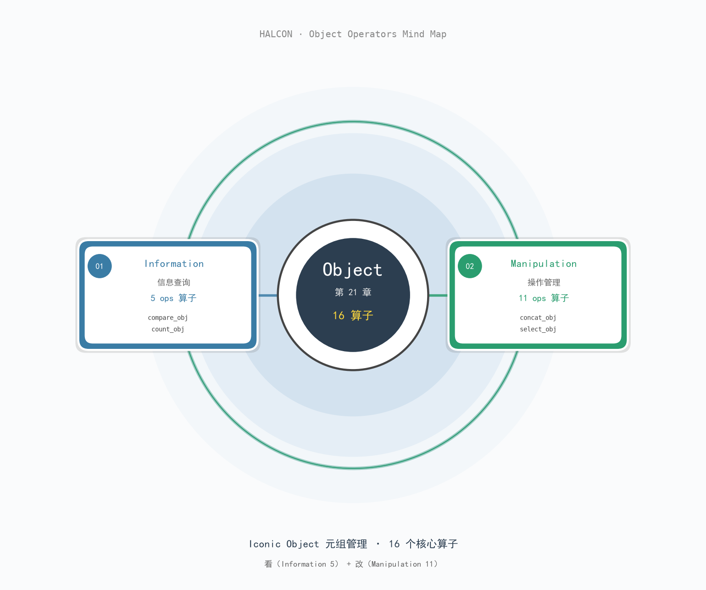

# 第 21 章 Object —— 标志性对象的"看与改"

> **HALCON 20.11.1.0 · 第 21 章 Object · 16 个算子 · 2 族**
>
> 主题：Iconic Object（元组）管理——`看`（Information 5 算子）+ `改`（Manipulation 11 算子）

---

## §1 章节定位

`Iconic Object`（图像、区域、轮廓等"标志型"对象）在 HALCON 中以**元组（tuple of objects）**形式存在。第 21 章是这些元组的"管家用具"——不创造新对象，只**查询信息**（5 个）和**重组元组**（11 个）。

| 对比项 | 上一章（第 19 章 Morphology） | **第 21 章 Object** | 下一章（第 22 章） |
| --- | --- | --- | --- |
| 主体 | 像素 / 区域上做形态学变换 | **对象元组本身**的查询与重组 | 通用对象管理 |
| 核心动作 | SE 在空间滑动 | 索引/查询/插入/删除/替换 | —— |
| 是否改变对象 | ✅ 形态改变 | ❌ 元组结构变化，对象本身不变 | —— |
| 典型算子 | `erosion_circle` | `select_obj` / `concat_obj` | —— |

**为什么这一章算子少而精？** 因为对象元组的"看与改"是任何算法管线（matching / OCR / 3D / classification）的基础脚手架，每个算子都对应一个明确的"集合论"操作。

---

## §2 双族速览

| 族 | ops | 核心抽象 | 关键算子 | 适用条件 |
| --- | ---: | --- | --- | --- |
| **Information** | 5 | 对象元组的**只读视图** | `count_obj` / `get_obj_class` / `compare_obj` | 调试 / 元组元信息查询 |
| **Manipulation** | 11 | 对象元组的**结构化重组** | `select_obj` / `concat_obj` / `copy_obj` | 任何需要挑/拼/拷/插/删/替元组的场景 |

合计 **16 ops**（≤60，单卷无需切分）。

---

## §3 双子星思维导图



中心 `Object` 焦点圆（深空蓝），左叶 `01 Information`（钢蓝）5 算子，右叶 `02 Manipulation`（翠绿）11 算子，双重轨道左右对称辐射。

---

## §4 双族详解

### 4.1 Information（5 算子）—— "看见元组"

5 个算子全部是**纯函数**（无副作用），返回元组的元信息或比较结果。生产代码调试、HALCON 脚本预检查、循环边界判断都靠它们。

#### 4.1.1 算子清单与流水线

| 算子 | 一句话功能 | HDevelop 关键签名 |
| --- | --- | --- |
| `compare_obj` | 比较两元组对象是否相等 | `compare_obj(Objects1, Objects2 : : Epsilon : IsEqual)` |
| `count_obj` | 数元组里的对象个数 | `count_obj(Objects : : : Number)` |
| `get_channel_info` | 查图像对象的通道信息 | `get_channel_info(Object : : Request, Channel : Information)` |
| `get_obj_class` | 查每个对象的类名（`image`/`region`/`xld`/...） | `get_obj_class(Object : : : Class)` |
| `test_equal_obj` | 严格比较两元组的 region+gray 通道 | `test_equal_obj(Objects1, Objects2 : : : IsEqual)` |

#### 4.1.2 典型流水线

```hdevelop
* 调试模板：先数对象、再查类、再比较
count_obj (Regions, NumRegions)
get_obj_class (Regions, Classes)
* 期望 1 个 region、类为 'region'
if (NumRegions # 1 or Classes[0] # 'region')
    return ()
endif
```

#### 4.1.3 误区

| 误区 | 正确做法 |
| --- | --- |
| `compare_obj` 与 `test_equal_obj` 互换 | `compare_obj` 用 `Epsilon` 容差比较（建议）；`test_equal_obj` 严格相等（region+gray 全部一致） |
| 假设 `count_obj` 数的是像素 | 数的是**对象个数**（元组长度），不是区域面积 |

### 4.2 Manipulation（11 算子）—— "重组元组"

11 个算子全部是**集合论操作**。每个算子都对应一个明确的"集合运算"或"序列操作"。

#### 4.2.1 算子清单

| 算子 | 一句话功能 | HDevelop 关键签名 |
| --- | --- | --- |
| `clear_obj` | 从 HALCON 数据库删除对象 | `clear_obj(Objects : : :)` |
| `concat_obj` | 拼接两元组 → 新元组 | `concat_obj(Objects1, Objects2 : ObjectsConcat : :)` |
| `copy_obj` | 拷贝指定索引起的 N 个对象 | `copy_obj(Objects : ObjectsSelected : Index, NumObj :)` |
| `gen_empty_obj` | 创建空元组（占位/哨兵） | `gen_empty_obj(: EmptyObject : :)` |
| `insert_obj` | 在指定 Index 插入元组 | `insert_obj(Objects, ObjectsInsert : ObjectsExtended : Index :)` |
| `integer_to_obj` | 把整数元组（数据库键）转回对象 | `integer_to_obj(: Objects : SurrogateTuple :)` |
| `obj_diff` | 集合差：A - B（去掉 B 中所有对象） | `obj_diff(Objects, ObjectsSub : ObjectsDiff : :)` |
| `obj_to_integer` | 把对象转成整数元组（数据库键） | `obj_to_integer(Objects : : Index, Number : SurrogateTuple)` |
| `remove_obj` | 按 Index 删除元素 | `remove_obj(Objects : ObjectsReduced : Index :)` |
| `replace_obj` | 按 Index 替换元素 | `replace_obj(Objects, ObjectsReplace : Replaced : Index :)` |
| `select_obj` | 按 Index 选择元素（拷出） | `select_obj(Objects : ObjectSelected : Index :)` |

#### 4.2.2 9 大集合操作映射

| 操作 | 集合论术语 | HALCON 算子 |
| --- | --- | --- |
| 创建空集 | `∅` | `gen_empty_obj` |
| 拼接 | `A ∪ B`（保持顺序） | `concat_obj` |
| 选择 | `A[i]` 或 `A[i..j]` | `select_obj` / `copy_obj` |
| 插入 | `A.insert(i, B)` | `insert_obj` |
| 删除 | `A.remove(i)` | `remove_obj` |
| 替换 | `A[i] = b` | `replace_obj` |
| 集合差 | `A − B` | `obj_diff` |
| 释放 | 显式析构 | `clear_obj` |
| 序列化/还原 | 与整数键互转 | `obj_to_integer` / `integer_to_obj` |

#### 4.2.3 典型流水线：构造多对象训练集

```hdevelop
* 把 5 张图各自抠出的 region 合成一个训练元组
gen_empty_obj (TrainSet)
for I := 1 to 5 by 1
    read_image (Image, 'img_' + I + '.png')
    threshold (Image, Region, 128, 255)
    * 把每个 region 拼接到元组（用 concat 保持顺序）
    concat_obj (TrainSet, Region, TrainSet)
endfor
* 数一下元组长度确认
count_obj (TrainSet, NumTrain)
```

#### 4.2.4 误区

| 误区 | 正确做法 |
| --- | --- |
| 把 `select_obj` 当拷贝 → 误以为会修改原元组 | `select_obj` 是**拷贝**出，原元组不变 |
| `remove_obj` 释放内存 → 误以为对象被删除 | `remove_obj` 从元组移除，对象仍可能在别处引用；想真正释放用 `clear_obj` |
| 错用 `obj_diff` 当单值删除 | `obj_diff` 移除**所有匹配**的对象；想只删一个用 `remove_obj(..., Index=[I])` |
| `integer_to_obj` 找不到对象 | 整数键必须先用 `obj_to_integer` 拿到，且对象不能被 `clear_obj` 释放过 |

---

## §5 通用工作流

### 5.1 元组构造模板（concat + insert 混合）

```hdevelop
* 用 gen_empty_obj 起点 + concat 累积 + insert 中间插入
gen_empty_obj (Set)
concat_obj (Set, RegionA, Set)
concat_obj (Set, RegionB, Set)
* 把 RegionX 插到索引 1 后
insert_obj (Set, RegionX, SetWithInsert, 1)
```

### 5.2 元组过滤模板（count + select + obj_diff）

```hdevelop
* 去掉面积小于 100 的对象
count_obj (Regions, N)
* 用 select_obj 按条件拷出
select_obj (Regions, SmallRegions, find(area < 100))
* 用 obj_diff 去掉它们
obj_diff (Regions, SmallRegions, BigRegions)
```

### 5.3 元组持久化（obj_to_integer / integer_to_obj）

```hdevelop
* 把元组存为整数数组（用于跨进程/序列化）
obj_to_integer (Objects, [0], NumObjects, Keys)
* ... 存到文件 ...
* 还原
integer_to_obj (Keys, RestoredObjects)
```

---

## §6 选型决策矩阵

| 需求 | 用 Information 族 | 用 Manipulation 族 |
| --- | --- | --- |
| 我想知道元组里有几个对象 | `count_obj` | —— |
| 我想知道每个对象是什么类型 | `get_obj_class` | —— |
| 我想判断两个元组是否相等 | `compare_obj` / `test_equal_obj` | —— |
| 我想从元组里挑出某些对象 | —— | `select_obj` |
| 我想合并两个元组 | —— | `concat_obj` |
| 我想删除/替换某些对象 | —— | `remove_obj` / `replace_obj` |
| 我想去掉两个元组的共同对象 | —— | `obj_diff` |
| 我想把元组存盘或传给别人 | `obj_to_integer` (Information 算转换) | —— |

---

## §7 误区速查（10 条）

1. **`select_obj` 是拷贝不是剪切**——原元组不变；想剪切用 `remove_obj`。
2. **`remove_obj` 不释放内存**——它从元组移除元素，对象可能仍被其他元组引用；想真正释放用 `clear_obj`。
3. **`clear_obj` 删除的是元组还是对象**——删除**对象本身**（释放 HALCON 数据库键），传入的元组变量变为空。
4. **`count_obj` 数的是对象数不是像素数**——数元组长度（Image/Region/XLD 都算 1）。
5. **`get_obj_class` 返回字符串**——'image' / 'region' / 'xld' / 'xld_cont' / 'xld_poly' / 'region_xld' / 'tuple' 等。
6. **`obj_diff` 是集合差不是元素删除**——A − B 移除 A 中**所有**与 B 任意元素"逻辑相等"的对象，不只是某个位置。
7. **`obj_to_integer`/`integer_to_obj` 互逆**——但被 `clear_obj` 释放过的对象用 `integer_to_obj` 还原会失败。
8. **`copy_obj(...,Index,NumObj)` 中 Index 从 1 开始**——HALCON 索引是 1-based，不要用 0。
9. **`concat_obj` 不去重**——它按顺序拼接，要去重得用 `obj_diff` 或 `tuple_union`（tuple 算子）。
10. **`gen_empty_obj` 创建的元组可以 `concat_obj` 添加**——空元组是合法起点，等价于空集合。

---

## §8 完整签名速查（16 算子全）

### §8.1 Information 族（5 算子）

| 算子 | 一句话功能 | HDevelop 关键签名 |
| --- | --- | --- |
| `compare_obj` | 比较两元组对象是否相等 | `compare_obj(Objects1, Objects2 : : Epsilon : IsEqual)` |
| `count_obj` | 数元组里的对象个数 | `count_obj(Objects : : : Number)` |
| `get_channel_info` | 查图像对象的通道信息 | `get_channel_info(Object : : Request, Channel : Information)` |
| `get_obj_class` | 查每个对象的类名 | `get_obj_class(Object : : : Class)` |
| `test_equal_obj` | 严格比较 region+gray 通道 | `test_equal_obj(Objects1, Objects2 : : : IsEqual)` |

### §8.2 Manipulation 族（11 算子）

| 算子 | 一句话功能 | HDevelop 关键签名 |
| --- | --- | --- |
| `clear_obj` | 从数据库删除对象 | `clear_obj(Objects : : :)` |
| `concat_obj` | 拼接两元组 → 新元组 | `concat_obj(Objects1, Objects2 : ObjectsConcat : :)` |
| `copy_obj` | 拷指定索引起的 N 个对象 | `copy_obj(Objects : ObjectsSelected : Index, NumObj :)` |
| `gen_empty_obj` | 创建空元组 | `gen_empty_obj(: EmptyObject : :)` |
| `insert_obj` | 在 Index 插入元组 | `insert_obj(Objects, ObjectsInsert : ObjectsExtended : Index :)` |
| `integer_to_obj` | 整数元组（数据库键）→ 对象 | `integer_to_obj(: Objects : SurrogateTuple :)` |
| `obj_diff` | 集合差 A − B | `obj_diff(Objects, ObjectsSub : ObjectsDiff : :)` |
| `obj_to_integer` | 对象 → 整数元组（数据库键） | `obj_to_integer(Objects : : Index, Number : SurrogateTuple)` |
| `remove_obj` | 按 Index 删除元素 | `remove_obj(Objects : ObjectsReduced : Index :)` |
| `replace_obj` | 按 Index 替换元素 | `replace_obj(Objects, ObjectsReplace : Replaced : Index :)` |
| `select_obj` | 按 Index 选择元素 | `select_obj(Objects : ObjectSelected : Index :)` |

---

## §9 一句话总结

第 21 章 Object 是 HALCON 的"元组管家用具箱"——**5 个 Information 算子让你看（count / class / compare）、11 个 Manipulation 算子让你改（select / copy / concat / insert / remove / replace / obj_diff / clear / obj_to_integer / integer_to_obj / gen_empty_obj）**，所有操作严格遵循集合论语义，是任何多对象算法管线（matching / OCR / 3D / classification）的基础脚手架。
