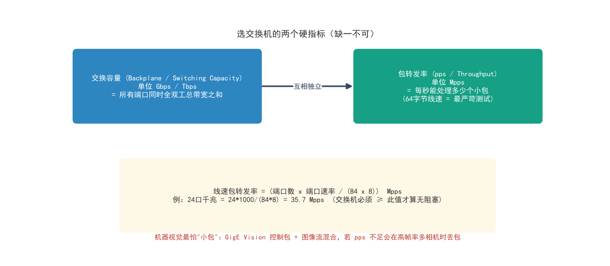
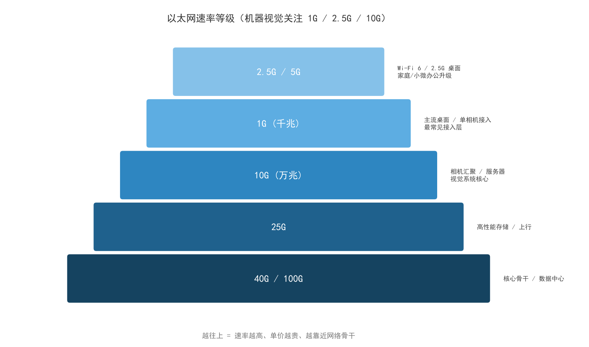
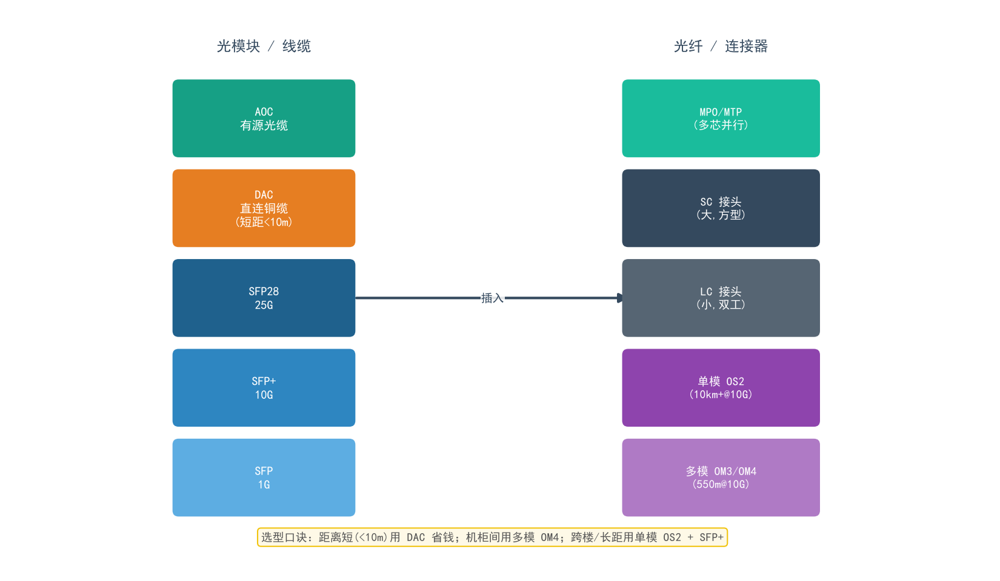
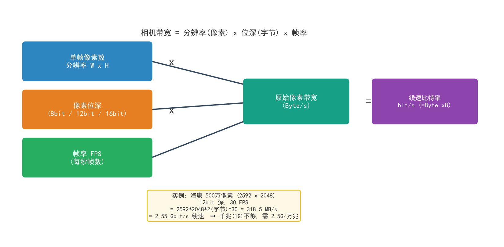
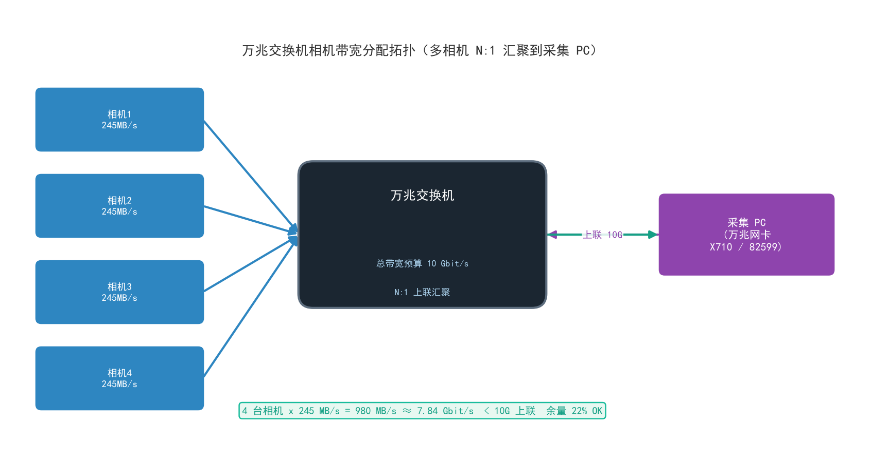

# 05 · 交换机与机器视觉网络详解（2.5G / 万兆交换机 · 万兆网卡 · 光缆 · 相机带宽分配）

> 本系列第 5 篇，承接 [01 工业相机详解](./01-工业相机详解.md)、[02 曝光增益帧率](./02-工业相机曝光增益帧率与参数下发详解.md)、[03 镜头光源选型](./03-镜头光源选型详解.md)、[04 局域网网络配置](./04-工业与安防相机局域网网络配置详解.md)。
>
> 04 解决了"把相机接上网"；本篇解决"**接得快、接得稳、接得多**"——当一台 500 万像素相机就能吃满千兆链路、当产线上有 4~8 台相机同时取流时，你需要一台真正的**万兆交换机**、一块靠谱的**万兆网卡**，以及一套**带宽分配的心算方法**。本篇覆盖：交换机原理与选型、2.5G/万兆速率等级、主流品牌横评、万兆网卡与驱动、光缆与光模块、相机帧率与带宽的关系、万兆交换机相机带宽分配原则，最后给出可直接照抄的组网方案与速查表。

---

## 一、交换机基础：先看懂这两个硬指标

### 1.1 交换机在干什么

交换机是局域网的"**交警 + 立交桥**"：它根据 **MAC 地址表** 把报文精准转发到对应端口，而不是像集线器（Hub）那样广播给所有人。对机器视觉而言，交换机的价值是：**让 N 台相机的数据流在同一时刻互不干扰地通过**。

### 1.2 硬指标一：交换容量（背板带宽）

- 单位：**Gbps / Tbps**
- 含义：交换机内部数据通路同时承载所有端口**全双工**流量的总能力。
- 无阻塞要求：`交换容量 ≥ 端口数 × 端口速率 × 2`（全双工按双向算，部分厂商直接按单相算，看规格书口径）。
- 例：8 口全万兆交换机，无阻塞要求交换容量 ≥ 8 × 10G × 2 = **160 Gbps**。

### 1.3 硬指标二：包转发率（pps）

- 单位：**Mpps**（百万包/秒）
- 含义：每秒能转发多少个**报文**。交换容量管"水管多粗"，包转发率管"交警每秒能放行多少辆车"。
- 64 字节小包线速公式（最严苛测试口径）：

```
线速包转发率 (Mpps) = Σ(每个端口速率 bit/s) / (84 × 8)
其中 84 = 64 字节最小帧 + 8 前导 + 12 帧间隔
```

- 例：24 口千兆交换机线速 = 24 × 10⁹ / (84×8) ≈ **35.7 Mpps**；规格书低于此值说明有阻塞。



### 1.4 二层 vs 三层交换机

| 维度 | 二层交换机 | 三层交换机 |
| --- | --- | --- |
| 转发依据 | MAC 地址 | MAC + IP 路由 |
| VLAN 间通信 | 需外部路由 | 内部直接路由 |
| 典型场景 | 单网段相机接入 | 多网段/多 VLAN 视觉车间 |
| 价格 | 低 | 高 |
| **视觉选型建议** | **单产线单网段首选，够用且省心** | 相机与主机跨网段、需要 ACL/QoS 精细控制时再上 |

> 记住 04 篇的结论：**相机与采集主机同网段（纯内网）最省事**——所以多数视觉系统用二层万兆交换机就够。

---

## 二、速率等级：2.5G 与万兆是怎么来的



### 2.1 速率等级速览

| 等级 | 线速 | 电口标准 | 光口标准 | 典型场景 |
| --- | --- | --- | --- | --- |
| 百兆 | 100 Mbit/s | 100BASE-TX | — | 已淘汰，勿用于取流 |
| **千兆 1G** | 1 Gbit/s | 1000BASE-T (Cat5e) | SFP | 单台低分辨率相机 |
| **2.5G** | 2.5 Gbit/s | 2.5GBASE-T (Cat5e 可跑) | SFP | 500 万像素单相机、Wi-Fi 6 AP 上行 |
| 5G | 5 Gbit/s | 5GBASE-T | — | 2.5G 换代升级 |
| **万兆 10G** | 10 Gbit/s | 10GBASE-T (Cat6a) | **SFP+** | 多相机汇聚、大面阵相机、服务器 |
| 25G | 25 Gbit/s | — | SFP28 | 高端存储/上行 |
| 40G/100G | 40/100 Gbit/s | — | QSFP+/QSFP28 | 数据中心骨干 |

### 2.2 2.5G 交换机：被低估的"甜点级"

**为什么会有 2.5G 这个"奇怪"的档位？** 千兆（1G）和万兆（10G）之间存在 10 倍的鸿沟：
- 千兆跑不动 500 万像素以上的相机（见第六节计算）；
- 万兆交换机 + 万兆电口网卡在 2020 年以前价格高昂；
- 而 Wi-Fi 6 AP 的上行需求恰好卡在中间。

于是 **2.5GBASE-T** 应运而生：**在 Cat5e 线上（距离 100m）跑 2.5 倍千兆**，无需重新布线。

**视觉场景选 2.5G 的判断依据：**
- 单台 500 万像素（2592×2048）相机 @30fps ≈ 2.55 Gbit/s → **刚好需要 2.5G**；
- 2~3 台 200 万像素相机汇聚 → 2.5G 也能扛（各约 0.5~1 Gbit/s）；
- 再往上（4 台以上/千万像素/高帧率）→ 直接上万兆，别犹豫。

**注意**：2.5GBASE-T 与 10GBASE-T 电口功耗高（每口 1~3W），发热大；多口长距离布线时优先考虑**光口 SFP/SFP+**。

### 2.3 万兆交换机：视觉系统的"标配中枢"

万兆交换机常见形态：

| 形态 | 典型配置 | 视觉适用 |
| --- | --- | --- |
| 全光口 SFP+ | 8~16 × SFP+ | **首选**：低发热、低延迟，直连相机网卡/光模块 |
| 电口 10GBASE-T | 8~12 × RJ45 | 相机是 RJ45 万兆口（少见）、布线用 Cat6a |
| 混合口 | 8×SFP+ + 2×10GE-T | 既有光模块相机汇聚又有电口上联 |
| 桌面式 | 5~8 口铁壳 | 实验台/单机工位 |
| 机架式 1U | 16~48 口 | 产线机房 |

---

## 三、主流品牌介绍（2.5G / 万兆档位横评）

| 品牌 | 代表系列 | 特点 | 价位段（万兆 8 口档） | 适合人群 |
| --- | --- | --- | --- | --- |
| **华为（HUAWEI）** | S310/S5700 系列 | 企业级稳定、Web 管理完善、生态大 | 中高 | 企业产线、需要售后体系 |
| **H3C（新华三）** | S1850V/S5120 | 与华为同源系企业级，管理界面友好 | 中高 | 企业产线、机房 |
| **TP-LINK 商用（普联）** | TL-SX2216P/SG2218P 等 | 性价比高、全万兆口、Web 管理 | 中低 | **视觉工程师个人/小型工位首选** |
| **锐捷（Ruijie）** | NBS 系列 | 国内网络方案商、PoE 机型多 | 中 | 中小型企业 |
| **NETGEAR（网件）** | XS708E/XS728T | 万兆老牌、L2+ 管理、SFP+ 齐全 | 中高 | 对稳定性要求高的工位 |
| **Ubiquiti（优倍快）** | USW-Pro 系列 | UniFi 生态统一管理、颜值高 | 中高 | 有 UniFi 生态的团队 |
| **MikroTik** | CRS 系列（如 CRS309） | RouterOS/SwitchOS 功能极强、全 SFP+ | 中低 | **动手能力强的极客**（配置门槛高） |
| **海康/大华（安防系）** | 万兆接入交换机 | 与自家安防/相机生态联动、PoE 供电相机方便 | 中低 | 安防视频监控为主的场景 |

**选型口诀：**
1. **实验台/单工位** → TP-LINK 全万兆桌面款（如 8 口 SFP+ 或 4 电 2 光）性价比最高；
2. **产线多相机 + 采集主机** → 同上，但优先**全 SFP+ 光口**形态，直连网卡发热低；
3. **需要 PoE 给相机/AP 供电** → 看 PoE 功率预算（如 16 口 × 30W = 480W）；
4. **有 IT 部门的企业** → 跟 IT 标准走（华为/H3C），别自作主张买家用款；
5. **MikroTik 功能强但配置陡峭**——没有网管经验请绕开。

> 交换机还有两个容易忽略的参数：**MAC 表容量**（接入几十台设备就够用，视觉场景无压力）和 **Jumbo Frame 支持**（万兆交换机必须支持 9000+ 字节巨帧，这是视觉取流的刚需，见第七节）。

---

## 四、万兆网卡与驱动

### 4.1 主流万兆网卡芯片/型号

| 型号 | 接口 | 芯片方案 | 价位 | 视觉适用 |
| --- | --- | --- | --- | --- |
| **Intel X520-DA1/DA2** | PCIe 2.0 ×8 | 82599 | 二手/低价 | 经典万兆光口卡，二手性价比之王 |
| **Intel X710-DA2** | PCIe 3.0 ×8 | X710 | 中 | 主流首选，稳定、驱动成熟 |
| **Intel X540/X550-T** | PCIe 2.0/3.0 | X540/X550 | 中 | RJ45 电口万兆（功耗高，发热大） |
| **Broadcom BCM57810** | PCIe 2.0 ×8 | BCM57810 | 低价 | 常见二手套牌卡（IBM/DELL 贴牌），性价比高 |
| **Mellanox ConnectX-3/4** | PCIe 3.0 | ConnectX | 中 | 低延迟神器，InfiniBand/以太双模 |
| **Realtek RTL8125** | PCIe（板载/PCIe 卡） | RTL8125 | 极低 | 2.5G 消费级，仅适合单 2.5G 相机/桌面 |

**视觉场景推荐**：
- 单万兆口：Intel X710-DA2（SFP+ 光口）+ DAC 线直连交换机；
- 双口冗余/多网段：Intel X710-DA2 双口或 X520 双口；
- 预算极限：X520-DA1/BCM57810 二手货 + 兼容性验证（见 4.3 常见坑）。

### 4.2 万兆网卡驱动详解

**Windows（视觉主机最常见）：**
1. 官网下载对应芯片驱动（Intel → "Intel® Ethernet Adapter Complete Driver Pack"；或用 Windows Update 自动装）；
2. 装完后进 **设备管理器 → 网卡属性 → 高级**，按下表调优（与 04 篇的"属性-高级"呼应）：

| 属性 | 建议值 | 原因 |
| --- | --- | --- |
| **Jumbo Frame（巨帧）** | 9014 Bytes（与交换机一致） | 大帧降低每秒报文数，减轻 CPU/pps 压力 |
| **Receive Buffers（接收缓存帧）** | 2048~4096 | 抗突发，多相机必调（见 04 篇） |
| **Transmit Buffers（传送缓冲区）** | 512~2048 | 默认即可，发送侧非瓶颈 |
| **RSS 队列** | 开启，队列数 = CPU 核心数 | 多相机并行分流到多核 |
| **Interrupt Moderation（中断调节）** | 视觉取流建议**关**或调低 | 降低延迟抖动（吞吐与延迟的权衡） |
| **Flow Control（流控制）** | 与交换机端**两端一致**（通常关） | 不一致会造成假死/丢帧 |
| **Energy Efficient Ethernet / Green Ethernet** | **关** | 防 PHY 节能唤醒引入延迟（见 04 篇） |
| **Speed & Duplex** | 10G Full Duplex（勿 Auto 卡半双工） | 强制全双工万兆 |

**Linux（采集服务器/边缘盒子）：**
```bash
# 1. 查看网卡识别
lspci | grep -i ethernet
ip link show

# 2. 驱动（主流发行版内核自带 ixgbe(X520/X540/X550)/i40e(X710)/mlx5(Mellanox)）
sudo apt install linux-headers-$(uname -r)
# 如需官方最新驱动：从 intel.com 下载 ixgbe/i40e 源码包 make && make install

# 3. 关键调优
sudo ethtool -G ens1f0 rx 4096 tx 1024     # 环形缓冲
sudo ip link set ens1f0 mtu 9000            # 巨帧
sudo ethtool -K ens1f0 gro off gso off      # 视场景关闭分段卸载测试
sudo ethtool -l ens1f0                      # 查看 RSS 队列
```

**常见驱动坑（血泪总结）：**
1. **X520 在 Server 2022 / Win11 新版被微软签名策略"拉黑"**：82599 老驱动不再被新版 Windows 默认接受，需用社区改版驱动或降级系统——买二手 X520 前先确认驱动可用性；
2. **巨帧两端不一致 = ping 得通但取流丢帧**（04 篇最高频根因，网卡的 MTU、交换机的 MTU、相机的 Packet Size 三处都要一致）；
3. **Realtek 2.5G 网卡在 Linux 老内核下需手动装 r8169 替代驱动**，新内核（5.9+）已原生支持；
4. **PCIe 插槽带宽不足**：万兆网卡务必插在 PCIe 3.0 ×4 以上插槽（×1 槽只有 985 MB/s，瓶颈）。

---

## 五、光缆与连接线：万兆世界的"血管"



### 5.1 三个层次：光纤 → 光模块 → 跳线

```
相机/网卡 [SFP+ 笼子] ←插入→ [光模块] ←插入→ [光纤跳线 LC-LC] ←→ [交换机 SFP+ 口]
```

### 5.2 光纤类型：单模 vs 多模

| 维度 | 多模 OM3/OM4/OM5 | 单模 OS2 |
| --- | --- | --- |
| 芯径 | 50 μm | 9 μm |
| 光源 | VCSEL（便宜） | 激光器（贵） |
| 10G 距离 | OM3 300m / OM4 550m | **10 km+** |
| 颜色标识 | OM3 水蓝 / OM4 紫红 / OM5 黄绿 | 黄色 |
| 典型用途 | **机柜内/同楼层**（视觉系统 99% 场景） | 跨楼/跨厂区 |

> 视觉系统绝大多数场景**多模 OM4 就够**，别为"单模听起来高级"多花钱。

### 5.3 光模块规格

| 模块 | 速率 | 接口 | 配对光纤 | 10G 距离 |
| --- | --- | --- | --- | --- |
| SFP | 1G | LC | 多模/单模 | — |
| **SFP+ (10G-SR)** | 10G | LC | 多模 OM3/OM4 | 300/400m |
| **SFP+ (10G-LR)** | 10G | LC | 单模 OS2 | 10 km |
| SFP28 | 25G | LC | 多模/单模 | — |
| QSFP+ | 40G | MPO/MTP | 多模 OM3/OM4 | 100~150m |

### 5.4 DAC 与 AOC：机柜内短距神器

| 类型 | 全称 | 距离 | 特点 | 价格 |
| --- | --- | --- | --- | --- |
| **DAC** | Direct Attach Copper 直连铜缆 | ≤7m（10G） | 无源铜缆、无光电器件、低功耗低延迟、**不可中途断开** | 最低 |
| **AOC** | Active Optical Cable 有源光缆 | ≤100m | 两端内置光模块、比光模块+跳线更省事 | 中 |

**视觉场景建议**：
- **同一机柜/工位**（<7m）：**DAC 直接连接**网卡↔交换机，一根线搞定，不用买光模块，还省电；
- **跨工位/跨车间**（7~100m）：AOC 或 SFP+ 光模块 + 多模 OM4 跳线；
- **跨楼栋**：单模 LR 模块 + 单模跳线。

**接头知识**：LC（小方头，双工，最常见）、SC（大方头，安防老设备常见）、MPO/MTP（多芯，40G+ 并行）。光纤弯折半径勿小于 3cm，接头怕灰——不用时套防尘帽。

### 5.5 网线（双绞线）何时还适用

| 速率 | 线材要求 | 最大距离 |
| --- | --- | --- |
| 1G | Cat5e 及以上 | 100 m |
| 2.5G | Cat5e 可跑（Cat6 稳） | 100 m |
| 5G | Cat6 | 100 m |
| 10G | **Cat6a**（Cat6 仅短距 37~55m） | 100 m |

---

## 六、相机帧率与带宽的设置关系（核心计算）



### 6.1 一条公式走天下

```
单相机带宽 (bit/s) = 宽(px) × 高(px) × 每像素字节数 × 帧率(fps) × 8

每像素字节数：
  Mono8   = 1 字节      BayerRG8 = 1 字节（解压前）
  Mono10/12 打包 = 1.25 / 1.5 字节   Mono12 未打包 = 2 字节
  RGB8 = 3 字节   BGR8 = 3 字节   YUV422 = 2 字节
```

**工作示例（海康 500 万像素 MV-CS050 @ 30fps，Mono8）：**

```
2592 × 2048 × 1 × 30 = 159.3 MB/s = 1.27 Gbit/s   → 千兆勉强、2.5G 舒服

若换成 Mono12 未打包（×2 字节）：
2592 × 2048 × 2 × 30 = 318.5 MB/s = 2.55 Gbit/s   → 必须 2.5G 或万兆
```

### 6.2 常见相机带宽速算表（Mono8）

| 分辨率 | 帧率 | 带宽 (MB/s) | 带宽 (Gbit/s) | 需要链路 |
| --- | --- | --- | --- | --- |
| 1920×1080 | 60 | 119 | 0.95 | 千兆（勉强） |
| 2048×1536（300万） | 30 | 90 | 0.72 | 千兆 OK |
| 2592×2048（500万） | 30 | 153 | 1.22 | 千兆不够 → **2.5G** |
| 2592×2048（500万） | 60 | 306 | 2.45 | **2.5G 满 / 万兆** |
| 4096×3000（1200万） | 30 | 352 | 2.81 | **万兆** |
| 7680×4320（3300万） | 30 | 944 | 7.55 | **万兆独占** |
| 4096×3000 Mono12@60 | 60 | 1409 | 11.3 | **万兆都紧 → 25G/双口聚合** |

### 6.3 帧率与带宽的反向约束：给定了链路，帧率上限是多少？

反向公式同样重要（选型时经常要用）：

```
最大帧率 (fps) = 链路可用带宽 (Byte/s) / (宽 × 高 × 每像素字节)
```

**例：千兆链路（理论 1000 Mbit/s，实际有效 ≈ 950 Mbit/s ≈ 119 MB/s）跑 500 万像素 Mono8：**

```
119 MB/s / (2592 × 2048 × 1) ≈ 22.4 fps
```

→ 千兆链路上 500 万相机**最高约 22fps**，标称 30fps 跑不到——这就是"标称帧率"与"实际帧率"的带宽解释（02 篇的"假帧率"陷阱在网络侧的镜像）。

### 6.4 压缩手段（在带宽不够时救急）

| 手段 | 带宽收益 | 代价 |
| --- | --- | --- |
| **ROI / Binning / Decimation** | 线性降低像素量 | 视野缩小/分辨率损失 |
| **Pixel Format 降深**（Mono12→Mono8） | 减半 | 灰度动态范围降低 |
| **Bayer 原始传输**（相机端不解压 RGB） | 1/3（对比 RGB8） | 主机端需插值 |
| **相机端 JPEG/H.264 压缩**（安防/网络相机） | 10~100× | 有损/延迟，**工业检测慎用** |
| **触发模式**（只在需要时出图） | 按需 | 非连续采集 |

---

## 七、万兆交换机相机带宽分配原则（本篇核心）



### 7.1 四条分配铁律

**铁律一：上联带宽 = 系统总瓶颈，先算总账。**

```
Σ(所有同时取流相机的带宽) ≤ 上联链路带宽 × 安全系数(0.7~0.8)
```

万兆上联可用预算按 **8 Gbit/s** 保守计算（10G × 0.8）。

**铁律二：单口相机流量 ≤ 端口速率 × 0.8。**

单相机 2.55 Gbit/s 接在千兆口（1×0.8=0.8 Gbit/s）必然丢帧——相机口速率必须 ≥ 相机带宽 / 0.8。

**铁律三：不要把交换机塞满。**

交换机背板/转发能力规格书中"无阻塞"是理论值；实际留 20~30% 余量应对：突发帧、广播/管理流量、未来加相机。

**铁律四：全系统巨帧/流控/协商速率保持一致。**

相机 Packet Size = 交换机 MTU = 网卡 Jumbo Frame（如 9000）。流控制两端同开或同关。

### 7.2 分配实例（可直接套用）

**案例 A：4 × 500 万像素 Mono8@30fps 相机 → 1 台采集 PC**

```
单相机带宽：2592×2048×1×30 = 159.3 MB/s ≈ 1.27 Gbit/s
总带宽：4 × 1.27 = 5.09 Gbit/s
方案：4 台相机各接交换机千兆口不够（1.27 > 0.8G）
     → 相机接 2.5G 口或万兆 SFP+ 口
     → 交换机与 PC 之间 1 条 10G 上联
     → 余量：8 - 5.09 = 2.91 Gbit/s ✓
```

**案例 B：2 × 1200 万像素 Mono8@30fps + 2 × 500 万 Mono12@60fps**

```
相机1/2：4096×3000×1×30 = 352 MB/s ≈ 2.81 Gbit/s × 2 = 5.63 Gbit/s
相机3/4：2592×2048×2×60 = 637 MB/s ≈ 5.09 Gbit/s × 2 = 10.19 Gbit/s
总计：15.8 Gbit/s > 万兆 8G 预算 ✗
方案：上联升级 2×10G LACP 聚合(16G 理论) 或 25G；或相机错峰触发；
     或相机3/4 降为 Mono8（带宽减半后总 10.7G 仍超）→ 必须 25G 上联或分两组万兆
```

### 7.3 网络参数协同清单（与 04 篇联动）

| 配置项 | 相机侧 | 交换机侧 | 网卡侧 |
| --- | --- | --- | --- |
| MTU / Packet Size | Packet Size = 9000 | Jumbo = 9000+ | Jumbo Frame = 9014 |
| 流控制 | 关 | 关 | 关 |
| 速率协商 | 强制或 Auto | Auto（或与相机一致的强制） | 10G Full |
| EEE / Green | — | 关（若支持） | 关 |
| IP 规划 | 静态，同网段 | — | 静态，同网段 |

### 7.4 进阶：QoS 与流隔离

多相机 + 其他业务（办公网、文件传输）混跑一个交换机时：

1. **VLAN 隔离**：相机流量划 VLAN 10，办公流量 VLAN 20——防止 ARP 广播/大文件下载干扰取流；
2. **DSCP QoS**：GigE Vision 图像流打 DSCP EF（46），交换机队列优先调度；
3. **物理隔离优先**：预算允许时，**相机专用一台交换机、办公走另一台**，比任何软件配置都稳。

---

## 八、实战组网模板（照抄即可用）

### 模板 1：单工位双相机（最常见）

```
[相机1 2.5G/万兆]──┐
                   ├──[万兆交换机 8口 SFP+]══DAC══[PC 万兆网卡 X710]
[相机2 2.5G/万兆]──┘
```
- 交换机：TP-LINK SX308 8 口 SFP+ 或同档；
- 连线：全 DAC（<7m），零光模块成本；
- 网卡：X710-DA2，驱动按 4.2 节调优。

### 模板 2：产线 8 相机汇聚

```
8× 相机 ──Cat6a/光── [16口万兆交换机] ══10G/25G══ [采集服务器]
                          │
                          └──(可选)── 上联办公网/存储
```
- 相机口全部 SFP+ 光模块（跨工位）或 DAC（同机柜）；
- 上联 25G（若服务器网卡支持）或 2×10G 聚合；
- 交换容量按 16×10G×2=320 Gbps 校验无阻塞。

### 模板 3：多车间分布式

```
[车间A 8相机]──OM4 光纤──┐
[车间B 8相机]──OM4 光纤──┼──[核心万兆/25G 交换机]──25G──[机房采集服务器]
[车间C 8相机]──OM4 光纤──┘
```
- 车间级 10G 接入交换机 → 核心机 25G/100G 汇聚；
- 跨车间单模 OS2（>550m 场景）。

---

## 九、速查表

### 9.1 相机带宽速算

| 需求 | 带宽 | 链路 |
| --- | --- | --- |
| 1080p60 Mono8 | 0.95 G | 千兆勉强 |
| 500万@30 Mono8 | 1.27 G | 2.5G |
| 500万@60 Mono12 | 5.09 G | 万兆 |
| 1200万@30 Mono8 | 2.81 G | 万兆 |
| 3300万@30 Mono8 | 7.55 G | 万兆独占 |

### 9.2 交换机选型速查

| 需求 | 选型 |
| --- | --- |
| 单工位 1~4 相机 | 8 口万兆 SFP+（TP-LINK/NETGEAR 桌面款） |
| 产线 5~16 相机 | 16 口机架万兆 + 10G/25G 上联 |
| 需要 PoE 供电相机 | PoE+ / PoE++ 机型（查总功率预算） |
| 跨楼栋 | 单模 OS2 + 10G-LR 模块 |

### 9.3 光连接速查

| 场景 | 方案 |
| --- | --- |
| <7m 机柜内 | DAC |
| 7~100m | AOC 或 SFP+ SR + OM4 |
| >550m | SFP+ LR + OS2 单模 |
| 网线 10G | Cat6a（100m） |

---

## 十、十大高频坑

1. **把相机接在交换机千兆口**：500 万以上像素带宽超千兆，必丢帧——先算带宽再选口；
2. **上联没算总账**：8 口万兆交换机 ≠ 8 个口能同时跑满 10G——看上联带宽与交换容量；
3. **巨帧三处不一致**（相机/交换机/网卡）：ping 通但取流丢帧（04 篇 #1 根因）；
4. **10GBASE-T 电口网卡 + 相机长跑**：发热大、延迟高——产线优先 SFP+ 光口；
5. **二手 X520 直接上 Win11/Server 2022**：驱动签名问题装不上——先验证再买；
6. **万兆网卡插在 PCIe ×1 槽**：985 MB/s 物理上限，白买万兆；
7. **多模/单模模块与光纤错配**（如 LR 模块插多模跳线）：距离/衰减完全不对，link 起不来；
8. **DAC/AOC 当成可插拔光模块用**：它们是"固定线缆"，不能中间断接；
9. **办公流量与相机流量同交换机无隔离**：有人一拷大文件，产线相机就掉帧——VLAN 或物理隔离；
10. ** forgot 流控制两端不一致**：一端开一端关 → 拥塞时假死，表现为"偶发整秒卡顿"。

---

## 一句话核心要义

> **先算带宽再选链路**（分辨率×位深×帧率=带宽），**上联留 20% 余量**（N:1 汇聚的命门），**全系统巨帧/流控/IP 三处一致**，**短距 DAC、中距多模、长距单模**——把这四句话刻进脑子，万兆视觉网络就不会翻车。

---

*系列导航：[01 工业相机详解](./01-工业相机详解.md) · [02 曝光增益帧率](./02-工业相机曝光增益帧率与参数下发详解.md) · [03 镜头光源选型](./03-镜头光源选型详解.md) · [04 局域网网络配置](./04-工业与安防相机局域网网络配置详解.md) · **本篇 05 交换机与机器视觉网络***
