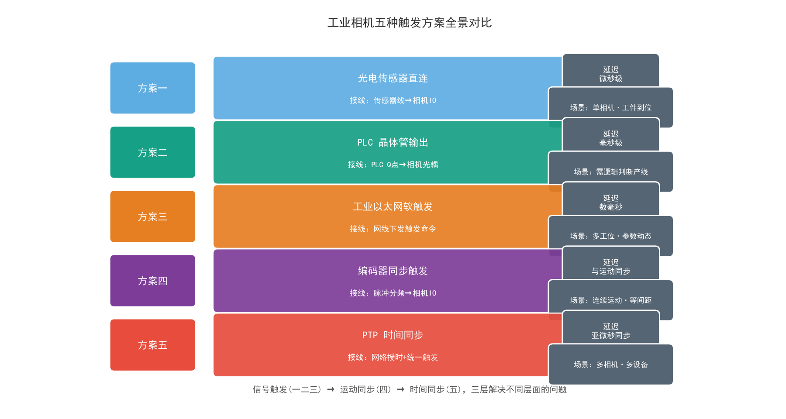
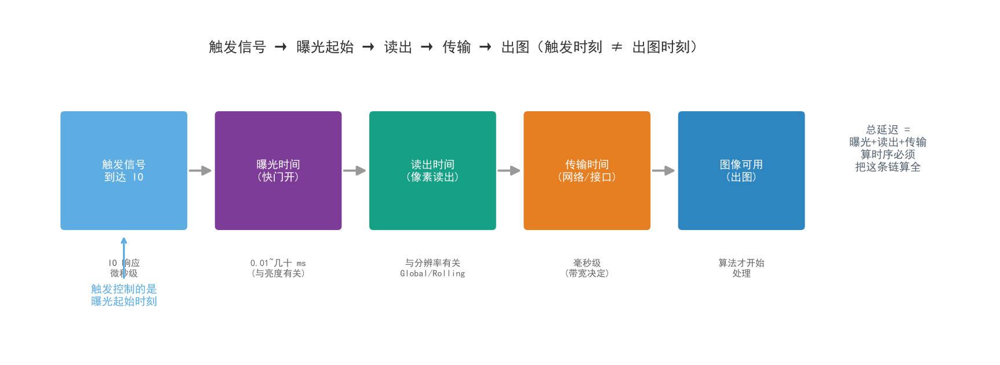
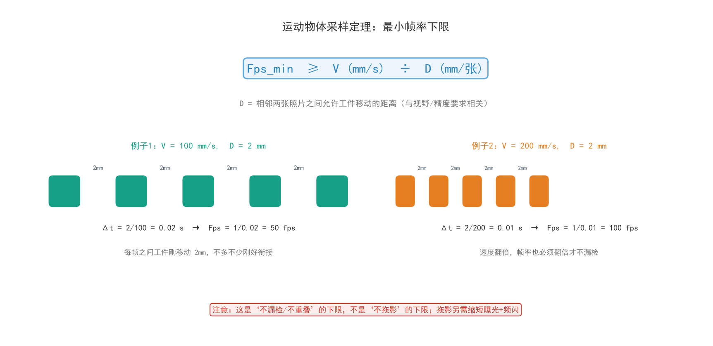
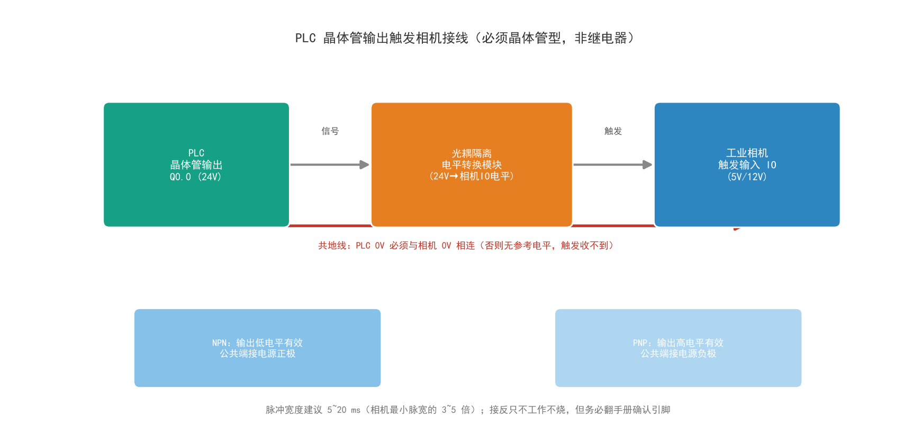
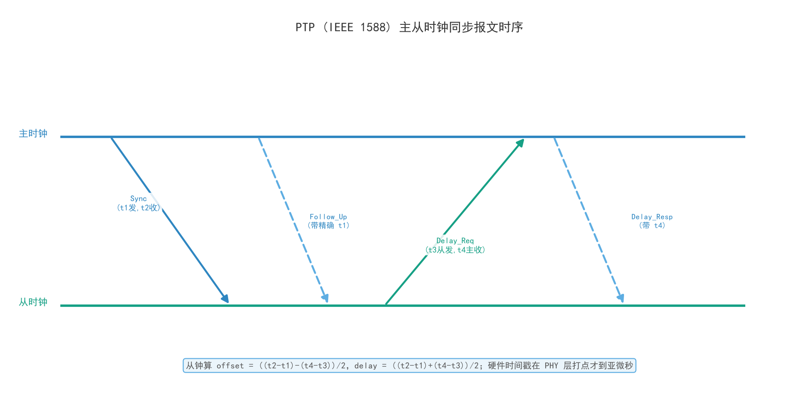

# 06 · PLC 触发相机与帧率计算详解（五种触发方案 + PTP 同步）

> **系列定位**：机器视觉硬件系列第 6 篇。承前：[01 相机详解](./01-工业相机详解.md) 讲了内/外/软/硬触发的概念，本篇把"**触发这件事**"展开到产线级落地——五种可落地的触发方案、接线与配置、帧率下限计算、以及多相机系统的 **PTP 时间同步**。与 [04 网络配置](./04-工业与安防相机局域网网络配置详解.md)、[05 交换机与带宽](./05-交换机与机器视觉网络详解.md) 联动阅读。
>
> **内容来源**：整合 CSDN《工业相机触发模式全解析：PLC信号触发与PTP同步的五种方案》全文，并补充运动物体采样定理（最小帧率计算）与 PTP（IEEE 1588）系统解析。

---

## 0. 一图看全：五种触发方案全景

| 方案编号 | 触发源 | 接线方式 | 典型延迟 | 适用场景 |
|---|---|---|---|---|
| 方案一 | 光电传感器直接触发 | 传感器信号线接相机 IO | 微秒级 | 单相机、工件到位检测 |
| 方案二 | PLC 晶体管输出触发 | PLC 输出点接相机光耦输入 | 毫秒级 | 需要逻辑判断的产线 |
| 方案三 | PLC 通过工业以太网软触发 | 网线传输触发命令 | 数毫秒 | 多工位、参数需动态调整 |
| 方案四 | 编码器同步触发 | 编码器脉冲分频后接相机 | 与运动同步 | 连续运动、等间距拍摄 |
| 方案五 | PTP 同步触发 | 网络时间同步 + 统一触发 | 亚微秒级同步 | 多相机、多设备协同 |

表中延迟数据是**量级参考**，实际值跟具体硬件型号关系很大。方案一到方案三属于"**信号触发**"范畴，方案四属于"**运动同步**"范畴，方案五属于"**时间同步**"范畴——三者解决的不是同一个层面的问题，选型时先想清楚你的核心矛盾是什么。

---

## 1. 触发模式到底在解决什么问题

### 1.1 自由运行与触发的本质区别

工业相机最基础的采集方式叫 **自由运行（Free Run）**，也就是相机自己按设定的帧率不停地拍，拍到什么算什么。这种方式在监控场景里没问题，但在工业检测里几乎不能用。原因很直接：产线上的工件是运动的，你需要在工件到达相机视野正中央的那一刻拍照，早一点晚一点，图像里的工件位置就偏了，后续的测量、定位、缺陷检测全部会受影响。

触发模式要解决的核心问题就是 **让相机在正确的时间点曝光**。这个"正确的时间点"来自外部信号，可能是光电传感器检测到工件到位，可能是 PLC 发出的一个脉冲，也可能是整个系统统一的时间基准。相机收到这个信号之后，才执行一次曝光和读出。

这里有个概念需要先厘清：触发信号控制的是 **曝光起始时刻**，不是读出时刻。很多人调试时会混淆这两者，以为发了触发信号相机就立刻出图，实际上从触发到图像传输完成，中间有 **曝光时间、读出时间、传输时间** 这几段延迟。理解这个链路，后面算时序才不会出错。

### 1.2 选型前必须问自己的三个问题

项目启动阶段一定确认这三件事，任何一个没想清楚，后面都可能返工：

1. **触发精度要求是多少？** 如果工件运动速度是 0.5 m/s，允许的位置误差是 1 mm，那时间精度要求就是 2 ms，PLC 输出触发完全够用。但如果允许误差是 0.05 mm，时间精度就要到 100 μs，PLC 的扫描周期就成了瓶颈，得考虑硬件触发或编码器方案。
2. **触发信号和相机之间的距离有多远？** 几米以内，普通 IO 线就能搞定；几十米的话，信号衰减和干扰问题就出来了，走网络触发反而更稳。
3. **系统里有没有多台设备需要协同？** 单相机单 PLC，方案二就够了。但如果产线两端各有一台相机，要求它们在同一时刻曝光，那就必须上 PTP——否则两台相机的时间基准不一致，图像对不上。

### 1.3 ⭐ 运动物体采样定理：最小帧率下限（核心公式）

在讲具体方案之前，先解决一个所有运动拍摄场景都绕不开的计算：**相机帧率至少要多快，才能不漏拍？**

设产线速度为 `V (mm/s)`，要求相邻两张照片之间工件最多移动 `D (mm)`（D 由视野/精度要求决定，比如两张间隔 2 mm），则：

$$\text{最小帧率 } Fps_{min} \geq \frac{V \ (\text{mm/s})}{D \ (\text{mm})}$$

**例子 1：输送速度 V = 100 mm/s**

两张间隔 2 mm，时间间隔 Δt = 2 / 100 = 0.02 s，最小帧率 = 1 / 0.02 = **50 fps**。

含义：每秒拍 50 张，每帧之间工件移动 2 mm，刚好满足两张间隔 2 mm。

**例子 2：V = 200 mm/s**

Δt = 2/200 = 0.01 s → 帧率 ≥ **100 fps**。

> **公式（速记）**：**最小帧率 Fps ≥ V (mm/s) ÷ 2 (mm)**（D=2 mm 时代入即得）
>
> 速度翻倍，帧率也必须翻倍才不漏检。

两个容易混淆的"下限"，注意区分：

- **不漏检/不重叠的下限** = 本节公式（帧率维度）；
- **不拖影的下限** = 曝光维度：模糊量 = V × 曝光时间。V=1000 mm/s、曝光 1 ms 时拖影 1 mm，精密检测不可接受——需缩短曝光 + 频闪光源补光（见 4.4 节）。

帧率够不上的出路：降低分辨率提帧率、开 ROI（[02 篇](./02-工业相机曝光增益帧率与参数下发详解.md)）、换更高帧率相机，或用方案四让"每张都拍在预定位置"。

---

## 2. 方案一与方案二：从传感器直连到 PLC 逻辑触发

### 2.1 光电传感器直连相机的接线细节

这是最朴素的方案：光电传感器检测到工件，输出一个开关信号，直接接到相机的触发输入引脚。相机的 IO 接口通常是**光耦隔离输入**，需要一定的驱动电流，一般是 5～15 mA。接线时要注意传感器的输出类型，**NPN 和 PNP 接法完全不同**：

- **NPN** 传感器输出低电平有效信号：传感器输出接相机触发输入，相机输入的公共端接**电源正极**；
- **PNP** 传感器输出高电平有效：公共端接**电源负极**。

接反了相机收不到触发，但也不会烧，只是不工作——这个错误非常常见。相机端触发输入一般有三根线：触发信号线、公共端、可选电源线。引脚定义每家不同（Basler 常用 Hirose 6pin/12pin，海康多用 12pin 航空插头），接线前一定翻手册确认，不要凭经验猜。

> 💡 **提示**：传感器直连相机时，建议在触发信号线上串联一个 100 Ω 左右的限流电阻，尤其传感器供电电压高于相机 IO 额定电压时。多数相机 IO 有保护，但长期过压会缩短光耦寿命。

优点：延迟极低（传感器响应 + 相机触发响应，通常几十微秒量级）。
缺点：没有任何逻辑处理能力，传感器一响相机就拍——产线干扰导致误触发时，相机会拍到空图。

### 2.2 PLC 晶体管输出触发的完整链路

当产线需要"工件到位 **且** 工位空闲才拍照"这种逻辑判断时，就得让 PLC 当触发源。关键点：**必须用晶体管输出型 PLC，不能用继电器输出型**。

- 继电器输出：响应时间毫秒到十几毫秒，机械触点有寿命限制，频繁触发很快坏；
- 晶体管输出：响应微秒级，适合做触发信号。西门子 S7-1200 的 DC/DC/DC 型号、三菱 FX5U 晶体管输出型、汇川 AM 系列都是常见选择。

接线逻辑：PLC 晶体管输出点（如 Q0.0）→ 相机触发输入正极；PLC 的 0V → 相机触发输入公共负极。PLC 程序里，到位传感器信号与工位空闲信号同时满足时置位 Q0.0，延时几毫秒后复位，形成一个脉冲。

**脉冲宽度很关键**：太窄相机来不及响应，太宽可能触发多次。一般 **5～20 ms** 比较稳妥，具体看相机手册的最小触发脉宽（Basler 通常要求几微秒，但工程上留足余量更安全）。

PLC 程序里建议用 **TON 定时器做脉冲整形**，而不是直接置位/复位：PLC 扫描周期是毫秒级，多个逻辑分支并存时直接置位复位可能导致脉冲宽度不稳定；用 TON 定时器，设定时间到才复位，脉冲宽度就固定了。

### 2.3 光耦隔离与电平匹配的实操要点

PLC 输出是 24 V 电平，相机触发输入通常是 5 V 或 12 V 电平，直接接会烧相机 IO，中间必须做电平转换或隔离：

- **光耦隔离模块**（最省事）：输入端接 PLC 24 V 输出，输出端接相机 IO。选响应时间 < 10 μs 的型号；
- **相机厂商 IO 扩展盒**：内部已做好电平转换和隔离，接线更简单但贵一些；
- 都是 24 V 时可直接接，但**必须共地**：PLC 的 0V 和相机的 0V 连在一起，否则信号没有参考电平，相机收不到有效触发。共地线不能省——只接信号线不接地，调试半天找不到原因；
- 相机 IO 支持宽电压（12～24 V）时可直接接，但仍建议加隔离：产线上感性负载（电磁阀、接触器）的反向电动势可能通过地线串扰到相机。

### 2.4 触发延迟的实测与补偿

PLC 触发方案的延迟三部分：PLC 输出响应 + 光耦模块延迟 + 相机触发响应，合计通常 **1～5 ms**。

低速产线可忽略，高速产线必须补偿，两种方法：

1. **PLC 程序里提前发触发**：根据编码器位置预判工件到达时刻，提前触发（优先推荐——在图像层面就消除偏差，算法不用改；前提是产线速度稳定）；
2. **视觉算法位置补偿**：按延迟 × 产线速度，把检测结果沿运动方向偏移相应距离。

---

## 3. 方案三：走网络的软触发与 PLC 通讯配置

### 3.1 软触发的适用边界

软触发 = 触发命令通过通讯接口发送，而不是硬件 IO。常见接口：GigE Vision、USB3 Vision、Camera Link，其中 **GigE Vision 因布线方便、距离远在产线上用得最多**。

- 优势：不需要额外接线、触发参数可程序动态调整、能同时控制多台相机；
- 劣势：延迟比硬件触发大且**不稳定**——命令要经协议栈打包、网络传输、相机解析，千兆网下一次软触发延迟通常 **2～10 ms**，受网络负载影响波动。

适用：静态检测、低速产线、触发频率很低的场合。

### 3.2 PLC 与相机建立通讯的两种路径

1. **PLC 直接和相机通讯**：PLC 支持 GigE Vision 或厂商提供相机控制库时可实现，但大多数 PLC 不原生支持视觉协议，较少见；
2. **PLC → 上位机 → 相机**（更常见）：PLC 通过 Modbus TCP / Profinet / EtherNet/IP 把触发请求发给上位机软件，上位机调用相机 SDK 发软触发。灵活、可做复杂逻辑，但多一层通讯延迟。

实测案例：西门子 S7-1500 通过 Profinet 连上位机，上位机 C# 调海康 SDK。PLC 发请求到相机曝光全链路 **8～15 ms**；对 0.3 m/s 产线，位置偏差 2～4 mm，算法补偿后可接受。

### 3.3 网络配置中最容易翻车的几个点

相机插上网线连不上，排查顺序：

1. **看网口指示灯**：不亮查网线/交换机端口；亮但连不上查 IP——相机出厂默认 IP 通常在 `192.168.1.x` 或 `169.254.x.x` 网段，电脑网卡必须同网段且掩码一致；
2. **多网卡路由坑**：有线+无线同时开着，路由表默认走无线，访问相机的包发错网卡。解决：禁用无线网卡，或加静态路由把相机网段指向有线网卡；
3. **巨帧（Jumbo Frame）坑**：千兆网传图开巨帧能显著降 CPU 占用和丢包，但必须**相机、网卡、交换机三处同时开启**，缺一处大包就被分片反而出问题。建议调试阶段先不开，通讯稳定后再开（详见 [04 篇](./04-工业与安防相机局域网网络配置详解.md)）。

> ⚠️ **注意**：相机和 PLC 在同一交换机下、PLC 通讯周期又快时，会与图像传输抢带宽。条件允许视觉系统单独用一个交换机，或用支持 VLAN 的交换机做隔离。

### 3.4 软触发的时序稳定性优化

软触发最大的问题是延迟不稳定，优化方向是减少波动：

1. 相机触发模式设为"**触发后立即传输**"，不要"触发后缓存再传输"（后者引入额外缓冲延迟）；
2. 上位机用**高优先级线程**处理触发命令（Windows 不是实时系统，调度有不确定性；要求极高可考虑实时 Linux / RT 内核）；
3. **减少网络其他流量**：视觉网络不跑大流量业务；必须共用则用 QoS 给相机数据流设高优先级；
4. PLC 与上位机通讯也走网络时，把**触发请求和图像传输分到不同网段或 VLAN**。

---

## 4. 方案四：编码器同步触发与运动匹配

### 4.1 编码器触发的工作原理

工件在传送带上连续运动、需要**等间距拍照**时，编码器触发最合适。编码器装在传送带驱动轴上，带子每移动固定距离输出固定数量脉冲；把脉冲**分频**后接相机触发输入，相机就在工件每移动固定距离时拍一张。

核心参数是 **分频系数**。例：编码器每转 2500 脉冲，驱动轴周长 200 mm，则每脉冲对应 0.08 mm 位移。想每 2 mm 拍一张，分频系数 = 2 ÷ 0.08 = **25**，即每 25 个编码器脉冲输出一个相机触发。

分频的两种实现：

| 方式 | 优点 | 缺点 | 适用 |
|---|---|---|---|
| 硬件分频器 | 延迟低、稳定性好 | 参数固定，改起来麻烦 | 脉冲频率 > 50 kHz |
| PLC 高速计数+程序分频 | 灵活 | 受扫描周期限制，高速可能丢脉冲 | < 50 kHz |

### 4.2 编码器信号接入 PLC 高速计数模块

选 PLC 分频时，编码器信号必须接**高速计数模块**，不能用普通输入点——普通输入点响应频率只有几十到几百 Hz，编码器脉冲动辄几千上万 Hz。

PLC 高速计数能力参考：西门子 S7-1200 自带高速计数器到 100 kHz；S7-1500 工艺模块到 1 MHz；三菱 FX5U 高速计数输入到 200 kHz。选型时确认编码器脉冲频率在能力范围内。

接线：编码器通常差分输出（A+/A-/B+/B-），抗干扰强、传输远，推荐；单端输出（A/B）次之。差分信号要接支持差分的输入点，或用差分转单端模块。

程序要点：高速计数器计脉冲，计数值达到分频系数时输出触发脉冲并复位计数器。**复位不能影响计数连续性**——用比较指令而不是中断复位，否则高速时可能丢计数。

### 4.3 运动方向变化时的处理

编码器方案容易被忽略的问题：**传送带反向运动或抖动时，编码器输出反向脉冲，不判方向就会误触发**。

- 用 **A、B 两相判方向**：A 相超前 B 相 90° 为正转，反之为反转。PLC 根据相位关系决定加/减计数，只有正转才触发相机；
- **启停加减速段**：速度不稳定时触发会导致图像间距不均。处理：PLC 里加速度判断，速度稳定在设定值附近才允许触发；或用编码器 **Z 相**（每转一个脉冲）做基准，从 Z 相之后开始计数，保证每次拍照起始位置一致。

### 4.4 编码器触发与频闪光源的配合

编码器触发拍运动物体时，曝光太长会拖影：V=1 m/s、曝光 1 ms → 图像运动模糊 1 mm，精密检测不可接受。

解决：**缩短曝光 + 频闪光源补光**。频闪光源的触发信号与相机触发同步，曝光时光源瞬间点亮、曝光结束光源熄灭——既保证曝光量又缩短有效曝光时间。

频闪光源的触发延迟要和相机曝光起始**对齐**：光源有延迟调节功能就微调；不可调则在 PLC 程序里给光源触发信号加偏移量，让光源提前或延后点亮。

---

## 5. 方案五：PTP 同步在多相机系统中的应用

### 5.1 什么是 PTP（补充详解）

**PTP（Precision Time Protocol，精确时间协议）**，即 **IEEE 1588 标准**，是一种让分布式网络中所有设备的时钟**互相同步到亚微秒级**的网络授时协议。可以把它理解为"网络版的对时系统"，但它比普通对时（NTP）精确几个数量级。

**为什么需要它？** 多相机系统里，每台相机有独立的本地时钟，各自走各自的晶振，几分钟后就会偏差毫秒级。如果两台相机要"同一时刻曝光"（比如立体视觉、多面检测、拼接），时间基准不一致图像就对不上。PTP 的作用就是让全网设备共享**同一个时间基准**。

**PTP 的工作原理（四步报文交互）**：

1. 主时钟周期性发送 **Sync** 报文（从时钟记录收到时刻 t2，主时钟记录发送时刻 t1）；
2. 主时钟通过 **Follow_Up** 报文把精确的 t1 补发给从时钟；
3. 从时钟发送 **Delay_Req**（记录发送时刻 t3），主时钟收到后记录 t4；
4. 主时钟通过 **Delay_Resp** 把 t4 回给从时钟。

从时钟据此算出：

- 链路延迟 `delay = ((t2−t1) + (t4−t3)) / 2`
- 自身偏差 `offset = ((t2−t1) − (t4−t3)) / 2`，然后校正本地时钟。

**硬件时间戳是精度的关键**：

| 时间戳方式 | 打点位置 | 精度 | 说明 |
|---|---|---|---|
| 软件时间戳 | 操作系统/驱动层 | 毫秒级 | 受调度影响，做 PTP 意义不大 |
| 硬件时间戳 | 网卡 PHY 物理层 | 纳秒级 | 报文进出网口的瞬间打点 |

**PTP 设备角色**：

- **普通时钟（OC）**：单网口设备（相机、PLC）；
- **边界时钟（BC）**：多网口交换机，每个端口独立参与 PTP，终结报文再转发；
- **透明时钟（TC）**：交换机转发 PTP 报文时**把自身驻留时间写进报文**，从时钟据此扣除——这是 PTP 交换机与普通交换机的核心区别。

**PTP vs NTP/SNTP 对比**：

| 维度 | PTP (IEEE 1588) | NTP/SNTP |
|---|---|---|
| 同步精度 | 亚微秒（硬件时间戳可到纳秒级） | 毫秒~10 毫秒级 |
| 依赖 | 最好全程硬件支持（PHY/交换机） | 纯软件即可 |
| 报文 | 组播/单播，UDP 319/320 | UDP 123 |
| 典型场景 | 工业同步、多相机、电力、基站 | 日常电脑对时 |

另外还有非网络的 **PPS（秒脉冲）+ ToD** 方案：一根秒脉冲线 + 一条时间报文，精度也高但要单独布线；PTP 的优势正是**复用网线**、不用额外布线。

### 5.2 PTP 授时的基本原理（原文要点）

PTP 的核心思想是让网络中所有设备共享同一个时间基准：主时钟设备周期性发送同步报文，从时钟设备根据报文的收发时间戳计算自己与主时钟的时间偏差，然后调整本地时钟。

要做到亚微秒级同步，需要**硬件支持时间戳**。普通网卡的时间戳在软件层打，受操作系统调度影响，精度只能到毫秒级；支持 PTP 的网卡在物理层打时间戳，精度可到纳秒级。

工业设备支持情况：

- **相机**：Basler ace 系列、海康 MV 系列部分型号支持 PTP；
- **PLC**：西门子 S7-1500、倍福 TwinCAT 系统都支持 PTP。

选型时确认设备支持**硬件时间戳**——只支持软件时间戳的设备做 PTP 意义不大。

### 5.3 多相机同步触发的实现方式

典型架构：选一台设备做**主时钟**（通常 PLC 或专用时钟服务器），其他相机和 PLC 做从时钟；所有设备通过支持 PTP 的交换机连接（交换机要支持 PTP 透传，否则报文驻留时间引入误差）。

同步建立后，PLC 在某个绝对时刻发送触发命令，命令里带一个"**预定触发时间**"——所有相机收到命令后不立即触发，而是**等本地时钟到达预定时间才触发**。由于所有相机时钟已同步，它们会在同一时刻曝光。

理想情况下同步精度可做到 **100 ns 以内**，对绝大多数工业视觉应用远远够用。

### 5.4 PTP 网络配置的实操步骤

按以下顺序配置：

1. **确认所有设备支持 PTP 且固件版本兼容**——不同厂商的 PTP 实现可能有差异，混用要特别小心；
2. **规划网络拓扑**：PTP 对网络结构敏感，建议**星型拓扑**，所有设备接同一台支持 PTP 的交换机；不要级联太多层，每多一层就多一份驻留时间误差；
3. **配置主时钟**：在 PLC 或时钟服务器上启用 PTP 主时钟模式，设置时钟等级和优先级——等级数值越小优先级越高，一般主时钟设为 1 或 2；
4. **配置从时钟**：相机启用 PTP 从时钟模式，设置同步周期（越短精度越高但网络负载越大，一般 1～2 秒一次）；
5. **验证同步状态**：多数设备有状态指示，可看是否同步成功、时间偏差多少。**偏差持续 > 1 μs 就要检查网络配置**。

### 5.5 PTP 同步失败的排查思路

同步不上，通常在这几个地方：

- **交换机不支持 PTP 透传**（最常见）：普通交换机对 PTP 报文一视同仁排队转发，驻留时间不确定，同步精度极差甚至无法同步。换支持 PTP 的交换机或启用透传功能；
- **网络中有其他大流量数据**：PTP 报文很小但网络拥塞时排队延迟增加，影响精度。把 PTP 流量和图像数据流分到不同 VLAN，或 QoS 给 PTP 报文设最高优先级；
- **时钟等级配置冲突**：多个设备都配了主时钟，或等级设置不合理，会出现主时钟选举震荡。确保只有一个主时钟，其他都是从时钟；
- **防火墙拦截 PTP 报文**：PTP 使用 **UDP 端口 319 和 320**，电脑防火墙要放行这两个端口。

---

## 6. 触发方案选型与现场调试经验

### 6.1 按产线速度反推触发方案

选型最实用的方法是从产线速度反推，对照表（经验值，实际还要考虑成本、开发难度、维护便利性）：

| 产线速度 | 允许位置误差 | 时间精度要求 | 推荐方案 |
|---|---|---|---|
| < 0.2 m/s | 1 mm | 5 ms | 方案二或方案三 |
| 0.2～1 m/s | 0.5 mm | 0.5 ms | 方案二加补偿 |
| 1～3 m/s | 0.2 mm | 70 μs | 方案四编码器 |
| > 3 m/s | 0.1 mm | 30 μs | 方案四或方案五 |
| 多相机协同 | 任意 | < 1 μs | 方案五 PTP |

方案五硬件成本最高，但如果产线本身就需要多相机协同，这个投入是值得的。

### 6.2 触发信号质量的实际测量

触发信号质量直接影响稳定性，建议用**示波器**看触发波形（测量点：相机触发输入引脚）：

- 正常波形是**干净方波**，上升/下降沿陡峭，无振铃毛刺。有毛刺可能是信号线太长、没屏蔽、附近有干扰源——缩短线缆、用屏蔽线、加磁环、并联小电容滤波；
- **上升沿太缓** = 驱动能力不足（光耦模块输出驱动有限，线缆电容大时变缓）——换驱动更强的模块或缩短线缆；
- **确认脉冲宽度**：在相机最小脉宽之上，又不能宽到影响下一次触发。建议设在**最小脉宽的 3～5 倍**，留足余量。

### 6.3 常见触发故障的排查链路

相机不触发，按以下顺序排查：

1. **看相机状态**：相机软件里的触发信号计数——计数在增但不出图 = 触发收到但曝光/传输有问题；计数不增 = 触发信号没到相机；
2. **看信号源**：万用表/示波器测信号源输出，确认信号源本身在工作；源正常则问题在线缆或相机 IO；
3. **查线缆**：万用表测通断，确认信号线和共地线都通；中间有接头查松动和氧化；
4. **查配置**：触发模式是否外部触发、触发极性（上升沿/下降沿）是否匹配、触发延迟是否设太大。

实战案例：相机偶尔触发偶尔不触发，换线缆、换传感器都没用，最后发现是 **PLC 程序里触发脉冲的定时器被另一个逻辑分支复位了**，导致脉冲宽度时有时无——这种问题只能靠仔细审查程序逻辑解决。

### 6.4 长期运行稳定性的保障措施

触发系统跑起来不难，难的是长期稳定运行。四件事：

1. **接线端子定期检查紧固**——产线振动导致端子松动、信号时断时续，尤其 PLC 输出端和相机输入端（电流不大但接触电阻要求高）；
2. **触发信号线远离动力线**——至少 20 cm 以上距离，交叉时尽量垂直交叉（动力线电磁干扰会耦合进触发线）；
3. **PLC 程序加触发计数和超时报警**——连续一段时间没触发或频率异常就报警，故障初期发现，避免批量漏检；
4. **定期用示波器复查触发波形**——设备老化（传感器响应变长、屏蔽层磨损）会慢慢影响触发质量，定期复查提前发现隐患。

---

## 7. 速查表与一句话核心要义

### 7.1 速查表

| 主题 | 关键值 / 关键动作 |
|---|---|
| 相机 IO 驱动电流 | 光耦输入 5～15 mA |
| NPN 接法 | 低电平有效，公共端接电源正极 |
| PNP 接法 | 高电平有效，公共端接电源负极 |
| PLC 输出类型 | 必须晶体管型（响应 μs 级），禁用继电器型 |
| 触发脉冲宽度 | 5～20 ms，或相机最小脉宽的 3～5 倍 |
| PLC 触发总延迟 | 1～5 ms（输出+光耦+相机响应） |
| 软触发延迟 | 2～10 ms（千兆网，受负载波动） |
| 最小帧率 | Fps ≥ V ÷ D（如 V=100mm/s、D=2mm → 50fps） |
| 编码器分频 | 分频系数 = 目标间距 ÷ 每脉冲位移 |
| PLC 高速计数能力 | S7-1200 100kHz / S7-1500 工艺模块 1MHz / FX5U 200kHz |
| PTP 标准 | IEEE 1588；UDP 319/320；硬件时间戳才有亚微秒 |
| PTP 同步精度 | 理想 100 ns 以内；偏差持续 >1μs 要查网络 |
| PTP 主时钟等级 | 数值越小优先级越高，主时钟设 1 或 2 |

### 7.2 十大高频坑

1. NPN/PNP 接反——不烧但不工作，白调试半天；
2. 只接信号线不接**共地**——信号没有参考电平；
3. 用**继电器输出型** PLC 做触发——响应慢且触点寿命短；
4. 触发脉冲太窄——低于相机最小脉宽，触发丢失；太宽——重复触发；
5. 24 V 直接怼相机 5 V IO——烧光耦（中间必加光耦/电平转换）；
6. 软触发当硬触发用——2～10 ms 延迟 + 波动，高速产线必翻车；
7. 编码器接普通输入点——几十 Hz 响应跟不上几 kHz 脉冲；
8. 传送带反转/抖动不判向——A/B 相相位判断缺位导致误触发；
9. 巨帧只在相机开——网卡/交换机没开，大包分片反而丢包（三处一致，见 04 篇）；
10. PTP 用普通交换机——无透传功能驻留时间不可控，同步失败或精度极差。

### 7.3 一句话核心要义

**触发方案是在精度、成本、开发难度之间找平衡**：能用硬件触发就不用软触发，能用简单方案就不用复杂方案——每多一个环节就多一个故障点。单相机+PLC 能解决的，没必要上 PTP；反过来产线确实需要多相机协同，PTP 就是绕不过去的选择，早点把网络基础设施（PTP 交换机、硬件时间戳设备）搭好，后面省很多事。而所有运动拍摄的地基，是那条采样公式：**Fps ≥ V ÷ D**——速度翻倍，帧率必须翻倍。

---

## 附：本篇与系列其他篇目的关系

- 想懂"曝光/增益/帧率参数本身" → [02 篇](./02-工业相机曝光增益帧率与参数下发详解.md)
- 想懂"相机怎么接到网络、IP 怎么配、网卡高级属性" → [04 篇](./04-工业与安防相机局域网网络配置详解.md)
- 想懂"带宽够不够、交换机怎么选、多相机怎么分带宽" → [05 篇](./05-交换机与机器视觉网络详解.md)
- 本篇解决"什么时候拍、多台设备怎么拍齐"的问题
