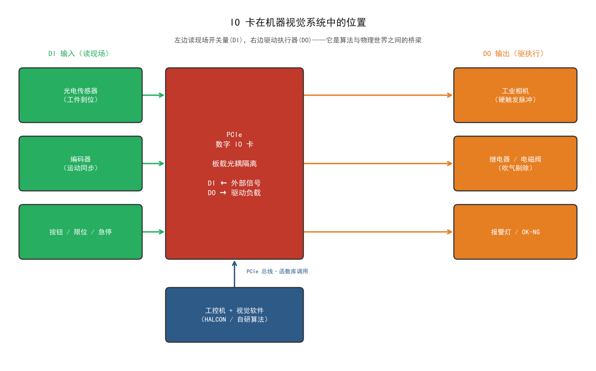
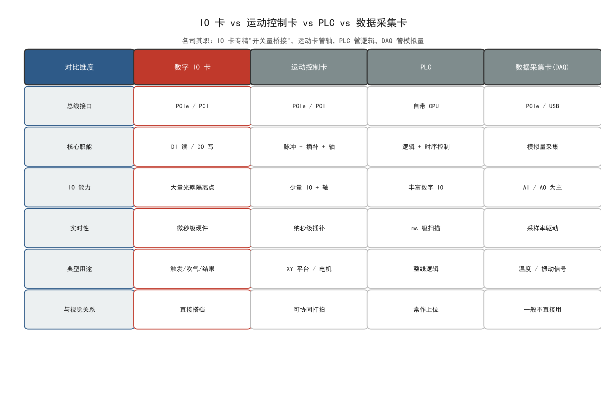
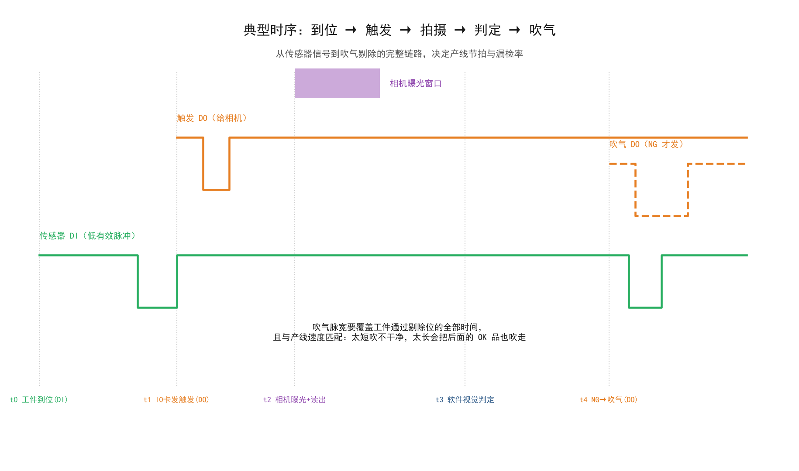
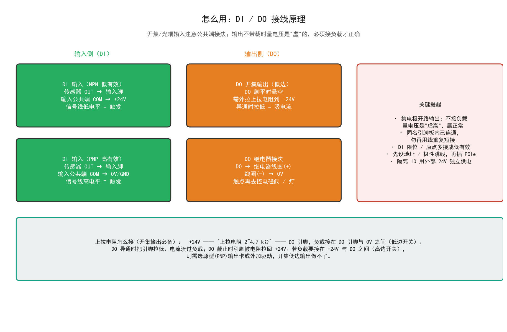
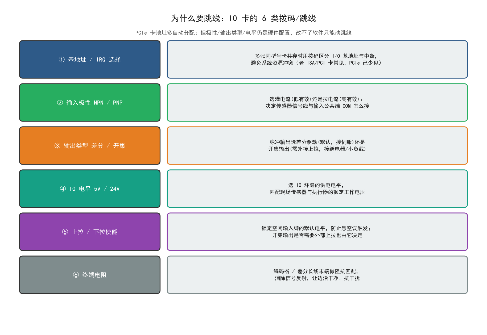
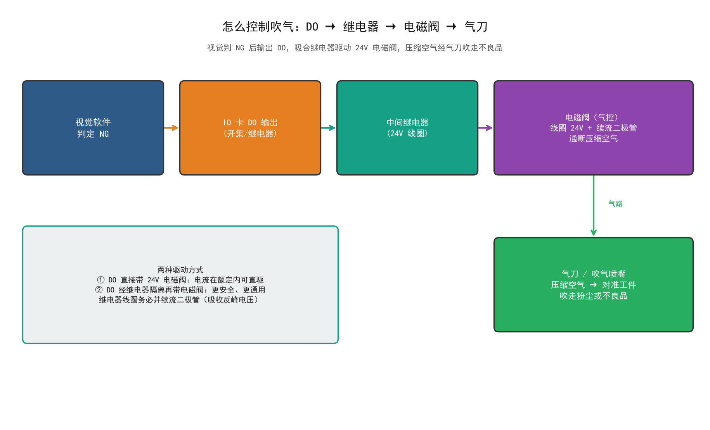

# 07 · IO 卡详解（是什么 · 怎么用 · 跳线 · 吹气控制）

> **系列定位**：机器视觉硬件系列第 7 篇。承前：[01 相机详解](./01-工业相机详解.md) 讲了触发概念，[06 PLC 触发相机](./06-PLC触发相机与帧率计算详解.md) 讲了五种触发方案——但"**夹在传感器、相机、执行器中间的那块卡**"一直没讲，本篇补上。视觉软件判出的每一个 NG，最后都要靠这块卡变成现场的一次吹气。
>
> **名称说明**：常被叫作"PCI IO 卡""数字量 IO 卡""采集卡"。口头的"PCL IO 卡"多半是 **PCI 的笔误**；另一种来源是运动控制卡里常用的 **PCL-5023 运动芯片**（凌华 PCI-8132/8134 等板卡内置），工程师习惯连卡片一起叫"PCL 卡"。本篇按"**PC 内插卡式数字 IO**"讲，运动控制卡、PLC 的 IO 部分原理完全通用。

---

## 0. 一图看全



先把你最关心的五个问题一口气答完，后面逐节展开：

| 问题 | 一句话回答 |
|---|---|
| **是什么** | 插在工控机 PCI/PCIe 槽上的**数字量输入输出卡**：对外提供一批光耦隔离的 DI（读开关量）和 DO（驱动负载） |
| **用来做什么** | 相机硬触发、输出 OK/NG 结果、**控制吹气/剔除**、读到位传感器/按钮/急停 |
| **怎么用** | 插卡 → 接外部 24V → 装驱动 → 调厂商函数库 `read/write` → 按时序发脉冲 |
| **为什么要跳线** | 输入极性（NPN/PNP）、输出类型（差分/开集）、IO 电平等是**硬件行为，驱动软件改不了**，只能上电前用跳线/拨码定死 |
| **怎么控制吹气** | `DO 输出 → 中间继电器 → 24V 电磁阀 → 气刀/喷嘴`，NG 才发一个**宽度算好的脉冲** |

---

## 1. 是什么：IO 卡到底是什么

### 1.1 本质：PC 与物理世界之间的"电压翻译官"

计算机内部只有 0 和 1，现场却全是**真实的电压和电流**：传感器输出 24V 高电平、电磁阀线圈要吃 200 mA、相机触发脚要一个 10 μs 的脉冲。IO 卡干的就是两件事：

- **DI（Digital Input，数字输入）**：把现场的高/低电平"读进来"，变成软件里的 0/1；
- **DO（Digital Output，数字输出）**：把软件里的 0/1"写出去"，变成能驱动负载的电平。

它和显卡、网卡一样是插在主板总线（PCI/PCIe）上的板卡，由驱动程序映射成一段 I/O 地址或内存，函数库一条 `write` 就能改变某个引脚的电平。因为现场环境充满干扰和大电压，IO 卡的每个通道都用**光耦（光电耦合器）隔离**——两侧电路不共地，只靠光传信号，耐压通常 2500 Vrms，现场串进再大的共模干扰也烧不到电脑主板。

### 1.2 一张卡的物理构成

拿到一张典型的 IO 卡，你会看到四个部分：

1. **金手指（总线接口）**：PCI 或 PCIe 边缘插头，插进工控机对应插槽，负责与 CPU 通信；
2. **接线端子**：一排排螺丝端子或 DB37/SCSI-100 插座，丝印着 `DI0~DI15、DO0~DO7、COM、EXTGND、EXTPWR` 等编号；
3. **跳线/拨码开关**：几组小跳线帽（Jumper）和拨码开关（DIP Switch），本篇第 4 节的主角；
4. **外部电源端子（EXTPWR/EXTGND）**：隔离侧的光耦和输出驱动需要**独立的 +24V** 供电——不能只靠主板，这是新手最容易漏接的一根线。

### 1.3 常见规格参数（选型看这几行就够）

| 参数 | 典型值 | 说明 |
|---|---|---|
| 通道数 | DI 16/32/64，DO 16/32/64 | 按工位数 + 20% 余量选 |
| 输入电压 | 5~24 VDC 或 24~48 VDC | 要和现场传感器电平一致 |
| 输出类型 | 集电极开路 / 晶体管 / 继电器 | 开集最常见，继电器带载最强 |
| 每点驱动能力 | 30~500 mA | **直接决定能不能带电磁阀**（见 5.3） |
| 隔离方式 | 光耦，2500 Vrms | 干扰场合的生命线 |
| 响应时间 | 输出 μs 级、输入 μs~ms 级 | 相机硬触发选 μs 级 |
| 中断/定时 | 支持 DI 中断、定时输出 | 到位即触发不占 CPU 轮询 |

### 1.4 和"近亲"们的区别

现场容易被搞混的四类卡，职责完全不同，别买错：



- **数字 IO 卡**：只管开关量的进出，专精"桥接"，是机器视觉的直接搭档；
- **运动控制卡**：核心是发脉冲控制电机轴（定位、插补），附带少量 IO，做 XY 平台飞拍时用它代替 IO 卡也常见；
- **PLC**：自带 CPU 的逻辑控制器，扫描周期 ms 级，适合整线逻辑；视觉工位要求 μs 级触发时，IO 卡比 PLC 输出点更干脆；
- **数据采集卡（DAQ）**：主攻模拟量（温度、振动、应变），和视觉触发基本不搭界。

一句话：**要做视觉触发和吹气剔除，买纯 IO 卡；要同时控电机，买运动控制卡顺便用它的 IO。**

---

## 2. 用来做什么：机器视觉里的四大角色

### 2.1 角色一：触发相机（最常见）

工件到位 → 传感器信号进 DI → IO 卡（或直接由传感器）给相机一个硬触发脉冲 → 相机曝光。相比 PLC 输出点或软触发，IO 卡的优势是**响应快（μs 级）、抖动小、不占网络**。触发链路与延迟拆解见 [06 篇](./06-PLC触发相机与帧率计算详解.md)。

### 2.2 角色二：输出检测结果

视觉软件判定 OK/NG 后，把结果写到一个 DO 上：OK 点亮绿灯、NG 触发剔除。下游 PLC 或剔除机构只认这个电平，**视觉系统和整线逻辑就此解耦**——PLC 不需要懂算法，算法不需要懂产线。

### 2.3 角色三：控制执行器（吹气、剔除、报警）

这是本篇第 5 节的重点：电磁阀吹气、气缸推料、声光报警，全是 DO 驱动的负载。

### 2.4 角色四：读取现场状态

按钮、限位开关、急停、手动/自动切换旋钮……这些状态进 DI，视觉程序就能"知道现场"：比如自动模式下才允许触发检测，急停按下时立刻停止吹气输出。

### 2.5 一条完整的产线时序

把这四个角色串起来，就是一条检测线的完整心跳：



读图要点：

- **t0**：工件到位，传感器 DI 有效（图上画的是低有效脉冲）；
- **t1**：IO 卡立刻发出触发 DO 给相机——这一步走硬件，延迟微秒级；
- **t2**：相机曝光 + 读出，图像经网线进 PC；
- **t3**：视觉算法判定，耗时取决于算法复杂度（几 ms 到几十 ms）；
- **t4**：判定 NG 才发吹气 DO——注意图上后半段传感器又有一次脉冲，那是**下一个工件**到了，所以吹气脉宽必须算准，别把人家吹跑了。

---

## 3. 怎么用：从插卡到发出第一个脉冲

### 3.1 硬件安装五步

1. **先跳线后插卡**：地址、极性、输出类型的跳线/拨码要在**断电状态**下设好（为什么见第 4 节）；
2. **插卡**：关机断电，打开工控机箱，插入空闲 PCI/PCIe 插槽并固定挡板螺丝；金手指氧化时用橡皮擦擦一遍再插；
3. **接外部 24V**：`EXTPWR → +24V`、`EXTGND → 0V`，给隔离侧光耦和输出驱动供电——**不接这根线，DI 读不到、DO 输不出**，是新手第一大坑；
4. **接现场线**：传感器、相机触发、继电器按第 3.3 节的极性规则接到对应端子；
5. **上电验卡**：设备管理器出现新硬件（或问号），装驱动后厂商演示工具里能手动翻转 DO、读到 DI 状态即算成功。

### 3.2 驱动与函数库

每家卡（研华、凌华、固高、雷赛、ADLINK 等）都提供 Windows/Linux 驱动 + 函数库（DLL/.so），C/C++/C#/.NET 直接调用，Python 可用 `ctypes` 包装。API 高度雷同，无外乎四类：

```c
// 伪代码风格，各厂商函数名略有差异，参数语义一致
card = BoardInit(0);                  // 1. 初始化：按卡号/地址打开板卡
SetIoDirection(card, DI_IN, DO_OUT);  // 2. 设方向：哪些脚输入、哪些输出
val = ReadDiChannel(card, 3);         // 3. 读 DI：第 3 路输入当前 0/1
WriteDoChannel(card, 0, 1);           // 4. 写 DO：第 0 路输出置 1（驱动负载）
Sleep(200);                           //    保持 200 ms（吹气脉宽）
WriteDoChannel(card, 0, 0);           //    拉低，吹气结束
BoardClose(card);                     // 5. 释放
```

工程上通常会再封一层：把"读 DI 触发 → 采集 → 判定 → 写 DO 吹气"做成一个**带超时和状态机的循环**，而不是线性脚本，防止卡料时程序堵死。

### 3.3 接线原理：极性决定接法



记两组规则就够了：

**DI 输入侧（跟 NPN/PNP 传感器配对）：**

| 传感器类型 | 有效电平 | 输入公共端 COM 接 | 口诀 |
|---|---|---|---|
| NPN（灌电流） | 低电平有效 | **+24V** | NPN，COM 接正 |
| PNP（拉电流） | 高电平有效 | **0V / GND** | PNP，COM 接负 |

接反了不烧东西，但永远读不到信号——排查 DI 不通时先查这个。

**DO 输出侧（开集输出是主流）：**

- 集电极开路（Open Collector）输出**不带负载时量电压是"虚高"的**，属正常现象，不代表坏了；
- 小负载（指示灯、小继电器）可经上拉电阻直驱；大负载（电磁阀、气缸阀）一律走继电器中转；
- 板卡上**同名引脚内部是连通的**（比如多个 `EXTPWR` 其实是同一点），接任意一个即可，不要再用线把它们短接一遍。

### 3.4 调试检查单

按顺序逐项打勾，90% 的"卡不工作"都能在这张单里找到：

1. 外部 24V 是否接好、极性是否对？（最常见）
2. 跳线极性与传感器类型（NPN/PNP）是否匹配？
3. 驱动装了吗？设备管理器里有没有报错感叹号？
4. 厂商演示工具里手动翻转 DO，万用表/负载有没有反应？
5. DI 短接 COM 试验：手动模拟有效电平，软件能读到吗？
6. 中断冲突/资源冲突：BIOS 里关掉板载串并口释放 IRQ（老平台）。

---

## 4. 为什么要跳线：硬件行为必须在"出生时"定死

### 4.1 跳线解决什么问题

驱动软件能改的只有"往哪个地址读写数据"；而**电路层面的行为**——这个脚是灌电流还是拉电流、这路输出是差分还是开集、整个 IO 环路用 5V 还是 24V——是由板上的物理连线决定的。这些行为必须在上电那一刻就正确，所以出厂时留一组跳线帽/拨码让使用者配置。**软件改不了的东西，才需要跳线。** 反过来讲：跳线拨错，装什么驱动都没用。

另一类原因是**资源协调**：一张工控机里插两张同型号卡时，它们的 I/O 基地址和中断号会撞车，靠拨码开关错开；老 ISA/PCI 时代这是必修课，PCIe 即插即用后已大幅减少，但工业上仍能遇到。

### 4.2 六类跳线全景



按出现频率排序，前两类是视觉工程师天天要碰的：

| 跳线 | 不设/设错的后果 |
|---|---|
| ① 基地址 / IRQ | 双卡冲突：系统认不到卡或开机异常 |
| ② 输入极性 NPN/PNP | DI 永远读不到有效电平 |
| ③ 输出类型 差分/开集 | 伺服不转 / 继电器不吸合 |
| ④ IO 电平 5V/24V | 24V 传感器接 5V 环路读不到，反向可能损坏 |
| ⑤ 上拉/下拉 | 输入悬空乱跳、误触发 |
| ⑥ 终端电阻 | 编码器长线信号反射、边沿振铃、计数丢步 |

### 4.3 重点展开：灌电流与拉电流（NPN/PNP 的本质）

这是跳线 ② 背后的原理，值得单独讲透：

- **NPN 传感器 = 灌电流（Sink）**：传感器导通时把输出线**拉向 0V**，电流从外部电源经负载"灌进"传感器。因此输入回路的高电平端（COM）必须接 **+24V**，信号线被拉低时电流流过光耦，判定"有效"。
- **PNP 传感器 = 拉电流（Source）**：传感器导通时把输出线**顶到 +24V**，电流从传感器"拉出"流进负载。输入回路的 COM 接 **0V**，信号线被顶高时导通。

一句话记忆：**看电流往哪流——NPN 往里灌，COM 接正；PNP 往外拉，COM 接负。** 日系/台系设备 NPN 多，欧系 PNP 多，拿到传感器先翻铭牌确认输出型式，再决定跳线和接线。

### 4.4 跳线操作守则

1. **断电操作**——带电插拔跳线轻则配置无效，重则短路烧卡；
2. 动手前**拍照记录出厂默认位置**，改错了有底可回；
3. 一次只改一组跳线，改完通电验证，不要一次全动；
4. 以**卡片丝印和手册为准**，不同型号 J1 含义可能完全不同，别跨型号抄经验；
5. 拨码开关用塑料笔尖拨，别用金属镊子斜着撬。

---

## 5. 怎么控制吹气（重点）

### 5.1 吹气在产线上的两种用途

| 用途 | 触发逻辑 | 脉冲特点 |
|---|---|---|
| **清洁吹气** | 周期性 / 每次拍照前 | 定时短脉冲，目的是吹掉工件或镜头上的粉尘，保证成像质量 |
| **剔除吹气** | 视觉判 NG 后 | 脉宽必须覆盖工件通过剔除位的全部时间，把不良品吹离主线 |

两种用途用的气路硬件一样，差别全在**什么时候吹、吹多久**——这恰恰是 IO 卡 + 软件时序来定义的。

### 5.2 控制回路链条



信号与气路两条链：

- **电信号链**：视觉软件判 NG → `WriteDoChannel` 置 1 → 继电器线圈得电吸合 → 电磁阀线圈回路导通；
- **气路链**：空压机 → 气源处理三联件（过滤 + 减压 + 油雾）→ 电磁阀 → 气刀/喷嘴 → 对准工件吹。

电磁阀是"电控气"的开关：线圈一通电，阀芯切换，压缩空气放行；断电复位，气路切断。所以 **DO 控制的其实是"阀"，真正吹东西的是气**——气压不稳、气源含水，再准的电信号也吹不干净。

### 5.3 直驱还是走继电器？算一笔电流账

能不能用 DO 直接驱动电磁阀，只看一个数：**阀线圈电流 vs DO 每点驱动能力**。

- 典型 24V 电磁阀线圈功率 2~5 W → 电流 ≈ 80~210 mA；
- 典型 IO 卡开集输出每点驱动 30~100 mA（部分高驱动型号可达 500 mA）。

**结论：多数情况 DO 直驱带不动或贴着极限，走中间继电器最稳。** 继电器线圈电流只有几十 mA，DO 轻松吸合；大电流由继电器触点承担，还顺带把现场感性负载和板卡隔离开。必须直驱时，选 DO 为"继电器输出型"或高驱动晶体管型，并核对持续电流余量 ≥ 2 倍。

**续流二极管必加**：继电器线圈和电磁阀线圈都是感性负载，断电瞬间会产生数百伏的反峰电压，足以击穿 DO 输出管。在线圈两端反向并联一只二极管（如 1N4007，负极接电源正端），把反峰泄放掉——几毛钱的元件，省一次整卡报废。

### 5.4 吹气时序与脉宽计算

剔除吹气最考验计算，核心是三个量：

**① 吹气延时（什么时候开始吹）**

工件在相机处被判定后，还要沿传送带走到剔除位。设相机到剔除位的距离 `L (mm)`、产线速度 `V (mm/s)`、视觉处理耗时 `t_proc (s)`、信号链延迟 `t_sig (s)`：

$$t_{delay} = \frac{L}{V} - t_{proc} - t_{sig}$$

例：L = 300 mm，V = 200 mm/s，t_proc = 0.08 s，t_sig ≈ 0.005 s →
t_delay = 1.5 − 0.08 − 0.005 ≈ **1.42 s**——判定完成后延时 1.42 s 才发吹气 DO。

**② 吹气脉宽（吹多久）**

工件长度 `W (mm)`，要让整个工件都处在气流覆盖期内：

$$t_{pulse} \geq \frac{W}{V} + \text{余量}$$

例：W = 50 mm，V = 200 mm/s → 0.25 s，取 0.3 s。

**③ 与相邻工件的间隔校验**

节拍间隔 `T = 工件间距 / V`。要求 `t_delay + t_pulse < T`，否则气还没停、下一个（可能是 OK 品）工件已经到了剔除位——这就是时序图里"别把下一个吹走"的定量版本。不满足时的出路：加剔除位与相机的距离（增大 L）、提高气压缩短脉宽、或改用"分道剔除"。

软件实现上，延时用**硬件定时器或高速输出指令**，不要用 `Sleep` 轮询凑数——秒级延时凑合，毫秒级精度 Sleep 不可靠。

### 5.5 吹气常见坑

1. **带载量电压**：开集 DO 不接负载量出来是虚高，别据此判断输出坏了；
2. **忘加续流二极管**：短期内没事，某天 DO 通道莫名失效，多半是反峰击穿；
3. **气源不处理**：压缩空气含水含油，喷到镜头/工件上反而制造缺陷，三联件不能省；
4. **气压与脉宽不匹配**：气压低吹不动却怪程序；先定气压（常见 0.4~0.6 MPa），再调脉宽；
5. **吹气扰动相邻工位**：剔除位气流会吹到旁边相机视野，必要时加导流罩或错开拍摄时刻；
6. **急停没连到吹气回路**：急停时 DO 必须立刻拉低（硬件连线或软件第一时间清输出），否则停线了还在喷气。

---

## 6. 与其它章节的关联

| 关联篇 | 关系 |
|---|---|
| [01 工业相机详解](./01-工业相机详解.md) | 相机 IO 接口（光耦输入）是触发信号的"终点"，本篇是"起点" |
| [06 PLC 触发相机](./06-PLC触发相机与帧率计算详解.md) | 五种触发方案中，IO 卡是方案一/二的落地载体；NPN/PNP 共地要点同源 |
| [04/05 网络与交换机](./04-工业与安防相机局域网网络配置详解.md) | 千兆网相机走网线传图，但触发与剔除仍走 IO 卡——"网络传数据，IO 传事件" |
| HALCON `read_io_channel`/`write_io_channel` | HALCON 自带 IO 算子可直接对接部分板卡，见 24-System(上) 章节总结 |

---

## 7. 速查表

**选型四问**：通道数够吗（+20% 余量）？DO 驱动能力带得动负载吗？输入电平和传感器一致吗？响应时间是 μs 级吗？

**安装五步**：跳线 → 插卡 → 外部 24V → 接线 → 装驱动验证。

**接线口诀**：NPN 灌电流 COM 接正，PNP 拉电流 COM 接负；开集输出必须带载/上拉；大负载走继电器；线圈并续流二极管。

**吹气三算**：延时 `L/V − t_proc − t_sig`；脉宽 `W/V + 余量`；校验 `延时 + 脉宽 < 节拍`。

## 8. 十大坑速览

1. 外部 24V 没接 → DI/DO 全部无反应；
2. NPN/PNP 极性接反或跳线不对 → 永远读不到输入；
3. 开集输出不带载量电压 → 误判板卡损坏；
4. 同名引脚重复短接 → 人为制造短路；
5. 直驱电磁阀超 DO 电流 → 烧输出通道；
6. 线圈没并续流二极管 → 反峰击穿输出管；
7. 跳线带电操作 → 配置无效甚至短路；
8. 吹气脉宽没算节拍 → 把下一个 OK 品吹走；
9. 气源不过三联件 → 水油污染镜头工件；
10. 急停不联动吹气 → 停线还在喷气。

## 9. 一句话核心要义

> **IO 卡是把"软件里的 0/1"翻译成"现场的真电压"的翻译官：DI 读现场，DO 驱执行；跳线定死软件改不了的硬件行为；吹气 = DO 算好延时与脉宽的脉冲，经继电器和电磁阀，变成对准不良品的一口气。**
