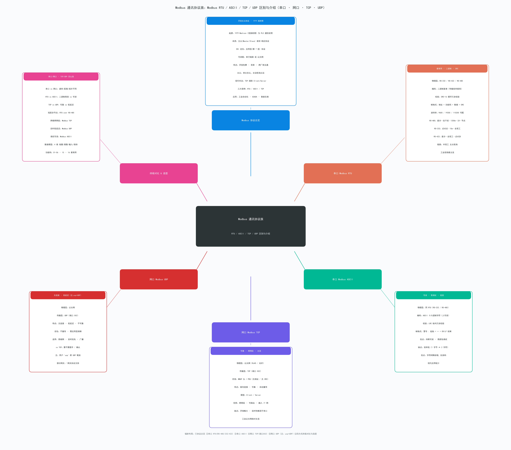

# Modbus 通讯协议族 · RTU / ASCII / TCP / UDP 区别与介绍

> 一张聚焦 **「Modbus 通讯方式全对比」** 的辐射式思维导图，覆盖 **串口（RTU/ASCII）** 与 **网口（TCP/UDP）** 全部主流通讯方式，
> 并对 **串口 vs 网口、TCP vs UDP、RTU vs ASCII** 做终极对比。
>
> （注：图中"ucp"= UDP 笔误，已在 UDP 分支标注更正）

---

## 一句话结论

> **Modbus 是 1979 年施耐德（Modicon）发明的「主从请求-响应」应用层协议，本身只规定"帧格式与功能码"，物理承载可走「串口（RS-232/422/485）」或「网口（以太网）」；串口端有 RTU（最常用）与 ASCII（可读）两种帧，网口端有 TCP（可靠主流）与 UDP（无连接低延迟）两种传输。**

---

## Modbus 四大变种 · 一图速览

| 变种 | 物理层 | 传输层 | 编码 | 校验 | 端口 | 现状 |
| --- | --- | --- | --- | --- | --- | --- |
| Modbus RTU | RS-232 / 422 / 485（串口） | 串行 UART | 二进制紧凑 | CRC-16 | — | 工业现场最主流 |
| Modbus ASCII | RS-232 / 485（串口） | 串行 UART | ASCII 十六进制 | LRC | — | 调试可读，逐渐少用 |
| Modbus TCP | 以太网（RJ45 / 光纤） | TCP | MBAP 头 + 二进制 PDU | 无（TCP 自带） | 502 | 工业以太网绝对主流 |
| Modbus UDP | 以太网 | UDP | 同 TCP（MBAP+PDU） | 无（UDP 不保） | 502 | 非标准但部分网关支持 |

---

## 串口 Modbus RTU（最常用）

| 要点 | 内容 |
| --- | --- |
| 物理层 | RS-232 / RS-422 / RS-485 三种串行接口（RS-485 工业最常用） |
| 编码 | 二进制紧凑，传输效率最高 |
| 校验 | CRC-16（循环冗余校验） |
| 帧格式 | [从站地址 1B][功能码 1B][数据 N B][CRC 2B]，3.5 字符静默间隔 |
| 典型波特率 | 9600 / 19200 / 115200 可配 |
| RS-485 特性 | 差分信号 · 抗干扰强 · 最远 1200 m · 一总线 32+ 节点 · 半双工 |
| RS-232 特性 | 单端 · 点对点 · 最远 15 m · 全双工 |
| RS-422 特性 | 差分 · 点对多 · 全双工 |
| 拓扑 | 一主多从，主站轮询（Master / Slave） |
| 应用 | PLC、变频器、传感器、电表 —— 工业现场最主流 |

为什么最常用：RS-485 布线简单、抗干扰、距离远、多节点、成本低，完美匹配工业现场。

---

## 串口 Modbus ASCII（可读、低效）

| 要点 | 内容 |
| --- | --- |
| 物理层 | 同 RTU（RS-232 / 485） |
| 编码 | ASCII 十六进制字符（人眼可读） |
| 校验 | LRC（纵向冗余校验） |
| 帧格式 | : + [地址 2字符][功能码 2字符][数据…][LRC 2字符] + CR LF |
| 优点 | 肉眼 / 串口工具可读 · 抓包调试方便 · 字符间隔容错 |
| 缺点 | 效率低（1 字节 → 2 字符，传输量翻倍） |
| 现状 | 现代工业较少用，仅遗留系统或调试场景 |

---

## 网口 Modbus TCP（可靠、跨网段、主流）

| 要点 | 内容 |
| --- | --- |
| 物理层 | 以太网（RJ45 双绞线 / 光纤） |
| 传输层 | TCP（端口 502） |
| 封装 | MBAP 头（事务 ID + 协议 ID + 长度 + 单元 ID） + PDU |
| PDU | [功能码 1B][数据 N B] —— 无地址字段（地址在 MBAP 单元 ID 中）、无 CRC（TCP 已保证可靠） |
| 特点 | 面向连接 · 可靠 · 自动重传 · 顺序保证 |
| 模型 | Client / Server（替代主从叫法） |
| 优势 | 跨网段 · 可路由 · 融入企业 IT 网 · 易于与上位机/云集成 |
| 缺点 | 握手开销略大 · 实时性略弱于纯串口 |
| 应用 | 工业以太网绝对主流，SCADA / MES / 物联网网关 |

---

## 网口 Modbus UDP（无连接、低延迟）

| 要点 | 内容 |
| --- | --- |
| 物理层 | 以太网 |
| 传输层 | UDP（端口 502） |
| 封装 | 与 TCP 相同（MBAP + PDU） |
| 特点 | 无连接 · 低延迟 · 不可靠（丢包不重传） |
| 适用 | 局域网、实时优先、广播/组播 |
| vs TCP | 不需握手/确认 → 更快；不保证到达 → 需应用层容错 |
| 现状 | 非 Modbus 官方标准，但部分厂商（网关、PLC）支持 |

---

## 终极对比：串口 vs 网口、TCP vs UDP、RTU vs ASCII

### 1. 串口 vs 网口（物理层）

| 维度 | 串口（RS-485） | 网口（以太网） |
| --- | --- | --- |
| 速率 | 几十 kbps ~ 几 Mbps（典型 115.2 kbps） | 10 Mbps / 100 Mbps / 1 Gbps / 10 Gbps |
| 距离 | RS-485 最远 1200 m | 双绞线 100 m；光纤可达 km 级 |
| 拓扑 | 总线（一主多从） | 星型 / 树型（交换机） |
| 节点数 | 32+ 节点 | 数千（IP 寻址） |
| 抗干扰 | RS-485 差分强；RS-232 单端弱 | 工业以太网屏蔽双绞线 / 光纤 |
| 成本 | 低（双绞线 + 收发器） | 中（交换机 + 网线 / 光模块） |
| 实时性 | 极好（确定性强） | 较好（交换机有抖动） |
| 集成 IT | 需网关转换 | 天然融入企业网 / 互联网 |

### 2. TCP vs UDP（传输层，针对网口 Modbus）

| 维度 | Modbus TCP | Modbus UDP |
| --- | --- | --- |
| 连接 | 面向连接（三次握手） | 无连接 |
| 可靠性 | 可靠（重传、顺序、去重） | 不可靠（丢包不重传） |
| 延迟 | 略高（握手/确认开销） | 低延迟 |
| 流量控制 | 有（TCP 滑动窗口） | 无 |
| 头部开销 | 较大（TCP 头 ≥ 20 B） | 小（UDP 头 8 B） |
| 适用 | 跨网段、需可靠、SCADA / MES | 局域网、实时优先、广播 |
| 现状 | 绝对主流 | 边缘场景使用 |

### 3. RTU vs ASCII（串口帧格式）

| 维度 | Modbus RTU | Modbus ASCII |
| --- | --- | --- |
| 编码 | 二进制 | ASCII 十六进制字符 |
| 帧长度 | 紧凑（1 字节 = 8 bit） | 翻倍（1 字节 → 2 字符） |
| 校验 | CRC-16（强） | LRC（弱） |
| 可读性 | 不可读 | 人可读 |
| 帧间隔 | 3.5 字符静默 | 冒号起始 + CR/LF 结束 |
| 效率 | 高 | 低 |
| 现状 | 工业现场绝对主流 | 调试/遗留系统 |

---

## 数据模型 & 功能码（Modbus 4 张表）

Modbus 把设备数据抽象为 4 张"表"，每张表有自己的地址空间和功能码：

| 表名 | 类型 | 访问 | 地址前缀 | 典型功能码 |
| --- | --- | --- | --- | --- |
| 线圈 Coils | 1 bit（布尔） | 读 / 写 | 0xxxx | 01 读 · 05 写单 · 15 写多 |
| 离散输入 Discrete Inputs | 1 bit | 只读 | 1xxxx | 02 读 |
| 输入寄存器 Input Registers | 16 bit | 只读 | 3xxxx | 04 读 |
| 保持寄存器 Holding Registers | 16 bit | 读 / 写 | 4xxxx | 03 读 · 06 写单 · 16 写多 · 23 读/写多 |

最常用的 8 个功能码：01 / 02 / 03 / 04 / 05 / 06 / 15 / 16 —— 覆盖 90% 工业场景。

---

## 选型指南（一张表告诉你该用哪个）

| 场景 | 推荐 |
| --- | --- |
| 现场短距、多节点、抗干扰 | Modbus RTU over RS-485（工业最经典） |
| 跨楼/跨网段、需融入 IT/云 | Modbus TCP（工业以太网主流） |
| 局域网、实时优先、低延迟 | Modbus UDP（非标，特定场景） |
| 调试抓包、需肉眼可读 | Modbus ASCII（仅调试/遗留） |
| 点对点短距老设备 | Modbus RTU over RS-232 |
| 点对多差分长距 | Modbus RTU over RS-422 |

---

## 报文帧结构对比（3 种帧一目了然）

### Modbus RTU 帧
[ 从站地址 1B ][ 功能码 1B ][ 数据 N B ][ CRC-16 2B ]
   0x11          0x03         ...           Lo,Hi

### Modbus ASCII 帧
':' [ 地址 2ch ][ 功能码 2ch ][ 数据 N ch ][ LRC 2ch ] CR LF

### Modbus TCP 帧（MBAP + PDU）
[ 事务ID 2B ][ 协议ID 2B=0x00 ][ 长度 2B ][ 单元ID 1B ][ 功能码 1B ][ 数据 N B ]
                                MBAP 头 7B                 └──── PDU ────┘
注：没有从站地址（单元 ID 取代）、没有 CRC（TCP 链路层已保可靠）。

---

## 思维导图（辐射布局，matplotlib 渲染）

下方 Modbus通讯.png 用 Python + Matplotlib 绘制成 6 族辐射图：中心「Modbus 通讯协议族」，向外 6 张卡片（Modbus 协议总览 / 串口 RTU / 串口 ASCII / 网口 TCP / 网口 UDP / 终极对比与选型），每张卡再外延一个子组列出要点。

---

## 文件清单

| 文件 | 用途 |
| --- | --- |
| Modbus通讯.py | 源文件（Matplotlib 脚本，可改数据后重跑生成图） |
| Modbus通讯.png | 栅格图（高分辨率，含全部 6 族节点） |
| Modbus通讯.svg | 矢量图（浏览器放大无失真） |
| Modbus通讯.md | 本文件（区别对比表 + 详细解析 + 选型） |

---

## 二次编辑

- 改内容：直接编辑 Modbus通讯.py 顶部的 FAMILIES 列表（每族 = 名称 / 颜色 / 子标题 / 要点列表）。
- 改配色：修改 COLOR 字典（6 族：蓝/橙/绿/紫/红/洋红）。
- 改布局：调整 R（辐射半径）、LBL_W/LBL_H（族标签尺寸）、ITEM_H（行距）。
- 重叠修复说明：当子族数 ≥ 6 且内容较长时，脚本会自动按"x 与 y 都不重叠"公式计算径向推进距离（避免斜向族子组压在族标签上）。如需更紧凑可减小 LBL_W 或缩短单行文字。
- 重生成：python Modbus通讯.py → 自动覆盖 .png / .svg。
- 依赖：matplotlib（本仓库用 C:/Users/Administrator/.workbuddy/binaries/python/envs/default/Scripts/python.exe 运行，已含 SimHei 中文字体）。
