# 硬件知识体系 · 关系总览

> 一张覆盖 **PLC（三菱 / 信捷 / FX3U / FX5U）**、**单片机 MCU**、**FPGA**、**开发板**、**树莓派 Raspberry Pi**、**电路板 / PCB**、**电脑主机 PC** 及其横向关系的工业与嵌入式硬件知识体系思维导图。

---

## 一句话核心

> **PCB ⊂ 电路板 ⊂ 开发板**（逐级包含）·**MCU < PLC < PC**（控制力递增）·**顺序 vs 并行 vs 通用**（三种计算范式）·按场景在四类硬件间选型。

---

## 关系速览

| 维度 | 关系 |
| --- | --- |
| 物理层级 | PCB（裸板）→ 焊上元件 → 电路板 → 预焊好芯片的开发板 |
| 树莓派定位 | 搭载 SoC 的**单板计算机**，跑 Linux 的开发板，介于 MCU 与 PC 之间 |
| PLC vs MCU | 同为"逻辑控制器"；PLC 工业级抗干扰 + 梯形图 + 7×24 稳定；MCU 便宜灵活但需自搭外围 |
| FX3U vs FX5U | 同为三菱 FX 系列小型 PLC；FX3U 是第三代经典（RS485 / 梯形图 / 2~3 轴 100kHz）；FX5U 是 iQ-F 旗舰（内置以太网 / ST / CC-Link IE / 4 轴 200kHz） |
| 三菱 vs 信捷 | 三菱日系主流、系列全；信捷国产高性价比、中文软件、本土服务 |
| FPGA vs MCU/PC | FPGA 是**硬件并行**（LUT + 触发器），非冯氏顺序执行；适合高速采集、协议、图像加速 |
| 开发板 vs 电路板 | 开发板 = 焊好芯片、可以直接写程序的电路板 |
| PC 的角色 | 算力最强的上位机，常跑 HALCON 视觉 / 监控系统 |

---

## 思维导图

下方是用 [PlantUML](https://plantuml.com/mindmap-diagram) `mindmap` 语法绘制的详细版（8 大族、含子分支与叶子），左右分栏布局，已用 `kroki.io` 渲染为 PNG/SVG。

```plantuml
@startmindmap
top to bottom direction
skinparam backgroundColor #FFFFFF
skinparam shadowing false
skinparam roundCorner 6
skinparam defaultFontSize 10
skinparam nodePadding 3
skinparam boxPadding 3

*[#1565C0] 工业与嵌入式硬件知识体系

**[#1565C0] PLC（三菱/信捷/3U/5U）
***[#1565C0] 三菱 Mitsubishi
**** FX1S / FX1N / FX2N
**** FX3U（见专节）
**** FX5U（见专节）
**** Q 系列（中大型）
**** L 系列（紧凑型）
**** iQ-R / iQ-F（新一代）
***[#1565C0] 信捷 Xinje
**** XD 系列（小型）
**** XL 系列（中型）
**** XC 系列（经济型）
**** 国产高性价比
***[#1565C0] FX3U（三菱小型）
**** 单机 / 小型流水线
**** 梯形图 + 指令表
**** 16~64 点 可扩展
**** RS485/422
**** 2~3 轴 100kHz
***[#1565C0] FX5U（iQ-F 旗舰）
**** 以太网 + 4 轴 200kHz
**** ST 结构化文本
**** CC-Link IE
**** 中小型智能产线
***[#1565C0] PLC 通用概念
**** 循环扫描 输入→执行→输出
**** 梯形图/ST/FBD/SFC
**** 数字/模拟/高速/脉冲
**** 抗干扰/断电保持/7x24

**[#2E7D32] 单片机 MCU
***[#2E7D32] 内核 / 型号
**** 8051 / AVR
**** STM32（Cortex-M）
**** ESP32（WiFi+蓝牙）
***[#2E7D32] CPU+RAM+Flash+外设
***[#2E7D32] C/C++/Arduino
***[#2E7D32] 裸机 / RTOS
***[#2E7D32] 家电 / 传感器节点
***[#2E7D32] 无工业防护

**[#6A1B9A] FPGA
***[#6A1B9A] Xilinx / Intel / Lattice
***[#6A1B9A] LUT + 触发器
***[#6A1B9A] Verilog / VHDL / HLS
***[#6A1B9A] 真并行 / 低延迟
***[#6A1B9A] 采集 / 图像 / 协议

**[#EF6C00] 开发板 Dev Board
***[#EF6C00] 预焊 MCU/SoC 的电路板
***[#EF6C00] Arduino（最易上手）
***[#EF6C00] STM32 Nucleo
***[#EF6C00] 51 / ESP32 开源板
***[#EF6C00] = 带芯片的电路板

left side

**[#00838F] 树莓派 RPi
***[#00838F] 搭载 SoC 的单板机
***[#00838F] Linux（Pi OS）
***[#00838F] GPIO/CSI/HDMI/USB/网
***[#00838F] IoT 网关 / 边缘
***[#00838F] 教学 / 轻量服务
***[#00838F] MCU易用 + PC生态

**[#AD1457] 电路板 / PCB
***[#AD1457] 承载元器件的基板
***[#AD1457] 刚性 / FPC / HDI
***[#AD1457] 裸板→焊元件→板卡
***[#AD1457] 开发板属于电路板
***[#AD1457] PCB = 未焊元件的裸板

**[#455A64] 电脑主机 PC
***[#455A64] CPU+主板+内存+存储
***[#455A64] x86（Intel/AMD）
***[#455A64] 通用 OS
***[#455A64] 算力最强 生态最丰
***[#455A64] 上位机 / HALCON视觉

**[#F9A825] 关系总览
***[#F9A825] PCB→电路板→开发板
***[#F9A825] MCU < PLC < PC
***[#F9A825] 顺序 vs 并行 vs 通用
***[#F9A825] 实时→PLC 并行→FPGA
***[#F9A825] 嵌入→MCU 复杂→PC
***[#F9A825] RPi = MCU与PC之间

@endmindmap
```

---

## 文件清单

| 文件 | 用途 |
| --- | --- |
| `硬件知识体系.puml` | PlantUML 源文件（结构化、可编辑、可在任何 PlantUML 渲染器中打开） |
| `硬件知识体系.svg` | 矢量图（浏览器/IDE 内放大无失真） |
| `硬件知识体系.png` | 栅格图（4096×334，含全部节点，kroki.io 渲染） |
| `硬件知识体系.md` | 本文件（含 markdown 关系速览表 + 内嵌 plantuml 代码块） |

---

## 如何二次编辑

- 想调整节点：直接改 `硬件知识体系.puml`，保存后用任意 PlantUML 工具（VS Code 插件、IntelliJ PlantUML、HTTPS 在线编辑器）实时预览。
- 想换配色：修改每行开头的 `*[#xxxxxx]` / `**[#xxxxxx]` 即可。
- 想换布局：把 `top to bottom direction` 改成 `right to left direction` 即可变成横向辐射。
- 不想本地装 PlantUML：把 `.puml` 内容贴进 <https://www.plantuml.com/plantuml/uml/> 在线渲染。