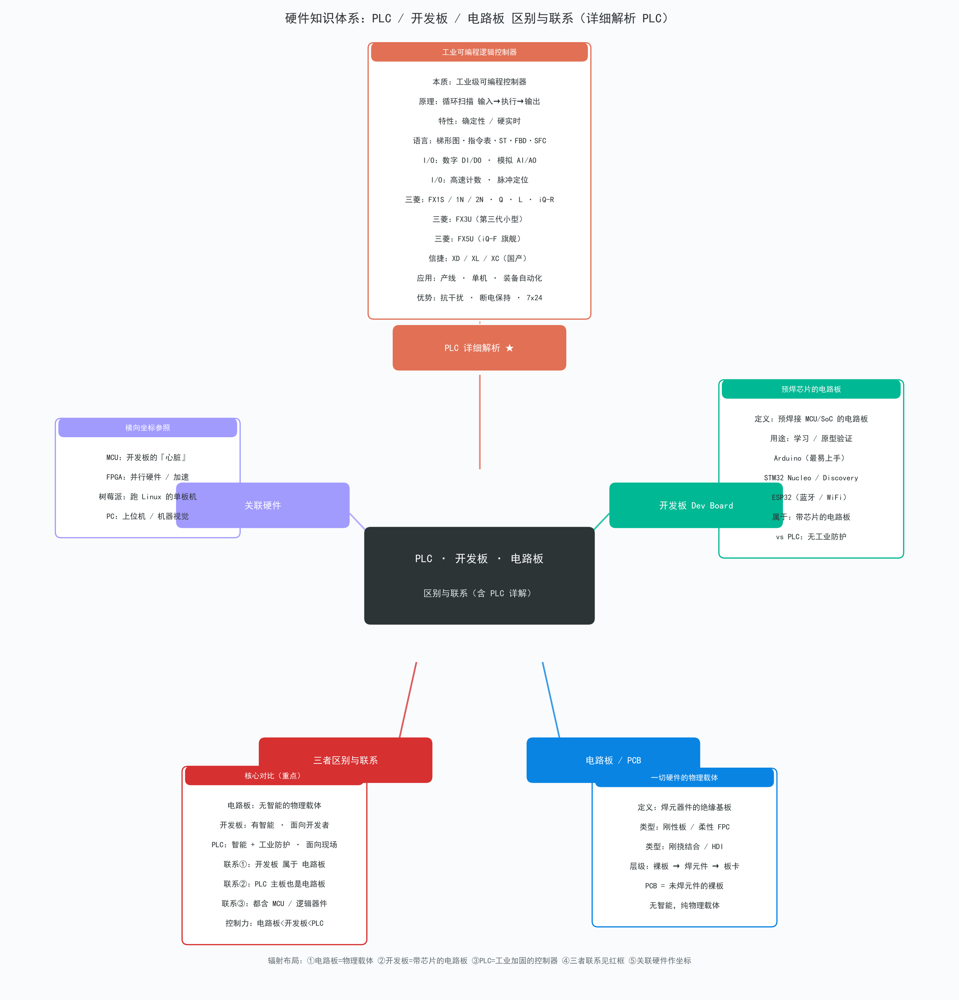

# 硬件知识体系 ・ PLC / 开发板 / 电路板 的区别与联系

> 一张聚焦 **「PLC、开发板、电路板到底有什么区别、又有什么联系」** 的辐射式思维导图，并对 **PLC 做详细解析**（三菱/信捷/3U/5U、原理、语言、I/O、选型）。

---

## 一句话结论

> **电路板是物理载体（无智能）→ 开发板是「焊好芯片的电路板」→ PLC 是「带工业防护与强 I/O 的控制器」**。三者是层层包含、能力递进的关系；开发板与 PLC 本质都是「电路板 + 智能器件」，区别只在**面向谁、用在哪、稳不稳**。

---

## 三者核心区别（横向对比）

| 维度 | 电路板 / PCB | 开发板 Dev Board | PLC |
| --- | --- | --- | --- |
| 本质 | 焊元器件的绝缘基板 | 预焊 MCU/SoC 的电路板 | 工业级可编程控制器 |
| 是否有智能 | ? 无（纯载体） | ? 有（单片机/SoC） | ? 有（CPU + 逻辑器件） |
| 面向使用者 | 硬件工程师 | 开发者 / 学生 | 现场电气工程师 |
| 编程门槛 | 不需编程 | 需 C / 框架 | 梯形图，门槛低、易维护 |
| 工作环境 | 任意 | 实验室 / 原型 | 工业现场（强抗干扰、7×24） |
| 典型 I/O | 无 | 少量 GPIO | 数字/模拟/高速/脉冲/通信 |
| 价格 | 低（裸板） | 中（几十~几百） | 高（千元级起） |
| 包含关系 | ― | ? 电路板 | 主板本身也是电路板 |

**联系**：① 开发板 ? 电路板；② PLC 的主控板也是一块电路板；③ 开发板和 PLC 内部都含 MCU / 逻辑器件。

---

## PLC 详细解析

| 要点 | 内容 |
| --- | --- |
| **本质** | 工业现场可编程逻辑控制器 = 加固的嵌入式控制器 + I/O 模块 + 工业防护 |
| **工作原理** | **循环扫描**：输入采样 → 程序执行 → 输出刷新；**确定性硬实时** |
| **编程语言** | 梯形图 LD / 指令表 IL / 功能块 FBD / 顺序功能 SFC / 结构化文本 ST |
| **I/O 类型** | 数字量 DI/DO ・ 模拟量 AI/AO ・ 高速计数 ・ 脉冲定位 |
| **三菱 Mitsubishi** | FX1S/1N/2N（经典型）・ Q（中大型）・ L（紧凑）・ iQ-R（新一代） |
| **　└ FX3U** | 第三代小型：梯形图 + 指令表；主机 16~64 点可扩展；RS485/422；2~3 轴 100kHz |
| **　└ FX5U** | iQ-F 旗舰：内置以太网；4 轴 200kHz；支持 ST；CC-Link IE |
| **信捷 Xinje** | XD（小型）/ XL（中型）/ XC（经济型），国产高性价比、中文软件 |
| **应用场景** | 产线、单机设备、装备自动化 |
| **优势** | 抗干扰、断电保持、长期稳定运行 |

---

## 关联硬件（横向坐标）

- **MCU（单片机）**：开发板的「心脏」，8051 / STM32 / ESP32。
- **FPGA**：硬件并行（LUT + 触发器），与 PLC 互补――适合高速采集 / 图像 / 协议加速。
- **树莓派**：搭载 SoC 的单板计算机，跑 Linux，**介于 MCU 与 PC 之间**。
- **PC（电脑主机）**：算力最强的上位机，常跑视觉（如 HALCON）与监控系统。

---

## 思维导图（辐射布局，matplotlib 渲染）

下方 `硬件知识体系.png` 用 **Python + Matplotlib** 绘制成 5 族辐射图：中心「PLC・开发板・电路板 区别与联系」，向外 5 张卡片（PLC 详细解析 ★ / 开发板 / 电路板 / 三者区别与联系 / 关联硬件），每张卡再外延一个子组列出要点。

---

## 文件清单

| 文件 | 用途 |
| --- | --- |
| `硬件知识体系.py` | **源文件**（Matplotlib 脚本，可改数据后重跑生成图） |
| `硬件知识体系.png` | 栅格图（2689×2802，含全部节点） |
| `硬件知识体系.svg` | 矢量图（浏览器放大无失真） |
| `硬件知识体系.md` | 本文件（区别对比表 + PLC 详解 + 关联硬件） |

---

## 二次编辑

- 改内容：直接编辑 `硬件知识体系.py` 顶部的 `FAMILIES` 列表（每族 = 名称 / 颜色 / 子标题 / 要点列表）。
- 改配色：修改 `COLOR` 字典。
- 改布局：调整 `R`（辐射半径）、`N`（族数，1~8 适用）、`ITEM_H`（行距）。
- 重生成：`python 硬件知识体系.py` → 自动覆盖 `.png` / `.svg`。
- 依赖：`matplotlib`（本仓库用 `C:/Users/Administrator/.workbuddy/binaries/python/envs/default/Scripts/python.exe` 运行，已含 SimHei 中文字体）。